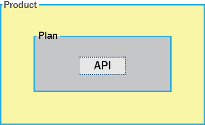
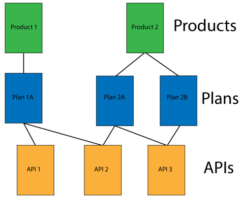

---

copyright:
  years: 2017
lastupdated: "2017-09-14"

keywords: IBM Cloud, APIs, lifecycle, catalog, manage, toolkit, develop, dev portal

subcollection: apiconnect

---

{:new_window: target="_blank"}
{:shortdesc: .shortdesc}
{:screen: .screen}
{:codeblock: .codeblock}
{:pre: .pre}

# About IBM API Connect
{: #about_apic_overview}

Use the {{site.data.keyword.apiconnect_full}} service to
quickly create APIs and microservices based on Node.js and Java runtimes. After they are created,
you can manage your APIs with business-level controls by setting varying levels of security,
visibility, billing plans, and rate limits while sharing APIs with application developers. The {{site.data.keyword.apiconnect_short}} service also provides you with the
tools to transform and grow your business with insights through detailed analytics with structured
filtered searches.

<object height="315" type="application/x-shockwave-flash" width="560"
data="https://www.youtube.com/v/lmxyiNMER5Y?version=3&amp;hl=en_US">
<desc>This video provides an overview of the {{site.data.keyword.apiconnect_short}} service</desc>
<param name="movie" value="https://www.youtube.com/v/lmxyiNMER5Y?version=3&amp;hl=en_US"/>
<param name="allowFullScreen" value="true"/>
<param name="allowscriptaccess" value="always"/>
<param name="scale" value="noScale"/>
</object>

## API creation
{: #creation_apic_overview}

With {{site.data.keyword.apiconnect_short}}, you can
import APIs from swagger definitions, or create APIs by using a proxy URL or by assembling data from
HTTP data sources. In addition, {{site.data.keyword.apiconnect_short}} supports creating and testing APIs
offline. Embedded with the developer toolkit is a micro gateway that enables you to connect to
back-end data sources, such as an SQL database, and perform create-, read-, update-, and
delete-based operations.

APIs are created within the developer toolkit. The developer toolkit includes a CLI and API
Designer graphical user interface. To access the developer toolkit, you need to download and install
it from npm.
When you install the toolkit, you begin by creating a LoopBack project. The following diagram
illustrates what is contained within a LoopBack project.

- **LoopBack project**: The LoopBack project contains the LoopBack application and API Product.

- **LoopBack application**: Within the Loopback application is the API endpoint that provides access to your data source,
business asset, or cloud service.

- **Product**: The Product is the unit that enables you to publish your APIs. A Product contains a Plan and a
Plan contains the API that invokes the API endpoint when it is called.

The following diagram demonstrates where the LoopBack application, API, and Product are deployed
to after they are published from the developer toolkit CLI or UI.

- **{{site.data.keyword.Bluemix_short}} run time**:
The LoopBack app is deployed to the {{site.data.keyword.Bluemix_short}} run time of your choice.

- **Gateway**: The API is deployed to the gateway.

**API Manager**: The product is deployed to the API Manager where you can specify how it is used.

For more information about the tasks required to create APIs, see [Creating APIs](/docs/services/apiconnect?topic=apiconnect-creating_apis).

## API management overview

After a Product has been staged and published, you can open the API Manager to manage security, rate limits, policies, and billing information, and then publish the Product to a Developer Portal.

As displayed in the following diagram, a product contains a plan, which contains one or more APIs.

### Plans
{: #plans_apic_overview}

To make an API available to a customer, it must be included in a Plan. Plans are used to differentiate between different offerings. Plans can share APIs, but whether subscription approval is required depends upon the Plan itself. Additionally, you can enforce rate limits through Plans or through operations within a Plan's APIs that override the Plan's rate limit.

Plans can also specify billing costs for customers who use your Products. For example, you can define three different Plans for a single Product. Each Plan can have a different subscription cost and a different rate limit that targets different customers.  

### Products
{: #products_apic_overview}

Plans and APIs are grouped in Products. Through Products, you can manage the availability and visibility of APIs and Plans. Use the API Designer to create, edit, and stage your Product. Use the API Manager to manage the lifecycle of your Product.

The following diagram demonstrates how Products, Plans, and APIs relate to one another. Note how Plans belong to only one Product, can possess different APIs to other Plans within the same Product, and can share APIs with Plans from any Product. Figure to show the hierarchy of Products, Plans, and APIs. 

You can create Plans only within Products, and these Products are then published in a Catalog. A lifecycle manager can then control the availability and visibility of APIs and Plans through the API Manager. Through the Developer Portal, the customer is then able to subscribe to one of the Plans that is available to them, as determined in the API Manager. If it is a Plan with billing, the customer must provide credit card information when subscribing. The user can only subscribe to one Plan
from a specific Product. Multiple Plans within a single Product are useful in that they can fulfill similar purposes but with differing levels of performance and cost. For example, you might have a "Demo Plan", which makes a single API available, and a "Full Plan", which makes several available.

As well as controlling which APIs a customer can use, different Plans can be used to implement rate limits. A rate limit can be implemented as a default rate across an entire Plan, or for specific operations of an API within that Plan, exempting them from the Plan rate limit. Different Plans can have differing rate limits, both between operations and for the overall limit. This is useful for providing differing levels of service to customers. For example, a "Demo Plan" might enforce a rate limit of 10 calls per minute while a "Full Plan" might permit up to 1000 calls per minute.

Finally, different Plans can be used to assign a billing cost. A Plan can be set as a free Plan, or as a Plan with billing. Plans with billing can be used with rate limits to set different levels of service to customers. For example, a "Demo Plan" might enforce a rate limit of 10 calls per minute for a cost of $5 per month, while a "Full Plan" might permit up to 1000 calls per minute for a cost of $20 per month.

**Note:**  Applying a rate limit at the Plan level, creates a default rate limit that applies to each operation within the Plan. If you need to set specific rate limits for specific operations, you must set these within the operations themselves and this setting overrides the setting at the Plan level.

IBM API Connect also supports the implementation of multiple versions of Products. You can choose version numbers and use them to aid the development of your Products and Plans.

**Note:** The version for a Product is distinct from the version of any APIs that are contained in the associated Plans. Plans cannot themselves have their own version, they use the version of their parent Product.

For more information about the tasks required to manage APIs, see [Managing APIs](/docs/services/apiconnect?topic=apiconnect-managing_apis).

### Catalogs
{: #catalogs_apic_overview}

Products must be staged to a Catalog and then published to Developer organizations to become available to application developers. In {{site.data.keyword.apiconnect_short}}, you can create multiple Catalogs. Catalogs are useful for separating Products and APIs for testing before you make them available to Developer organizations.

A Catalog is a staging target, and behaves as a logical partition of the gateway and the Developer Portal. The URL for API calls and the Developer Portal are specific to a particular Catalog. In a typical configuration, an API provider organization uses a development Catalog for testing APIs under development and a production Catalog for hosting APIs that are ready for full use. A common approach is to have a development cloud with a development Catalog, a few test Catalogs and a production cloud that might have its own test Catalog.

#### Catalog settings
{: #cat_set_apic_overview}

You can apply the following settings to a Catalog:

- **Development**: By default, a development Catalog is provided for you. A development Catalog must be used only for test purposes. In a development Catalog, staging and publishing actions are forced, meaning that if you republish a previously published Product it is overwritten without warning. If conflicts are found, they are automatically resolved by the system. Unpublish actions happen automatically. When you use the test tool in a development Catalog, any Product that you test is forced through and overwrites staged and published Products even if the operations are being used on the Developer Portal. A Developer Portal created from a development Catalog must be used in the same way, that is, for testing purposes only and not for real cases.

- **Automatic subscription**: If you enable automatic subscription for a Catalog, testing of your APIs in the API Manager user interface is made easier because a test application is used, with a pre-supplied client ID and client secret, which is automatically subscribed to all the Plans in the Catalog, so you don't have to specify a plan or application when testing. The test application is not subject to rate limits. Automatic subscription is available only for a development Catalog.

- **Default**: You can set one of your Catalogs to be the default Catalog. Then, calls to APIs that are published to that Catalog can use a shorter URL that does not include the Catalog name.

For more information about using the Developer Portal, see [Discovering and using APIs ](https://www.ibm.com/support/knowledgecenter/en/SSFS6T/com.ibm.apic.devportal.doc/capim_devportal_overview.dita){: #new_window}.

### Syndication
{: #syn_apic_overview}

With the {{site.data.keyword.apiconnect_full}}
syndication feature, you can partition your Catalogs into Spaces. Each Space is used by a different
API provider development team and has its own set of management capabilities relating specifically
to the APIs that the associated team publishes to that Space, enabling each team to manage their
APIs independently.

When you stage or publish an API to a Catalog that has Spaces enabled, you specify the Space
within that Catalog that you want to stage or publish to. However, application developers that
access the Developer Portal for the Catalog are unaware of the Space partitioning of the Catalog and
see the APIs as a coordinated offering.
Each Space has its own Product lifecycle management, subscription approvals, and analytics data.
You use Space specific access control to restrict user access to each Space; for example, a
developer in the Flights team is able to stage APIs only to the Flights Space.

**Note:** By default, Spaces are disabled in a Catalog. You enable Spaces by modifying the Catalog
settings.

To partition a catalog, see [Partitioning a catalog](/docs/services/apiconnect?topic=apiconnect-create_catalog#apic_spaces).
