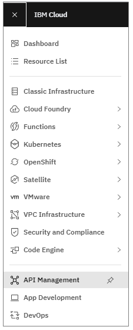
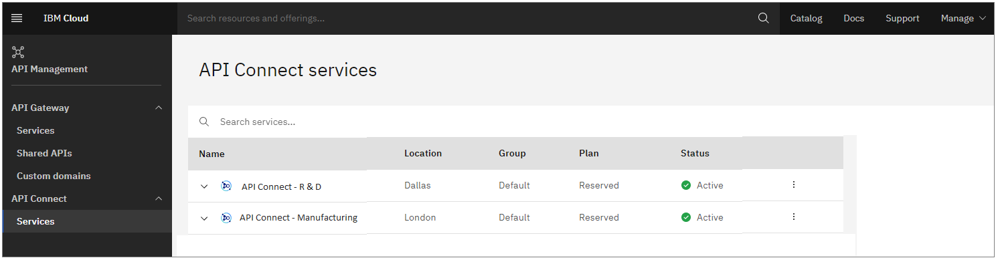
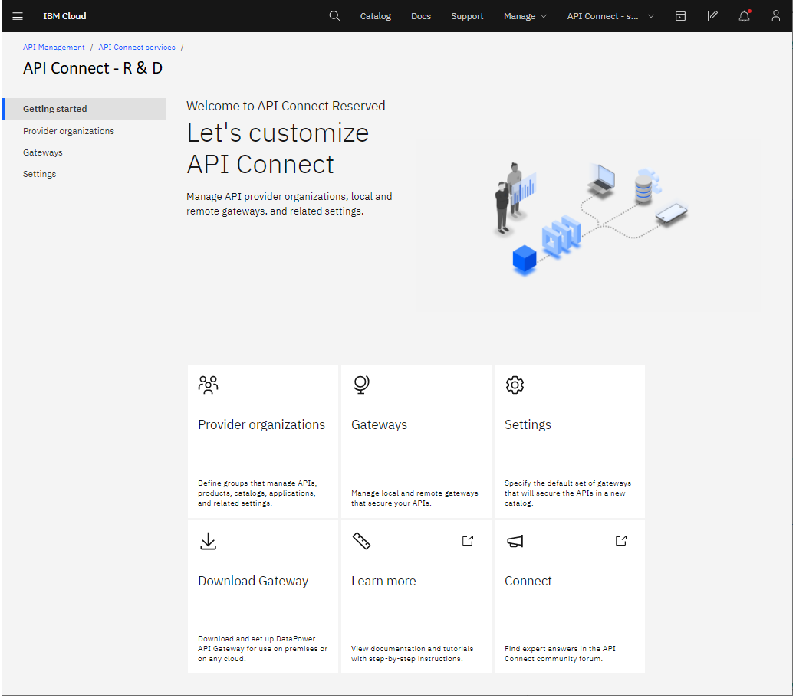

---

copyright:
   years: 2020, 2021
lastupdated: "2020-10-15"

keywords: IBM Cloud, API Connect, V10, Reserved instance, lifecycle, develop, create, manage, API

subcollection: apiconnect

---

{:external: target="_blank" .external} 
{:shortdesc: .shortdesc}
{:codeblock: .codeblock}
{:pre: .pre}
{:screen: .screen}
{:tip: .tip}
{:important: .important}
{:note: .note}

# Getting started as an admin in {{site.data.keyword.apiconnect_short}} V10 Reserved
{: #getting-started-admin}

Set up {{site.data.keyword.apiconnect_short}} so your users can develop APIs, publish them to consumers, and manage usage and lifecycles. 
{: shortdesc}

When you provision your Reserved instance, API Connect is configured with your administrator account and a default gateway service for controlling access to APIs. Just add users!

If you're not an admin, see [Getting started as a user](/docs/apiconnect?topic=apiconnect-getting-started) for instructions on signing in to {{site.data.keyword.apiconnect_short}}.
{: note}

## Step 1. Open your administration console
{: #start-service_getting-started}

In {{site.data.keyword.cloud_notm}}, {{site.data.keyword.apiconnect_short}} V10 Reserved provides two components: the administration console and the API Manager. Use the administration console to configure the Reserved instance for your users, who work with features in the API Manager.

All admins in your IBM Cloud account automatically have admin access to {{site.data.keyword.apiconnect_short}} and can use the features in the administration console.

Start the administration console by completing the following steps:

1. [Log in](https://cloud.ibm.com/login/){: external} to {{site.data.keyword.cloud_notm}}.
  
2. On the Dashboard, click  and select **API Management**.

   

3. In the navigation list, expand **API Connect** and click **Services**.

   

   The "Services" page lists all of your {{site.data.keyword.apiconnect_short}} services. 
   
4. On the "Services" page, click your Reserved instance's name to start it.

   {{site.data.keyword.apiconnect_short}} opens to the administration console.

   

As an {{site.data.keyword.apiconnect_short}} admin, you control the Reserved instance by configuring gateways for API access and managing users. Whenever you want to perform admin tasks, return to the "Services" page to open the administration console. 

## Step 2. Configure user access
{: #config-users_getting-started}

In {{site.data.keyword.apiconnect_short}} V10 Reserved, user access is managed with the {{site.data.keyword.cloud_notm}} Identity and Access Management (IAM) service. Create an {{site.data.keyword.apiconnect_short}} provider organization that will represent a set of users, and use the IAM service to define access groups with roles that grant permission for users to work with {{site.data.keyword.apiconnect_short}} features.

For details on configuring user access for {{site.data.keyword.apiconnect_short}}, see [Managing users](/docs/apiconnect?topic=apiconnect-ri-mng-users).
