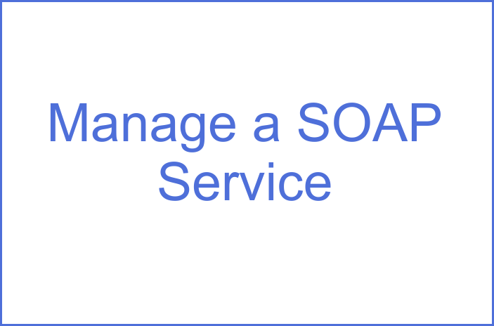

---

copyright:
  years: 2017
lastupdated: "2017-08-28"

---

{:new_window: target="_blank"}
{:shortdesc: .shortdesc}
{:screen: .screen}
{:codeblock: .codeblock}
{:pre: .pre}

# Getting started with the Bluemix API Connect service
{: #index}
Use the {{site.data.keyword.apiconnect_full}} service to
quickly create APIs and microservices based on Node.js and Java runtimes. After they are created,
you can manage your APIs with business-level controls by setting varying levels of security,
visibility, and rate limits while sharing APIs with application developers. The {{site.data.keyword.apiconnect_short}} service also provides you with the
tools to transform and grow your business with insights through detailed analytics with structured
filtered searches.

**Note**: This documentation is a condensed version of the information that is provided in the IBM Knowledge Center. These topics contain a brief introduction to API connect with a set of tutorials that you can complete to get up and running with the service quickly. For the full set of tasks that you can achieve with API Connect, see the IBM Knowledge Center documentation.

## Where would you like to begin?
{: #starting_point}

Select one of the following boxes to view the tutorial for that topic.  You can complete all of the tutorials in order, or complete the ones that apply to your role with APIs.

| Create an API | Manage an existing API | Discover APIs | 
|---------------|------------------------|---------------|
| <a href="tutorials/tut_create_api_node.html">  |  |  |
| | <a href="tutorials/tut_manage_soap_api.html">  | |
{: caption="Bluemix API Connect service getting started tutorials" caption-side="top"}

## API Connect overview
{: #moregetstart}

