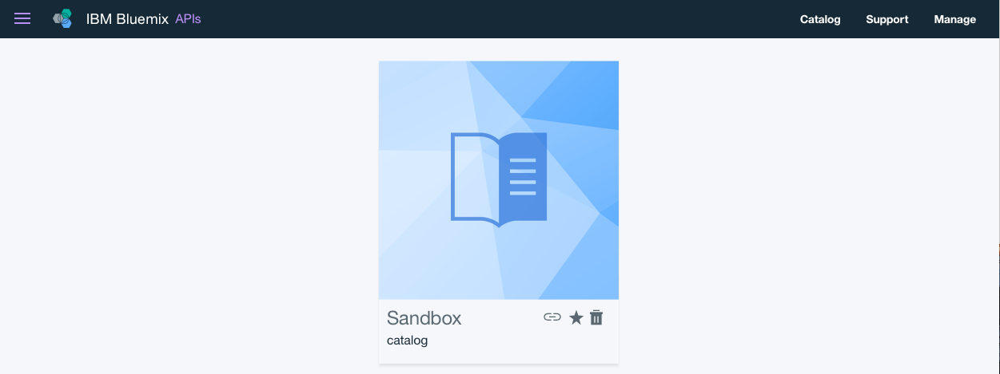

---
copyright:
  years: 2017
lastupdated: "2017-10-31"
---

{:new_window: target="blank"}
{:shortdesc: .shortdesc}
{:screen: .screen}
{:codeblock: .codeblock}
{:pre: .pre}

# Developer Portal einrichten und konfigurieren
**Dauer**: 30 Minuten  
**Kenntnisstufe**: Anfänger  

## Voraussetzungen
Bevor Sie beginnen, müssen Sie [die API-Spezifikationen importieren und einen Proxy für einen vorhandenen REST-Service erstellen](tut_rest_landing.html).

## Lernziel
In diesem Lernprogramm lernen Sie, wie **API Connect Developer Portal** konfiguriert wird. 

---

## Developer Portal erstellen
In diesem Abschnitt erstellen Sie eine Developer Portal-Instanz für einen Katalog.

*Kataloge* ist ein IBM Begriff für unterschiedliche Umgebungen. Für Test-, Bereitstellungs- und Produktionsumgebungen würden zum Beispiel unterschiedliche Kataloge erstellt werden. Ein Katalog mit dem Namen Sandbox muss vorhanden sein. Sie können entweder diesen Katalog zum Erstellen der Developer Portal-Instanz verwenden oder einen neuen Katalog erstellen und einen beliebigen Namen für diesen definieren.

1. Wählen Sie im {{site.data.keyword.Bluemix_short}}-Dashboard den Service **API Connect** aus, um das API Connect-Dashboard zu starten.

2. Wählen Sie im {{site.data.keyword.apiconnect_short}}-Dashboard den Katalog aus, für den Sie eine Developer Portal-Instanz erstellen möchten. Beispiel: **Sandbox**.

3. Wählen Sie im Katalog die Registerkarte **Einstellungen** aus.  
  

4. Wählen Sie in der Registerkarte 'Einstellungen' **Portal** aus.  
  

5. Wählen Sie auf der Seite 'Portalkonfiguration' im Dropdown-Menü 'Portal auswählen' **IBM Developer Portal** aus.
   

6. Notieren Sie die **Portal-URL** und speichern Sie die Änderungen.  
  
  
7. Wie im Dialogfeld angegeben dauert es in der Regel einige Minuten, bis die Developer Portal-Instanz erstellt ist. Wenn der Vorgang abgeschlossen ist, erhalten Sie eine E-Mail. Wählen Sie **OK** aus, um die Dialognachricht zu bestätigen.  
  

---

## Developer Portal kennenlernen
In diesem Abschnitt machen Sie sich mit der Developer Portal-Instanz vertraut, die Sie im vorherigen Schritt erstellt haben.

1. Nachdem Sie die Developer Portal-Instanz für Ihren Katalog konfiguriert haben, empfangen Sie eine E-Mail mit einem nur einmal verwendbaren Anmeldelink. Wählen Sie den Link aus, um die Developer Portal-Instanz zu starten.

2. Wählen Sie **Anmeldung** aus, um sich an der Developer Portal-Instanz anzumelden.

3. Geben Sie ein neues Kennwort ein und klicken Sie auf **Speichern**.  
  

4. Nach dem Festlegen des Kennworts können Sie sich mit Developer Portal vertraut machen; beginnen Sie mit **Home** ganz oben auf der Seite.  
  
  
| Registerkarte              | Beschreibung          | 
|:---------------- | -------------------- | 
| _Home_       | Die Seite 'Home' ist die Begrüßungsseite von Developer Portal. Sie können [die Seite anpassen](tut_custom_dev_portal.html), damit sie Ihren Anforderungen entspricht. | 
| _Einführung_       | Die Seite 'Einführung' enthält Anweisungen für Entwickler zum Einstieg in die Verwendung von Developer Portal. |
| _API-Produkte_ | Auf der Seite 'API-Produkte' durchsuchen und abonnieren die Entwickler die APIs, die im Portal zur Verfügung stehen. | 
| _Apps_ | Auf der Seite 'Apps' werden die Anwendungen angezeigt, die die APIs verwenden. | 
| _Blogs_ | Auf der Seite 'Blogs' können Sie Blogbeiträge zu den APIs erstellen und anzeigen. | 
| _Foren_ | Auf der Seite 'Foren' können Entwickler über APIs diskutieren und Fragen zu den APIs posten. | 
| _Support_ | Auf der Seite 'Support' können Sie Entwickler darüber informieren, wie Sie Support zu den APIs erhalten können. So können Sie zum Beispiel auf Foren und Häufig gestellten Fragen (FAQs) verweisen. Sie können auch einen Link bereitstellen, über den Sie bei Bedarf ein Support-Ticket öffnen können. | 

Hinweis: Auf der Seite 'API-Produkte' können Sie eines der Produkte zum Anzeigen der Produktseite für eine API und die verfügbaren Pläne auswählen. Dies ermöglicht es Entwicklern, API-Details zu abonnieren und anzuzeigen. 

  

### Fazit
In diesem Lernprogramm haben Sie gelernt, wie Sie {{site.data.keyword.apiconnect_short}} Developer Portal einrichten und konfigurieren. Außerdem haben Sie sich mit der Developer Portal-Instanz vertraut gemacht.

---

## Nächster Schritt

[Developer Portal anpassen und Motiv auswählen](tut_custom_dev_portal.html).

Erstellen >Verwalten> Schützen > ** Teilen ** > Analysieren
