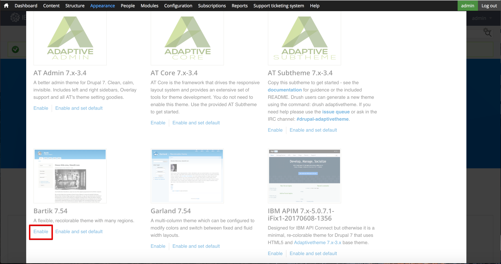

---

copyright:
  years: 2017
lastupdated: "2017-10-31"

subcollection: apiconnect

keywords: IBM Cloud, APIs, lifecycle, catalog, manage, toolkit, develop, dev portal, tutorial

---

{:new_window: target="blank"}
{:shortdesc: .shortdesc}
{:screen: .screen}
{:codeblock: .codeblock}
{:pre: .pre}

# Developer Portal anpassen und Motiv auswählen
{: #tut_custom_dev_portal}

**Dauer**: 30 Minuten  
**Kenntnisstufe**: Anfänger  

## Lernziel
{: #object_tut_custom_dev_portal}

In diesem Lernprogramm erfahren Sie, wie Sie {{site.data.keyword.apiconnect_full}} Developer Portal schnell anpassen und ein Motiv auswählen, das Ihren Anforderungen entspricht.

---

## Voraussetzungen
{: #prereq_tut_custom_dev_portal}

Bevor Sie mit diesem Lernprogramm beginnen, sollten Sie das Lernprogramm [Developer Portal einrichten und konfigurieren](/docs/services/apiconnect/tutorials?topic=apiconnect-tut_config_dev_portal) abgeschlossen haben und als Portaladministrator angemeldet sein.

---

## Developer Portal anpassen
{: #cust_tut_custom_dev_portal}

Nach der Erstellung Ihrer Developer Portal-Instanz können Sie Darstellung und Funktionsweise anpassen.

1. Als Erstes wird das Willkommensbanner geändert. Wählen Sie im obersten Menü **Inhalt** und anschließend **Blöcke** aus.  
  

2. Wählen Sie **Bearbeiten** im Block **Willkommensbanner** aus.  
  

3. Unter der Überschrift 'Inhalt' können Sie den Text und das Bild des Inhalts für das Willkommensbanner ändern; dazu können Sie entweder den Text in den Inhaltseditor eingeben oder das Symbol 'HTML-Quelle bearbeiten' auswählen, um HTML-Code direkt zu bearbeiten oder einzufügen, von dem Bild- und Textangaben definiert werden.  
   

4. Fügen Sie auch ein Bild zur Hauptanzeige hinzu. Blättern Sie abwärts zur Überschrift 'Bild'. Suchen Sie ein Bild, das Sie für den Hintergrund verwenden möchten, und speichern Sie es im entsprechenden Dateiformat (png, gif, jpg, jpeg). Falls Sie nicht über ein Bild verfügen, können Sie [dieses Bild](images/Cloudy_Day.png) verwenden. Klicken Sie auf **Datei auswählen** und suchen Sie nach dem ausgewählten Hintergrundbild. Klicken Sie nach der Auswahl des Bilds auf **Hochladen**.  
  

5. Das Bild wird angezeigt, sobald es hochgeladen ist. Falls Sie es entfernen möchten, klicken Sie auf **Entfernen**.  
  
 
6. Klicken Sie unten auf der Seite auf **Speichern**, um die Änderungen zu speichern.  
  
---

## Motiv von Developer Portal anpassen
{: #cust_theme_tut_custom_dev_portal}

In Developer Portal können Sie durch eine Änderung des Motivs die Darstellung und Funktionsweise ändern.

1. Wählen Sie zum Ändern des Motivs im obersten Menü **Darstellung**, danach **Einstellungen** und anschließend **Motiv von IBM API Connect** aus. Hierbei handelt es sich um das Standardmotiv, wenn Sie Developer Portal erstellt haben.
   

2. In der Registerkarte **Standardlayout** können Sie die Layouts für Geräte mit großen Bildschirmen ändern, zum Beispiel Desktops. In der Registerkarte **Tablet-Layout** können Sie die Layouts ändern, die auf Tablets verwendet werden. In der Registerkarte **Smalltouch-Layout** können Sie die Layouts ändern, die auf Geräten wie Smartphones verwendet werden. Wählen Sie nach der Überprüfung dieser Registerkarten **Anzeigen & GPanels** aus.
  

3. Zusätzlich zur Änderung der oben beschriebenen Seitenleistenlayouts wird vom Standardmotiv die Verwendung von GPanels oder responsiven Anzeigen unterstützt, wenn Sie das Anzeigenmodul installieren. Wenn Sie die Anzeigenlayouts auf Standardgeräten, Tablets und Smalltouch-Geräten steuern möchten, erweitern Sie die Abschnitte und aktualisieren die Einstellungen.
   

4. Es gibt noch weitere Einstellungen, die Sie anpassen können; überspringen Sie diese und wählen Sie **Erweiterungen** aus. In dieser Registerkarte können Sie zusätzliche Einstellungen aktivieren, mit denen Sie den Stil von Developer Portal konfigurieren können.  
  

5. Die Einstellungen der Erweiterungen, die in der Registerkarte **Erweiterungen** aktiviert sind, können im Abschnitt **Erweiterungen** unterhalb der Haupteinstellungen geändert werden.     
  

6. Wählen Sie nach Abschluss der Einstellungsänderungen ganz unten auf der Seite **Konfiguration speichern** aus.

---

## Anderes Motiv für Developer Portal auswählen
{: #diff_theme_tut_custom_dev_portal}

Im Lieferumfang von Developer Portal sind zusätzliche Motive enthalten, die Sie auswählen und anpassen können, um Darstellung und Funktionsweise zu ändern.

1. Wählen Sie zum Aktivieren eines anderen Motivs die Registerkarte **Liste** ganz oben im Bereich der Eigenschaften von 'Darstellung' aus.
   

2. Ganz oben in der Registerkarte **Liste** werden die aktivierten Motive angezeigt.
  

3. Unter der Liste der aktivierten Motive wird eine Zusammenstellung der inaktivierten Motive angezeigt. Sie können ein Motiv durch Auswählen von **Aktivieren** aktivieren.   
   

4. Nach seiner Aktivierung wird das Motiv ganz oben in der Registerkarte **Liste** in **Aktivierte Motive** angezeigt. Sie können es durch Auswählen von **Einstellungen** anpassen.  
  

5. Wenn Sie mit dem Ändern der Einstellungen fertig sind, können Sie das Motiv durch Auswählen von **Als Standard festlegen** als Standardmotiv definieren.     
  

---

## Neues Motiv für Developer Portal installieren
{: #new_theme_tut_custom_dev_portal}

Wenn die Änderung eines vorhandenen Motivs nicht Ihre Anforderungen erfüllt, können Sie in Developer Portal auch ein Motiv installieren, um Darstellung und Funktionsweise zu ändern.

1. Sie können Module oder Motive verwenden, die Sie von [drupal.org ](http://drupal.org){: #new_window} heruntergeladen haben, um Ihre Developer Portal-Instanz anzupassen; alternativ können Sie eine eigene erstellen.

2. Wählen Sie zum Installieren eines Motivs in Developer Portal im oberen Menü **Darstellung** und anschließend **Neues Motiv installieren** aus.  
  

3. Sie können Motive mithilfe einer URL direkt von [drupal.org ](http://drupal.org){: #new_window} installieren; alternativ können Sie durch Klicken auf **Datei auswählen** ein Motiv hochladen, das Sie heruntergeladen oder erstellt haben, und anschließend auf **Installieren** klicken.  
   

4. Wenn das Hochladen abgeschlossen ist, müssen Sie das Motiv aktivieren. Wählen Sie **Neu hinzugefügte Motive aktivieren** aus.  
  

5. Blättern Sie in der Liste abwärts und suchen Sie das neu installierte Motiv. Wählen Sie **Aktivieren und als Standard festlegen** aus.  
  

6. Klicken Sie unten auf der Seite auf **Speichern**, um die Änderungen zu speichern.  

---

## Fazit
{: #conclusion_tut_custom_dev_portal}
Glückwunsch! Sie haben dieses Lernprogramm abgeschlossen. In diesem Lernprogramm haben Sie Folgendes gelernt:

* Begrüßungsseite von Developer Portal anpassen
* Von Developer Portal verwendetes Motiv anpassen 
* Anderes Motiv für die Verwendung in Developer Portal auswählen
* Neues Motiv für Developer Portal installieren

---

## Nächster Schritt
{: #next_tut_custom_dev_portal}

Lernen, [wie ein Benutzer durch Developer Portal navigiert](/docs/services/apiconnect/tutorials?topic=apiconnect-tut_discover_apis) oder [wie Erkenntnisse aus grundlegenden Analysedaten gewonnen werden können](/docs/services/apiconnect/tutorials?topic=apiconnect-tut_insights_analytics).

Erstellen > Verwalten > Schützen > **Teilen** > Analysieren  

