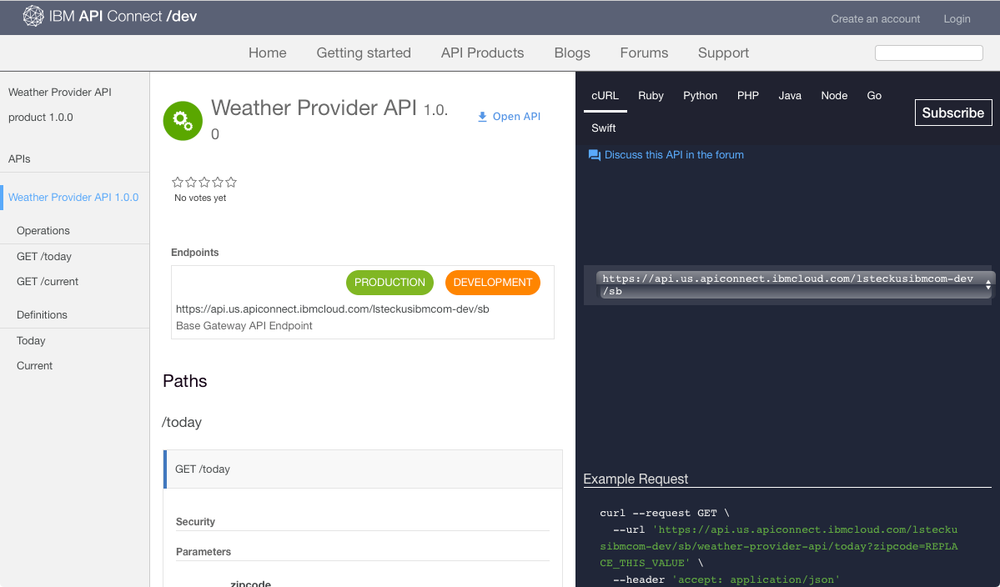

---

copyright:
  years: 2017
lastupdated: "2017-10-10"

{:new_window: target="_blank"}
{:shortdesc: .shortdesc}
{:screen: .screen}
{:codeblock: .codeblock}
{:pre: .pre}

# APIs kennenlernen
**Dauer**: 25 Minuten  
**Kenntnisstufe**: Anfänger  

## Voraussetzung
Für dieses Lernprogramm gibt es keine Voraussetzungen. Als Portaladministrator können Sie dieses Lernprogramm auch durcharbeiten, während Sie in Developer Portal navigieren, um zu untersuchen, wie die Portalbenutzer in Developer Portal navigieren. Beachten Sie, dass alle Instanzen von Developer Portal unterschiedliche Oberflächen aufweisen.

Wenn Sie nicht über eine vorhandene Developer Portal-Instanz verfügen, können Sie eine solche in {{site.data.keyword.Bluemix_short}} einrichten und konfigurieren, bevor Sie mit diesem Lernprogramm fortfahren.

## Lernziel
In diesem Lernprogramm erfahren Sie, wie ein Portalbenutzer die APIs in {{site.data.keyword.apiconnect_short}} Developer Portal nutzen kann. Sie machen sich damit vertraut, wie ein Portalbenutzer Produkte und APIs durchsucht, APIs anzeigt und testet, und wie er die APIs abonniert.

## Produkte und APIs nutzen
In diesem Abschnitt wird erläutert, wie ein Portalbenutzer die Produkte und APIs in Developer Portal nutzen würde.

1. Navigieren Sie in einem Browser zu **API Connect Developer Portal**.

2. Wählen Sie in {{site.data.keyword.apiconnect_short}} Developer Portal die Registerkarte 'API-Produkte' aus.

3. Wählen Sie eines der verfügbaren Produkte aus, damit die verfügbaren APIs und Pläne für das Produkt angezeigt werden.  
  

4. Wählen Sie eine API zum Kennenlernen der Details der verfügbaren APIs aus.  
  

5. Auf der Detailseite einer API können Sie die verfügbaren Operationen mit ihren Parametern und zurückgegebenen Antworten anzeigen. Am Ende der Seite können Sie die Definitionen anzeigen, die von der API verwendet werden.  
  

6. In der Anzeige für die Codebeispiele können Sie die Beispiele in den unterschiedlichen Codesprachen anzeigen, um zu erfahren, wie die Anforderungen und ihre Antworten aufgerufen werden. Wählen Sie eines der Beispiele aus, zum Beispiel **Knoten**, um ein Beispiel in dieser Codesprache anzuzeigen.  
  

---

## APIs anzeigen und testen
In diesem Abschnitt wird erläutert, wie ein Portalbenutzer die für ein Produkt verfügbaren APIs anzeigt und testet. 

1. Navigieren Sie wie im vorherigen Abschnitt beschrieben zu den API-Details in {{site.data.keyword.apiconnect_short}} Developer Portal.  
   

2. Sie können die YAML-Informationen zu Swagger-APIs durch Auswählen von **Open-API** herunterladen und anzeigen.  
   

3. Blättern Sie abwärts bis zu einer Operation, um ihre Details anzuzeigen. Sie können auch auf den Link für die Operationen klicken, um zu diesen auf der Seite zu springen.

4. Blättern Sie im rechten Teilfenster unterhalb der Beispiele zum Abschnitt **Diese Operation testen**. Geben Sie die Parameter ein und wählen Sie **Operation aufrufen** aus.  
  

5. Blättern Sie abwärts, um Anforderung und Antwort des Operationsaufrufs anzuzeigen. Anhand der Rückgabe der Antwort **200 OK** und der Anzeige des Nachrichtentexts wird angegeben, dass der Aufruf der Operation erfolgreich war.  
  

---

## APIs subskribieren
In diesem Abschnitt wird beschrieben, wie ein Portalbenutzer APIs in Developer Portal subskribiert. 

1. Wählen Sie **Konto erstellen** aus.

2. Füllen Sie die erforderlichen Felder aus und wählen Sie **Neues Konto erstellen** ganz unten auf der Seite aus.
**Hinweis:** Verwenden Sie eine andere E-Mail-Adresse als die, die Sie zum Erstellen der Developer Portal-Instanz im vorherigen Lernprogramm verwendet haben.

3. Melden Sie sich nach dem Erstellen des Developer Portal-Kontos an und zeigen Sie die Startseite an. Sie müssen über eine App verfügen, um die APIs subskribieren zu können. Wählen Sie **Apps** aus, um die Seite mit den registrierten Apps aufzurufen.  
  

4. Wählen Sie zum Registrieren einer neuen Anwendung **Neue App erstellen** aus.  
  

5. Geben Sie einen *Titel* und eine *Beschreibung* für die App ein und wählen Sie **Übergeben** aus.  
   

6. Da jetzt eine App vorhanden ist, können Sie API-Produktpläne abonnieren. Wählen Sie **Verfügbare APIs** oder **API-Produkte** aus, um die API-Produktpläne zu durchsuchen.  
   

7. Wählen Sie das API-Produkt aus, das Sie abonnieren möchten.  
   

8. Wählen Sie **Abonnieren** aus, um den API-Produktplan zu abonnieren.  
   

9. Wählen Sie die App aus, die Sie für den Produktplan abonnieren möchten und wählen Sie anschließend **Abonnieren** aus.
   

10. Die Anwendung wurde erfolgreich für den Produktplan abonniert.
   

## Fazit

In diesem Lernprogramm haben Sie erfahren, wie Portalbenutzer Produkte und APIs durchsuchen, APIs anzeigen und testen, und wie sie die APIs abonnieren. 

---

## Nächster Schritt

Lernen, [wie Erkenntnisse aus grundlegenden Analysedaten gewonnen werden können](tut_insights_analytics.html).

Erstellen > Verwalten > Schützen > **Teilen** > Analysieren  

