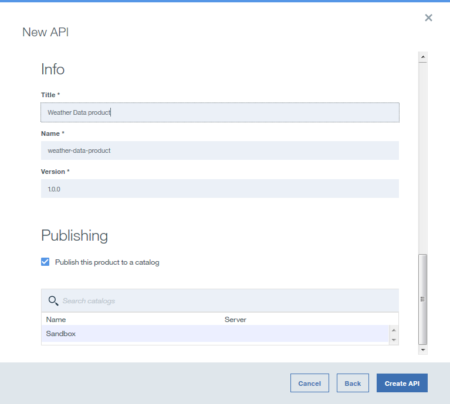
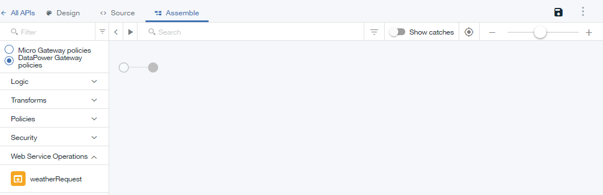
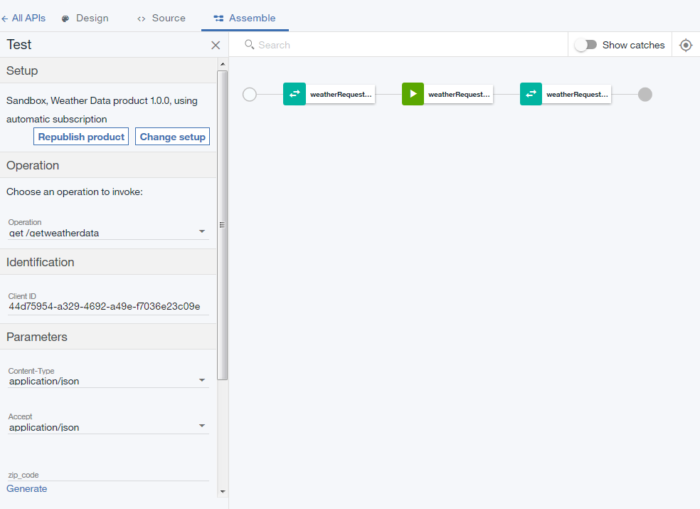

---

copyright:
years: 2017
lastupdated: "2017-10-19"

---

{:new_window: target="blank"}
{:shortdesc: .shortdesc}
{:screen: .screen}
{:codeblock: .codeblock}
{:pre: .pre}
 

# SOAP-Service als REST-API verfügbar machen
**Dauer**: 20 Minuten  
**Kenntnisstufe**: Anfänger  

---
## Lernziel
Sie erstellen in API Manager eine REST-API, die auf einen vorhandenen SOAP-Service zugreift und diesen als REST-API verfügbar macht.

## Voraussetzungen
1. Bevor Sie beginnen, müssen Sie [eine Instanz von {{site.data.keyword.apiconnect_full}} einrichten](tut_prereq_set_up_apic_instance.html).
2. Bevor Sie beginnen, müssen Sie die Testdatei [weatherprovider.wsdl](https://github.com/ibm-apiconnect/getting-started/blob/master/bluemix/manage-soap-api/files/weatherprovider.wsdl){:new_window} in Ihr lokales Dateisystem kopieren.
	>![images/info.png]
	>Sie können auf **Unbearbeitet** klicken und anschließend die resultierende Seite im lokalen System als `.wsdl`-Datei speichern.

---
## REST-API-Definition festlegen
1. Melden Sie sich an {{site.data.keyword.Bluemix_short}} an: [https://new-console.ng.bluemix.net/login ](https://new-console.ng.bluemix.net/login){:new_window}.
2. Blättern Sie im {{site.data.keyword.Bluemix_short}} **Dashboard** abwärts und wählen Sie {{site.data.keyword.apiconnect_full}} aus. Alternativ können Sie über das Menüsymbol **Services** und anschließend **APIs** auswählen, um das Fenster **Mit APIs arbeiten** zu öffnen, und **API Connect** auswählen. Auf der Seite **API Connect** können Sie einfach `Erstellen` auswählen oder die Standardeinstellungen anpassen. Belassen Sie die Instanz in diesem Beispiel ohne Bindung und passen Sie den Servicename an, damit Sie ihn später leicht wiedererkennen. Ein Beispiel wäre `API Connect-weather-exercise`.
Klicken Sie auf die Schaltfläche `Erstellen`, um den {{site.data.keyword.apiconnect_short}}-Service zu starten.  
Es kann ein Alert angezeigt werden, in dem beschrieben wird, was neu ist, oder die Begrüßungsanzeige **APIs entwerfen** wird mit Informationen angezeigt. Klicken Sie nach dem Lesen der Informationen auf das Symbol **Ich habs!**, um API Manager anzuzeigen.
3. Wenn Sie in {{site.data.keyword.apiconnect_short}} bisher nicht den Navigationsbereich der Benutzerschnittstelle fixiert haben, klicken Sie auf das Symbol **Navigieren zu** . Der Navigationsbereich der Benutzerschnittstelle von API Manager wird geöffnet. Klicken Sie zum Fixieren des Navigationsbereichs der Benutzerschnittstelle auf das Symbol für das **Fixiermenü** .
4. Wählen Sie **Entwürfe** im Navigationsbereich der Benutzerschnittstelle aus und klicken Sie anschließend auf die Registerkarte **APIs**. Die Registerkarte **APIs** wird geöffnet.
	
5. Wählen Sie **Hinzufügen +** > **Neue API** aus.
6. Geben Sie die Basisinformationen zur API an.
	- Geben Sie in das Feld **Titel** die Zeichenfolge `Weather Data` ein.
	- Belassen Sie im Feld **Name** die Angabe `weather-data`, wenn es gefüllt wird, während Sie den Titel eingeben.	
	- Übernehmen Sie im Feld **Basispfad** den Wert `/weather-data`.
	- Lassen Sie im Feld **Version** die Angabe `1.0.0` unverändert.
7. Erweitern Sie **Zusätzliche Eigenschaften**, um weitere Eigenschaften für die API anzugeben.
	- Wählen Sie im Feld **API-Vorlage** die Angabe **Standard** aus, um festzulegen, dass Sie die Standardvorlage zum Erstellen einer API-Definition verwenden möchten.
	- Lassen Sie die übrigen Felder unverändert.
	
8. Fügen Sie die API zum neuen Produkt hinzu und erstellen Sie anschließend die API-Definition.
	- Wählen Sie **Produkt hinzufügen** aus. 
	- Verwenden Sie im Feld **Titel** die Zeichenfolge `Weather Data product` als Standardeinstellung.
	- Belassen Sie die Felder **Name** und **Version** unverändert.
	- Stellen Sie sicher, dass das Kontrollkästchen **Dieses Produkt in einem Katalog veröffentlichen** ausgewählt ist und wählen Sie anschließend **Sandbox** als Zielkatalog aus.
	
	- Klicken Sie auf **API erstellen**. Die Registerkarte **Design** zum Entwerfen der API-Definition wird geöffnet.
9. Die API wird jetzt erstellt. Die Seite 'Design' wird angezeigt. Klicken Sie in der Navigationsleiste auf **Sicherheit**.

10. Nehmen Sie die Auswahl der Option **Client-ID** zurück.

	>![images/info.png]
	>Es kann sein, dass ein gelbes Dreieckssymbol neben dem Symbol zum Speichern auf der Platte angezeigt wird. Hierbei handelt es sich um eine Warnung, die besagt, dass bereits eine Definition vorhanden sein kann, die zwar definiert, aber noch nicht verwendet wurde. (Dies hat keinen Einfluss auf die API-Definition).
11. Klicken Sie im Abschnitt **Definitionen** auf das Symbol **Definition hinzufügen**  und erweitern Sie die neue Definition anschließend durch Klicken auf die Definition.
12. Legen Sie für die Definition den Namen `Weather Data Output` fest.
13. Die Definition besteht aus fünf Eigenschaften. Klicken Sie vier Mal auf **Eigenschaft hinzufügen**, um die zusätzlichen Eigenschaften hinzuzufügen. Benennen Sie die Angabe unter `Property Name` gemäß der nachfolgenden Vorgehensweise um und verwenden Sie den Standard für `Description`, `Type` und `Example`:
	
14. Klicken Sie im Abschnitt **Pfade** auf das Symbol **Pfad hinzufügen** .
15. Ersetzen Sie im Feld **Pfad** des neu erstellen Pfads den Inhalt durch `/getweatherdata`.
16. Erweitern Sie die Operation **GET /getweatherdata** durch Klicken auf dieselbe.
	
17. Klicken Sie für die Operation **GET /getweatherdata** auf **Parameter hinzufügen** und klicken Sie anschließend auf **Neuen Parameter hinzufügen**.
18. Legen Sie für den neuen Parameter den Namen `zip_code` fest und belassen Sie für den Rest die Standardeinstellung.
19. Wählen Sie in der Spalte **Schema** der Antwort **200 OK** im Abschnitt **Antworten** die Definition **Weather Data Output** aus. Die Antwort auf den API-Aufruf ist das Antwortobjekt, das unter **Weather Data Output** definiert ist.
	
20. Klicken Sie auf das Speichersymbol , um die Änderungen zu speichern.

---
## Web-Service-Aufruf hinzufügen und konfigurieren
Führen Sie die nachfolgenden Schritte aus, um den Aufruf hinzuzufügen und zu konfigurieren und um die Richtlinien zuzuordnen, mit deren Hilfe der Web-Service in die API-Definition integriert wird.
1. Klicken Sie im Abschnitt **Services** auf das Symbol **Service hinzufügen** . Das Fenster `Web-Service aus WSDL-Datei importieren` wird geöffnet.
	
2. Wählen Sie **Datei hochladen** aus.
3. Geben Sie im Fenster **Dateiupload** die Position für die Datei `weatherprovider.wsdl` an, die Sie in `Schritt 2` im Abschnitt **Voraussetzungen** heruntergeladen haben, und klicken Sie auf **Öffnen**, um fortzufahren.
4. Wählen Sie den SOAP-Service **weatherService** aus und klicken Sie auf **Fertig**. Im Abschnitt **Services** wird der Web-Service **WeatherService** mit der einzigen Operation **weatherRequest** aufgelistet.
	

	
5. Navigieren Sie zur Registerkarte **Assemblieren** und stellen Sie sicher, dass **DataPower-Gateway-Richtlinien** ausgewählt ist.
6. Löschen Sie die vorhandene Richtlinie **invoke** im Erstellungsbereich; bewegen Sie hierzu den Cursor über die Richtlinie und klicken Sie anschließend auf das Symbol **Richtlinie löschen** .
		
7. Ziehen Sie den Web-Service **weatherRequest** aus der Palette in das gestrichelte Feld, das im Erstellungsbereich angezeigt wird. In der Assemblierung befinden sich eine Aufrufrichtlinie (invoke) und zwei Zuordnungsrichtlinien. Von der ersten Zuordnungsrichtlinie werden Variablen der Eingabe des Web-Service-Aufrufs zugeordnet, von der zweiten Richtlinie werden die Ausgaben des Web-Service-Aufrufs den Variablen zu zugewiesen. Die Ausgaben der ersten Zuordnung und die Eingaben der zweiten Zuordnung werden aus der WSDL-Datei generiert, die in Schritt 4 bereitgestellt wurde.
		
8. Klicken Sie auf die Zuordnungsrichtlinie **weatherRequest: input** und klicken Sie anschließend auf das Symbol **Eingaben bearbeiten**  in der Eingabespalte der Eigenschaftsseite.
		
9. Klicken Sie auf **+ Parameter für Operation** und wählen Sie `get /getweatherdata` aus.
10. Klicken Sie auf **Fertig**, um den Parameter `zip_code` hinzuzufügen.
	
11. Klicken Sie auf den Kreis, der **zip_code string** auf der Eingabeseite zugeordnet ist, und klicken Sie anschließend auf den Kreis, der **zipcode string** auf der Ausgabeseite zugeordnet ist.  
	
12. Schließen Sie die Eigenschaftsseite.
13. Klicken Sie auf die Zuordnungsrichtlinie **weatherRequest: output** in der Palette und klicken Sie anschließend auf das Symbol **Ausgaben bearbeiten**  in der Ausgabespalte des Eigenschaftenblatts.
14. Wählen Sie **+ Ausgaben für Operation** und anschließend `get /getweatherdata` aus.
15. Wählen Sie **Fertig** aus, um die Ausgabedefinition `Weather Data Output` hinzuzufügen.
	
16. Klicken Sie auf den Kreis, der **zip string** auf der Eingabeseite zugeordnet ist, und klicken Sie anschließend auf den Kreis, der **zip string** auf der Ausgabeseite zugeordnet ist. Ordnen Sie die übrigen Parameter gemäß der folgenden Vorgehensweise zu.
	
17. Klicken Sie auf das Symbol **Speichern** , um Ihre Änderungen zu speichern.

Sie haben den Web-Service-Aufruf in die Assemblierung eingeschlossen und einen Eingabeparameter zum entsprechenden Teil der SOAP-Anforderung zugeordnet und den entsprechenden Teil der SOAP-Antwort einer JSON-Ausgabe zugeordnet.

---
## API-Definition testen
Führen Sie die nachfolgenden Schritte aus, um die API-Definition mithilfe des Testtools von API Manager zu testen.
1. Klicken Sie auf das Symbol **Testen**  unter der Registerkarte **Assemblierung**, um das Testfenster anzuzeigen.
	
2. Falls Sie das Testtool bereits vorher verwendet haben, klicken Sie auf **Konfiguration ändern**.
3. Wählen Sie in der Liste der Produkte `Weather Data product 1.0.0` aus.
	
4. Klicken Sie auf **Produkt erneut veröffentlichen**.
5. Klicken Sie auf **Weiter**.
6. Wählen Sie in der Liste der Operationen `get /getweatherdata` aus.  
	
7. Blättern Sie abwärts bis zum Feld **zip_code** und geben Sie `90210` ein.  
	
8. Klicken Sie auf **Aufrufen**. Von der API wird das aktuelle Wetter zurückgegeben.  
	

---
## Was Sie in diesem Lernprogramm erreicht haben
In diesem Lernprogramm haben Sie Folgendes durchgeführt:
1. REST-API-Definition festgelegt
2. API zum Aufrufen eines vorhandenen Web-Service und Zurückgeben seiner Ausgabe konfiguriert
3. API-Definition getestet

---

## Nächster Schritt

API mit [Quotenbegrenzung](tut_rate_limit.html), [Client-ID und geheimen Schlüssel](tut_secure_landing.html) oder [OAuth 2.0](tut_secure_oauth_2.html) schützen.

Erstellen > **Verwalten** > Schützen > Teilen > Analysieren

[important]: ./images/important.png "Wichtig!"
[info]: ./images/info.png "Information"
[troubleshooting]: ./images/troubleshooting.png "Fehlerbehebung" 
