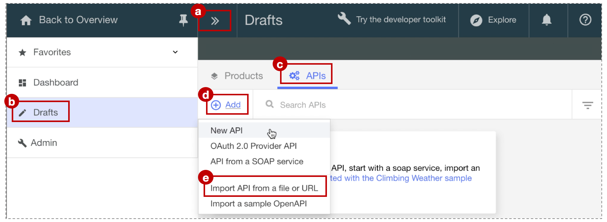

---
copyright:
  years: 2017
lastupdated: "2017-11-02"
---

{:new_window: target="blank"}
{:shortdesc: .shortdesc}
{:screen: .screen}
{:codeblock: .codeblock}
{:pre: .pre}

# API-Spezifikation importieren und Proxy für vorhandenen REST-Service mit {{site.data.keyword.Bluemix_notm}} erstellen
Dauer: 5 Minuten  
Kenntnisstufe: Anfänger  

## Lernziel
Dieses Lernprogramm unterstützt Sie beim Einstieg in {{site.data.keyword.apiconnect_full}}, da es verdeutlicht, wie Sie vorgehen müssen, damit Sie eine vorhandene API verwalten können. In einem ersten Schritt wird eine neue OpenAPI-Spezifikation importiert, anschließend wird ein Durchgriffs-API-Proxy für einen vorhandenen REST-Service erstellt.

## Voraussetzungen
Bevor Sie beginnen, müssen Sie [eine Instanz von {{site.data.keyword.apiconnect_short}} einrichten](tut_prereq_set_up_apic_instance.html).

---


## Beispielapp untersuchen und Zielendpunkt testen

Für dieses Lernprogramm wurde die Beispielapp _weather provider_ erstellt. Die entsprechende API-Spezifikation (Swagger 2.0) befindet sich in der Datei [weather-provider-api_1.yaml ](https://raw.githubusercontent.com/IBM-Bluemix-Docs/apiconnect/master/tutorials/weather-provider-api_1.yaml){:new_window}.

1. Rufen Sie [http://gettingstartedweatherapp.mybluemix.net/ ](http://gettingstartedweatherapp.mybluemix.net/){:new_window} auf, um die App kennenzulernen.  
2. Geben Sie eine gültige fünfstellige US-Postleitzahl ein, um Angaben zum _**aktuellen Wetter**_ und zur _**Vorhersage für heute**_ zu erhalten.  


3. Die obige Beispielwetterapp wurde mithilfe von APIs erstellt, von denen die Wetterdaten bereitgestellt werden. Der Endpunkt zum Abrufen der **aktuellen** Wetterdaten ist `https:// myweatherprovider<span></span>.mybluemix.net/current?zipcode={zipcode}`. Testen Sie ihn durch Aufrufen von [https://myweatherprovider.mybluemix.net/current?zipcode=90210 ](https://myweatherprovider.mybluemix.net/current?zipcode=90210){:new_window}.  

  

4. Analog ist der Endpunkt zum Abrufen der Vorhersagedaten von **heute** der Link `https:// myweatherprovider<span></span>.mybluemix.net/today?zipcode={zipcode}`. Testen Sie ihn durch Aufrufen von [https://myweatherprovider.mybluemix.net/today?zipcode=90210 ](https://myweatherprovider.mybluemix.net/today?zipcode=90210){:new_window}.  

  


---

## OpenAPI-Spezifikation für Beispielapp zum Erstellen eines REST-API-Proxy importieren
1. Melden Sie sich an {{site.data.keyword.Bluemix_short}} an: https://new-console.ng.bluemix.net/login.
2. Wählen Sie im {{site.data.keyword.Bluemix_notm}}-Navigationsfenster **Services** und anschließend **Dashboard** aus. Starten Sie den {{site.data.keyword.apiconnect_short}}-Service. 
3. Stellen Sie in {{site.data.keyword.apiconnect_short}} sicher, dass das Navigationsfenster auf der linken Seite geöffnet ist. Falls dies nicht der Fall ist, klicken Sie auf **>>**, um es zu öffnen.  
4. Wählen Sie im Navigationsfenster **Entwürfe** aus.   
5. Klicken Sie in der Registerkarte **APIs** auf **Hinzufügen**. Wählen Sie im Dropdown-Menü **API aus Datei oder URL importieren** aus.  
     

6. Jetzt wird die OpenAPI-Wetterdefinition importiert. Geben Sie in das jetzt angezeigte Dialogfenster 'OpenAPI importieren (Swagger)' die folgende URL ein:
`https://raw.githubusercontent.com/IBM-Bluemix-Docs/apiconnect/master/tutorials/weather-provider-api_1.yaml`. Übernehmen Sie für die restlichen Optionen die Standardwerte und klicken Sie auf **Importieren**.  
      

7. Nach dem Import der OpenAPI-Spezifikation wird die Ansicht **Design** der API angezeigt. Hier können Sie unterschiedliche Abschnitte der OpenAPI-Definition anzeigen. Blättern Sie durch die Abschnitte und notieren Sie den Wert für **Host**. Sie können auch die OpenAPI in der Registerkarte **Quelle** anzeigen.
  _Hinweis: Sie werden feststellen, dass unter 'Host' der Wert_ `$(catalog.host)` angegeben ist_. Hierbei handelt es sich um die Basis-URL für den API-Proxy._
8. Die API wird gespeichert. 


## API-Proxy testen

### Mit _API Manager-Testtool_ testen
1. Klicken Sie in der Registerkarte **Assemblieren** auf das Symbol für mehr Aktionen und wählen Sie anschließend **Standardprodukt auswählen** aus.  
     

2. Bestätigen Sie die Standardoptionen im Dialogfeld **Neues Produkt** und klicken Sie auf **Produkt erstellen**. Das Produkt **Weather Provider API** wird erstellt und im Sandbox-Katalog veröffentlicht. Eine Nachricht über die erfolgreiche Generierung des Produkts wird angezeigt.  
    

  

  _In {{site.data.keyword.apiconnect_short}} wird mithilfe von **Produkte** eine Möglichkeit zum Gruppieren von APIs bereitgestellt, die für eine bestimmte Verwendung vorgesehen sind. Die Produkte werden in einem **Katalog** veröffentlicht.  [{{site.data.keyword.apiconnect_short}}-Glossar](../apic_glossary.html)_

3. Klicken Sie in der Registerkarte 'Assemblieren' auf das Wiedergabesymbol, um den Zielaufruf des API-Proxys zu testen.

4. Wählen Sie in der Testanzeige die Operation **get /current** aus.  
    a. Da die Postleitzahl für diese Operation ein erforderlicher Parameter ist, geben Sie eine gültige US-Postleitzahl ein (z. B. 90210).  
    b. Klicken Sie auf **Aufrufen** und stellen Sie sicher, dass Folgendes angezeigt wird:  
    ```
    - 200 OK response
    - Current weather data for 90210  
    ```
_Falls ein CORS-Fehler auftritt, gehen Sie gemäß den Anweisungen in der Fehlernachricht vor. Klicken Sie auf den Link im Fehler, um die Ausnahmebedingung zum Browser hinzuzufügen und klicken Sie anschließend erneut auf die Schaltfläche zum Aufrufen._

    


### Mit _Explore-Tool_ testen
_Mit dem Tool Explore können Benutzer die korrekte Operation der API durch erzwingen aller Parameteranforderungen testen, die in der OpenAPI-Definition festgelegt sind. Da diese Durchsetzung im API-Testtool in der Registerkarte für die Assemblierung nicht durchgeführt wird, kann der Benutzer das API-Verhalten überprüfen, wenn der Parameter fehlt._

1. Wählen Sie zum Testen der API-Proxy-Endpunkte **Explore** und anschließend **Sandbox** aus.
    
2. Wählen Sie die Operation **GET /current** in der Palette aus.
3. Wählen Sie 'Versuchen' aus.  
4. Geben Sie eine gültige US-Postleitzahl (zum Beispiel 90210) in das Testfeld ein.
5. Klicken Sie auf **Operation aufrufen**, um die Antwort anzuzeigen.
  

    


### Fazit
In diesem Lernprogramm haben Sie erfahren, wie ein vorhandener REST-Service über einen Durchgriffs-API-Proxy aufgerufen werden kann. Als ersten Schritt haben Sie die Verfügbarkeit des Beispielservice über den Web-Browser getestet. Anschließend haben Sie einen API-Proxy in {{site.data.keyword.apiconnect_short}} erstellt und den Proxy mit dem Beispielservice verknüpft, der aufgerufen werden soll. Sie haben die API in ein Produkt gepackt, das Produkt im Katalog veröffentlicht und den Proxy getestet.

---

## Nächster Schritt

API mit [Quotenbegrenzung](tut_rate_limit.html), [Client-ID und geheimen Schlüssel](tut_secure_landing.html) oder [OAuth 2.0](tut_secure_oauth_2.html) schützen.

Erstellen > **Verwalten** > Schützen > Teilen > Analysieren

