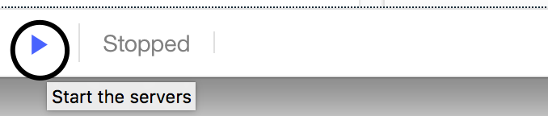

---

copyright:
  years: 2017
lastupdated: "2017-10-31"

subcollection: apiconnect

keywords: IBM Cloud, APIs, lifecycle, catalog, manage, toolkit, develop, dev portal, tutorial

---

{:new_window: target="blank"}
{:shortdesc: .shortdesc}
{:screen: .screen}
{:codeblock: .codeblock}
{:pre: .pre}

# API-Spezifikation importieren und Proxy für vorhandenen REST-Service mit Developer Toolkit erstellen
{: #tut_import_openapi_rest_tk}

Dauer: 5 Minuten  
Kenntnisstufe: Anfänger  

## Lernziel
{: #object_tut_import_openapi_rest_tk}

Dieses Lernprogramm veranschaulicht, wie Sie vorgehen müssen, damit Sie eine vorhandene API mit {{site.data.keyword.apiconnect_full}} verwalten können. Sie importieren in diesem Lernprogramm eine OpenAPI-Spezifikation und erstellen einen Durchgriffs-API-Proxy für einen vorhandenen REST-Service.

## Voraussetzungen
{: #prereq_tut_import_openapi_rest_tk}

Bevor Sie beginnen, müssen Sie [eine Instanz von API Connect einrichten](tut_prereq_set_up_apic_instance.html) und [das API Connect-Toolkit installieren](tut_prereq_install_toolkit.html).

---

## Beispielapp untersuchen und Zielendpunkt testen
{: #explore_tut_import_openapi_rest_tk}

Für dieses Lernprogramm wurde die Beispielapp _weather provider_ erstellt. Die entsprechende API-Spezifikation (Swagger 2.0) befindet sich in der Datei [weather-provider-api_1.yaml ](https://raw.githubusercontent.com/IBM-Bluemix-Docs/apiconnect/master/tutorials/weather-provider-api_1.yaml){: #new_window}.

1. Rufen Sie [http://gettingstartedweatherapp.mybluemix.net/ ](http://gettingstartedweatherapp.mybluemix.net/){: #new_window} auf, um die App kennenzulernen.  
2. Geben Sie eine gültige fünfstellige US-Postleitzahl ein, um Angaben zum _**aktuellen Wetter**_ und zur _**Vorhersage für heute**_ zu erhalten.  

3. Die obige Beispielwetterapp wurde mithilfe von APIs erstellt, von denen die Wetterdaten bereitgestellt werden. Der Endpunkt zum Abrufen der **aktuellen** Wetterdaten ist `https://myweatherprovider.mybluemix.net/current?zipcode={zipcode}`. Testen Sie ihn durch Aufrufen von [https://myweatherprovider.mybluemix.net/current?zipcode=90210 ](https://myweatherprovider.mybluemix.net/current?zipcode=90210){: #new_window}.  

  

4. Analog ist der Endpunkt zum Abrufen der Vorhersagedaten von **heute** der Link `https:// myweatherprovider.mybluemix.net/today?zipcode={zipcode}`. Testen Sie ihn durch Aufrufen von [https://myweatherprovider.mybluemix.net/today?zipcode=90210 ](https://myweatherprovider.mybluemix.net/today?zipcode=90210){: #new_window}.  

  

---

## OpenAPI-Spezifikation für Beispielapp zum Erstellen eines REST-API-Proxy importieren
{: #import_tut_import_openapi_rest_tk}

1. Starten Sie **API Designer**. Geben Sie im Terminalfenster den folgenden Befehl ein: `apic edit`.
2. Melden Sie sich mit Ihrer IBMid an.
    
3. Stellen Sie in **API Designer** sicher, dass das Navigationsfenster geöffnet ist. Falls dies nicht der Fall ist, klicken Sie auf >>, um es zu öffnen.
4. Klicken Sie im Navigationsfenster auf **Entwürfe**.
5. Wechseln Sie zur Registerkarte **APIs**.
6. Klicken Sie in der Registerkarte 'APIs' auf **Hinzufügen**.
7. Klicken Sie im Dropdown-Menü auf **API aus Datei oder URL importieren**.
   
8. An dieser Position befindet sich eine OpenAPI 2.0-Definition für die Wetter-API, die Sie für dieses Lernprogramm verwenden. Geben Sie in das Dialogfenster 'OpenAPI importieren (Swagger)' die folgende URL ein:
`https://raw.githubusercontent.com/IBM-Bluemix-Docs/apiconnect/master/tutorials/weather-provider-api_1.yaml`.
9. Lassen Sie die Option _Produkt hinzufügen_ nicht ausgewählt und klicken Sie auf **Importieren**.  
      

Nach dem Import der OpenAPI-Spezifikation wird die Ansicht 'Design' der API angezeigt. Hier können Sie unterschiedliche Abschnitte der OpenAPI-Definition anzeigen. Blättern Sie durch die Abschnitte und notieren Sie insbesondere den Wert für 'Host'. Sie können die OpenAPI auch in der Registerkarte 'Quelle' anzeigen. 
_Sie werden feststellen, dass für den Host der Wert `$(catalog.host)` eingestellt ist_. Hierbei handelt es sich um die Basis-URL für den API-Proxy.
 

## API-Proxy testen
{: #test_tut_import_openapi_rest_tk}

1. Starten Sie den lokalen Testserver durch Auswählen des Symbols **Server starten**. Sobald das Gateway gestartet ist, wird der Status automatisch aktualisiert und _**Aktiv**_ wird angezeigt.
    

2. Wählen Sie die Registerkarte **Assemblieren** aus.

3. Klicken Sie auf das Symbol für die Wiedergabe (>), um den Aufruf für das Ziel des API-Proxys zu testen.
   Da in diesem Lernprogramm das integrierte Micro Gateway verwendet wird, sollten Sie sicherstellen, dass **Micro Gateway-Richtlinien** ausgewählt ist.
    

4. Gehen Sie in der Testanzeige wie folgt vor:
  - Wählen Sie die Operation **get /current** aus.  
  - Da die Postleitzahl für diese Operation ein erforderlicher Parameter ist, geben Sie eine gültige US-Postleitzahl ein (z. B. 90210).  
  - Wählen Sie **Aufrufen** aus und überprüfen Sie die Antwort.

    Falls ein CORS-Fehler auftritt, gehen Sie gemäß den Anweisungen in der Fehlernachricht vor. Klicken Sie auf den Link im Fehler, um die Ausnahmebedingung zum Browser hinzuzufügen und klicken Sie anschließend erneut auf die Schaltfläche **Aufrufen**.
  
  - Die erwartete Antwort besteht aus der Antwort **200 OK** und den aktuellen Wetterdaten für den Postleitzahlbereich 90210.
        

## Fazit
{: #conclusion_tut_import_openapi_rest_tk}

In diesem Lernprogramm haben Sie erfahren, wie ein vorhandener REST-Service über einen Durchgriffs-API-Proxy aufgerufen werden kann. Als ersten Schritt haben Sie die Verfügbarkeit des Beispielservice über den Web-Browser getestet. Anschließend haben Sie einen API-Proxy in {{site.data.keyword.apiconnect_short}} erstellt und den Proxy mit dem Beispielservice verknüpft, der aufgerufen werden soll. Zum Schluss haben Sie diesen Service mit den internen Testtools von {{site.data.keyword.apiconnect_short}} getestet.

---

## Nächster Schritt
{: #next_tut_import_openapi_rest_tk}

API mit [Quotenbegrenzung](/docs/services/apiconnect/tutorials?topic=apiconnect-tut_rate_limit), [Client-ID und geheimen Schlüssel](/docs/services/apiconnect/tutorials?topic=apiconnect-tut_secure_landing) oder [OAuth 2.0](/docs/services/apiconnect/tutorials?topic=apiconnect-tut_secure_oauth_2) schützen.

Erstellen > **Verwalten** > Schützen > Teilen > Analysieren
