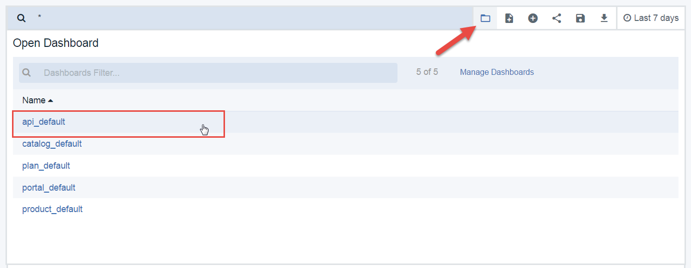
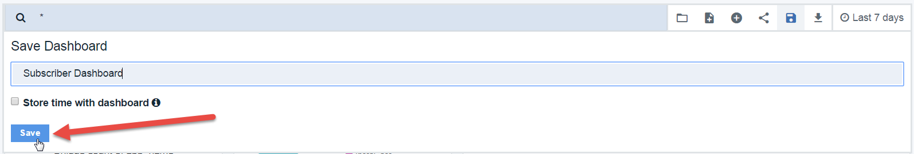

---
copyright:
  years: 2017
lastupdated: "2017-12-15"
---

{:new_window: target="blank"}
{:shortdesc: .shortdesc}
{:screen: .screen}
{:codeblock: .codeblock}
{:pre: .pre}

# Erkenntnisse aus grundlegenden Analysedaten gewinnen
Dauer: 30 Minuten  
Kenntnisstufe: Anfänger

## Lernziel
Hierbei handelt es sich um eine grundlegende Einführung in {{site.data.keyword.apiconnect_full}}. Die verfügbaren Analysedashboards werden erläutert und später folgen die eigenen APIs.

## Voraussetzungen
Damit Sie eigene API-Analysen anzeigen können, müssen Sie ein API-Produkt erstellt und veröffentlicht haben. Außerdem müssen Sie Ihre API einige Male aufgerufen haben, damit Analysedaten generiert werden, vorzugsweise mithilfe einer Client-ID einer registrierten Anwendung (nicht der vorab bereitgestellten Testapp).

Zum Generieren der Daten in diesem Lernprogramm wird *Collection Runner* von Postman zum mehrmaligen Aufrufen der API mit unterschiedlichen Daten und Client-IDs verwendet. Sie können ein ähnliches Tool (wie HttpRequester für Firefox) oder einfach cURL zum mehrmaligen Aufrufen der API in der Befehlszeile verwenden. Wenn Sie Beispielanforderungen für Ihre API beschaffen möchten, klicken Sie auf den Link **Explore** in {{site.data.keyword.apiconnect_short}}.

## Einführung in die Kataloganalyse
Als Eigner einer API benötigen Sie eine Möglichkeit, den Erfolg und die Leistung der von Ihnen angebotenen APIs zu bewerten. Diese Bewertung der Analysedaten findet hauptsächlich auf der Katalogebene statt. Falls Sie noch keine Einführung in Kataloge erhalten haben, finden Sie diese im IBM Knowledge Center unter [Mit Katalogen arbeiten ](https://www.ibm.com/support/knowledgecenter/en/SSFS6T/com.ibm.apic.apionprem.doc/conref_working_with_env.html){:new_window}. 

Sie und Ihre App-Entwickler können auch auf anwendungsspezifische Analysen in Developer Portal zugreifen, in diesem Lernprogramm wird jedoch nur die Kataloganalyse besprochen.

Sie haben Zugriff auf bis zu 90 Tage an Informationen in Echtzeit und Langzeitinformationen in Bezug auf Ihre APIs und Produkte, die in diesem Katalog veröffentlicht wurden. Hierbei wird auch angegeben, wer sie aufruft. Wenn der Katalog aus mehreren Bereichen besteht, können Sie auf Bereichsebene navigieren.

Dieses Lernprogramm besteht aus vier Aktivitäten, mit deren Hilfe beschrieben wird, wie die folgenden Tasks ausgeführt werden:
* Analysedaten anzeigen
* Details eines Ereignisdatensatzes anzeigen
* Neue Dashboards erstellen
* Neue Visualisierungen erstellen

## Aktivität 1: Sofort nutzbare Analysedaten anzeigen
1. Starten Sie im {{site.data.keyword.apiconnect_short}}-Service in {{site.data.keyword.Bluemix_short}} das Dashboard und wählen Sie den Katalog aus, den Sie öffnen möchten. 
2. Klicken Sie auf die Registerkarte *Analyse*.

    
  
Das Dashboard mit der Standardübersicht wird angezeigt; in ihr werden zwei Balkendiagramme dargestellt werden, in denen die folgenden Daten der letzten sieben Tage enthalten sind:
* Die 5 aktivsten Produkte 
* Die 5 aktivsten APIs 

3. Bewegen Sie den Mauszeiger über die Balken, um weitere Details anzuzeigen, zum Beispiel die API-Anzahl, API-Namen, etc.

    

4. Verwenden Sie die Suchleiste zum Filtern der angezeigten Daten. Sie können auch einen abweichenden Zeitfilter bzw. eine andere Rate für automatisches Aktualisieren auswählen. Die Visualisierung wird aktualisiert und spiegelt ihre Auswahlen wider.

Es werden noch weitere sofort nutzbare Dashboards bereitgestellt.

5. Klicken Sie auf das Ordnersymbol, um ein gespeichertes Dashboard zu laden, und wählen Sie **api_default** in der Dropdown-Liste aus.

    

In diesem Dashboard sind andere Visualisierungen enthalten, von denen API-Status, Fehler, Antwortzeiten, Gesamtzahl der Aufrufe und Aufrufe pro Tag angezeigt werden.

    

## Aktivität 2: Ereignisdetails anzeigen

Die Visualisierungen sind eine gute Möglichkeit, um einen Überblick über die Daten zu erhalten, aber Sie benötigen auch eine Möglichkeit, zu den Ereignisdatensätzen zu navigieren, aus denen die Diagramme bestehen.

1. Bewegen Sie den Mauszeiger über das Pfeilsymbol in der unteren linken Ecke einer Visualisierung. Ein kleiner Pfeil wird angezeigt.
2. Klicken Sie auf den Pfeil, um eine Tabelle der Daten anzuzeigen, die in dieser Visualisierung verwendet werden. 
3. Klicken Sie auf die Beschriftung **Ereignisse anzeigen**, um zu den Details eines einzelnen Ereignisses für bis zu 100 Datensätze zu navigieren.

    

Sie können Visualisierungen im Dashboard bearbeiten, verschieben und löschen.

## Aktivität 3: Neue Dashboards erstellen

In diesem Schritt wird ein neues Dashboard erstellt, von dem eine Ansicht der API-Datenverkehrsmuster bereitgestellt wird. Diese sind alle mithilfe integrierter Visualisierungen verfügbar. 

1. Klicken Sie auf das Symbol für neue Dashboards und klicken Sie auf den Link **Aus vorhandenen Visualisierungen auswählen**. 

    
    Eine Liste der verfügbaren Visualisierungen wird angezeigt.

2. Wählen Sie Visualisierungen aus, die Sie zum Dashboard hinzufügen möchten.  Beispiel:
  * Abonnierte Apps
  * Apps pro Plan 
  * Erfolgsquote
  * API-Aufrufe pro Tag
  
  **Tipp:** Wenn Sie jede Visualisierung auswählen, wird die Dashboardansicht von der Auswahlregisterkarte blockiert; es kann somit vorkommen, dass Sie nicht erkennen, ob die Visualisierung zum Dashboard hinzugefügt wurde. Wählen Sie eine Visualisierung gleichzeitig aus und schließen Sie die Auswahlregisterkarte jedes Mal, damit die Änderungen im Dashboard angezeigt werden.

3. Klicken Sie auf **Speichern** und legen Sie für das Dashboard den Namen `Subscriber Dashboard` fest.

   

    

## Aktivität 4: Neue Visualisierungen erstellen
Im oben erstellen Abonnentendashboard (Subscriber Dashboard) wurden eine integrierte Visualisierung eingeschlossen, von der die API-Aufrufe pro Tag angezeigt werden. Wenn diese Informationen in ihrer Gesamtheit angezeigt werden, ist eine Angabe der Verwendung pro App sinnvoll. Hierfür wird jetzt eine neue Visualisierung erstellt, von der diese Informationen angezeigt werden.

1. Klicken Sie auf **Neue Visualisierung** und wählen Sie den Link **Visualisierungen erstellen** aus.
    

2. Wählen Sie **Kurvendiagramm** als Visualisierungstyp aus. Das initialisierte Kurvendiagramm weist eine Y-Achse mit der Anzahl der API-Aufrufe auf. Dies ist für das Diagramm passend.

3. Wählen Sie Folgendes aus:
	* Buckettyp: **X-Achse**
	* Aggregation: **Datumshistogramm**
	* Benutzerdefinierte Bezeichnung: **Zeit** 
4. Klicken Sie auf **Ausführen**, um das Diagramm anzuzeigen. **Tipp:** Es kann erforderlich sein, den Zeitrahmen anzupassen, damit die Daten angezeigt werden.

   

In diesem Diagramm wird (bisher) eine Zeitreihe für API-Aufrufe angezeigt. Wir möchten die API-Aufrufe nach App-Name anzeigen.

5. Klicken Sie auf die Schaltfläche **Subbuckets hinzufügen**.
6. Wählen Sie Folgendes aus:
	* Buckettyp: **Trennzeilen**
	* Subaggregation: **Begriffe**
	* Feld: **App-Name**
	* Benutzerdefinierte Bezeichnung: **App**
	
   
8. Klicken Sie auf **Ausführen**, um das Diagramm anzuzeigen.
9. Klicken Sie auf **Speichern** und legen Sie für das Diagramm den Namen `API Calls by App` fest.
10. Fügen Sie die Visualisierung zum Abonnentendashboard (Subscriber Dashboard) hinzu, damit es im richtigen Zusammenhang angezeigt wird.

   
 
Für die Visualisierung von Details zu API-Aufrufen, Aufrufern, etc stehen weitere Informationen zur Verfügung. Eine vollständige Liste der API-Ereignisse ist im API Connect Knowledge Center oder in der Liste der Begriffe beim Erstellen von Visualisierungen verfügbar.

## Fazit

Die Möglichkeit zur Visualisierung von API-Analysedaten in unterschiedlichen Darstellungsarten und Kombinationen ermöglicht Schlussfolgerungen oder tiefere Einblicke in die API-Daten. Sie können diese Erkenntnisse nutzen, um zu entscheiden, welche APIs angeboten werden sollen, wann eine API ersetzt oder zurückgezogen werden soll, wer eine API nutzt, etc.

Beispiel: APIs der Version 1 (v1) und Version 2 (v2) von einem Anbieter mit dem Namen 'ACME' wurden für mehrere Jahre verwendet. Version v1 wurde nicht mehr unterstützt, als Release v2 freigegeben wurde. Es wurde sichergestellt, dass vorhandene Benutzer von v1 darüber informiert waren, dass sie einen bestimmten Zeitraum für den Wechsel zu v2 haben. Als der Termin kurz bevorsteht, möchte ACME wissen, wie schnell die Nutzer von v1 wechseln, um seinen Partnern Unterstützung anbieten zu können. 

Mithilfe der soeben erstellten Visualisierungen verfügt ACME auf einen Blick über diese Informationen.

In diesem Lernprogramm wurden mehrere Aktivitäten beschrieben, die die Erstellung sinnvoller Kombinationen von APIs und Nutzerdaten veranschaulichen. Mithilfe von Visualisierungen und Dashboards wurden Tools erstellt, von denen Daten bereitgestellt werden können, mit denen sichergestellt werden kann, dass die richtige Mischung an APIs angeboten wird.

---

## Nächster Schritt

Lernen, [wie die APIs und Versionssteuerung verwaltet werden](tut_manage_version_landing.html).

Erstellen > Verwalten > Schützen > Teilen > **Analysieren**  
