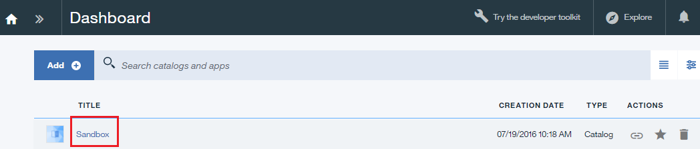
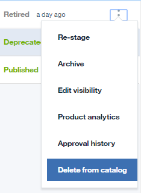
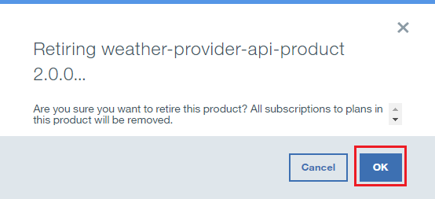
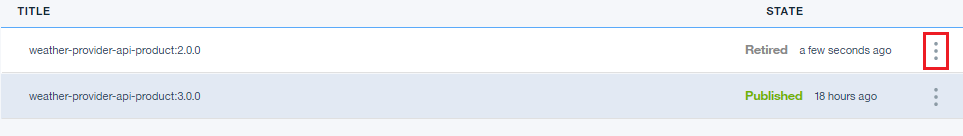

---

copyright:
  years: 2019
lastupdated: "2019-3-15"

subcollection: apiconnect

keywords: IBM Cloud, APIs, lifecycle, catalog, manage, toolkit, develop, dev portal, tutorial

---

{:new_window: target="_blank"}
{:shortdesc: .shortdesc}
{:screen: .screen}
{:codeblock: .codeblock}
{:pre: .pre}

# API-Produkte archivieren und löschen
{: #tut_manage_remove}

**Dauer**: 15 Minuten  
**Kenntnisstufe**: Anfänger 

## Lernziel
{: #object_tut_manage_remove}
In diesem Lernprogramm löschen und archivieren Sie eine API und ziehen eine API zurück.

---
## Voraussetzungen
{: #prereq_tut_manage_remove}

1. [Richten Sie die {{site.data.keyword.apiconnect_full}}-Instanz ein](/docs/services/apiconnect/tutorials?topic=apiconnect-tut_prereq_set_up_apic_instance).

2. Schließen Sie das [Lernprogramm zum Außerkraftsetzen von API-Produkten](/docs/services/apiconnect/tutorials?topic=apiconnect-tut_manage_supercede) ab.

---

## API-Produkt löschen
{: #delete_tut_manage_remove}

1. Melden Sie sich bei {{site.data.keyword.Bluemix_short}} an: https://cloud.ibm.com.
2. Klicken Sie im {{site.data.keyword.Bluemix_notm}}-**Dashboard** auf **Cloud Foundry-Services**.Starten Sie den {{site.data.keyword.apiconnect_short}}-Service. 
3. Stellen Sie in {{site.data.keyword.apiconnect_short}} sicher, dass das Navigationsfenster geöffnet ist. Falls dies nicht der Fall ist, klicken Sie auf **>>**, um es zu öffnen.  

  

4. Klicken Sie auf **Sandbox**, um den Sandbox-Katalog zu öffnen. **Hinweis:** Es kann sein, dass Sie zum Dashboard zurückkehren müssen, um die verfügbaren Kataloge anzuzeigen. Es kann auch vorkommen, dass die Kataloge auf der Dashboardseite als Kacheln und nicht in einer Liste angezeigt werden.

5. Klicken Sie auf den vertikalen Auslassungspunkt in der Zeile **Wetter-Provider-API 1.0.0**.  

6. Wählen Sie **Aus Katalog löschen** aus.  

7. Klicken Sie auf **OK**.  

    Das Produkt wird in der Liste der Produkte im Katalog nicht mehr angezeigt. Es kann zu diesem Zeitpunkt nicht mehr wiederhergestellt werden.

## API-Produkt archivieren
{: #archive_tut_manage_remove}

1. Klicken Sie auf den vertikalen Auslassungspunkt in der Zeile **Wetter-Provider-API 2.0.0**.  

2. Wählen Sie **Zurückziehen** aus.  

3. Klicken Sie auf **OK**.  

4. Klicken Sie auf den vertikalen Auslassungspunkt in der Zeile **Wetter-Provider-API 2.0.0**.  

5. Wählen Sie **Archivieren** aus.  

6. Klicken Sie auf **OK**.  

    Das Produkt wird in der Liste der Produkte im Katalog nicht mehr angezeigt. Es kann wiederhergestellt werden.

7. Klicken Sie auf das Symbol für die Listenansicht.  

8. Wählen Sie **Archiviert** aus.  

9. Klicken Sie auf den vertikalen Auslassungspunkt in der Zeile **Wetter-Provider-API 2.0.0**.  

10. Wählen Sie **Archivierung aufheben** aus.  

    Der Status des Produkts wechselt zu 'Zurückgezogen'
    

 
 
## Fazit
{: #conclusion_tut_manage_remove}

In diesem Lernprogramm haben Sie Folgendes durchgeführt:

1. Ein API-Produkt gelöscht
2. Ein API-Produkt außer Kraft gesetzt
3. Ein API-Produkt archiviert
4. Die Archivierung eines API-Produkts aufgehoben

---

