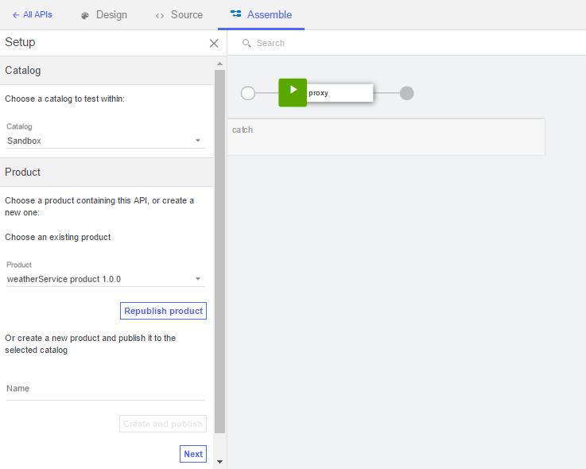

---

copyright:
  years: 2019
lastupdated: "2019-3-11"

subcollection: apiconnect

keywords: IBM Cloud, APIs, lifecycle, catalog, manage, toolkit, develop, dev portal, tutorial

---


{:new_window: target="_blank"}
{:shortdesc: .shortdesc}
{:screen: .screen}
{:codeblock: .codeblock}
{:pre: .pre}


# SOAP-Service verwalten
{: #tut_manage_soap_api}

**Dauer:** 15 Minuten
**Kenntnisstufe:** Anfänger

---
## Lernziel
{: #object_tut_manage_soap_api}

In diesem Lernprogramm verwenden Sie API Manager, um eine SOAP-API zu erstellen, die als Proxy für einen SOAP-basierten Wetterdienst fungiert.

## Voraussetzungen
{: #prereq_tut_manage_soap_api}

- Bevor Sie beginnen, müssen Sie [eine Instanz von {{site.data.keyword.apiconnect_short}} einrichten](/docs/services/apiconnect/tutorials?topic=apiconnect-tut_prereq_set_up_apic_instance).
- Bevor Sie beginnen, müssen Sie die Testdatei [weatherprovider.wsdl ](https://raw.githubusercontent.com/IBM-Bluemix-Docs/apiconnect/master/tutorials/weatherprovider.wsdl){: #new_window} in Ihr lokales Dateisystem kopieren.
Hinweis: Sie können auf **Unbearbeitet** klicken und anschließend die resultierende Seite im lokalen System als `.wsdl`-Datei speichern. Wie der Name nahelegt, werden von diesem SOAP-Service Wetterdaten zurückgegeben, wenn eine Postleitzahl eingegeben wird.

---
## SOAP-API-Definition festlegen
{: #setup_tut_manage_soap_api}

1. Melden Sie sich bei {{site.data.keyword.Bluemix_short}} an: https://cloud.ibm.com.
2. Klicken Sie im {{site.data.keyword.Bluemix_notm}}-**Dashboard** auf **Cloud Foundry-Services**. 
3. Starten Sie den {{site.data.keyword.apiconnect_short}}-Service. 
4. Stellen Sie in {{site.data.keyword.apiconnect_short}} sicher, dass das Navigationsfenster auf der linken Seite geöffnet ist. Falls dies nicht der Fall ist, klicken Sie auf **>>**, um es zu öffnen.  
5. Wählen Sie im Navigationsfenster **Entwürfe** aus.   

6. Wählen Sie im Dropdown-Menü **API von SOAP-Service** aus.
  

7. Das Dialogfenster 'Neue API aus WSDL' wird geöffnet. Klicken Sie auf **Datei hochladen**.
  

8. Wählen Sie die Datei `weatherprovider.wsdl` aus, die Sie vorher gespeichert haben.

9. Das Dialogfenster 'Neue API aus WSDL' wird erneut angezeigt. Wählen Sie das Kontrollkästchen **weatherService** aus. Klicken Sie auf **Fertig**.
  

10. Bei einem erfolgreichen Import wird die Ansicht 'Design' der API angezeigt. Sie können auch die OpenAPI-Definition in der Registerkarte 'Quelle' anzeigen.
   _In der Registerkarte 'Quelle' wird angezeigt, dass die WSDL-Datei in der OpenAPI-Definition eingeschlossen ist._
  

11. Klicken Sie auf das Symbol , um Ihre Änderungen zu speichern. Kurzzeitig wird die Bestätigungsnachricht 'API gespeichert' angezeigt.

12. In der Menüleiste mit dem Speichersymbol gibt die Registerkarte **Design** die derzeitige Position an. Daneben befindet sich die Registerkarte **Quelle**, in der Sie direkt die Swagger-Datei (Version 2.0) anzeigen können, in der die API dargestellt wird; in der Nähe befindet sich auch die Registerkarte **Assemblieren**, mit der Sie die Drag-and-Drop-Schnittstelle für die API-Verarbeitung öffnen können. Klicken Sie auf **Assemblieren**.
    

## SOAP-API-Definition testen
{: #test_tut_manage_soap_api}

1. Klicken Sie in der Registerkarte **Assemblieren** auf das Symbol **Weitere Aktionen** (drei Punkte) und wählen Sie **Standardprodukt generieren** im Menü aus.  
   

2. Bestätigen Sie die Standardoptionen im Dialogfenster **Neues Produkt** und wählen Sie **Produkt erstellen** aus. **weatherService product 1.0.0** wird erstellt und im Sandbox-Katalog veröffentlicht.  
  
 
  _In {{site.data.keyword.apiconnect_short}} wird mithilfe von **Produkte** eine Möglichkeit zum Gruppieren von APIs bereitgestellt, die für eine bestimmte Verwendung vorgesehen sind. Die Produkte werden in einem **Katalog** veröffentlicht. Referenz: [{{site.data.keyword.apiconnect_short}}-Glossar](docs/services/apiconnect/tutorials/tut_expose_soap_service/apic_glossary.html)_

3. Speichern Sie Ihre Änderungen.  

4. Klicken Sie neben dem Suchfeld auf das Testsymbol, um den API-Service zu testen. Das Konfigurationsmenü wird angezeigt.

5. Wählen Sie in der Liste der Produkte `weatherService product 1.0.0` aus.  
  

6. Blättern Sie nach unten und klicken Sie auf **Weiter**.

7. Wählen Sie in der Liste der Operationen `post /weatherRequest` aus.  
  

8. Blättern Sie abwärts. Geben Sie den folgenden XML-Code in das Textfeld ein. Sie können die folgende Beispiel-XML auswählen, kopieren und anschließend auf das Feld **Hauptteil** klicken, um das Feld zu aktivieren und die Beispiel-XML einzufügen.  
  ```
  <?xml version="1.0" encoding="UTF-8"?>
  <soap:Envelope xmlns:xsi="http://www.w3.org/2001/XMLSchema-instance" xmlns:xsd="http://www.w3.org/2001/XMLSchema" xmlns:soap="http://schemas.xmlsoap.org/soap/envelope/">
   <soap:Body>
  <wdata:WeatherRequest xmlns:wdata="http://www.ibm.com/wdata">
       <zipcode>10504</zipcode>
  </wdata:WeatherRequest>
   </soap:Body>
  </soap:Envelope>
  ```
 
  

9. Blättern Sie bei Bedarf nach unten und klicken Sie auf **Aufrufen**.
Von der API wird der **Hauptteil** der Antwort mit dem aktuellen Wetter zurückgegeben.  
  

## Fazit
{: #conclusion_tut_manage_soap_api}

In diesem Lernprogramm haben Sie Folgendes durchgeführt:
1. SOAP-API-Definition festgelegt
2. API-Definition getestet
3. **Hauptteil** der Antwort mit dem Ergebnis der Anfrage vom Endpunkt der Wetter-API empfangen

---

## Nächster Schritt
{: #next_tut_manage_soap_api}

[Service als REST-API verfügbar machen](/docs/services/apiconnect/tutorials?topic=apiconnect-tut_expose_soap_service) oder die API schützen wie in [Schutz durch OAuth 2.0](/docs/services/apiconnect/tutorials?topic=apiconnect-tut_secure_oauth_2) beschrieben.

Erstellen > **Verwalten** > Schützen > Teilen > Analysieren
