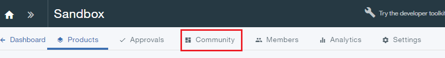
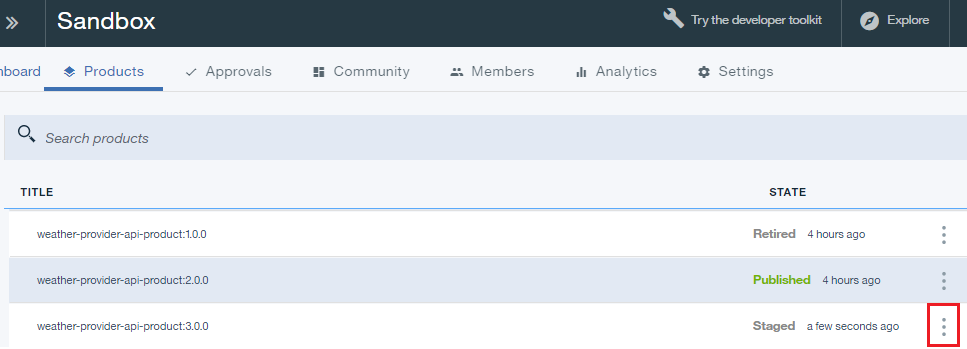
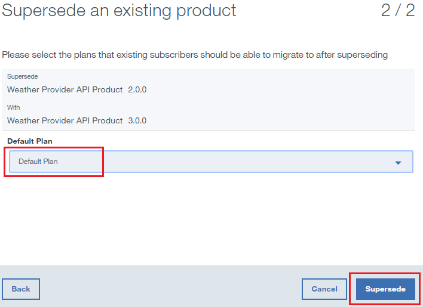

---

copyright:
  years: 2017
lastupdated: "2017-10-10"

---

{:new_window: target="_blank"}
{:shortdesc: .shortdesc}
{:screen: .screen}
{:codeblock: .codeblock}
{:pre: .pre}

# API-Produkte außer Kraft setzen
**Dauer:** 15 Minuten  
**Kenntnisstufe:** Anfänger  

## Voraussetzungen

1. [Richten Sie die {{site.data.keyword.apiconnect_full}}-Instanz ein](tut_prereq_set_up_apic_instance.html).

2. Schließen Sie das [Lernprogramm zum Ersetzen von API-Produkten](tut_manage_replace.html) ab.

---
## Lernziel
In diesem Lernprogramm setzen Sie eine vorhandene API zugunsten einer neuen außer Kraft.

---
## API-Produkt außer Kraft setzen
1. Melden Sie sich an {{site.data.keyword.Bluemix_short}} an: [https://console.ng.bluemix.net/login ](https://console.ng.bluemix.net/login){:new_window}.

2. Starten Sie im {{site.data.keyword.Bluemix_short}}-Dashboard den {{site.data.keyword.apiconnect_short}}-Service.

3. Wenn Sie in API Manager bisher nicht den Navigationsbereich der Benutzerschnittstelle fixiert haben, klicken Sie auf das Symbol **Navigieren zu** . Der Navigationsbereich der Benutzerschnittstelle von API Manager wird geöffnet. Klicken Sie zum Fixieren des Navigationsbereichs der Benutzerschnittstelle auf das Symbol für das **Fixiermenü** .

4. Klicken Sie auf **Sandbox**, um den Sandbox-Katalog zu öffnen. **Hinweis:** Die Anzeige kann Kacheln anstatt einer Liste der Kataloge enthalten.

4. Klicken Sie auf **Entwürfe** > **APIs**.

5. Klicken Sie in der Anzeige 'APIs' auf **Weather Provider API**, um die API für den REST-Proxy zu öffnen.  

6. Ändern Sie die **Version** in 3.0.0.

7. Klicken Sie auf das Plattensymbol, um die Änderungen an der API zu speichern.  

8. Klicken Sie auf **Alle APIs**.  

9. Klicken Sie auf **Produkte**.  

10.	Wählen Sie das Produkt **Weather Provider API 2.0.0** aus.  

11.	Ändern Sie die **Version** in 3.0.0. Klicken Sie auf das Plattensymbol, um die Änderungen zu speichern. Klicken Sie auf das Symbol **Staging**.  

12.	Klicken Sie auf **>>**, um das Navigationsfenster zu öffnen, und wählen Sie anschließend **Dashboard** aus.  

13.	Klicken Sie auf **Sandbox**.

14.	Klicken Sie auf **Community**.  

15.	Klicken Sie auf **Abonnements**.  

16.	Notieren Sie die Anwendungsabonnements für Weather Provider API Product 2.0.0. Klicken Sie auf **Produkte**.
  

17.	Klicken Sie auf den vertikalen Auslassungspunkt in der Zeile **Weather Provider API Product 3.0.0 Staged**.  

18.	Wählen Sie **Vorhandenes Produkt außer Kraft setzen** aus.  

19.	Wählen Sie **Weather Provider API Product 2.0.0** in der Liste der dargestellten Produkte aus. Klicken Sie auf **Weiter**.  

20.	Wählen Sie **Standardplan** aus. Klicken Sie auf **Außer Kraft setzen**.  

    Als Ergebnis dieses Ersetzungsvorgangs wird 'Weather Provider API Product 2.0.0' nicht weiter unterstützt und 'Weather Provider API Product 3.0.0' wird veröffentlicht.  
 
 
21.	Klicken Sie auf **Community >> Abonnements**.  

 
22.	Klicken Sie auf den vertikalen Auslassungspunkt in der Zeile **Weather Provider API Product 2.0.0**. Wählen Sie **Verwalten** aus.  
 

23.	Wählen Sie **Standardplan** unter 'Weather Provider API Product 3.0.0' aus. Klicken Sie auf **Migrieren**.  

    Als Ergebnis dieser Migration wird 'Weather Provider API Product 2.0.0' auf 'Weather Provider API Product 3.0.0' migriert.  
 
 

 
## Was Sie in diesem Lernprogramm erreicht haben
In diesem Lernprogramm haben Sie Folgendes durchgeführt:

1. Ein API-Produkt aktualisiert
2. Ein vorhandenes API-Produkt zugunsten eines aktualisierten API-Produkts außer Kraft gesetzt
3. Das Abonnement für das vorhandene API-Produkt auf das aktualisierte API-Produkt migriert

---

