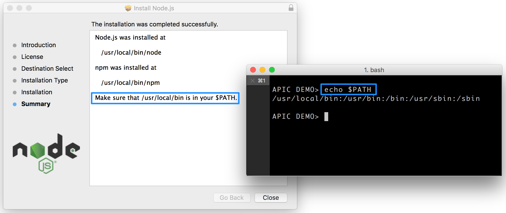

---

copyright:
  years: 2017
lastupdated: "2017-10-31"

keywords: IBM Cloud, APIs, lifecycle, catalog, manage, toolkit, develop, dev portal, tutorials

subcollection: apiconnect

---

{:new_window: target="blank"}
{:shortdesc: .shortdesc}
{:screen: .screen}
{:codeblock: .codeblock}
{:pre: .pre}

# API Connect-Toolkit installieren
{: #tut_prereq_install_toolkit}

**Dauer:** 15 Minuten
  
**Kenntnisstufe:** Anfänger  

## Voraussetzungen
{: #prereq_tut_prereq_install_toolkit}

1. Node.js
2. Node Product Manager (NPM)
3. {{site.data.keyword.apiconnect_full}} _Lite_

<table>
  <tr><td><b>Node.js:</b> Eine asynchrone ereignisgesteuerte JavaScript-Laufzeit, die zum Erstellen und Ausführen skalierbarer Netzanwendungen verwendet wird.
     
    <b>Node Product Manager</b>: JavaScript-Produktmanager und -Software-Registry 
    <b>{{site.data.keyword.apiconnect_short}} _Lite_:</b> Eine kostenlose Version von {{site.data.keyword.apiconnect_short}}, die sich auf Ihrem Laptop befindet.</td></tr>
  </table>  

## Node.js installieren
{: #nodejs_tut_prereq_install_toolkit}

1. Laden Sie Node.js von einer der beiden folgenden Quellen herunter und führen Sie die Installation aus:
   * [https://nodejs.org/en/download/ ](https://nodejs.org/en/download/){: #new_window} (Hinweis: Laden Sie die LTS-Version für Ihre Plattform herunter, nicht die neueste, das sonst Fehler auftreten können.)
      **ODER**
   * [https://developer.ibm.com/node/sdk/v6/ ](https://developer.ibm.com/node/sdk/v6/){: #new_window}  

    _Im Verlauf der Installation von Node.js wird auch **npm** (Node Package Manager) installiert_.

2.  Sobald Node.js heruntergeladen und installiert ist, stellen Sie sicher, dass sich Node.js in _PATH_ befindet.
      

3. Aktualisieren Sie **npm**. Geben Sie in einer Befehlszeile `npm install -g npm` ein.  
   **Hinweis:** Wenn Sie für npm `--engine-strict` oder `npm config set engine-strict true` einstellen, wird die Ausführung der Installation verhindert.

4. Überprüfen Sie die installierte Version und den Pfad.
     

## API Connect-Toolkit und Micro Gateway installieren
{: #tk_micro_tut_prereq_install_toolkit}

1. Aktualisieren Sie die npm-Konfiguration so, dass die Verwendung nicht vertrauenswürdiger Zertifikat zulässig ist.  
   `npm config -g set strict-ssl false`  

2. Installieren Sie das {{site.data.keyword.apiconnect_short}}-Toolkit von **npm**.  
    `npm install -g apiconnect`

3. Überprüfen Sie die installierte Version.  
    `apic -v`

4. Geben Sie den folgenden Befehl in die Befehlszeile ein: `npm install -g microgateway`.

Micro Gateway (microgateway) wird als lokaler Testserver verwendet.
