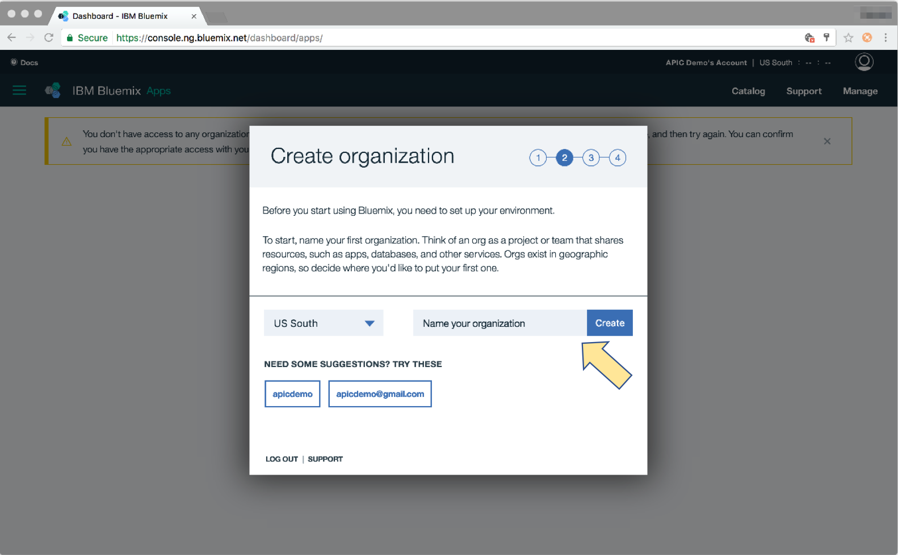

---
copyright:
  years: 2017
lastupdated: "2017-10-31"
---

{:new_window: target="blank"}
{:shortdesc: .shortdesc}
{:screen: .screen}
{:codeblock: .codeblock}
{:pre: .pre}

# API Connect-Instanz einrichten
**Dauer:** 15 Minuten  
**Kenntnisstufe:** Anfänger  

## Was Sie benötigen
1. Eine IBMid
2. Ein {{site.data.keyword.Bluemix_short}}-Konto
3. Eine {{site.data.keyword.apiconnect_full}}-Instanz mit mindestens einem _Lite_-Plan

<table>
  <tr><td><b>IBMid:</b> Wird für den Zugriff auf alle Apps, Communitys, den Support und vieles mehr von IBM verwendet.
     
    <b>{{site.data.keyword.Bluemix_notm}}</b>: Die Cloudplattform von IBM, auf der {{site.data.keyword.apiconnect_short}} zusammen mit anderen Apps und Services gehostet wird. 
    <b>{{site.data.keyword.apiconnect_short}} Lite:</b> Eine kostenlose Version von {{site.data.keyword.apiconnect_short}}, die auf {{site.data.keyword.Bluemix_notm}} gehostet wird.</td></tr>
  </table>  

---

1. Melden Sie sich mit Ihrer IBMid an der folgenden URL an: [https://console.ng.bluemix.net/registration/ ](https://console.ng.bluemix.net/registration/){:new_window}.

	Verfügen Sie bereits über eine IBMid? Dann überspringen Sie die Registrierung und erstellen einfach ein kostenloses {{site.data.keyword.Bluemix_short}}-Konto unter der folgenden URL: [https://console.ng.bluemix.net/ ](https://console.ng.bluemix.net/){:new_window}.  

2. Wenn Sie über eine IBMid und ein {{site.data.keyword.Bluemix_notm}}-Konto verfügen, erstellen Sie Ihre {{site.data.keyword.apiconnect_short}}-Instanz.  
  a. Melden Sie sich an {{site.data.keyword.Bluemix_notm}} an: [https://new-console.ng.bluemix.net/login ](https://new-console.ng.bluemix.net/login){:new_window}.  
    
  b. Erstellen Sie Ihre _Organisation_ in {{site.data.keyword.Bluemix_notm}}. Sie werden dazu aufgefordert, wenn Sie sich zum ersten Mal anmelden.  
  
  c. Erstellen Sie Ihren _Bereich_.  
  
  d. Rufen Sie [https://console.ng.bluemix.net/catalog/services/api-connect ](https://console.ng.bluemix.net/catalog/services/api-connect){:new_window} auf.  
    
  e. Wählen Sie den Preistarif _Lite_ (kostenlos) aus und klicken Sie auf **Erstellen**, um zu beginnen.  
    
