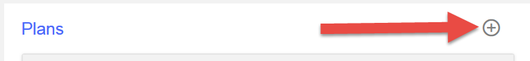

---
copyright:
  years: 2017
lastupdated: "2017-09-30"
---

{:new_window: target="blank"}
{:shortdesc: .shortdesc}
{:screen: .screen}
{:codeblock: .codeblock}
{:pre: .pre}

# Quotenbegrenzungen einrichten
**Dauer**: 15 Minuten  
**Kenntnisstufe**: Anfänger  

## Lernziel
In diesem Lernprogramm erfahren Sie, wie Sie Quotenbegrenzungen für APIs verwenden. Durch das Festlegen von Quotenbegrenzungen können Sie den Netzverkehr für die
APIs und bestimmte Operationen in den APIs verwalten. Eine Quotenbegrenzung ist die maximale Anzahl an Aufrufen, die in einem bestimmten Zeitintervall zulässig sein soll.

In {{site.data.keyword.apiconnect_full}} wird mithilfe von *Produkte* eine Möglichkeit zum Gruppieren von APIs in einem Paket für einen bestimmten Anwendungsfall oder eine bestimmte Zielgruppe bereitgestellt. Produkte enthalten auch *Pläne*, in denen die Begriffe beschrieben werden, die Sie Ihren API-Nutzern anbieten möchten. Präziser formuliert, werden in Plänen Regeln definiert, die API-Subskription zugeordnet sind: API-Quotenbegrenzungen und ob die Subskription genehmigt werden muss.

Wenn ein Anwendungsentwickler APIs verwenden möchte, wählen Sie ein Produkt aus, in dem die API enthalten ist, die Sie verwenden möchten, und abonnieren abhängig von ihren Nutzungsanforderungen einen der Pläne des Produkts.

In diesem Lernprogramm machen Sie sich mit den folgenden Themen vertraut:
1. Erstellung eines neuen Plans mit Quotenbegrenzung für ein vorhandenes Produkt
2. Vorgänge beim Überschreiten der zulässigen Quotenbegrenzungen

## Voraussetzungen
Sie müssen bereits eine API in {{site.data.keyword.apiconnect_short}} erstellt haben, die mit mindestens einem API-Schlüssel gesichert ist. In den folgenden Anweisungen ist die [Beispieldatei für 'Weather Provider API' ](https://raw.githubusercontent.com/ibm-apiconnect/getting-started/master/toolkit/1a-import/weather-provider-api_1.0.0.yaml){:new_window} der Ausgangspunkt, gesichert mithilfe einer [Client-ID und einem geheimen Schlüssel](tut_secure_landing.html).

Führen Sie folgenden Lernprogramme aus, bevor Sie mit diesem Lernprogramm beginnen:
- [API-Spezifikation importieren und Proxy für vorhandenen REST-Service erstellen](tut_rest_landing.html)
- [API mit Client-ID und geheimen Schlüssel schützen](tut_secure_landing.html)

---
## API Connect starten

1. Melden Sie sich an {{site.data.keyword.Bluemix_short}} an: [https://console.ng.bluemix.net/login ](https://console.ng.bluemix.net/login){:new_window}.
2. Blättern Sie nach der Anmeldung an {{site.data.keyword.Bluemix_short}} abwärts bis zu **Alle Services** und klicken Sie auf **API Connect**.
3. Klicken Sie auf **API Connect**, um den {{site.data.keyword.apiconnect_short}}-Service zu starten.

## Standardplan kennenlernen
1. Wählen Sie im {{site.data.keyword.apiconnect_short}}-Navigationsfenster **Entwürfe** aus. (Wenn das Navigationsfenster nicht geöffnet wird, klicken Sie auf **>>**, um es zu öffnen.)
2. Wählen Sie die Registerkarte **Produkte** aus; daraufhin sollte das Produkt 'Weather Provider API' aufgelistet werden.

         

3. Klicken Sie auf den Produktlink; die Ansicht 'Design' wird geöffnet und Informationen zum Produkt werden aufgelistet.
4. Blättern Sie abwärts zum Abschnitt 'Pläne' der Seite. Als Sie dieses Produkt generierten, wurde ein Standardplan erstellt. 

       
5. Erweitern Sie die Details des Standardplans. Beachten Sie die Quotenbegrenzung (100 Aufrufe pro Stunde) und die API-Liste, die erweitert werden kann, damit bestimmte Operationen angezeigt werden.

    

   
## Neuen Plan mit Quotenbegrenzung erstellen

Nachdem Sie sich mit dem Standardplan vertraut gemacht haben, wird im nächsten Schritt ein neuer Plan mit restriktiveren Quotenbegrenzungen erstellt, um zu veranschaulichen, was geschieht, wenn ein API-Nutzer die Obergrenzen für den Plan überschreitet. 
1. Klicken Sie auf die Schaltfläche, um einen neuen Plan hinzuzufügen.
 
     
    
    Ein neuer Plan wird erstellt, für den standardmäßig eine unbegrenzte Nutzung zulässig ist (also ohne Quotenbegrenzung). Legen Sie für ihn einen aussagekräftigeren Name und eine restriktivere Begrenzung fest.
2. Klicken Sie auf den neuen Plan (`New Plan 1`), um die Details zu erweitern.
3. Klicken Sie auf das Feld 'Titel' und legen Sie als Titel für den Plan `Demo` fest.
4. Klicken Sie auf das Feld 'Name' und legen Sie als Name für den Plan `demo-plan` fest.
5. Klicken Sie auf das Pluszeichen (+), um eine neue Quotenbegrenzung hinzuzufügen.
6. Benennen Sie die neue Quotenbegrenzung in `demo-rate-limit` um und stellen Sie sicher, dass `1 / 1 Minute` eingestellt ist.
7. Markieren Sie das Kontrollkästchen `Festen Grenzwert durchsetzen`. (Wenn diese Einstellung aktiviert ist, empfängt eine Anwendung einen Fehler, wenn eine API von ihr öfter als gemäß abonniertem Plangrenzwert aufgerufen wird).
8. Bestätigen Sie alle anderen Standardeinstellungen und speichern Sie das Produkt.

    

## Aktualisiertes Produkt im Sandbox-Katalog bereitstellen und veröffentlichen

Es kann sein, dass Sie Ihr Produkt in früheren Beispielen mit dem Testtool veröffentlicht haben, von dem die API mit den vorab bereitgestellten Berechtigungsnachweisen der Testanwendung aufgerufen wird. Da für diese Testanwendung jedoch nicht Quotenbegrenzungen gelten, müssen Sie zum Testen der Quotenbegrenzungen hier eine neue Anwendung erstellen. Weitere Informationen hierzu finden Sie im [IBM Knowledge Center-Inhalt für API Connect ](https://www.ibm.com/support/knowledgecenter/SSFS6T/com.ibm.apic.toolkit.doc/tapim_create_product.html){:new_window}.

1. Klicken Sie auf das Symbol 'Veröffentlichen' zum *Bereitstellen* des Produkts im **Sandbox**-Katalog. Durch diese Aktion werden die Änderungen am Produktentwurf zum ausgewählten Katalog hinzugefügt. Im nächsten Schritt ist das *Veröffentlichen* der Produktänderungen erforderlich, damit sie für die Nutzer über Developer Portal verfügbar werden.
    
2. Klicken Sie auf die Schaltfläche >>, um das Navigationsmenü zu öffnen.
    
3. Wählen Sie das Dashboard aus und öffnen Sie anschließend den Katalog **Sandbox**. Das Produkt 'Weather Provider API' wird als **Bereitgestellt** aufgelistet.
4. Klicken Sie auf den Auslassungspunkt und wählen Sie im Menü **Veröffentlichen** aus.
    
5. Bestätigen Sie die Standardeinstellungen für die Sichtbarkeit und klicken Sie auf die Schaltfläche **Veröffentlichen**. Sobald das Produkt veröffentlicht und in Developer Portal sichtbar ist, können Anwendungsentwickler die verfügbaren Pläne abonnieren.

## Neue Anwendung (für Nutzer) in Developer Portal registrieren
Anwendungsentwickler untersuchen und verwenden APIs mithilfe von Developer Portal. Weitere Informationen zu Developer Portal finden Sie im folgenden [IBM Knowledge Center-Abschnitt ](https://www.ibm.com/support/knowledgecenter/SSFS6T/com.ibm.apic.devportal.doc/tapim_tutorial_using_ADP.html){:new_window}.

Wenn Sie zum ersten Mal mit Developer Portal arbeiten, müssen Sie eine Developer Portal-Instanz für den Sandbox-Katalog bereitstellen. Das Konto, an dem Sie sich anmelden, wenn Sie das Portal bereitstellen, ist das Administratorkonto für dieses Portal. Damit Sie anschließend APIs untersuchen und testen können, müssen Sie eine &-Anmeldung mit einem neuen Developer Portal-Konto erstellen und sich unter Verwendung dieses Kontos und nicht des Administratorkontos anmelden (mit einer anderen E-Mail-Adresse).

Führen Sie diese Schritte gemäß der folgenden Anweisungen aus.

1. Starten Sie Developer Portal. Wenn Sie die URL nicht kennen, finden Sie diese in der Registerkarte 'Einstellungen' des Sandbox-Katalogs.

   
    - Wenn Sie die Developer Portal-Instanz zum ersten Mal bereitstellen, wählen Sie im Dropdown-Menü **IBM Developer Portal** aus.
    - Dieser Vorgang kann bis zu einer Stunde dauern. Wenn die Sandbox-Developer Portal-Instanz fertig ist, empfangen Sie eine E-Mail mit einem Link
zur neuen Developer Portal-Site. Der Link ist ein Link zur einmaligen Verwendung für das Administratorkonto.
2. Melden Sie sich mit Ihren App-Entwickler-Berechtigungsnachweisen an (**nicht** mit der IBMid). ***(Erstellen Sie bei Bedarf unter Verwendung einer anderen Adresse als Ihrer IBMid ein neues Entwicklerkonto.)***
3. Klicken Sie auf den Link **Apps** in der Symbolleiste und klicken Sie auf die Schaltfläche **Neue App erstellen**.

   
4. Legen Sie einen Titel für die Anwendung fest und klicken Sie auf **Abschicken**.

   
5. Speichern Sie den angezeigten geheimen Clientschlüssel und die angezeigte Client-ID. Dies ist die einzige Möglichkeit zum Kopieren des geheimen Clientschlüssels.

   

## API-Produkt abonnieren

1. Klicken Sie in der Symbolleiste auf den Link **API-Produkte**. Das Produkt 'Weather Provider API' wird aufgelistet. 

   
2. Klicken Sie auf den Link zum Anzeigen der Details und Optionen. Die verfügbaren Pläne sollten angezeigt werden: der ursprüngliche Standardplan und der neue Demoplan. (Falls nur ein Plan angezeigt wird, kehren Sie zu API Connect zurück und stellen sicher, dass die Produktänderungen gespeichert, bereitgestellt und im Sandbox-Katalog veröffentlicht wurden.) 

   
3. Klicken Sie für den Demoplan auf **Abonnieren** und wählen Sie die soeben registrierte Anwendung aus. Jetzt kann die Anwendung die diesem Plan zugeordneten APIs aufrufen; hierbei ist bis zu *ein* API-Aufruf pro Minute zulässig. 

Jetzt kann dieses Verhalten getestet werden und es kann überwacht werden, was geschieht, wenn die Anwendung die angegebene Rate überschreitet.

## API mit Quotenbegrenzung aufrufen

1. Klicken Sie auf der Seite des Produkts 'Weather Provider API' in Developer Portal auf den Link für die API.

   
2. Die Seite wird aktualisiert und die Details der API, ihre Operationen und ein Bereich zum Testen der API werden angezeigt. (Auf diese Art lernen auch die API-Nutzer die API kennen und testen sie.) Beachten Sie das dunkle Testfenster und blättern Sie abwärts zum ersten Abschnitt mit der Bezeichnung **Diese Operation testen**.

3. Geben Sie zum Testen der Operation `GET /current` den geheimen Clientschlüssel der Anwendung und eine gültige Postleitzahl ein. Klicken Sie auf die Schaltfläche **Operation aufrufen**. Daraufhin müssen die Antwort `200 OK` und die Daten zum aktuellen Wetter in diesem Postleitzahlenbereich zurückgegeben werden. 

   

   

4. Klicken Sie vor dem Ablauf einer Minute erneut auf die Schaltfläche **Operation aufrufen** und verwenden Sie dazu eine andere Postleitzahl, wenn Sie dies möchten. Jetzt muss die Antwort `429 Too Many Requests` lauten.

   

5. Wenn Sie überprüfen möchten, ob die Quotenbegrenzung zurückgesetzt wird, warten Sie eine Minute, versuchen es erneut und stellen sicher, dass Sie jetzt eine gültige Antwort erhalten.

## Fazit

Glückwunsch! Sie haben erfolgreich einen Plan mit Quotenbegrenzung erstellt, diesem geschützte APIs zugeordnet und sichergestellt, dass die API nur auf Anforderungen gemäß den von Ihnen angegebenen Parametern antwortet.

---

## Nächster Schritt

Teilen der API durch [Einrichten und Konfigurieren von Developer Portal](tut_config_dev_portal.html) starten

Erstellen > Verwalten > **Schützen** > Teilen > Analysieren
