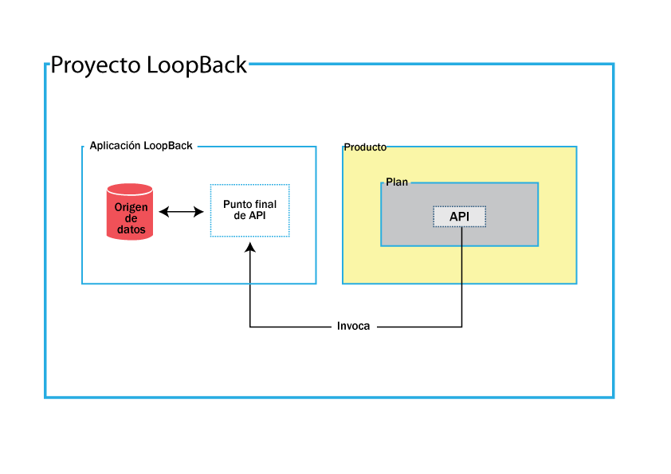
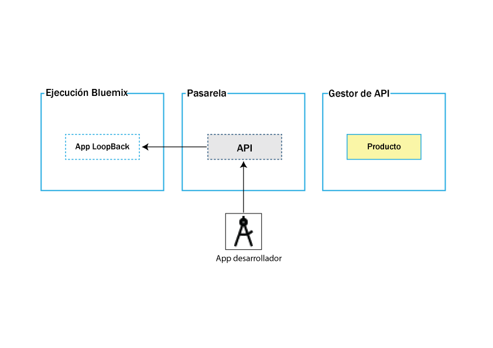
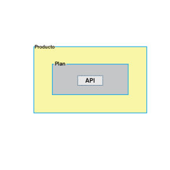

---

copyright:
  years: 2017
lastupdated: "2017-09-14"

keywords: IBM Cloud, APIs, lifecycle, catalog, manage, toolkit, develop, dev portal

subcollection: apiconnect

---

{:new_window: target="_blank"}
{:shortdesc: .shortdesc}
{:screen: .screen}
{:codeblock: .codeblock}
{:pre: .pre}

# Acerca de IBM API Connect
{: #about_apic_overview}

Utilice el servicio de {{site.data.keyword.apiconnect_full}} para crear rápidamente
API y microservicios basados en tiempos de ejecución de Node.js y Java. Después de crearlas,
puede gestionar sus API con controles de nivel empresarial definiendo niveles variables de seguridad,
visibilidad, planes de facturación y límites de tarifa, a la vez que comparte las API con desarrolladores de aplicaciones. El servicio de {{site.data.keyword.apiconnect_short}} también le ofrece las herramientas
necesarias para transformar y hacer crecer su negocio con una perspectiva hacia el análisis detallado con búsquedas filtradas y estructuradas.

<object height="315" type="application/x-shockwave-flash" width="560"
data="https://www.youtube.com/v/lmxyiNMER5Y?version=3&amp;hl=en_US">
<desc>Este vídeo proporciona una visión general del servicio de {{site.data.keyword.apiconnect_short}}</desc>
<param name="movie" value="https://www.youtube.com/v/lmxyiNMER5Y?version=3&amp;hl=en_US"/>
<param name="allowFullScreen" value="true"/>
<param name="allowscriptaccess" value="always"/>
<param name="scale" value="noScale"/>
</object>

## Creación de API
{: #creation_apic_overview}

{{site.data.keyword.apiconnect_short}} le permite importar
API a partir de definiciones de Swagger o crear API mediante un URL de proxy o ensamblando datos de orígenes de datos HTTP. Además, {{site.data.keyword.apiconnect_short}} permite crear y probar API fuera de línea. Incluido con el kit de herramientas se encuentra Micro Gateway, que le permite conectarse a orígenes de datos back-end (por ejemplo, a una base de datos SQL) y efectuar operaciones create, read, update y delete.

Las API se crean en el kit de herramientas de desarrollador, que incluye una CLI y una interfaz gráfica de usuario de API Designer. Para acceder a él, debe descargarlo e instalarlo desde npm.
Al instalar el kit de herramientas, empieza creando un proyecto de LoopBack. En el siguiente diagrama se muestran los elementos incluidos en un proyecto de LoopBack.

- **Proyecto de LoopBack**: El proyecto de LoopBack contiene la aplicación de LoopBack y el producto de la API.

- **Aplicación de LoopBack**: Dentro de la aplicación de Loopback se encuentra el punto final de la API, que proporciona acceso al origen de datos, activo de empresa o servicio en la nube.

- **Producto**: El producto es la unidad que le permite publicar las API. Un producto contiene un plan y este,
la API que invoca el punto final de API al recibir la llamada.

En el siguiente diagrama se muestra dónde se despliega la aplicación de LoopBack, la API y el producto una vez publicados en la IU o la CLI del kit de herramientas de desarrollador.

- **Tiempo de ejecución de {{site.data.keyword.Bluemix_short}}**:
La app de LoopBack se despliega en el tiempo de ejecución de {{site.data.keyword.Bluemix_short}} elegido.

- **Puerta de enlace**: La API se despliega en la puerta de enlace.

**API Manager**: El producto se despliega en API Manager, donde puede especificar cómo se debe utilizar.

Para obtener más información sobre las tareas necesarias para crear API, consulte [Creación de API](/docs/services/apiconnect?topic=apiconnect-creating_apis).

## Visión general de la gestión de API

Después de transferir y publicar un producto, puede abrir API Manager para gestionar la seguridad, los límites de las tarifas, las políticas y la información de facturación, para después publicar el producto en un portal del desarrollador.

Como se puede ver en el siguiente diagrama, un producto contiene un plan, que a su vez contiene una o más API.

### Planes
{: #plans_apic_overview}

Para que una API esté disponible para un cliente, debe incluirse en un plan. Los planes se utilizan para diferenciar las distintas ofertas. Los planes pueden compartir distintas API, pero el hecho de que se solicite una aprobación de suscripción dependerá del plan en cuestión. Además, puede aplicar límites de tarifas mediante planes u operaciones en las API de un plan que sustituyan el límite de tarifa del plan.

Los planes también pueden especificar costes de facturación para clientes que utilicen sus productos. Por ejemplo, puede definir tres planes diferentes para un mismo producto. Cada plan puede tener un coste de suscripción diferente y un límite de tarifa diferente que se pueda orientar a diferentes clientes.  

### Productos
{: #products_apic_overview}

Los planes y las API se agrupan en productos. Los productos le permiten gestionar la disponibilidad y la visibilidad de las API y los planes. Utilice API Designer para crear, editar y transferir su producto. Utilice API Manager para gestionar el ciclo de vida de su producto.

En el siguiente diagrama se muestra la interrelación de los productos, los planes y las API. Observe que los planes
solo pertenecen a un producto, pueden contar con distintas API en otros planes dentro del mismo producto y pueden compartir API con planes de cualquier producto. Figura en la que se muestra la jerarquía de los productos, los planes y las API. 

Solo puede crear planes dentro de los productos, y estos productos se publican en un catálogo. Un gestor de ciclo de vida puede controlar la disponibilidad y la visibilidad de las API y los planes gracias a API
Manager. Mediante el portal del desarrollador, el cliente puede suscribirse a uno de los planes que tiene disponibles, tal como se determina en API Manager. Si es un plan con facturación, el cliente debe proporcionar información de tarjeta de crédito al suscribirse. El usuario solo puede suscribirse a un plan de un producto determinado. Los diversos planes dentro de un solo producto son útiles porque pueden cumplir propósitos similares pero con diferentes niveles de rendimiento y coste. Por ejemplo, podría tener un "plan de demostración", que proporciona una sola API, y un "plan completo", que proporciona varias.

Además de controlar las API que puede utilizar un cliente, se pueden emplear distintos planes para implementar límites de tarifas. Un límite de tarifa se puede implementar como una tarifa predeterminada en todo un plan o bien para determinadas operaciones de una API dentro de dicho plan, excluyéndolas del límite de tarifas del plan. Puede haber distintos planes que tengan límites de tarifas diferentes, ya sea entre las operaciones o para el límite global, lo cual es práctico para proporcionar distintos niveles de servicio a los clientes. Por ejemplo, un "plan de demostración" podría aplicar un límite de tarifa de 10 llamadas por minuto, mientras que un "plan completo" podría permitir hasta 1000.

Por último, los distintos planes pueden utilizarse para asignar un coste de facturación. Un plan puede definirse como plan gratuito o plan con facturación. Los planes con facturación pueden usarse con límites de tarifa para definir distintos niveles de servicio para los clientes. Por ejemplo, un "plan de demostración" podría aplicar un límite de tarifa de 10 llamadas por minuto por un coste de 5&euro; al mes, mientras que un "plan completo" podría permitir hasta 1000 llamadas por minuto por un coste de 20&euro; al mes.

**Nota:** La aplicación de un límite de tarifa a nivel de plan crea un límite predeterminado que se aplica a todas las operaciones del plan. Si debe establecer límites de tarifa específicos para determinadas operaciones, debe establecerlos dentro de las propias operaciones; este valor altera temporalmente el valor a nivel de plan.

IBM API Connect también admite la implementación de varias versiones de productos. Puede elegir números de versión y utilizarlos para ayudar en el desarrollo de sus productos y planes.

**Nota:** La versión de un producto difiere de la versión de cualquier API incluida en los planes asociados. Los planes no pueden tener su propia versión, ya que utilizan la versión de su producto padre.

Para obtener más información sobre las tareas necesarias para gestionar API, consulte [Gestión de API](/docs/services/apiconnect?topic=apiconnect-managing_apis).

### Catálogos
{: #catalogs_apic_overview}

Los productos se deben transferir a un catálogo y luego publicar en las organizaciones de los desarrolladores para que estén disponibles para los desarrolladores de aplicaciones. En {{site.data.keyword.apiconnect_short}}, puede crear varios catálogos. Los catálogos son útiles para separar
productos y API para probarlos antes de hacerlos disponibles a organizaciones de desarrolladores.

Un catálogo es un destino de transferencia y se comporta como una partición lógica de la pasarela
y el Portal del desarrollador. Los URL para llamadas API y para el Portal del desarrollador son específicos
de un catálogo concreto. En una configuración típica, la organización del proveedor de API utiliza un catálogo de desarrollo para probar las API bajo desarrollo y un catálogo de producción para albergar las API que ya se están utilizando. Un enfoque común consiste en disponer de una nube de desarrollo con un catálogo de desarrollo y unos cuantos catálogos de prueba y una nube de producción que puede tener su propio catálogo de prueba.

#### Valores del catálogo
{: #cat_set_apic_overview}

Puede aplicar los siguientes valores a un catálogo:

- **Desarrollo**: De forma predeterminada se proporciona un catálogo de desarrollo. Un catálogo de desarrollo solo se debe utilizar para realizar pruebas. En un catálogo de desarrollo, las acciones de transferencia y publicación se fuerzan,
es decir, si vuelve a publicar un producto publicado anteriormente, se sobrescribe sin aviso. Si se encuentra
algún conflicto, el sistema lo resuelve automáticamente. Las acciones de anulación de publicación se producen
de forma automática. Cuando utilice la herramienta de prueba en un catálogo de desarrollo, cualquier producto que pruebe se fuerza y sobrescribe los productos transferidos y publicados aunque las operaciones se estén utilizando en el Portal del desarrollador. Un Portal del desarrollador
creado a partir de un catálogo de desarrollo se debe utilizar del mismo modo, es decir, solo para pruebas, no para casos reales.

- **Suscripción automática**: Si habilita la suscripción automática para un catálogo, las pruebas de las API en la interfaz de usuario de API Manager serán más fáciles, porque se utiliza una aplicación de pruebas, con un ID de cliente y un secreto de cliente suministrado anteriormente,
que se suscribe automáticamente a todas las planificaciones en el catálogo, así que no tiene que especificar
una planificación o aplicación al realizar pruebas. La aplicación de prueba no está sujeta a los límites de tarifa. La suscripción automática sólo está disponible para un catálogo de desarrollo.

- **Predeterminado**: Puede establecer uno de los catálogos como el catálogo predeterminado. A continuación, las llamadas a las API publicadas en este catálogo, pueden utilizar un URL más corto que no incluya
el nombre del catálogo.

Para obtener más información sobre cómo usar el Portal del desarrollador, consulte [Descubrimiento y uso de API ](https://www.ibm.com/support/knowledgecenter/en/SSFS6T/com.ibm.apic.devportal.doc/capim_devportal_overview.dita){: #new_window}.

### Sindicación
{: #syn_apic_overview}

Con la característica de sindicación de {{site.data.keyword.apiconnect_full}}, puede particionar los catálogos en espacios. Cada equipo de desarrollo del proveedor de API utiliza un espacio y tiene sus propias funciones de gestión relacionadas específicamente con las API asociadas a las publicaciones del equipo en dicho espacio, lo que permite al equipo gestionar sus API de forma independiente.

Cuando transfiere o publica una API en un catálogo que tiene habilitados espacios, especifica el espacio dentro de dicho catálogo cuando desea transferirlo o publicarlo. Sin embargo, los desarrolladores de aplicaciones que acceden
a Developer para el catálogo no tienen conocimiento del particionamiento del espacio del catálogo y ven las API como una oferta coordinada.
Cada espacio tiene su propia gestión de ciclo de vida del producto, aprobaciones de suscripciones y datos analíticos.
Utilice el control de acceso específico del espacio para restringir el acceso de los usuarios a cada espacio; por ejemplo, un desarrollador del equipo Vuelos solo puede transferir API al espacio Vuelos.

**Nota:** De forma predeterminada, los espacios están inhabilitados en un catálogo. Puede habilitar espacios modificando los valores del catálogo.

Para particionar un catálogo, consulte [Particionamiento de un catálogo](/docs/services/apiconnect?topic=apiconnect-create_catalog#apic_spaces).
