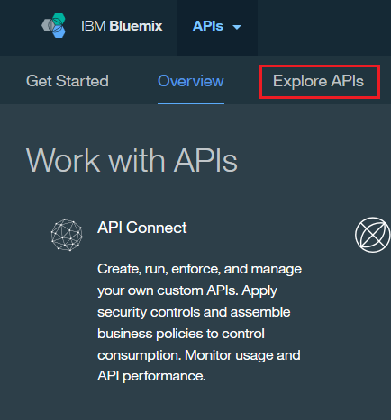

---
copyright:
  years: 2017
lastupdated: "2017-07-11"
---

{:new_window: target="blank"}
{:shortdesc: .shortdesc}
{:screen: .screen}
{:codeblock: .codeblock}
{:pre: .pre}

# Exploración de API y productos
{: #explore_prods_apis}

1. Para ver las API que se han compartido con la organización de
{{site.data.keyword.Bluemix_short}}, vaya a la página de destino
de las API y pulse **Explorar API**.

2. Expanda la API para ver más información.

3. Para suscribirse a una API, pulse un producto de la API.
Se abre el portal del desarrollador y puede suscribirse a un plan para acceder a una API.

## Visualización y prueba de las API en el portal del desarrollador
{: #view_test_apis_dev_port}

1. En la pantalla de inicio del portal del desarrollador, pulse **Productos de la API**.

2. Para ver más detalles, pulse **API** en el producto que contiene la API requerida y, a continuación, pulse la API.

3. Encontrará más detalles de las operaciones asociadas a una API en la cabecera **Operaciones de API**.

4. Para ver el código de ejemplo de una operación:
    - En la sección Operaciones de API, pulse **Vías de acceso** y en la operación para la que desea ver el código de ejemplo.
    - Pulse el separador de la operación para expandir y mostrar los detalles, incluidos los códigos de ejemplo. Puede ver el código de ejemplo de la operación en varios idiomas.

Para probar una API, lleve a cabo los pasos siguientes:
1. Pulse **API**.
Se muestran todas las API que pueden utilizar los desarrolladores de aplicaciones.

2. Pulse el nombre de la API que desee probar.

3. Busque la operación con la que desea trabajar en la cabecera `Operaciones de API`.

4. Pulse **Intentar esta operación**.

5. Proporcione los valores para las cabeceras o parámetros necesarios.

6. Si la operación está protegido con una autenticación básica, proporcione las credenciales.

7. Pulse **Enviar solicitud**.
El resultado se visualiza en el campo Cuerpo de respuesta. Puede seguir probando diferentes valores de parámetro según sea necesario.

## Suscripción para el uso de API
{: #subscrib_apis}

1. En el portal del desarrollador, pulse **Productos de la API**.

2. Pulse el producto que contiene el plan con el que desea trabajar.

3. En la sección Plan del producto, pulse el plan que desee utilizar. Se visualizarán los detalles del plan seleccionado.

4. Cuando haya identificado el plan que desea utilizar, pulse **Utilizar este plan**.
Se muestra el recuadro de diálogo Utilizar este plan.

5. Seleccione la aplicación que desee utilizar con este plan y pulse **Guardar**.
Se muestran los detalles de la aplicación.

6. Para ver las operaciones de las API que se incluyen en los planes a los que se ha suscrito la aplicación, pulse el nombre de la API.

7. Si el plan no está restringido, puede utilizarlo inmediatamente. Si el plan está restringido, se muestra como `Pendiente de aprobación` y no puede utilizar el plan solicitado hasta que el administrador haya aprobado la solicitud.

