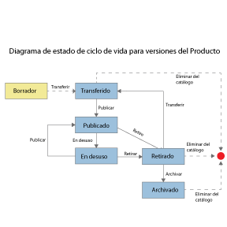

---

copyright:
  years: 2017
lastupdated: "2017-12-15"

keywords: IBM Cloud, APIs, lifecycle, catalog, manage, toolkit, develop, dev portal

subcollection: apiconnect

---

{:new_window: target="blank"}
{:shortdesc: .shortdesc}
{:screen: .screen}
{:codeblock: .codeblock}
{:pre: .pre}

# Gestión de productos
{: #managing_products}

Para obtener detalles de los modos en los que puede gestionar los productos, consulte la documentación de IBM&reg; Knowledge Center [Gestión de los productos ](http://www.ibm.com/support/knowledgecenter/SSFS6T/com.ibm.apic.apionprem.doc/task_product_management.html){: #new_window}.

## Ciclo de vida del producto
{: #prod_lifecycle_managing_products}

Cuando gestiona las versiones de su producto, estas pasan por una serie de estados de ciclo de vida, desde la transferencia inicial a un entorno de un borrador de versión de producto hasta la publicación, a fin de que la versión del producto esté disponible para los desarrolladores de aplicaciones, así como la posible retirada y archivado. En la siguiente tabla y en el siguiente diagrama se describen los distintos estados de ciclo de vida de una versión de producto.

<table summary="" id="apic_004__table_lym_rxj_gv" class="defaultstyle"><caption class="style-scope doc-content">Tabla 1. Estados del ciclo de vida del producto API Management</caption>
<thead class="style-scope doc-content">
<tr class="style-scope doc-content doc-tr-even">
<th style="width: 11.25%" id="d3569e1968" class="thleft thbot style-scope doc-content">Estado</th>
<th style="width: 88.75%" id="d3569e1970" class="thleft thbot style-scope doc-content">Descripción</th>
</tr>
</thead>
<tbody class="style-scope doc-content">
<tr class="style-scope doc-content doc-tr-odd">
<td style="width: 11.25%" headers="d3569e1968 " class="style-scope doc-content">Borrador</td>
<td style="width: 88.75%" headers="d3569e1970 " class="style-scope doc-content">El producto no está desplegado ni asociado a ningún catálogo de API Connect.</td>
</tr>
<tr class="style-scope doc-content doc-tr-even">
<td style="width: 11.25%" headers="d3569e1968 " class="style-scope doc-content">Transferido</td>
<td style="width: 88.75%" headers="d3569e1970 " class="style-scope doc-content">Se ha desplegado una copia inmutable de la versión del producto en el entorno de destino. "Transferido" es el estado inicial cuando se transfiere a partir de un borrador de producto. Cuando un producto está en estado transferido, aún no está visible para los desarrolladores, que no se pueden suscribir a este.</td>
</tr>
<tr class="style-scope doc-content doc-tr-odd">
<td style="width: 11.25%" headers="d3569e1968 " class="style-scope doc-content">Publicado</td>
<td style="width: 88.75%" headers="d3569e1970 " class="style-scope doc-content">La versión del producto está visible para los desarrolladores o las comunidades de destino, que se pueden suscribir a esta.</td>
</tr>
<tr class="style-scope doc-content doc-tr-even">
<td style="width: 11.25%" headers="d3569e1968 " class="style-scope doc-content">En desuso</td>
<td style="width: 88.75%" headers="d3569e1970 " class="style-scope doc-content">La versión del producto solo está visible para los desarrolladores cuyas aplicaciones están actualmente suscritas. No se permiten nuevas suscripciones al producto.</td>
</tr>
<tr class="style-scope doc-content doc-tr-odd">
<td style="width: 11.25%" headers="d3569e1968 " class="style-scope doc-content">Retirado</td>
<td style="width: 88.75%" headers="d3569e1970 " class="style-scope doc-content">La versión del producto no se puede ver, nadie se puede suscribir a esta y todas las API asociadas están detenidas. Las versiones del producto se muestran de forma predeterminada en la página Productos de la interfaz de usuario de API Manager.</td>
</tr>
<tr class="style-scope doc-content doc-tr-even"><td style="width: 11.25%" headers="d3569e1968 " class="style-scope doc-content">Archivado</td>
<td style="width: 88.75%" headers="d3569e1970 " class="style-scope doc-content">La versión del producto no se puede ver, nadie se puede suscribir a esta y todas las API asociadas están detenidas. Las versiones del producto no se muestran de forma predeterminada en la página Productos de la interfaz de usuario de API Manager.</td>
</tr>
</tbody>
</table>

### Flujos del ciclo de vida del producto
{: #prod_lifecycle_flows_managing_products}

En el siguiente diagrama se muestran los posibles estados del ciclo de vida de una versión del producto y las operaciones de gestión de productos que hacen que la versión del producto pase de un estado del ciclo de vida a otro; por ejemplo, la operación de retirada hace que la versión del producto pase del estado Publicado al estado Retirado.




## Creación de un producto
{: #create_product_managing_products}

Cree un producto para recopilar un conjunto de API y planes en una oferta que pondrá a disposición de los desarrolladores. Un plan incluye valores de límite de tarifa que se pueden aplicar al plan como un todo o bien de forma específica para cada operación de una API. Gracias a los productos y los planes, puede controlar mejor a qué API acceden los desarrolladores. Después de crear un producto, este debe transferirse. La transferencia de un producto hace que tenga un estado activo, lo que le permite llamar y probar las API incluidas. Al transferir un producto, aún no está visible para los desarrolladores.

**Sugerencia**: Además de utilizar el método descrito en esta tarea, también puede crear un producto cuando crea una API. Si crea una API mediante la interfaz de línea de mandatos del kit de herramientas de desarrollador, se crea un producto de forma automática. Después puede cambiar los valores del producto que desee; para ello, abra el producto nuevo en la página **Productos** de API Designer.

Para crear un producto con API Designer, lleve a cabo los siguientes pasos:
1. Para abrir la interfaz de usuario de API Designer, abra una línea de mandatos y escriba el siguiente mandato:
```
apic edit
```
API Designer se abre en su explorador predeterminado.

2. En el panel de navegación de API Designer, pulse **Productos**.
Se abre el separador Productos.

3. Pulse **Añadir** y, a continuación, en **Nuevo producto**.
Se abre la ventana Añadir un nuevo producto.

4. Rellene los siguientes campos:
    - Título
    - Nombre
    - Versión

5. Pulse **Añadir**.
Se abre el separador Diseño del nuevo producto.

6. **Opcional**:
Indique una descripción, un contacto, una licencia y los términos del servicio del producto en la sección **Información**.

7. En la sección **Visibilidad**, especifique los usuarios que podrán ver el producto. Puede elegir **Público**, **Usuarios autenticados** o **Personalizado**. Si selecciona **Personalizado**, utilice el campo **Tipo que se va a añadir** para buscar organizaciones o comunidades de los desarrolladores en las que desea que estén visibles los planes del producto.

    **Nota:**
    Para buscar organizaciones o comunidades de desarrolladores, el producto debe tener el estado Transferido, Publicado o En desuso. Si el catálogo en el que está transferido, publicado o en desuso no es un catálogo de recinto de pruebas, no podrá efectuar otros cambios en el producto mientras tenga uno de los estados mencionados. Para obtener más información, consulte [Ciclo de vida del producto](#prod_lifecycle_managing_products).

8. Especifique los usuarios que se pueden suscribir al producto. Puede elegir **Usuarios autenticados** o **Personalizado**. Si selecciona **Personalizado**, utilice el campo **Tipo que se va a añadir** para buscar las organizaciones o comunidades de los desarrolladores que podrán suscribirse a los planes del producto.

9. En la sección API, especifique las API que desee incluir en el producto.
    1. Pulse el icono **Añadir API**.
    2. Seleccione las API que desea incluir y pulse **Aplicar**. Aparecerán las API seleccionadas.

10. Para que una API esté disponible para los desarrolladores de aplicaciones, debe incluirse en un plan. Para añadir uno o varios planes al producto, pulse el icono **Añadir plan**.
    1. Expanda el nuevo plan que se ha creado. Si ya ha añadido API al producto, estas se incluyen automáticamente.
    2. Cambie el nombre del plan en los campos **Título** y **Nombre** y, si lo desea, añada una descripción.
    **Nota:** Automáticamente se crea un plan predeterminado, y puede incluir en él la API si no desea crear una. Sin embargo, si opta por no utilizar el plan predeterminado, deberá suprimirlo, puesto que no se puede transferir un producto si incluye planes que no incluyen API.

11. Verifique que las API elegidas están incluidas en el plan.
    1. Expanda el plan al que desea añadir una API.
    2. En las API incluidas, asegúrese de que los recuadros de selección de las API elegidas estén marcados. Si ya hay API seleccionadas y no desea incluirlas en el plan que está editando, desmarque los recuadros de selección correspondientes.

12. **Opcional**:
Añada la información de facturación para el Plan. Para añadir la información de facturación, debe establecer una cuenta con un servicio de proceso de tarjetas de crédito para que los clientes puedan pagar con una tarjeta de crédito. Los planes de facturación mensual se facturan en la misma fecha de cada mes.

13. **Opcional**:
Si desea adaptar las operaciones de una API que se van a incluir en el plan, pase el cursor por encima de la API que contiene la operación. Pulse el icono **Mostrar operaciones** y marque o desmarque los recuadros de selección de las operaciones que desee incluir o excluir.

14. **Opcional**:
Para añadir un límite de tarifa al plan, desmarque el recuadro de selección **Ilimitado** y especifique el límite de tarifa que desea aplicar. Si el recuadro de selección **Aplicar límite estricto** está marcado, el plan hará que las aplicaciones dejen de llamar a la API una vez alcanzado el límite de tarifa; de lo contrario, se mostrará una advertencia.

    **Nota:** La aplicación de un límite de tarifa a nivel de plan crea un límite predeterminado que se aplica a todas las operaciones del plan. Si debe establecer límites de tarifa específicos para determinadas operaciones, debe establecerlos dentro de las propias operaciones; este valor altera temporalmente el valor a nivel de plan.

15. **Opcional**:
Especifique si el plan necesita una aprobación de suscripción. Si desea que las suscripciones de los desarrolladores requieran la aprobación mediante la interfaz de usuario de API Manager, seleccione **Requerir aprobación de suscripción**; de lo contrario, asegúrese de que el recuadro de selección esté desmarcado.

16. **Opcional**:
Añada un límite de tarifa a una operación.
    1. Pase el cursor por encima de la API que contiene la operación y pulse el icono **Mostrar operaciones**.
    2. Pase el cursor por encima de la operación a la que desea aplicar un límite de tarifa. Pulse el icono **Editar límite de tarifa**.
    3. Asegúrese de que el recuadro de selección **Ilimitado** esté desmarcado y especifique el límite de tarifa que desee aplicar. Si el recuadro de selección **Aplicar límite estricto** está marcado, el plan hará que las aplicaciones dejen de llamar a la API una vez alcanzado el límite de tarifa; de lo contrario, se mostrará una advertencia.

- Pulse el icono **Guardar** para guardar los cambios.

Ha creado un producto y ha especificado un conjunto de API y planes en una oferta que puede poner a disposición de los desarrolladores.
A continuación transfiera su producto a un catálogo tal y como se explica en la sección siguiente, [Transferencia de un producto](#stage_product_managing_products}).


## Transferencia de un producto
{: #stage_product_managing_products}

Transfiera un producto para crear una versión específica de dicho producto en un catálogo antes de publicarlo. Cuando un producto está en estado transferido, aún no está visible para los desarrolladores, que no se pueden suscribir a este.

**Nota:** La interfaz de usuario de API Manager también incluye la posibilidad de transferir productos; sin embargo, el método preferido para estas tareas es el uso de la interfaz de usuario de API Designer, como se describe en el siguiente procedimiento.

1. En el panel de navegación de API Designer, pulse **Productos**.
Se abre el separador Productos.

2. Pulse el **producto** con el que desea trabajar. Si tiene más de una versión
del producto, asegúrese de pulsar la versión con la que desea trabajar.

3. Pulse el icono **Publicar**.

4. Si el catálogo al que desea transferir el producto aparece en la lista:
    1. Seleccione el Catálogo que necesite. 
    2. Seleccione **Solo transferir (los productos no se publicarán)**, seguido de **Publicar**. Su producto se ha transferido.

5. Si el catálogo al que desea transferir el producto no aparece en la lista:
    1. Pulse **Añadir y gestionar destinos**.
    2. Pulse **Añadir destino de {{site.data.keyword.Bluemix_notm}}**.
    3. Seleccione la **Región** de {{site.data.keyword.Bluemix_short}}
en la que desea efectuar la publicación.
    4. Seleccione la **Organización** de {{site.data.keyword.Bluemix_notm}} en la que desea publicar.
    5. Se muestra una lista de catálogos. Seleccione el catálogo en el que desea efectuar la publicación.
    6. Pulse **Siguiente**.
    7. Si tiene una aplicación de LoopBack que desea publicar, seleccione la app en la que desea publicar.
De lo contrario, seleccione **Ninguno**.
    8. Pulse **Guardar**.
    9. Vuelva a pulsar **Publicar** y seleccione el destino que acaba de añadir.
    10. Seleccione el catálogo necesario.
    11. Seleccione **Solo transferir**.
    12. Pulse **Publicar**.

Su producto se ha transferido a un catálogo. Para ver el estado del producto en el catálogo, abra la interfaz de usuario de
API Manager, seleccione la sección Panel de control del panel de navegación y pulse el catálogo que desee. El producto aparece con el estado Transferido.

- Abra el **panel de control** de {{site.data.keyword.Bluemix_notm}}. Verá el icono de la aplicación en la sección Aplicaciones.

Abra API Manager para publicar el producto en una comunidad donde los desarrolladores de aplicaciones puedan acceder a él a través del Portal del desarrollador explicado en la sección siguiente, [Publicación de un producto](#publish_proj_managing_products}).


## Publicación de un producto
{: #publish_proj_managing_products}

Cuando se publica un plan, las API pasan a estar visibles y accesibles para los desarrolladores de aplicaciones.
La publicación de un producto hace que esté visible en el **Catálogo** de {{site.data.keyword.Bluemix_short}}
y en el portal del desarrollador incorporado para que los desarrolladores de aplicaciones puedan utilizarlo.

### Requisitos previos
{: #prereq_publish_proj_managing_products}

Debe transferir un producto antes de publicarlo. Para obtener más información sobre la transferencia de productos, consulte [Transferencia de un producto](#stage_product_managing_products).

Para publicar un producto, lleve a cabo los pasos siguientes:

1. En el panel de navegación de API Manager, expanda la sección **Catálogos** y seleccione el catálogo con el que desea trabajar. Se abrirá el separador Productos del catálogo y se mostrarán todos los productos disponibles en dicho catálogo. Puede seleccionar qué estados deben mostrarse con los recuadros de selección de filtro que aparecen a la derecha de la pantalla.

2. Al lado de la versión del producto con la que desea trabajar, pulse el icono
**Gestionar** y en **Publicar**. Se muestra el recuadro de diálogo Editar visibilidad y suscriptores.

3. Especifique las siguientes opciones:
    - `Visible para`: Puede elegir **Usuarios públicos**, **Usuarios autenticados**,
    o **Personalizado**. Si selecciona `Personalizado`, puede utilizar el campo **Tipo que se va a añadir...** para buscar
organizaciones o comunidades en las que desea que esté visible el producto.
    - `Se puede suscribir por`: Puede elegir **Usuarios autenticados**, o **Personalizado**. Si selecciona `Personalizado`, puede utilizar el campo **Tipo que se va a añadir...** para buscar
organizaciones o comunidades en las que desea que esté visible el producto.

4. Pulse **Publicar**.
    Si se necesita la aprobación para publicar productos en este catálogo, se envía una solicitud de aprobación y el producto pasa a estar en estado Pendiente; el producto se publica una vez aprobada la solicitud. Si no es necesaria la aprobación, la versión del producto se publica de inmediato y pasa a tener el estado Publicado.

Su producto tiene el estado Publicado. El producto se publica en el catálogo y está disponible para las organizaciones o comunidades especificadas. Los desarrolladores de aplicaciones que están dentro de los grupos seleccionados pueden ver y utilizar las API en el producto. Las solicitudes de desarrollador de aplicaciones para utilizar su producto se visualizan en el separador Aprobaciones del catálogo que lo contiene, donde puede rechazar o aceptar la solicitud.


## Publicación de un producto en Bluemix
{: #pub_to_bm_managing_products}

Para ver los productos en la sección **Explorar API** del panel de control de {{site.data.keyword.apiconnect_short}}, lleve a cabo los siguientes pasos.

### Requisitos previos
{: #prereq_pub_bm_managing_products}

Antes de empezar, si desea publicar una API REST implementada con LoopBack, asegúrese de que ha publicado el tiempo de ejecución de la app y de que ha transferido el producto con el proxy invoke apuntando a la nueva app. Para obtener más información sobre cómo hacerlo, consulte [Transferir y publicar una aplicación Loopback](/docs/services/apiconnect?topic=apiconnect-managing_apis#stage_publish_lb_app_managing_apis).

1. En la interfaz de usuario de API Manager, pulse **Añadir** > **Catálogo**. Aparece la ventana **Añadir catálogo**.

2. Complete los campos siguientes y pulse **Añadir**:
    - Nombre de visualización
    - Nombre
	
3. Seleccione el Catálogo que ha creado.

4. Pulse el icono **Valores**.

5. Pulse **Portal** y seleccione una de las siguientes opciones:
    - **IBM Developer Portal**. Si selecciona esta opción, se visualizará el URL del portal.
    - **Otros**. Si selecciona esta opción, especifique el URL del portal que desea utilizar.

6. En la sección Registro de usuarios e invitaciones, pulse la flecha **Registro de usuarios**
y seleccione **SAML**.

7. En el panel de navegación, pulse el icono **Desarrolladores**.

8. Pulse **Añadir organización de IBM Cloud**.

9. Añada la dirección de correo electrónico de su usuario de {{site.data.keyword.Bluemix_short}} y pulse **Añadir**.

10. Se envía una invitación a su dirección de correo electrónico.

11. Pulse el enlace del correo electrónico para aceptar la invitación.
Se abre la interfaz de usuario de {{site.data.keyword.Bluemix_notm}}.

12. Seleccione su organización de {{site.data.keyword.Bluemix_notm}} y pulse
**Confirmar**.

13. En la interfaz de usuario de API Manager, pulse el icono **Productos**.

14. Al lado de la versión del producto con la que desea trabajar, pulse el icono
**Gestionar** y en **Publicar**. Se muestra el recuadro de diálogo Editar visibilidad y suscriptores.

15. Especifique las siguientes opciones:
    - **Visible para:** Elija **Personalizado** y utilice el campo **Tipo que se va a añadir...** para seleccionar su organización de desarrolladores u otras organizaciones que desee añadir.
    - **Se puede suscribir por:** Elija **Personalizado** y utilice el campo **Tipo que se va a añadir...** para seleccionar su organización de desarrolladores u otras organizaciones que desee añadir.

16. Pulse **Publicar**.

Si se necesita la aprobación para publicar productos en este catálogo, se envía una solicitud de aprobación y el producto pasa a estar en estado Pendiente; el producto se publica una vez aprobada la solicitud. Si no es necesaria la aprobación, la versión del producto se publica de inmediato y pasa a tener el estado Publicado.

El producto se muestra en el separador **Explorar API** del **panel de control** de {{site.data.keyword.apiconnect_short}}. Si pulsa el enlace Producto, le llevará al producto en el portal del desarrollador.
