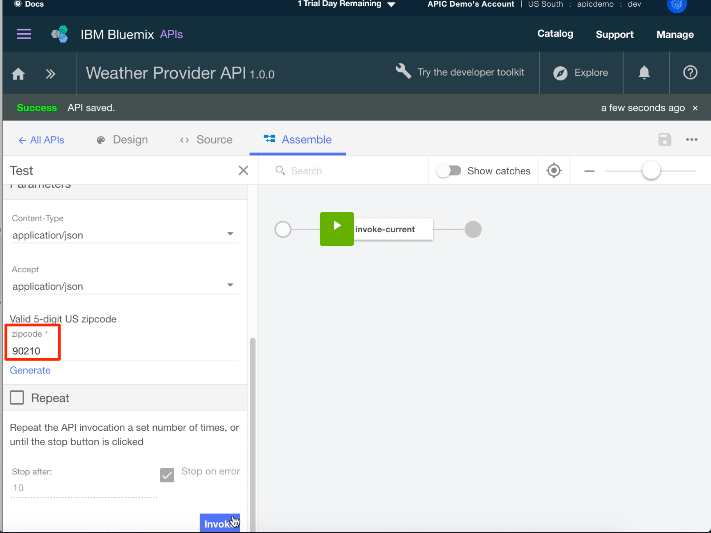
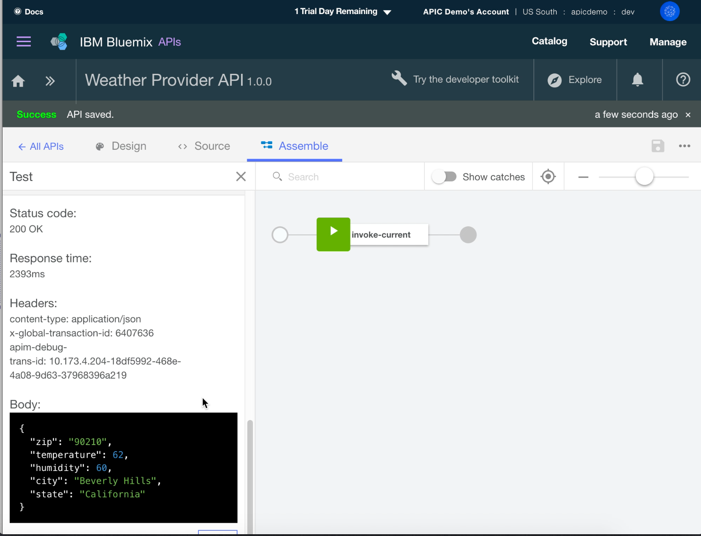

---
copyright:
  years: 2017
lastupdated: "2017-11-02"
---

{:new_window: target="blank"}
{:shortdesc: .shortdesc}
{:screen: .screen}
{:codeblock: .codeblock}
{:pre: .pre}

# Añadir una nueva especificación de API e invocar un servicio REST existente con {{site.data.keyword.Bluemix_notm}}
**Duración**: 15 minutos  
**Nivel de habilidad**: Principiante  

## Objetivo
Esta guía de aprendizaje le ayuda a comenzar rápidamente con {{site.data.keyword.apiconnect_full}}. Empezaremos por crear una nueva especificación de OpenAPI, y luego por crear un proxy de API de paso a través para un servicio REST anterior.

## Requisito previo
Antes de empezar, necesita [configurar la instancia de API Connect](tut_prereq_set_up_apic_instance.html).

---

### Explorar la app de ejemplo y probar los puntos finales de destino
Se ha creado una app _weather provider_ de ejemplo para esta guía de aprendizaje.
1. Para explorar la app, vaya a [http://gettingstartedweatherapp.mybluemix.net/ ](http://gettingstartedweatherapp.mybluemix.net/){:new_window}.  
2. Especifique un código postal de Estados Unidos de 5 dígitos válido para obtener el _**tiempo actual**_ y la _**previsión de hoy**_.  


3. La app de tiempo de ejemplo anterior se ha creado utilizando API que proporcionan los datos meteorológicos. El punto final para obtener los datos meteorológicos **actuales** es _**https://myweatherprovider.mybluemix.net/current?zipcode={zipcode}**_. Pruébelo visitando [https://myweatherprovider.mybluemix.net/current?zipcode=90210 ](https://myweatherprovider.mybluemix.net/current?zipcode=90210){:new_window}.  

  

4. Asimismo, el punto final para obtener los datos de previsión **de hoy** es _**https:// myweatherprovider<span></span>.mybluemix.net/today?zipcode={zipcode}**_. Pruébelo yendo a [https://myweatherprovider.mybluemix.net/today?zipcode=90210 ](https://myweatherprovider.mybluemix.net/today?zipcode=90210){:new_window}.  

  


---

### Añadir una nueva especificación de OpenAPI parar crear un proxy de API REST  
1. Inicie sesión en {{site.data.keyword.Bluemix_notm}}: https://new-console.ng.bluemix.net/login.
2. En el panel de navegación de {{site.data.keyword.Bluemix_notm}}, seleccione **Servicios**, y luego **Panel de control**. Inicie el servicio {{site.data.keyword.apiconnect_short}}.
3. En {{site.data.keyword.apiconnect_short}}, asegúrese de que el panel de navegación está abierto. Si no lo está, pulse **>>** para abrirlo.  
4. Seleccione **Borradores** en el panel de navegación.
5. En el separador **API**, pulse **Añadir**. Desde el menú desplegable, seleccione **Nueva API**.    
    
6. En la ventana *Nueva API*, especifique `API de Weather Provider` para el título.
_El Nombre y la Vía de acceso base se rellenan automáticamente_.  
  
7. Pulse **Crear API** para completar el asistente.  
8. Después de crear la API, se seleccionará el separador **Diseño**. 
9. Desplácese al panel **Host**. Escriba `$(catalog.host)` como el valor si el campo no se rellena automáticamente.
10. En el panel **Vía de acceso base**, anote el valor rellenado automáticamente: `/weather-provider-api`. El URL de destino de la API se creará a partir de estos valores.  

11. Desplácese al separador **Seguridad** y suprima "clientIDHeader (Clave de API)" que se ha generado automáticamente.  
_(Visitaremos la seguridad con las Claves de API en la siguiente guía de aprendizaje)._  

12. En la navegación, desplácese hacia abajo hasta el panel **Vías de acceso** y cree una nueva vía de acceso pulsando **+**.     
    a. Dé un nombre a la nueva vía de acceso "**/current**".  
    b. En el mismo panel *Vías de acceso*, seleccione la sección **GET /current**.    
    c. En la sección **GET /current**, añada un nuevo **Parámetro**. Como ha percibido al explorar la app de ejemplo, el servicio meteorológico necesita un código postal como parámetro.   
      - Nombre: código postal  
      - Ubicado en: Consulta  
      - Obligatorio: Sí  
      - Tipo: serie   
       
    d. Guarde la API.  

13. Con los parámetros de consulta definidos en el paso anterior, ahora debe definir el objeto de respuesta que se devuelve cuando se invoca la API meteorológica. Para ello, desplácese hasta el panel **Definiciones**.   
    a. Añada una nueva definición.  
    b. Asigne un nombre a la nueva definición _Actual_.  
    c. Establezca el Tipo en _Objeto_.  
    d. Añada nuevas propiedades para la definición **Actual**.    
       - Nombre: código postal         /  Tipo: serie   
       - Nombre: temperatura /  Tipo: entero   
       - Nombre: humedad    /  Tipo: entero   
       - Nombre: ciudad        /  Tipo: serie   
       - Nombre: estado       /  Tipo: serie   
       
    e. Guarde la API.  

14. En el paso anterior, ha definido el objeto de respuesta. A continuación deberá garantizar que el objeto de respuesta está asociado con la vía de acceso **get /current**. En la navegación, desplácese al panel **Vías de acceso**.
    a. Abra la operación **GET /current**, y desplácese a la sección **Respuestas**.
    b. Cambie el esquema de la respuesta 200OK de "objeto" a "**Actual**".
    c. Guarde la API pulsando el icono de guardar. Aparecerá momentáneamente una notificación de confirmación “API guardada”. 

15. La vía de acceso y la operación que se acaba de crear era obtener los datos meteorológicos actuales. Ahora deberá crear una vía de acceso y una operación similares para obtener los datos meteorológicos de hoy. De forma similar a cómo ha creado la vía de acceso **/current** en el paso 12, cree una nueva vía de acceso: **/today**.

16. Añada un nuevo Parámetro en la operación **GET /today**.
    - Nombre de parámetro: código postal  
    - Ubicado en: Consulta  
    - Obligatorio: Sí  
    - Tipo: serie  

17. Cree una nueva definición: **Hoy**.

18. Añada nuevas propiedades para la definición **Hoy**.
    - Nombre: código postal / Tipo: serie
    - Nombre: hi / Tipo: entero
    - Nombre: lo / Tipo: entero
    - Nombre: nightHumidity / Tipo: entero
    - Nombre: dayHumidity / Tipo: entero
    - Nombre: ciudad / Tipo: serie
    - Nombre: estado / Tipo: serie
19. Actualice el esquema de respuesta en la sección **GET /today** a "Hoy".
20. Guarde la API.

21. Conmute al separador **Ensamblar**. Ha creado dos operaciones hasta ahora: **GET /current** y **GET /today**. Para garantizar que se invoca el punto final de destino correcto, deberá crear la lógica que ejecutará supeditada a la operación que se llama. Vamos a utilizar la construcción lógica **Conmutador de funcionamiento** para hacerlo.  
    a. Suprima la política de **invocación** que ya se puede añadir al _lienzo_.  
    b. Desde la paleta, arrastre el **Conmutador de funcionamiento** y suéltelo en el lienzo.  
      - Para **caso 0**, asigne la operación **get /current**.
      - Añada un nuevo caso: **caso 1**.
      - Asigne la operación **get /today** a **caso 1**.
      
El **Conmutador de funcionamiento** proporciona un punto de decisión. Basándose en el par verbo/vía de acceso, deberá invocarse la operación apropiada.
    c. Arrastre la política de **invocación** desde la paleta y suéltela en el lienzo. _La acción de invocación se utiliza para llamar un servicio anterior desde dentro de una operación_. Suelte una acción de invocación en la vía de acceso **/get current**, y otra en la vía de acceso **/get today**.   
    d. Seleccione la política de **invocación** en la vía de acceso **/get current**, y actualice su título a "**invoke-current**".  
    e. Actualice el campo URL con `https://myweatherprovider.mybluemix.net/current?zipcode=$(request.parameters.zipcode)`.  
    f. Seleccione la política de **invocación** en la vía de acceso **/get today**, y actualice su título a "**invoke-today**".  
    g. Actualice el campo URL con `https://myweatherprovider.mybluemix.net/today?zipcode=$(request.parameters.zipcode)`.  
       

22. Guarde la API.

---

### Probar el proxy de la API
1. En el separador **Ensamblar**, pulse el icono de más acciones, y luego seleccione **Generar un producto predeterminado**.  
    

2. Acepte las opciones predeterminadas del recuadro de diálogo **Nuevo producto**, y pulse **Crear producto**. Se creará el producto de la API de Weather Provider y se publicará en el catálogo del recinto de pruebas. Se mostrará un mensaje que indica la generación correcta del producto.  
    
  
   

  - _En {{site.data.keyword.apiconnect_short}}, **Productos** proporcione una forma para agrupar API pensadas para un uso concreto. Los productos se publican en un **Catálogo**. [Glosario de {{site.data.keyword.apiconnect_short}}](../apic_glossary.html)_

3. En el separador Ensamblar, pulse el icono de reproducción para probar la invocación de destino del proxy de la API.

4. En el panel de prueba, seleccione la operación **get /current**.
	a. El código postal es un parámetro obligatorio para esta operación, por lo que especifique un código postal de Estados Unidos válido (p. ej., 90210). 
	b. Pulse **invocar**, y compruebe que vea: 
  ```
  200 OK response
  Current weather data for 90210  
  ```
  
      

      

    

---

### Conclusión
En esta guía de aprendizaje, ha aprendido cómo se puede invocar un servicio REST anterior mediante un proxy de paso a través de la API. Ha comenzado comprobando la disponibilidad del servicio de ejemplo mediante el explorador web. A continuación, ha creado una nueva especificación de OpenAPI en {{site.data.keyword.apiconnect_short}}, y la ha enlazado al servicio de ejemplo que se invocará. Ha empaquetado la API en un producto, ha publicado el producto en el catálogo y ha probado el proxy.

---

## Paso siguiente

Proteger la API utilizando [limitación de tarifas](tut_rate_limit.html), [ID y secreto de cliente](tut_secure_landing.html), o [protección utilizando OAuth 2.0](tut_secure_oauth_2.html).

Crear > **Gestionar** > Proteger > Socializar > Analizar
