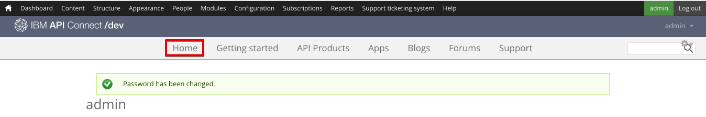

---

copyright:
  years: 2017
lastupdated: "2017-10-31"

subcollection: apiconnect

keywords: IBM Cloud, APIs, lifecycle, catalog, manage, toolkit, develop, dev portal, tutorial

---

{:new_window: target="blank"}
{:shortdesc: .shortdesc}
{:screen: .screen}
{:codeblock: .codeblock}
{:pre: .pre}

# Establecimiento y configuración del Portal del desarrollador
{: #tut_config_dev_portal}

**Duración**: 30 minutos  
**Nivel de habilidad**: Principiante  

## Objetivo
{: #object_tut_config_dev_portal}

Esta guía de aprendizaje le ayudará a empezar rápidamente con la configuración del **Portal del desarrollador de API Connect**. 

## Requisitos previos
{: #prereq_tut_config_dev_portal}

Antes de empezar, necesita [importar la especificación de la API y el proxy en un servicio REST anterior](/docs/services/apiconnect/tutorials?topic=apiconnect-tut_rest_landing).

---

## Crear el portal del desarrollador
{: #create_prereq_tut_config_dev_portal}

En esta sección, creará un portal del desarrollador para un catálogo.

*Catálogos* es un término de IBM para distintos entornos. Por ejemplo, puede crear catálogos distintos para la prueba, la transferencia y los entornos de producción. Debe tener un catálogo denominado Recinto de pruebas. Empiece a utilizar este catálogo para crear el portal del desarrollador, o crear un nuevo catálogo y ponerle el nombre que desee.

1. En el panel de control de {{site.data.keyword.Bluemix_short}}, seleccione el servicio de **API Connect** para iniciar el panel de control de {{site.data.keyword.apiconnect_short}}.

2. En el panel de control de {{site.data.keyword.apiconnect_short}}, seleccione el catálogo para el que desea crear un portal del desarrollador. Por ejemplo, **Recinto de pruebas**.

3. En el catálogo, seleccione el separador **Valores**.  
  

4. En el separador Valores, seleccione **Portal**.  
  

5. En la página Configuración de portal, seleccione **Portal del desarrollador de IBM** desde el desplegable Seleccionar portal.
   

6. Tome nota del **URL del portal** y, a continuación, guarde los cambios.  
  
  
7. Como se observa en el recuadro de diálogo, normalmente se tarda unos minutos en crear el portal del desarrollador. Recibirá un correo electrónico cuando haya terminado. Seleccione **Aceptar** para reconocer el mensaje de diálogo.  
  

---

## Explorar el portal del desarrollador
{: #explore_prereq_tut_config_dev_portal}

En esta sección, deberá familiarizarse con el portal del desarrollador que ha creado en los pasos anteriores.

1. Después de haber configurado el portal del desarrollador para el catálogo, recibirá un correo electrónico con un enlace a un inicio de sesión único. Seleccione el enlace para iniciar el portal del desarrollador.

2. Seleccione **Inicio de sesión** para iniciar la sesión en el portal del desarrollador.

3. Escriba una contraseña nueva y pulse **Guardar**.  
  

4. Ahora que ha establecido la contraseña, vamos a explorar el portal del desarrollador, empezando por **Inicio** en la parte superior de la página.  
  
  
| Separador              | Descripción          | 
|:---------------- | -------------------- | 
| _Inicio_       | La página de inicio es la página de bienvenida para el portal del desarrollador. Puede [personalizar la página](/docs/service/apiconnect/tutorials?topic=apiconnect-tut_custom_dev_portal) para que se ajuste a sus necesidades. | 
| _Cómo empezar_       | La página Cómo empezar se utiliza para indicar a los desarrolladores cómo empezar a utilizar el portal del desarrollador. |
| _Productos de API_ | La página Productos de API la utilizan los desarrolladores para explorar y suscribirse a las API que están disponibles en el portal. | 
| _Apps_ | La página Apps muestra las aplicaciones que utilizan las API. | 
| _Blogs_ | La página Blogs es donde puede crear y mostrar publicaciones de blogs sobre sus API. | 
| _Foros_ | La página Foros es donde los desarrolladores pueden tener discusiones y formular preguntas sobre las API. | 
| _Soporte_ | La página Soporte es donde puede indicar a los desarrolladores cómo pueden recibir asistencia sobre sus API. Por ejemplo, puede referirse a sus foros y preguntas frecuentes. También puede proporcionar un enlace que les permite abrir una incidencia de soporte si es necesario. | 

Nota: En la página Productos de API, puede seleccionar uno de los productos para ver la página del producto para una API y los planes disponibles. Permite a los desarrolladores suscribirse y ver los detalles de la API. 

  

### Conclusión
{: #conclusion_prereq_tut_config_dev_portal}

En esta guía de aprendizaje, ha aprendido cómo establecer y configurar el Portal del desarrollador de {{site.data.keyword.apiconnect_short}}. También ha explorado el portal del desarrollador.

---

## Paso siguiente
{: #next_prereq_tut_config_dev_portal}

[Personalice su Portal del desarrollador y seleccione un tema](/docs/services/apiconnect/tutorials?topic=apiconnect-tut_custom_dev_portal).

Crear > Gestionar > Proteger > **Socializar** > Analizar
