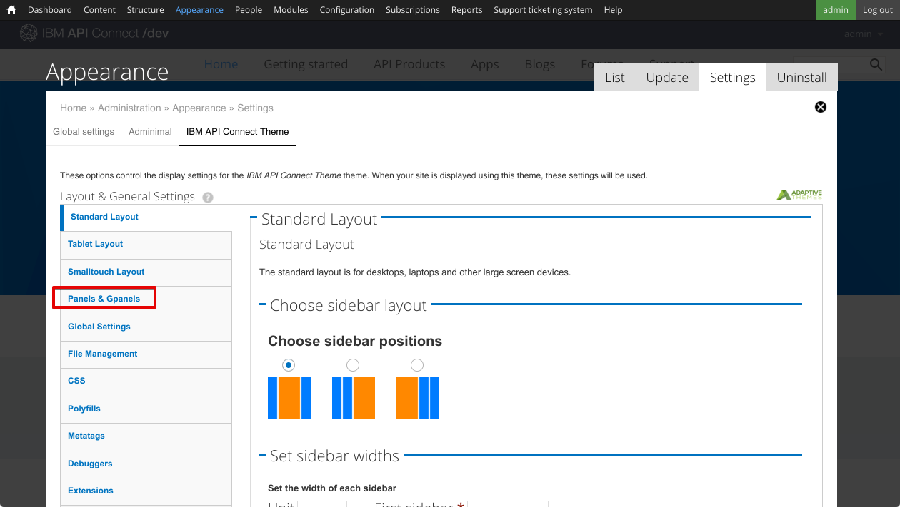
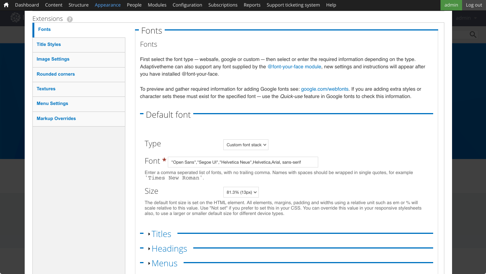
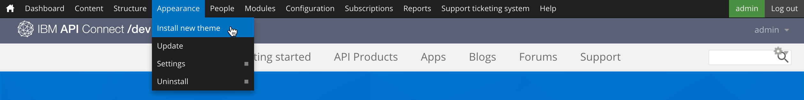

---

copyright:
  years: 2017
lastupdated: "2017-10-31"

subcollection: apiconnect

keywords: IBM Cloud, APIs, lifecycle, catalog, manage, toolkit, develop, dev portal, tutorial

---

{:new_window: target="blank"}
{:shortdesc: .shortdesc}
{:screen: .screen}
{:codeblock: .codeblock}
{:pre: .pre}

# Personalización del Portal del desarrollador y selección de un tema
{: #tut_custom_dev_portal}

**Duración**: 30 minutos  
**Nivel de habilidad**: Principiante  

## Objetivo
{: #object_tut_custom_dev_portal}

Esta guía de aprendizaje le ayudará a personalizar rápidamente el Portal del desarrollador de {{site.data.keyword.apiconnect_full}} y a seleccionar un tema que se ajuste a sus necesidades.

---

## Requisitos previos
{: #prereq_tut_custom_dev_portal}

Antes de iniciar esta guía de aprendizaje, debe haber completado la guía de aprendizaje [Establecimiento y configuración del Portal del desarrollador](/docs/services/apiconnect/tutorials?topic=apiconnect-tut_config_dev_portal) y haberse registrado como el administrador de portal.

---

## Personalizar el portal del desarrollador
{: #cust_tut_custom_dev_portal}

Después de haber creado el portal del desarrollador, puede personalizar su aspecto.

1. Vamos a empezar por modificar la cabecera de bienvenida. En el parte superior, seleccione **Contenido** y luego seleccione **Bloques**.  
  

2. Seleccione **Editar** en el bloque **Cabecera de bienvenida**.  
  

3. Bajo la cabecera Contenido, puede cambiar el texto y la imagen de Contenido para la cabecera de bienvenida escribiendo texto en el editor de contenidos, o seleccionando el icono Editar origen HTML para editar o pegar HTML directamente que define especificaciones de imagen y de texto.  
   

4. Vamos a añadir también una imagen a nuestra pantalla de inicio. Desplácese a la cabecera Imagen. Busque una imagen para utilizarla para el fondo y guárdela en el formato de archivo apropiado (png, gif, jpg, jpeg). Si no tiene una imagen, puede utilizar [esta](images/Cloudy_Day.png). Pulse **Elegir archivo** y busque la imagen de fondo elegida. Después de haber seleccionado la imagen, pulse **Cargar**.  
  

5. La imagen se visualizará una vez que se haya cargado. Si desea eliminarla, pulse **Eliminar**.  
  
 
6. En la parte inferior de la página, pulse **Guardar** para guardar los cambios.  
  
---

## Personalizar el tema para el portal del desarrollador
{: #cust_theme_tut_custom_dev_portal}

El portal del desarrollador le permite modificar el tema para cambiar su aspecto.

1. Para modificar el tema, seleccione **Aspecto** en el menú superior, seleccione **Configuración** y luego **Tema de IBM API Connect**. Este será el tema predeterminado cuando se cree el portal del desarrollador.
   

2. El separador **Diseño estándar** permite modificar los diseños para dispositivos con pantallas grandes, como por ejemplo los escritorios. El separador **Diseño para tableta** permite modificar los diseños utilizados en dispositivos de tabletas. El separador **Diseño para pantalla táctil pequeña** permite modificar los diseños utilizados en dispositivos como por ejemplo teléfonos inteligentes. Después de inspeccionar estos separadores, seleccione **Paneles y Gpanels**.
  

3. Además de modificar los diseños de Barra lateral, el tema predeterminado admite el uso de Gpanels, o Paneles responsivos, si instala el módulo Paneles. Para controlar el diseño de paneles en dispositivos estándares, tabletas y dispositivos de pantalla táctil pequeña, expanda las secciones y actualice los valores.
   

4. Hay otros valores que puede ajustar, pero vaya hacia abajo y seleccione **Extensiones**. Este separador permite habilitar valores adicionales que puede utilizar para configurar el estilo de su portal del desarrollador.  
  

5. Los valores de las extensiones habilitadas en el separador **Extensiones** se pueden modificar en la sección **Extensiones** debajo de los valores principales.     
  

6. Una vez que finalicen las modificaciones de los valores, seleccione **Guardar configuración** en la parte inferior de la página.

---

## Seleccionar un tema diferente para el portal del desarrollador
{: #diff_theme_tut_custom_dev_portal}

El portal del desarrollador se proporciona con temas adicionales que puede elegir y personalizar para cambiar su aspecto.

1. Para habilitar un tema diferente, seleccione el separador **Lista** en la parte superior de los valores Aspecto.  

2. En la parte superior del separador **Listas**, se mostrarán los temas habilitados.
  

3. Debajo de la lista de temas habilitados hay una recopilación de temas inhabilitados. Puede habilitar un tema seleccionando **Habilitar**   
   

4. Una vez que el tema esté habilitado, aparecerá en la parte superior del separador **Lista** en los **Temas habilitados**. Puede personalizarlo seleccionando **Configuración**.  
  

5. Cuando haya terminado de modificar los valores, puede establecer el tema como el predeterminado seleccionando **Establecer predeterminado**.     
  

---

## Instalar un tema nuevo para el portal del desarrollador
{: #new_theme_tut_custom_dev_portal}

Si modificar un tema anterior no se ajusta a sus necesidades, el portal del desarrollador también le permite instalar un tema para cambiar su aspecto.

1. Puede utilizar módulos o temas descargados de [drupal.org ](http://drupal.org){: #new_window} para personalizar el portal del desarrollador o puede crear el suyo propio.

2. Para instalar un tema en el portal del desarrollador, seleccione **Aspecto** desde el menú superior y, a continuación, seleccione **Instalar tema nuevo**.  
  

3. Puede instalar temas directamente desde [drupal.org ](http://drupal.org){: #new_window} utilizando un URL, o puede cargar un tema que haya descargado o creado pulsando **Elegir archivo** y luego **Instalar**.  
   

4. Cuando la carga finalice, debe habilitar el tema. Seleccione **Habilitar temas recién añadidos**.  
  

5. Desplácese hacia abajo en la lista y busque el tema recién instalado. Seleccione **Habilitar y establecer predeterminado**.  
  

6. En la parte inferior de la página, pulse **Guardar** para guardar los cambios.  

---

## Conclusión
{: #conclusion_tut_custom_dev_portal}
Enhorabuena, ha finalizado esta guía de aprendizaje. En esta guía de aprendizaje, ha aprendido a:

* Personalizar la página de bienvenida del portal del desarrollador
* Personalizar el tema utilizado por el portal del desarrollador 
* Seleccionar un tema diferente para utilizarlo para el portal del desarrollador
* Instalar un tema nuevo para el portal del desarrollador

---

## Paso siguiente
{: #next_tut_custom_dev_portal}

Aprender [cómo navega un usuario por un Portal del desarrollador](/docs/services/apiconnect/tutorials?topic=apiconnect-tut_discover_apis) o [cómo obtener conocimientos de análisis básico](/docs/services/apiconnect/tutorials?topic=apiconnect-tut_insights_analytics).

Crear > Gestionar > Proteger > **Socializar** > Analizar  

