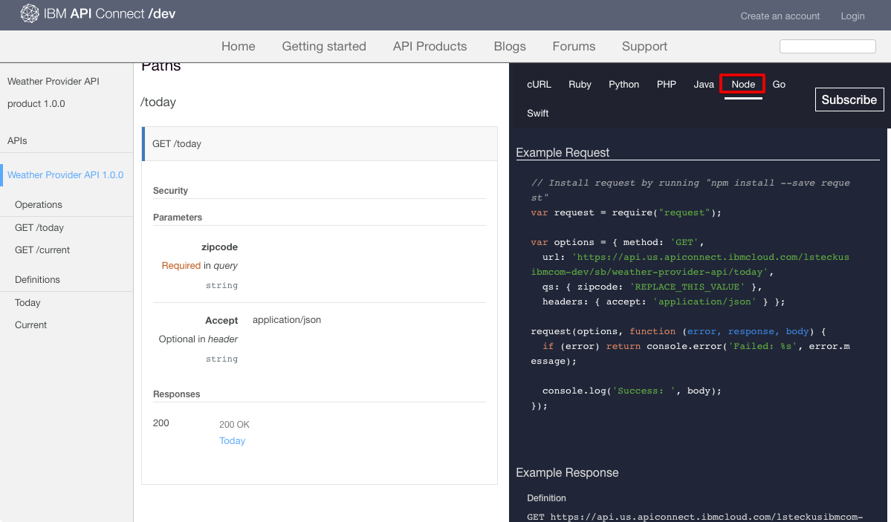
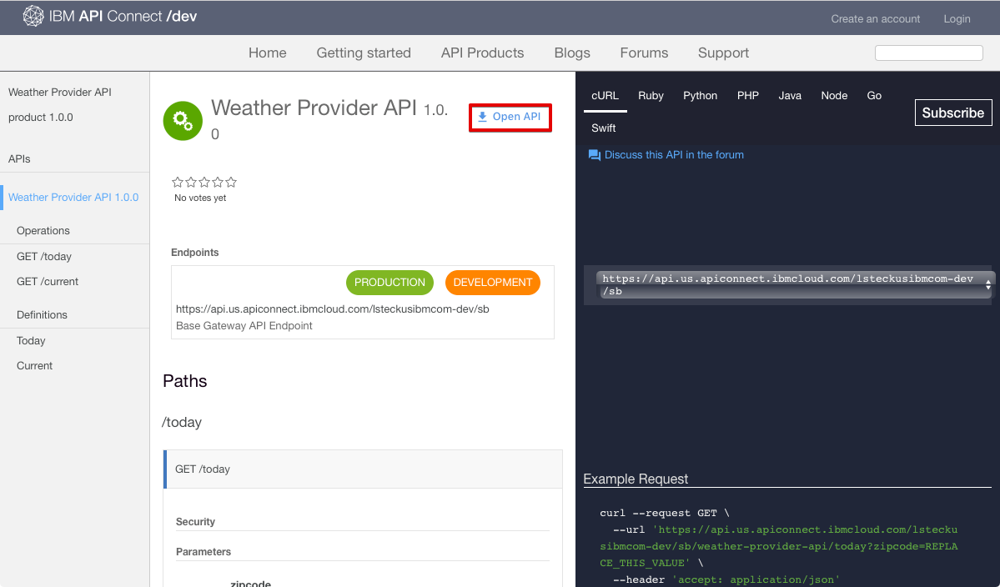
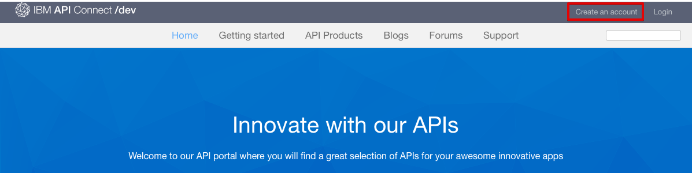

---
copyright:
  years: 2017
lastupdated: "2017-11-20"
---

{:new_window: target="_blank"}
{:shortdesc: .shortdesc}
{:screen: .screen}
{:codeblock: .codeblock}
{:pre: .pre}

# Descubrimiento de API
**Duración**: 25 minutos  
**Nivel de habilidad**: Principiante  

## Requisito previo
No hay ningún requisito previo para esta guía de aprendizaje. Como administrador del portal, también puede completar esta guía de aprendizaje mientras navega por el portal del desarrollador para experimentar cómo navegan los usuarios del portal por el portal del desarrollador. Tenga en cuenta que todos los portales de desarrolladores tienen diferentes texturas. 

Si no tiene un portal del desarrollador existente, puede establecer y configurar un portal del desarrollador en {{site.data.keyword.Bluemix_short}} antes de continuar con esta guía de aprendizaje.

## Objetivo
En esta guía de aprendizaje, aprenderá cómo un usuario del portal puede consumir las API en el Portal del desarrollador de {{site.data.keyword.apiconnect_full}}. Comprenderá cómo un usuario del portal puede explorar productos y API, ver y probar API, y suscribirse a las API. 

## Explorar los productos y las API
Esta sección muestra cómo un usuario del portal exploraría los productos y las API en el portal del desarrollador.

1. En un navegador, vaya a su **Portal del desarrollador de API Connect**.

2. En el Portal del desarrollador de {{site.data.keyword.apiconnect_short}}, seleccione el separador Productos de la API.

3. Seleccione uno de los productos de la API disponibles para mostrar las API y los Planes disponibles para el producto.  
  

4. Seleccione una API para explorar los detalles de las API disponibles.  
  

5. En la página de detalles de una API, puede ver las operaciones disponibles junto con sus parámetros y las respuestas devueltas. Al final de la página, puede ver las definiciones que utiliza la API.  
   

6. En el panel Códigos de ejemplo, puede ver ejemplos en distintos lenguajes de codificación de cómo invocar las solicitudes y sus respuestas. Seleccione uno de los ejemplos, como **Nodo**, para ver un ejemplo en dicho lenguaje de codificación.  
   

---

## Ver y probar las API
Esta sección muestra cómo un usuario del portal puede ver y probar las API disponibles para un producto. 

1. Vaya a los detalles de la API en el Portal del desarrollador de {{site.data.keyword.apiconnect_short}} como se describe en la sección anterior.  
   

2. Puede descargar y ver la información yaml de Swagger de las API seleccionando **Abrir API**.  
   

3. Desplácese a una de las operaciones para ver sus detalles. También puede pulsar en el enlace de operaciones para ir a él en la página.

4. En el panel derecho debajo de los ejemplos, desplácese hasta la sección **Intentar esta operación**. Escriba los parámetros y seleccione **Llamar operación**.  
  

5. Desplácese hacia abajo para ver la solicitud y la respuesta de la llamada de la operación. Se muestran una respuesta de **200 Aceptar** y el cuerpo de mensaje, indicando que la llamada de la operación ha sido satisfactoria.  
  

---

## Suscribirse a las API
Esta sección muestra cómo se puede suscribir un usuario del portal a las API en el portal del desarrollador. 

1. Seleccione **Crear una cuenta**.

2. Complete los campos necesarios y seleccione **Crear cuenta nueva** en la parte inferior de la página. 
**Nota:** Utilice una dirección de correo electrónico diferente a la que ha utilizado para crear el portal del desarrollador en la guía de aprendizaje anterior.

3. Una vez creada la cuenta del desarrollador, inicie sesión para ver la página de inicio. Debe tener una app para suscribirse a las API. Seleccione **Apps** para ir a la página de apps registradas.  
  

4. Para registrar una nueva aplicación, seleccione **Crear nueva app**.  
  

5. Escriba un *Título* y una *Descripción* para la app y seleccione **Enviar**.  
   

6. Ahora que tiene una app, puede suscribirse a los planes del Producto de la API. Seleccione **API disponibles** o **Productos de la API** para examinar los planes del Producto de la API.  
   

7. Seleccione el producto de la API al que desea suscribirse.  
   

8. Seleccione **Suscribirse** para suscribirse al Plan del producto de la API.  
   

9. Seleccione la app a la que desea suscribir el Plan del producto y, a continuación, seleccione **Suscribirse**.
   

10. La aplicación se ha suscrito satisfactoriamente al Plan del producto.
   

## Conclusión

En esta guía de aprendizaje, ha aprendido cómo pueden explorar los usuarios del portal productos y API, cómo pueden ver y probar API, y cómo suscribirse a API. 

---

## Paso siguiente

Aprender [cómo obtener conocimientos de análisis básico](tut_insights_analytics.html).

Crear > Gestionar > Proteger > **Socializar** > Analizar  

