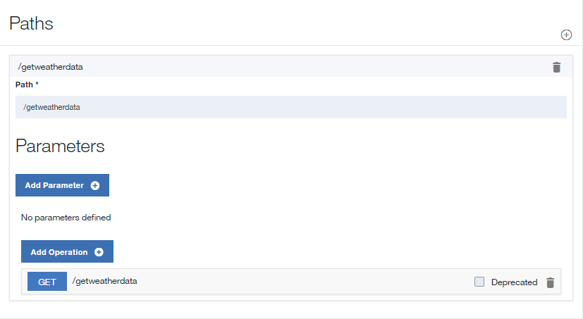

---

copyright:
years: 2017
lastupdated: "2017-11-14"

---

{:new_window: target="blank"}
{:shortdesc: .shortdesc}
{:screen: .screen}
{:codeblock: .codeblock}
{:pre: .pre}
 

# Exponer un servicio SOAP como una API REST
**Duración**: 20 minutos  
**Nivel de habilidad**: Principiante  

---
## Objetivo
En API Manager, creará una API REST que accederá a un Servicio SOAP anterior y lo expondrá como una API REST.

## Requisitos previos
1. Antes de empezar, deberá [configurar la instancia de {{site.data.keyword.apiconnect_full}}](tut_prereq_set_up_apic_instance.html).
2. Antes de empezar, copie el archivo de [prueba weatherprovider.wsdl ](https://raw.githubusercontent.com/IBM-Bluemix-Docs/apiconnect/master/tutorials/weatherprovider.wsdl){:new_window} en el sistema de archivos local.
	>![images/info.png]
	>Puede pulsar **Sin procesar** y, a continuación, guardar la página resultante en el sistema local como un archivo `.wsdl`.

---
## Configuración de una definición de API REST
1. Inicie sesión en {{site.data.keyword.Bluemix_short}}: [https://new-console.ng.bluemix.net/login ](https://new-console.ng.bluemix.net/login){:new_window}.
2. En el **Panel de control** de {{site.data.keyword.Bluemix_notm}}, desplácese y seleccione {{site.data.keyword.apiconnect_short}}. Como alternativa, desde el icono de menú, seleccione **Servicios** y, a continuación, **API** para llegar a la ventana **Trabajar con API**, y seleccione **API Connect**. En la página **API Connect**, simplemente puede pulsar `Crear`, o puede ajustar los valores predeterminados. Para los objetivos de este ejercicio, deje la instancia sin enlazar y ajuste el nombre de Servicio para facilitar el reconocimiento posterior. Un ejemplo sería `API Connect-weather-exercise`.
Pulse el botón `Crear` para iniciar el servicio de {{site.data.keyword.apiconnect_short}}.  
Puede ver una alerta que describe las novedades, o la página de bienvenida informativa **API de borradores**. Después de leer la información, pulse el icono **"Conseguido"** para ver el API Manager.
3. En {{site.data.keyword.apiconnect_short}}, si no ha marcado anteriormente el panel de navegación de la IU, pulse el icono **Navegar a** . Se abrirá el panel de navegación de la IU de API Manager. Para marcar el panel de navegación de la IU, pulse el icono **de menú Marcar** .
4. Seleccione **Borradores** en el panel de navegación de la IU y, a continuación, pulse el separador **API**. Se abre el separador **API**.
	
5. Seleccione **Añadir +** > **Nueva API**.
6. Especifique información básica sobre la API.
	- En el campo **Título**, escriba `Weather Data`.
	- Debe el campo **Nombre** como `weather-data` cuando se rellene al escribir el título.	
	- Deje el campo Vía de acceso **Base** como `/weather-data`.
	- Deje el campo **Versión** como `1.0.0`.
7. Expanda **Propiedades adicionales** para especificar propiedades adicionales para la API.
	- Desde el campo **Plantilla de API**, seleccione **Predeterminado** para indicar que desea utilizar la plantilla predeterminada para crear la definición de la API.
	- Deje los campos restantes sin cambiar.
	
8. Añada la API a un nuevo Producto y, a continuación, cree la definición de la API.
	- Seleccione **Añadir un producto**.
	- En el campo **Título**, utilice `producto Weather Data` como el valor predeterminado.
	- Deje los campos **Nombre** y **Versión** sin cambiar.
	- Asegúrese de que esté seleccionado el recuadro de selección **Publicar este producto en un catálogo** y, a continuación, seleccione **Recinto de pruebas** como Catálogo de destino.
	
	- Pulse **Crear API**. Se abrirá el separador **Diseño** para el borrador de la definición de la API.
9. La API se ha creado ahora. Se muestra la página Diseño. Pulse **Seguridad** en la barra de navegación.

10. Desmarque la opción **ClientID**.

	>
	
>Puede observar que hay un icono triangular amarillo que aparece junto al icono de guardar disco. Este es un aviso de que hay una definición que puede haber sido definida pero no utilizada aún. (Esto no afectará a la definición de la API).
11. En la sección **Definiciones**, pulse el icono **Añadir definición**  y, a continuación, expanda la nueva definición pulsándola.
12. Asigne un nombre a la definición `Salida de Weather Data`.
13. La definición tendrá cinco propiedades. Pulse **Añadir propiedad** cuatro veces para añadir las propiedades adicionales. Cambie el nombre de `Nombre de propiedad` utilizando lo siguiente como guía y utilice el valor predeterminado para la `Descripción`, el `Tipo` y el `Ejemplo`:
	
14. En la sección **Vías de acceso**, pulse el icono **Añadir vía de acceso** .
15. En el campo **Vía de acceso** de la Vía de acceso recién creada, sustituya el contenido por `/getweatherdata`.
16. Expanda la operación **GET /getweatherdata** pulsándola.
	
17. Para la operación **GET /getweatherdata**, pulse **Añadir parámetro** y, a continuación, pulse **Añadir nuevo parámetro**.
18. Designe un nombre para el nuevo parámetro `zip_code` y deje el resto como predeterminado.
19. En la columna **Esquema** de la respuesta **200 Aceptar** de la sección **Respuestas**, seleccione la definición **Salida de Weather Data**. Para la respuesta a la llamada de API, el objeto definido por la **Salida de Weather Data** será el objeto de respuesta.
	
20. Pulse el icono Guardar  para guardar los cambios.

---
## Añadir y configurar la invocación de servicio web
Para añadir y configurar las políticas de invocación y de correlación que integran el servicio web en la definición de API, siga los pasos siguientes.
1. En la sección **Servicios**, pulse el icono **Añadir servicio** . Se abrirá la ventana `Importar servicio web desde WSDL`.
	
2. Seleccione **Cargar archivo**.
3. En la ventana **Carga de archivos**, especifique la ubicación en el archivo `weatherprovider.wsdl` que ha descargado en el `paso 2` de la sección **Requisitos previos** y pulse **Abrir** para continuar.
4. Seleccione el servicio SOAP **weatherService** y pulse **Listo**. En la sección **Servicios**, el servicio web **WeatherService** aparecerá con una única operación **weatherRequest**.
	

		
5. Navegue al separador **Ensamblar** y asegúrese de que **Políticas de DataPower Gateway** esté seleccionado.
6. Suprima la política de **invocación** anterior en el lienzo pasando el cursor sobre la política y, a continuación, pulsando el icono **Suprimir política** .
		
7. En la paleta, arrastre el servicio web **weatherRequest** al recuadro discontinuo que se muestra en el lienzo. Se coloca una política de invocación y dos políticas de correlación en el ensamblado. La primera política de correlación asigna variables a la entrada de la invocación del servicio web, mientras que la segunda política asigna salidas de la invocación del servicio web a variables. Las salidas de la primera correlación y las entradas de la segunda correlación se generan a partir del WSDL proporcionado en el paso 4.
		
8. Pulse la política de correlación **weatherRequest: entrada** y, a continuación, pulse el icono **Editar entradas**  en la columna Entrada de la hoja de propiedades.
		
9. Pulse **+ parámetros de operación** y seleccione `get /getweatherdata`.
10. Pulse **Listo** para añadir el parámetro `zip_code`.
	
11. Pulse el círculo correspondiente a **serie zip_code** en el lado de entrada y, a continuación, pulse el círculo correspondiente a **serie de código postal** en el lado de salida.  
	
12. Cierre la hoja de propiedades.
13. Pulse la política de correlación de **weatherRequest: salida** en la paleta y, a continuación, pulse el icono **Editar salidas**  en la columna Salida de la hoja de propiedades.
14. Seleccione **+ salidas de operación** y seleccione `get /getweatherdata`.
15. Seleccione **Listo** para añadir la definición de salida `Salida de Weather Data`.
	
16. Pulse el círculo correspondiente a **serie de código postal** en el lado de entrada y, a continuación, pulse el círculo correspondiente a **serie de código postal** en el lado de salida. Correlacione los parámetros restantes utilizando lo siguiente como guía.
	
17. Pulse el icono **Guardar**  para guardar los cambios.

Ha incluido la invocación del servicio web en el ensamblado y ha correlacionado un parámetro de entrada con la parte apropiada de la solicitud SOAP y ha correlacionado la parte apropiada de la respuesta de SOAP a una salida JSON.

---
## Probar la definición de API
Para probar la definición de API utilizando la herramienta de prueba de API Manager, siga estos pasos.
1. Pulse el icono **Probar**  debajo del separador **Ensamblar** para revelar el panel de prueba.
	
2. Si ha utilizado la herramienta de prueba antes, pulse **Cambiar la configuración**.
3. Seleccione `Producto Weather Data 1.0.0` de la lista de productos.
	
4. Pulse **Volver a publicar producto**.
5. Pulse **Siguiente**.
6. Seleccione `get /getweatherdata` de la lista de operaciones.  
	
7. Desplácese hasta el campo **zip_code**, escriba `90210`.  
	
8. Pulse **Invocar**. La API devuelve el tiempo actual.  
	

---
## Qué ha hecho en esta guía de aprendizaje
En esta guía de aprendizaje, ha completado las actividades siguientes:
1. Ha configurado una definición de API REST
2. Ha configurado una API para invocar un servicio web existente y ha devuelto su salida
3. Ha probado la definición de API

---

## Paso siguiente

Proteger la API utilizando [limitación de tarifas](tut_rate_limit.html), [ID y secreto de cliente](tut_secure_landing.html), o [protección utilizando OAuth 2.0](tut_secure_oauth_2.html).

Crear > **Gestionar** > Proteger > Socializar > Analizar

[important]: ./images/important.png "¡Importante!"
[info]: ./images/info.png "Información"
[troubleshooting]: ./images/troubleshooting.png "Resolución de problemas" 
