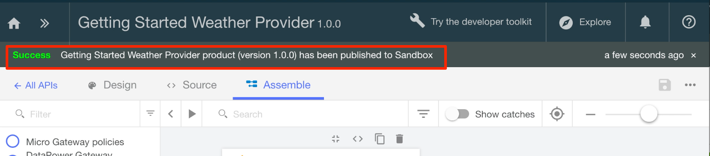

---
copyright:
  years: 2017
lastupdated: "2017-11-02"
---

{:new_window: target="blank"}
{:shortdesc: .shortdesc}
{:screen: .screen}
{:codeblock: .codeblock}
{:pre: .pre}

# Importar la especificación de API y el proxy en un servicio REST anterior con {{site.data.keyword.Bluemix_notm}}
Duración: 5 minutos  
Nivel de habilidad: Principiante  

## Objetivo
Esta guía de aprendizaje le ayuda a comenzar rápidamente con {{site.data.keyword.apiconnect_full}} ilustrando cómo puede llevar su API anterior bajo control de gestión. Empezaremos importando una especificación de OpenAPI, y luego creando un proxy de API de paso a través para un servicio REST anterior.

## Requisitos previos
Antes de empezar, deberá [configurar la instancia de {{site.data.keyword.apiconnect_short}}](tut_prereq_set_up_apic_instance.html).

---


## Explorar la app de ejemplo y probar los puntos finales de destino

Se ha creado una app _weather provider_ de ejemplo para esta guía de aprendizaje. La especificación de API correspondiente (Swagger 2.0) se encuentra en el archivo [weather-provider-api_1.yaml ](https://raw.githubusercontent.com/IBM-Bluemix-Docs/apiconnect/master/tutorials/weather-provider-api_1.yaml){:new_window}.

1. Para explorar la app, vaya a [http://gettingstartedweatherapp.mybluemix.net/ ](http://gettingstartedweatherapp.mybluemix.net/){:new_window}.  
2. Especifique un código postal de Estados Unidos de 5 dígitos válido para obtener el _**tiempo actual**_ y la _**previsión de hoy**_.  


3. La app de tiempo de ejemplo anterior se ha creado utilizando API que proporcionan los datos meteorológicos. El punto final para obtener los datos meteorológicos **actuales** es `https:// myweatherprovider<span></span>.mybluemix.net/current?zipcode={zipcode}`. Pruébelo visitando [https://myweatherprovider.mybluemix.net/current?zipcode=90210 ](https://myweatherprovider.mybluemix.net/current?zipcode=90210){:new_window}.  

  

4. Asimismo, el punto final para obtener los datos de previsión **de hoy** es `https:// myweatherprovider<span></span>.mybluemix.net/today?zipcode={zipcode}`. Pruébelo yendo a [https://myweatherprovider.mybluemix.net/today?zipcode=90210 ](https://myweatherprovider.mybluemix.net/today?zipcode=90210){:new_window}.  

  


---

## Importe la especificación de OpenAPI de la app de ejemplo para crear un proxy de API REST
1. Inicie sesión en {{site.data.keyword.Bluemix_short}}: https://new-console.ng.bluemix.net/login.
2. En el panel de navegación de {{site.data.keyword.Bluemix_notm}}, seleccione **Servicios** y, a continuación, **Panel de control**. Inicie el servicio {{site.data.keyword.apiconnect_short}}. 
3. En {{site.data.keyword.apiconnect_short}}, asegúrese de que esté abierto el panel de navegación del lado izquierdo. Si no lo está, pulse **>>** para abrirlo.  
4. Seleccione **Borradores** en el panel de navegación.   
5. En el separador **API**, pulse **Añadir**. Desde el menú desplegable, seleccione **Importar API desde un archivo o URL**.  
     

6. Ahora importaremos la definición meteorológica de OpenAPI. En el recuadro de diálogo "Importar OpenAPI (Swagger)" que se abre, escriba el siguiente URL: `https://raw.githubusercontent.com/IBM-Bluemix-Docs/apiconnect/master/tutorials/weather-provider-api_1.yaml`. Deje el resto de las opciones con sus valores predeterminados y pulse **Importar**.  
      

7. Después de importar la especificación de OpenAPI, se le dirigirá a la vista **Diseño** de la API. Aquí puede ver varias secciones de la definición de OpenAPI. Desplácese para explorar, y anote el valor **Host**. También puede ver el OpenAPI debajo del separador **Origen**.
  _Nota: Observará que el valor de Host está establecido en _ `$(catalog.host)` _. Este es el URL base para su proxy de API._
8. La API se ha guardado. 


## Probar el proxy de la API

### Probar con la _herramienta de prueba API Manager_.
1. En el separador **Ensamblar**, pulse el icono de más acciones, y luego seleccione **Generar un producto predeterminado**.  
     

2. Acepte las opciones predeterminadas del recuadro de diálogo **Nuevo producto**, y pulse **Crear producto**. Se creará el **producto de la API de Weather Provider** y se publicará en el catálogo del recinto de pruebas. Se mostrará un mensaje que indica la generación correcta del producto.  
    

  

  _En {{site.data.keyword.apiconnect_short}}, **Productos** proporcione una forma para agrupar API pensadas para un uso concreto. Los productos se publican en un **Catálogo**. [Glosario de {{site.data.keyword.apiconnect_short}}](../apic_glossary.html)_

3. En el separador Ensamblar, pulse el icono de reproducción para probar la invocación de destino del proxy de la API.

4. En el panel de prueba, seleccione la operación **get /current**.  
    a. El código postal es un parámetro obligatorio para esta operación, por lo que especifique un código postal de Estados Unidos válido (por ejemplo, 90210).  
    b. Pulse **invocar**, y compruebe que vea:  
    ```
    - 200 OK response
    - Current weather data for 90210  
    ```
_Si ejecuta en un error de CORS, siga las instrucciones del mensaje de error. Pulse el enlace del error para añadir la excepción a su navegador, y a continuación pulse el botón "invocar" de nuevo._

    


### Probar con la _herramienta Explorar_.
_La herramienta Explorar permite a los usuarios probar el funcionamiento correcto de la API aplicando cualquier requisito de parámetro establecido en la definición de OpenAPI. Esta aplicación no se realiza en la herramienta de prueba de la API que se encuentra en el separador Ensamblar, de modo que permite al usuario verificar el comportamiento de la API cuando falte el parámetro._

1. Para probar los puntos finales de proxy de API, seleccione **Explorar** y, a continuación, seleccione **Recinto de pruebas**.
    
2. Seleccione la operación **GET /current** de la paleta.
3. Seleccione "Probarlo".  
4. Especifique un código postal de Estados Unidos válido (p. ej. 90210) en el recuadro de prueba.
5. Pulse **Llamar operación** para ver la respuesta.
  

    


### Conclusión
En esta guía de aprendizaje, ha visto cómo se puede invocar un servicio REST anterior mediante un proxy de paso a través de la API. Ha comenzado comprobando la disponibilidad del servicio de ejemplo mediante el explorador web. A continuación, ha creado un proxy de API en {{site.data.keyword.apiconnect_short}} y lo ha enlazado al servicio de ejemplo que se invocará. Ha empaquetado la API en un producto, ha publicado el producto en el catálogo y ha probado el proxy.

---

## Paso siguiente

Proteger la API utilizando [limitación de tarifas](tut_rate_limit.html), [ID y secreto de cliente](tut_secure_landing.html), o [protección utilizando OAuth 2.0](tut_secure_oauth_2.html).

Crear > **Gestionar** > Proteger > Socializar > Analizar

