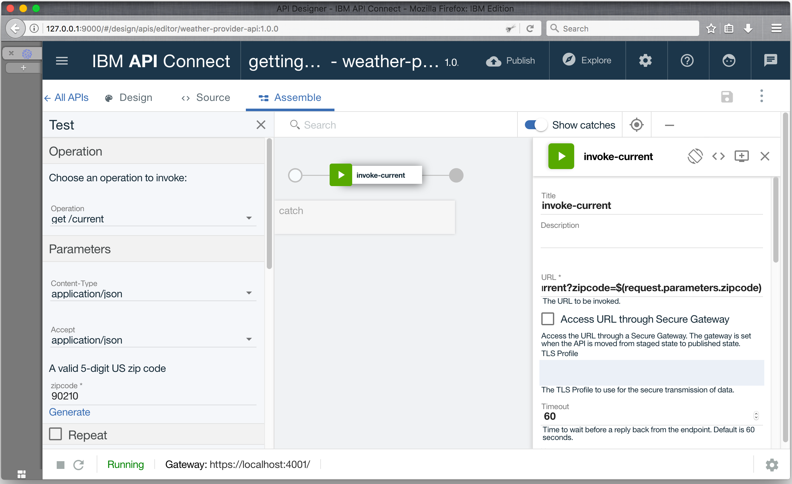

---
copyright:
  years: 2017
lastupdated: "2017-10-31"
---

{:new_window: target="blank"}
{:shortdesc: .shortdesc}
{:screen: .screen}
{:codeblock: .codeblock}
{:pre: .pre}

# Importar la especificación de la API y el proxy en un servicio REST anterior utilizando el Developer Toolkit
Duración: 5 minutos  
Nivel de habilidad: Principiante  

## Objetivo
Esta guía de aprendizaje ilustra cómo puede llevar su API anterior bajo control de gestión con {{site.data.keyword.apiconnect_full}}. En esta guía de aprendizaje, importará una especificación de OpenAPI, y creará un proxy de API de paso a través para un servicio REST existente.

## Requisitos previos
Antes de empezar, necesita [configurar la instancia de API Connect](tut_prereq_set_up_apic_instance.html) e [instalar el kit de herramientas de API Connect](tut_prereq_install_toolkit.html).

---

## Explorar la app de ejemplo y probar los puntos finales de destino

Se ha creado una app _weather provider_ de ejemplo para esta guía de aprendizaje. La especificación de API correspondiente (Swagger 2.0) se encuentra en el archivo [weather-provider-api_1.yaml ](https://raw.githubusercontent.com/IBM-Bluemix-Docs/apiconnect/master/tutorials/weather-provider-api_1.yaml){:new_window}.

1. Para explorar la app, vaya a [http://gettingstartedweatherapp.mybluemix.net/ ](http://gettingstartedweatherapp.mybluemix.net/){:new_window}.  
2. Especifique un código postal de Estados Unidos de 5 dígitos válido para obtener el _**tiempo actual**_ y la _**previsión de hoy**_.  

3. La app de tiempo de ejemplo anterior se ha creado utilizando API que proporcionan los datos meteorológicos. El punto final para obtener los datos meteorológicos **actuales** es `https:// myweatherprovider.mybluemix.net/current?zipcode={zipcode}`. Pruébelo visitando [https://myweatherprovider.mybluemix.net/current?zipcode=90210 ](https://myweatherprovider.mybluemix.net/current?zipcode=90210){:new_window}.  

  

4. Asimismo, el punto final para obtener los datos de previsión **de hoy** es `https:// myweatherprovider.mybluemix.net/today?zipcode={zipcode}`. Pruébelo yendo a [https://myweatherprovider.mybluemix.net/today?zipcode=90210 ](https://myweatherprovider.mybluemix.net/today?zipcode=90210){:new_window}.  

  

---

## Importe la especificación de OpenAPI de la app de ejemplo para crear un proxy de API REST
1. Inicie **API Designer**. En la ventana de terminal, especifique el mandato siguiente: `apic edit`.
2. Inicie sesión en el ID de IBM.
    
3. En el **API Designer**, asegúrese de que el panel de navegación esté abierto. Si no lo está, pulse >> para abrirlo.
4. En el panel de navegación, pulse **Borradores**.
5. Vaya al separador **API**.
6. En el separador API, pulse **Añadir**.
7. Desde el menú desplegable, pulse **Importar API desde un archivo o URL**.
   
8. Hay una definición de OpenAPI 2.0 de la API meteorológica que utilizará para esta guía de aprendizaje. En el recuadro de diálogo "Importar OpenAPI (Swagger)", escriba este URL: `https://raw.githubusercontent.com/IBM-Bluemix-Docs/apiconnect/master/tutorials/weather-provider-api_1.yaml`.
9. Deje la opción _Añadir un producto_ desmarcada y pulse **Importar**.  
      

Después de importar la especificación de OpenAPI, se le dirigirá a la vista Diseño de la API. Aquí puede ver varias secciones de la definición de OpenAPI. Desplácese para explorar, y anote especialmente el valor Host. También puede ver el OpenAPI debajo del separador Origen. 
_Verá que el valor de Host está establecido en _ `$(catalog.host)` _. Este es el URL base para el proxy de la API._
 

## Probar el proxy de la API

1. Inicie el servidor de prueba local seleccionando el icono **Iniciar servidores**. Cuando se inicie la Pasarela, verá la actualización de estado automáticamente en _**En ejecución**_.
    

2. Seleccione el separador **Ensamblar**.

3. Pulse el icono de reproducción (>) para probar la invocación del destino del proxy de la API.
   _Para esta guía de aprendizaje, utilizaremos la Micro Gateway incorporada, por lo que asegúrese de que esté seleccionado **Políticas de Micro Gateway**.
    

4. En el panel de prueba:
  - Seleccione la operación **get /current**.  
  - El código postal es un parámetro obligatorio para esta operación, por lo que especifique un código postal de Estados Unidos válido (por ejemplo, 90210).  
  - Seleccione **invocar**, y verifique la respuesta.

    _Si ejecuta en un error de CORS, siga las instrucciones del mensaje de error. Pulse el enlace en el error para añadir la excepción a su navegador y, a continuación, pulse **invocar** de nuevo.
  
  - La respuesta esperada es **200 Aceptar** y los datos meteorológicos actuales para el código postal 90210.
        

## Conclusión

En esta guía de aprendizaje, ha visto cómo se puede invocar un servicio REST anterior mediante un proxy de paso a través de la API. Ha comenzado comprobando la disponibilidad del servicio de ejemplo mediante el explorador web. A continuación, ha creado un proxy de API en {{site.data.keyword.apiconnect_short}} y lo ha enlazado al servicio de ejemplo que se invocará. Finalmente, ha probado este servicio con las herramientas de prueba internas de {{site.data.keyword.apiconnect_short}}.

---

## Paso siguiente

Proteger la API utilizando [limitación de tarifas](tut_rate_limit.html), [ID y secreto de cliente](tut_secure_landing.html), o [protección utilizando OAuth 2.0](tut_secure_oauth_2.html).

Crear > **Gestionar** > Proteger > Socializar > Analizar
