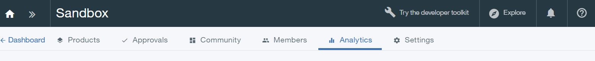
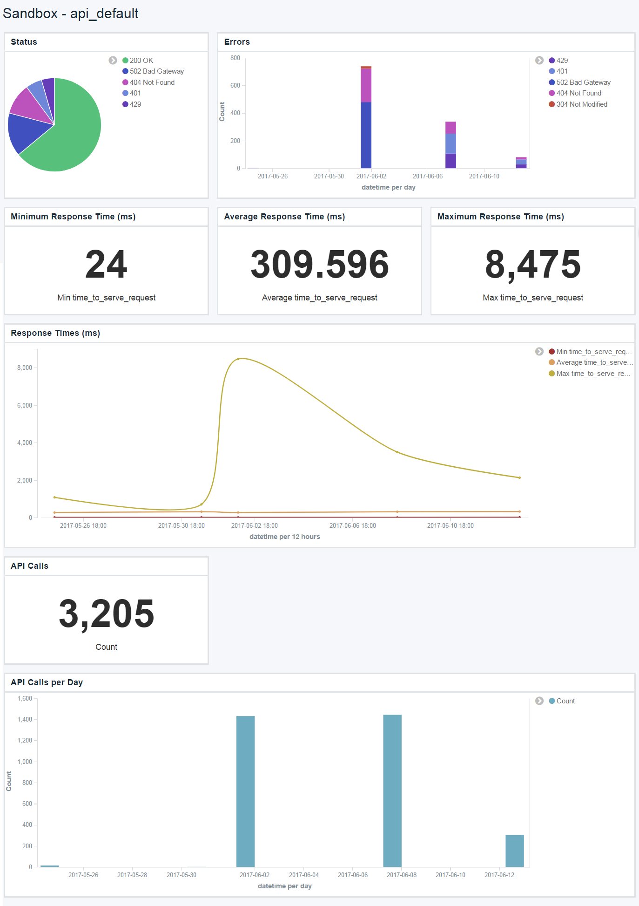
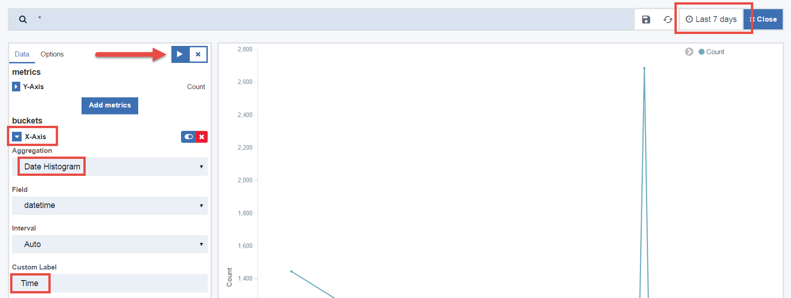

---

copyright:
  years: 2017
lastupdated: "2017-12-15"

subcollection: apiconnect

keywords: IBM Cloud, APIs, lifecycle, catalog, manage, toolkit, develop, dev portal, tutorial

---

{:new_window: target="blank"}
{:shortdesc: .shortdesc}
{:screen: .screen}
{:codeblock: .codeblock}
{:pre: .pre}

# Obtener información de analíticas básicas
{: #tut_insights_analytics}

Duración: 30 minutos  
Nivel de habilidad: Principiante

## Objetivo
{: #object_tut_insights_analytics}

Esta es una introducción básica al análisis de la API en {{site.data.keyword.apiconnect_full}}. Haremos una visita guiada por los paneles de control de análisis disponibles, y puede seguirla junto con sus propias API.

## Requisitos previos
{: #prereq_tut_insights_analytics}

Para ver sus propios análisis de API, debe tener un producto de la API creado y publicado. Además, necesitará llamar a la API varias veces para generar algunos datos de análisis, preferiblemente utilizando un ID de cliente desde una aplicación registrada (no la app de prueba presuministrada).

Para generar los datos en esta guía de aprendizaje, utilizamos *Collection Runner* de Postman para llamar a una API varias veces, con distintos datos e ID de cliente. Puede utilizar una herramienta similar (como HttpRequester para Firefox), o simplemente utilizar cURL para llamar a la API varias veces desde la línea de mandatos. Puede obtener solicitudes de ejemplo para la API pulsando el enlace **Explorar** en {{site.data.keyword.apiconnect_short}}.

## Introducción al análisis de catálogo
{: #intro_tut_insights_analytics}

Como propietario de una API, necesita un modo de evaluar el éxito y el rendimiento de las API que ofrece. El lugar principal en el que buscará análisis es a nivel de catálogo. Si no se ha introducido en catálogos, consulte [Cómo trabajar con Catálogos ](https://www.ibm.com/support/knowledgecenter/en/SSFS6T/com.ibm.apic.apionprem.doc/conref_working_with_env.html){: #new_window} en el IBM Knowledge Center para obtener una introducción. 

Usted y los desarrolladores de la app también pueden acceder al análisis específico de la app en el Portal del desarrollador, pero nos centraremos en Análisis de catálogo en esta guía de aprendizaje.

Tiene acceso a un máximo de 90 días de información en tiempo real e histórica sobre las API y los Productos publicados en dicho catálogo. También le mostrará quién la está llamando. Si el catálogo tiene varios espacios, puede navegar al nivel Espacio.

Esta guía de aprendizaje consta de cuatro actividades que le muestran cómo realizar las tareas siguientes:
* Ver analíticas
* Ver detalles de registro de sucesos
* Crear nuevos paneles de control
* Crear nuevas visualizaciones

## Actividad 1: Ver fuera del recuadro de análisis
{: #act1_tut_insights_analytics}

1. En el servicio de {{site.data.keyword.apiconnect_short}} en {{site.data.keyword.Bluemix_short}}, inicie su Panel de control y seleccione el Catálogo que desee abrir. 
2. Pulse el separador *Análisis*.

    
  
Verá el panel de control Visión general predeterminado, que muestra las visualizaciones de dos diagramas de barras que contienen los datos siguientes de los últimos 7 días:
* 5 productos más activos 
* 5 API más activas 

3. Pase el ratón por encima de cualquiera de las barras para ver detalles adicionales, como por ejemplo el recuento de API, los nombres de api, etc.

    

4. Utilice la barra de búsqueda para filtrar los datos mostrados. También puede seleccionar un filtro de tiempo distinto y/o velocidad de renovación automática. Las visualizaciones se actualizan para reflejar las selecciones.

Hay otros paneles de control que se proporcionan fuera del recuadro.

5. Pulse el icono de carpeta para cargar un panel de control guardado, y seleccione **api_default** en la lista desplegable.

    

Este panel de control tiene un conjunto distinto de visualizaciones que muestran el estado de la API, los errores, los tiempos de respuesta, el número total de llamadas y las llamadas por día.

    

## Actividad 2: Ver detalles del suceso
{: #act2_tut_insights_analytics}

Las visualizaciones son una gran forma de obtener una visión general útil de datos, pero también necesita una forma para navegar en los registros de suceso que rellenan los gráficos.

1. Pase el ratón sobre el icono de flecha en la esquina inferior izquierda de cualquier visualización. Aparecerá una flecha pequeña.
2. Pulse la flecha para ver una tabla de los datos que se utilizan en la visualización. 
3. Pulse la etiqueta **Ver sucesos** para navegar en los detalles de suceso individuales para un máximo de 100 registros.

    

Puede editar, mover y suprimir las visualizaciones en el panel de control.

## Actividad 3: Crear nuevos paneles de control
{: #act3_tut_insights_analytics}

Ahora, vamos a crear un nuevo panel de control que proporcionará la vista de patrones de tráfico de la API. Todos están disponibles utilizando visualizaciones incorporadas. 

1. Pulse el icono de panel de control nuevo y pulse el enlace **Elegir de visualizaciones existentes**. 

    
    Se mostrará una lista de visualizaciones disponibles.

2. Seleccione algunas visualizaciones que añadir a su panel de control.  Por ejemplo:
  * Apps suscritas
  * Apps por plan 
  * Tasa de éxito
  * Llamadas de API por día
  
  **Sugerencia**: Cuando seleccione cada visualización, el separador de selección bloqueará la vista del panel de control, por lo que puede no darse cuenta de que se ha añadido la visualización al panel de control. Seleccione una visualización a la vez y cierre el separador de selección cada vez para ver los cambios en el panel de control.

3. Pulse **Guardar** y dé un nombre a su panel de control: `Panel de control del suscriptor`.

   

    

## Actividad 4: Crear nuevas visualizaciones
{: #act4_tut_insights_analytics}

En el Panel de control del suscriptor que hemos creado, hemos incluido la visualización incorporada que muestra Llamadas de API por día. Cuando buscamos en toda la información presentada junta, en realidad nos gustaría ver el uso por App. Vamos a crear una nueva visualización que muestra esta información.

1. Pulse **Nueva visualización** y seleccione el enlace **Crear visualizaciones**.
    

2. Seleccione **Gráfico de líneas** como tipo de visualización. El gráfico de líneas inicializado tiene la configuración del eje Y con un recuento de llamadas de API. Esto es apropiado para nuestro gráfico.

3. Seleccione lo siguiente:
	* Tipo de receptáculos: **Eje X**
	* Agregación: **Histograma de fecha**
	* Etiqueta personalizada: **Hora** 
4. Pulse **Ejecutar** para ver el gráfico. **Sugerencia**: Es posible que tenga que ajustar el intervalo de tiempo para ver los datos.

   

Este gráfico (hasta ahora) muestra una serie de tiempo de llamadas de API. Queremos ver llamadas de API por nombre de app.

5. Pulse el botón **Añadir subreceptáculos**.
6. Seleccione lo siguiente:
	* Tipo de receptáculos: **Líneas divididas**
	* Subagregación: **Términos**
	* Campo: **app_name**
	* Etiqueta personalizada: **App**
	
   
8. Pulse **Ejecutar** para ver el gráfico.
9. Pulse **Guardar** y dé un nombre a su gráfico `Llamadas de API por app`.
10. Para ver la visualización en contexto, añádala al Panel de control del suscriptor.

   
 
Hay otra información disponible para visualizar detalles sobre las llamadas de API, interlocutores, etcétera. Hay disponible una lista completa de sucesos de API en el Knowledge Center de API Connect, o en la lista de Términos al crear visualizaciones.

## Conclusión
{: #conclusion_tut_insights_analytics}

La capacidad para visualizar análisis de API en diferentes estilos y combinaciones le ofrece una oportunidad para sacar conclusiones o profundizar en los datos de API. Puede utilizar esta información para tomar decisiones sobre qué API ofrecer, al sustituir o retirar una API, quién está consumiendo sus API, y así sucesivamente.

Por ejemplo, las versiones 1 (v1) y 2 (v2) de las API de un proveedor denominado "ACME" se han estado ejecutando durante varios años. Dejaron en desuso la v1 al publicar la v2. También se aseguraron de que los consumidores de la v1 existentes eran conscientes de que tenían un tiempo determinado para pasar a v2. A medida que se acerca este plazo, ACME quiere ver con qué rapidez están abandonando los consumidores la v1, de modo que puedan ofrecer asistencia a socios valiosos. 

Mediante una visualización similar a la que acaba de construir, ACME tiene esta información disponible de un vistazo.

En esta guía de aprendizaje, le hemos guiado por una serie de actividades para ayudarle a crear combinaciones útiles de API y datos de consumidor. Mediante visualizaciones y paneles, hemos creado rápidamente herramientas que pueden proporcionar datos para ayudarle a asegurarse de que estamos ofreciendo la combinación correcta de API.

---

## Paso siguiente
{: #next_tut_insights_analytics}
Aprender [cómo gestionar sus API y las versiones](/docs/services/apiconnect/tutorials?topic=apiconnect-tut_manage_version_landing).

Crear > Gestionar > Proteger > Socializar > **Analizar**  
