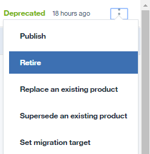

---

copyright:
  years: 2019
lastupdated: "2019-3-15"

subcollection: apiconnect

keywords: IBM Cloud, APIs, lifecycle, catalog, manage, toolkit, develop, dev portal, tutorial

---

{:new_window: target="_blank"}
{:shortdesc: .shortdesc}
{:screen: .screen}
{:codeblock: .codeblock}
{:pre: .pre}

# Archivado y supresión de Productos de API
{: #tut_manage_remove}

**Duración**: 15 minutos  
**Nivel de habilidad**: Principiante 

## Objetivo
{: #object_tut_manage_remove}
En esta guía de aprendizaje, suprimirá, archivará y retirará una API.

---
## Requisitos previos
{: #prereq_tut_manage_remove}

1. [Configurar la instancia de {{site.data.keyword.apiconnect_full}}](/docs/services/apiconnect/tutorials?topic=apiconnect-tut_prereq_set_up_apic_instance).

2. Complete la [guía de aprendizaje Reemplazar un producto de API](/docs/services/apiconnect/tutorials?topic=apiconnect-tut_manage_supercede).

---

## Supresión de un Producto de API
{: #delete_tut_manage_remove}

1. Inicie sesión en {{site.data.keyword.Bluemix_short}}: https://cloud.ibm.com.
2. En el **Panel de control** de {{site.data.keyword.Bluemix_notm}}, pulse **Servicios de Cloud Foundry**. Inicie el servicio {{site.data.keyword.apiconnect_short}}. 
3. En {{site.data.keyword.apiconnect_short}}, asegúrese de que el panel de navegación está abierto. Si no lo está, pulse **>>** para abrirlo.  

  

4. Pulse **Recinto de pruebas** para abrir el catálogo Recinto de pruebas. **Nota**: Puede que necesite volver al Panel de control para ver los catálogos disponibles. Además, la página del panel de control puede mostrar catálogos como mosaicos en lugar de una lista.

5. Pulse los puntos suspensivos verticales en la línea **Weather Provider API 1.0.0**.  

6. Seleccione **Suprimir del catálogo**.  

7. Pulse **Aceptar**.  

    El producto desaparece de la lista de productos en el catálogo. No se puede recuperar en este momento.

## Archivado de un producto de API
{: #archive_tut_manage_remove}

1. Pulse los puntos suspensivos verticales en la línea **Weather Provider API 2.0.0**.  

2. Seleccione **Retirar**.  

3. Pulse **Aceptar**.  

4. Pulse los puntos suspensivos verticales en la línea **Weather Provider API 2.0.0**.  

5. Seleccionar **Archivar**.  

6. Pulse **Aceptar**.  

    El producto desaparece de la lista de productos en el catálogo. Puede recuperarse.

7. Pulse el icono de vista de lista.  

8. Consulte **Archivado**.  

9. Pulse los puntos suspensivos verticales en la línea **Weather Provider API 2.0.0**.  

10. Seleccione **Desarchivar**.  

    El estado del producto cambia a Retirado.
    

 
 
## Conclusión
{: #conclusion_tut_manage_remove}

En esta guía de aprendizaje, ha completado las actividades siguientes:

1. Se ha suprimido un producto de API
2. Se ha retirado un producto de API
3. Se ha archivado un producto de API
4. Se ha desarchivado un producto de API

---

