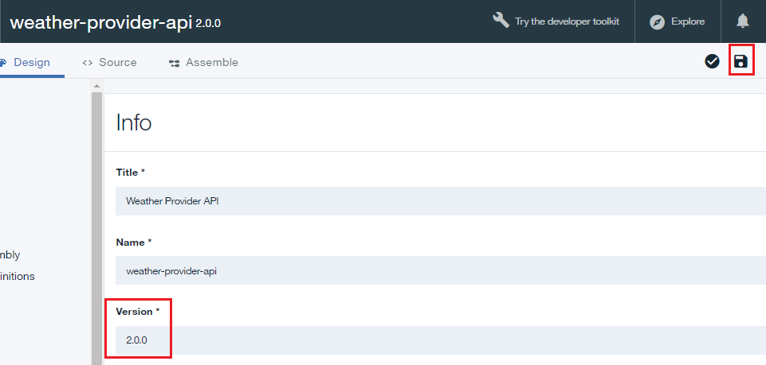
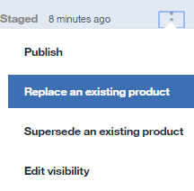

---

copyright:
  years: 2017
lastupdated: "2017-10-31"

---

{:new_window: target="_blank"}
{:shortdesc: .shortdesc}
{:screen: .screen}
{:codeblock: .codeblock}
{:pre: .pre}

# Sustitución de un Producto de API
**Duración**: 15 minutos  
**Nivel de habilidad**: Principiante  

## Requisitos previos

1. [Configurar la instancia de {{site.data.keyword.apiconnect_full}}](tut_prereq_set_up_apic_instance.html).

2. Realice una de las siguientes guías de aprendizaje:
 
    - [Importar una especificación de OpenAPI2.0 y proxy en un servicio REST anterior](tut_rest_landing.html)
       **o**  
    - [Añadir una nueva especificación de API e invocar un servicio REST anterior](tut_rest_landing.html).

---
## Objetivo
En esta guía de aprendizaje, actualizará un producto de API existente sustituyéndolo por uno nuevo. Cuando se sustituye un producto de API, los cambios entrarán en vigor inmediatamente y todas las suscripciones de la aplicación se actualizan automáticamente.  

---
## Sustitución de un Producto de API
{: #repl_api_prod}

1. Inicie sesión en {{site.data.keyword.Bluemix_short}}: [https://console.ng.bluemix.net/login ](https://console.ng.bluemix.net/login){:new_window}.

2. En el Panel de control de {{site.data.keyword.Bluemix_notm}}, inicie el servicio de {{site.data.keyword.apiconnect_short}}.

3. En API Manager, si no ha marcado anteriormente el panel de navegación de la IU, pulse el icono **Navegar a** . Se abrirá el panel de navegación de la IU de API Manager. Para marcar el panel de navegación de la IU, pulse el icono **de menú Marcar** .

4. Pulse **Borradores** > **API**.

5. En el panel API, pulse **API de Weather Provider** para abrir la API de proxy REST.  

6. Cambie la **Versión** a 2.0.0.  

7. Pulse el icono de disco para guardar los cambios de la API.  

8. Pulse **Todas las API**.  

9. Pulse **Productos**.  

10.	Seleccione **Producto de API de Weather Provider**.  

11.	Cambie la **Versión** a 2.0.0. Escriba `API actualizada` en el campo **Descripción**. Pulse en el icono de disco para guardar los cambios.  

12.	Pulse en el icono **Etapa** para subir la nueva versión. Seleccione el catálogo **Recinto de pruebas** si todavía no está seleccionado.

    **Nota**: Es posible transferir una nueva versión a un catálogo distinto, permitiendo el control de qué audiencia de desarrolladores puede ver esta versión. Esta funcionalidad puede ser útil al transferir productos de API de desarrollo para probar en producción.

13.	Pulse **>>** para abrir el menú de navegación, y seleccione **Panel de control**.  

14.	Pulse **Recinto de pruebas**.  

15.	Pulse los puntos suspensivos verticales en la línea **Weather Provider API Product 2.0.0 transferido**.  

16.	Seleccione **Sustituir un producto existente**.  

17.	Seleccione **Weather Provider API Product 1.0.0** en la lista de productos presentados. Pulse **Siguiente**.  

18.	Seleccione **Plan predeterminado**. Pulse **Sustituir**.  

    Como consecuencia de esta sustitución, se ha retirado el Weather Provider API Product 1.0.0, y se ha publicado el Weather Provider API Product 2.0.0. **Nota**: Es posible cambiar el plan asociado con este producto durante el proceso de sustitución. Esta es una forma sencilla de alterar el plan para un producto de API. 

## Qué ha hecho en esta guía de aprendizaje

En esta guía de aprendizaje, ha completado las actividades siguientes:
1. Ha actualizado un producto de API.
2. Ha sustituido un producto de API anterior con un producto de API actualizado.

---

