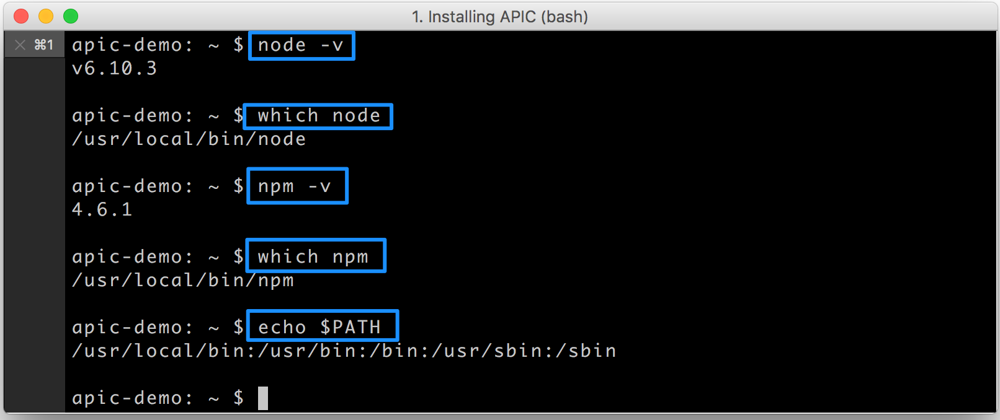

---
copyright:
  years: 2017
lastupdated: "2017-10-31"
---

{:new_window: target="blank"}
{:shortdesc: .shortdesc}
{:screen: .screen}
{:codeblock: .codeblock}
{:pre: .pre}

# Instalación del kit de herramientas de API Connect
**Duración**: 15 minutos  
**Nivel de habilidad**: Principiante  

## Lo que necesitará
1. Node.js
2. Node Product Manager (NPM)
3. {{site.data.keyword.apiconnect_full}} _Lite_

<table>
  <tr><td><b>Node.js</b>: Un tiempo de ejecución de JavaScript gestionado por sucesos asíncrono que se utiliza para construir y ejecutar aplicaciones de red escalables
     
    <b>Node Product Manager</b>: Gestor de paquetes JavaScript y registro de software 
    <b>{{site.data.keyword.apiconnect_short}} _Lite_</b>: Una versión gratuita de {{site.data.keyword.apiconnect_short}} que se aloja en su portátil</td></tr>
  </table>  

## Instalar node.js
1. Descargue e instale node.js de una de estas dos fuentes:
   * [https://nodejs.org/en/download/ ](https://nodejs.org/en/download/){:new_window} (Nota: Descargue la versión LTS para la plataforma, no la más reciente, o puede experimentar errores)
      **O**
   * [https://developer.ibm.com/node/sdk/v6/ ](https://developer.ibm.com/node/sdk/v6/){:new_window}  

    _La instalación de node.js también instala **npm** (Node Package Manager)_.

2.  Una vez que se descargue y se instale Node.js, asegúrese de que se encuentra en su _PATH_.
      

3. Actualice **npm**. En una línea de mandatos, escriba `npm install -g npm`.  
   **Nota:** El establecimiento de npm `--engine-strict` o `npm config set engine-strict true` impide que la instalación se complete.

4. Compruebe la versión instalada y la vía de acceso.
     

## Instalar el kit de herramientas de API Connect y Microgateway
1. Actualice npm config para permitir el uso de certificados de no confianza.  
   `npm config -g set strict-ssl false`  

2. Instale el kit de herramientas de {{site.data.keyword.apiconnect_short}} desde **npm**.  
    `npm install -g apiconnect`

3. Compruebe la versión instalada.  
    `apic -v`

4. Escriba el siguiente mandato en la línea de mandatos: `npm install -g microgateway`.

Vamos a utilizar Microgateway como servidor de pruebas local.
