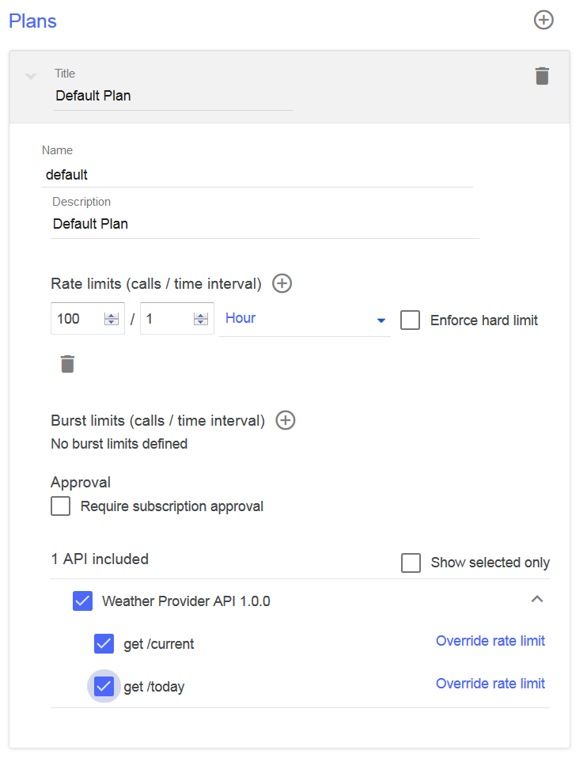
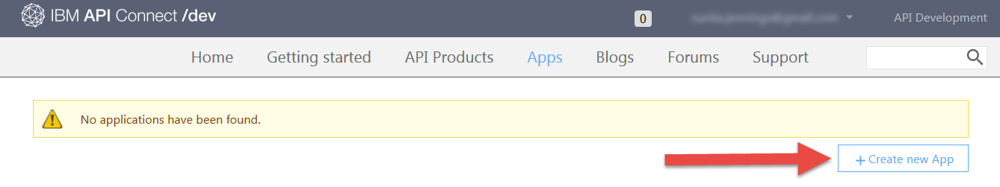
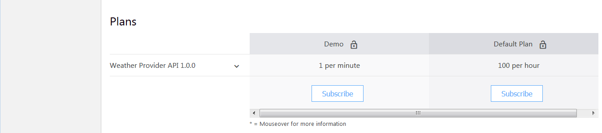

---
copyright:
  years: 2017
lastupdated: "2017-09-30"
---

{:new_window: target="blank"}
{:shortdesc: .shortdesc}
{:screen: .screen}
{:codeblock: .codeblock}
{:pre: .pre}

# Configuración de límites de velocidad
**Duración**: 15 minutos  
**Nivel de habilidad**: Principiante  

## Objetivo
Esta guía de aprendizaje muestra cómo limitar la velocidad de las API. El establecimiento de límites de velocidad le permite gestionar el tráfico de red para las
API y las operaciones específicas dentro de las API. Un límite de velocidad es el número máximo de llamadas que desea permitir en un intervalo de tiempo determinado.

En {{site.data.keyword.apiconnect_full}}, *Productos* proporcione una forma de agrupar API en un paquete para un caso de uso concreto o un público objetivo. Productos también contiene *Planes*, que describen los términos que está dispuesto a ofrecer a sus consumidores de API. Más precisamente, Planes define reglas asociadas con las suscripciones de la API: los límites de velocidad de la API y si la suscripción se tiene que aprobar.

Cuando un desarrollador de aplicaciones desea utilizar las API, seleccionará un Producto que contiene la API que desea utilizar, y se suscribirá a uno de los Planes del Producto, en función de qué Plan cumpla sus necesidades de uso.

En esta guía de aprendizaje, hará lo siguiente:
1. Crear un nuevo Plan de velocidad limitada en un Producto existente.
2. Ver lo que sucede cuando una aplicación supera los límites de velocidad permitidos.

## Requisitos previos
Debe haber creado ya una API en {{site.data.keyword.apiconnect_short}}, protegida con al menos una clave de API. En las instrucciones siguientes, nuestro punto de partida es el [archivo de ejemplo de Weather Provider API ](https://raw.githubusercontent.com/ibm-apiconnect/getting-started/master/toolkit/1a-import/weather-provider-api_1.0.0.yaml){:new_window}, protegido utilizando un [ID y secreto de cliente](tut_secure_landing.html).

Complete las guías de aprendizaje siguientes antes de empezar esta guía de aprendizaje:
- [Importe la especificación de la API, y el proxy en un servicio REST anterior](tut_rest_landing.html).
- [Proteja la API con un ID y secreto de cliente](tut_secure_landing.html).

---
## Iniciar API Connect

1. Inicie sesión en {{site.data.keyword.Bluemix_short}}: [https://console.ng.bluemix.net/login ](https://console.ng.bluemix.net/login){:new_window}.
2. Una vez que haya iniciado sesión en {{site.data.keyword.Bluemix_short}}, desplácese hasta **Todos los servicios**, y pulse en **API Connect**.
3. Pulse en **API Connect** para iniciar el servicio de {{site.data.keyword.apiconnect_short}}.

## Explorar el plan predeterminado
1. En el panel de navegación de {{site.data.keyword.apiconnect_short}}, seleccione **Borradores**. (Si el panel de navegación no está abierto, pulse **>>** para abrirlo.)
2. Seleccione el **separador Productos**, y debería ver el producto Weather Provider API en la lista.

         

3. Pulse el enlace Producto, y se abrirá la vista Diseño que enumerará información sobre el Producto.
4. Desplácese a la sección Planes de la página. Se ha creado un Plan predeterminado al generar este Producto. 

       
5. Expanda los detalles del Plan predeterminado. Observe el límite de velocidad (100 llamadas / 1 hora) y la lista de API, que se puede expandir para mostrar operaciones específicas.

    

   
## Creación de un nuevo Plan de tarifas limitadas

Ahora que hemos visto qué aspecto tiene el Plan predeterminado, vamos a crear un nuevo Plan con límites de velocidad más restrictivos, para demostrar lo que sucede cuando un consumidor de la API excede los límites de un Plan. 
1. Pulse el botón para añadir un Plan nuevo.
 
     
    
    Se ha creado un nuevo Plan, y de forma predeterminada, se establece para permitir un uso ilimitado (es decir, ningún límite de velocidad). Vamos a darle un nombre más significativo, y a establecer un límite más restrictivo.
2. Pulse el Plan nuevo (`Plan nuevo 1`) para expandir los detalles.
3. Pulse el campo Título y establezca el mosaico del Plan en: `Demo`.
4. Pulse el campo Nombre y establezca el nombre del Plan en `demo-plan`.
5. Pulse + para añadir un nuevo límite de velocidad.
6. Cambie el nombre del nuevo límite de velocidad a `demo-rate-limit`, y asegúrese de que se establece en `1 / 1 minuto`.
7. Marque el recuadro de selección `Aplicar límite estricto`. (Cuando este valor esté habilitado, una aplicación recibirá un error si llama a una API más de lo permitido por el límite del Plan suscrito).
8. Acepte el resto de los valores predeterminados y guarde el Producto.

    

## Transferir y publicar un Producto actualizado en el Catálogo del recinto de pruebas

En ejemplos anteriores, puede haber publicado el Producto utilizando la herramienta de prueba, lo que llama a la API con las credenciales de la aplicación de prueba suministradas anteriormente. Sin embargo, esta aplicación de prueba no está sujeta a límites de velocidad, por lo que necesitaremos crear una aplicación nueva aquí para limitar la velocidad. Consulte el [contenido de IBM Knowledge Center para API Connect ](https://www.ibm.com/support/knowledgecenter/SSFS6T/com.ibm.apic.toolkit.doc/tapim_create_product.html){:new_window} para obtener más información.

1. Pulse el icono Publicar para *transferir* el Producto al Catálogo de **recinto de pruebas**. Esta acción añade los cambios del Producto de borrador al Catálogo seleccionado. Necesitamos *publicar* los cambios del Producto a continuación, para ponerlos a disposición de los consumidores a través del Portal del desarrollador.
    
2. Pulse el botón >> para abrir el menú de navegación.
    
3. Seleccione Panel de control y abra el Catálogo de **recinto de pruebas**. Weather Provider API Product aparece como **Transferido**.
4. Pulse los puntos suspensivos y seleccione **Publicar** desde el menú.
    
5. Acepte los valores de visibilidad predeterminados y pulse el botón **Publicar**. Una vez que el Producto esté publicado y esté visible en el Portal del desarrollador, los desarrolladores de aplicaciones pueden suscribirse a los Planes disponibles.

## Registrar una nueva aplicación (consumidor) en el Portal del desarrollador
Los desarrolladores de aplicaciones descubren y utilizan las API utilizando el Portal del desarrollador. Para obtener más información sobre el Portal del desarrollador, consulte este [tema de IBM Knowledge Center ](https://www.ibm.com/support/knowledgecenter/SSFS6T/com.ibm.apic.devportal.doc/tapim_tutorial_using_ADP.html){:new_window}.

Si esta es la primera vez que trabaja con el Portal del desarrollador, deberá suministrar un Portal del desarrollador para el Catálogo del recinto de pruebas. La cuenta en la que está registrado cuando suministra el Portal será la cuenta de administrador para dicho Portal. A continuación, con el fin de explorar y probar API, deberá crear e iniciar sesión con una nueva cuenta de desarrollador (utilizando una dirección de correo electrónico distinta) a la cuenta de administrador.

Las siguientes instrucciones le guiarán a través de estos pasos.

1. Inicie el Portal del desarrollador. Si no conoce el URL, puede encontrarlo en el separador Configuración del Catálogo del recinto de pruebas.

   
    - Para suministrar el Portal del desarrollador por primera vez, seleccione **IBM Developer Portal** desde el desplegable.
    - Esto puede tardar hasta una hora en completarse. Cuando el Portal del desarrollador del recinto de pruebas esté listo, recibirá un correo electrónico
con un enlace a su nuevo sitio de Portal del desarrollador. El enlace es un enlace de un solo uso para la cuenta de administrador. 
2. Inicie sesión en el Portal utilizando las credenciales de desarrollador de apps (**no** su ID de IBM). ***(Cree una nueva cuenta de desarrollador si es necesario, utilizando una dirección distinta de su ID de IBM.)***
3. Pulse el enlace **Apps** en la barra de herramientas, y pulse el botón **Crear nueva app**.

   
4. Dé un título a la aplicación y pulse **Enviar**.

   
5. Guarde el secreto de cliente y el identificador de cliente mostrados. Esta será la única vez que el secreto de cliente estará disponible para su copia.

   

## Suscribirse a un Producto de API

1. Pulse el enlace **Productos de API** en la barra de herramientas. El Producto Weather Provider API aparecerá listado. 

   
2. Pulse el enlace para ver detalles y opciones. Debería ver dos Planes disponibles: el Plan predeterminado original, y el nuevo Plan demo. (Si sólo ve un Plan, vuelva a API Connect y asegúrese de que los cambios al Producto se han guardado, transferido y publicado en el Catálogo de reciento de pruebas.) 

   
3. Pulse en **Suscribirse** en el Plan demo y seleccione la aplicación que acaba de registrar. Ahora, la aplicación puede llamar a las API asociadas con este Plan, a una velocidad de hasta *una* llamada de API cada minuto. 

Estamos listos para probar este comportamiento y observar lo que ocurre cuando la aplicación supera la velocidad especificada.

## Llamar a una API de velocidad limitada

1. En la página Producto de Weather Provider API del Portal del desarrollador, pulse el enlace de la API.

   
2. La página se renovará para mostrar los detalles sobre la API, sus operaciones y proporcionar un lugar para probarlo. (Así es cómo descubrirán y probarán los consumidores de la API su API también.) Observe el panel de prueba oscuro, y desplácese hasta la primera sección **Intentar esta operación**.

3. Para probar la operación `GET /current`, escriba el secreto de cliente de aplicaciones y un código postal válido. Pulse el botón **Llamar operación**. Debería obtener una respuesta `200 Aceptar`, con datos sobre el tiempo actual en ese código postal, 

   

   

4. Ahora, antes de que pase un minuto, pulse el botón **Llamar operación** de nuevo, con un código postal distinto si lo desea. Debería obtener una respuesta `429 Demasiadas solicitudes` esta vez.

   

5. Para validar que se restablezca el límite de velocidad, espere un minuto, inténtelo de nuevo y confirme que ha recibido una respuesta válida.

## Conclusión

Felicidades. Ha creado correctamente un Plan de limitación de velocidad, lo ha asociado con su API segura, y ha verificado que su API sólo responda a solicitudes dentro de los parámetros que haya especificado.

---

## Paso siguiente

Empiece por socializar su API mediante [establecimiento y configuración de un portal del desarrollador](tut_config_dev_portal.html).

Crear > Gestionar > **Proteger** > Socializar > Analizar
