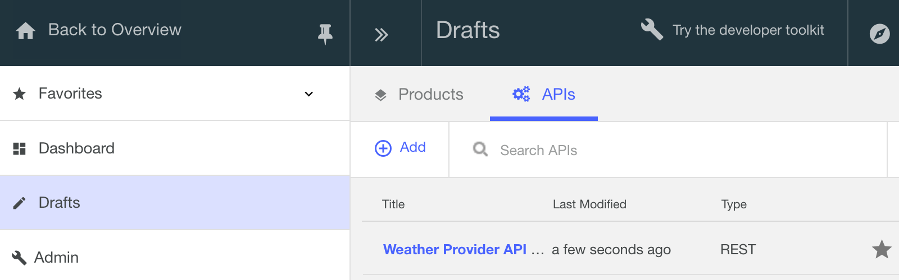

---
copyright:
  years: 2017
lastupdated: "2017-09-30"
---

{:new_window: target="blank"}
{:shortdesc: .shortdesc}
{:screen: .screen}
{:codeblock: .codeblock}
{:pre: .pre}

# Proteger la API con el ID de cliente y el Secreto de cliente mediante el Toolkit

**Duración:** 10 minutos  
**Nivel de habilidad:** Principiante

## Objetivo

Esta guía de aprendizaje le guiará en la protección de la API con el ID de cliente y el Secreto de cliente. Cuando las aplicaciones se registran en el Portal del desarrollador, un ID de cliente se genera para identificar la aplicación. Opcionalmente, un secreto de cliente, que sirve como contraseña, también puede generarse. Las aplicaciones necesitarían facilitar las claves del ID de cliente y del Secreto de cliente generados para acceder a la API.

## Requisitos previos
Antes de empezar, debe haber completado una de las siguientes guías de aprendizaje:
- [Importar una especificación de OpenAPI2.0 y proxy en un servicio REST anterior](tut_rest_landing.html) **o**  
- [Añadir una nueva especificación de API e invocar un servicio REST existente](tut_rest_landing.html)

## Establecer el mecanismo de identificación de la API

1. Inicie API Designer (si no está ya abierto):  
   a. Abra el terminal.  
   b. Escriba `apic edit` en la línea de mandatos. _API Designer se ha iniciado en su navegador web_    
   c. Pulse en **Iniciar sesión con Bluemix**.  
   d. Escriba la información de inicio de sesión de {{site.data.keyword.Bluemix_short}}.  

2. Vaya a la vista Diseño de la API:
    a. Pulse en **Borradores** en el panel de navegación izquierdo 
    b. A continuación, pulse en el separador **API**
    c. Pulse en _Weather Provider API_ que ha creado en la guía de aprendizaje anterior. Esto abre la vista **Diseño** de la API.  
      

3. En la vista Diseño:  
   a. Desplácese hasta **Definiciones de seguridad**.  
     

   b. Pulse el icono **Añadir definiciones de seguridad** (+) y, a continuación, pulse **Clave de API**.  
      - Nombre: ID de cliente; Nombre de parámetro: X-IBM-Client-ID  
      - Nombre: Secreto de cliente; Nombre de parámetro: X-IBM-Client-Secret  
      - Para las dos nuevas claves, asegúrese de que el campo **Ubicado en** esté establecido en "Cabecera".  
          

4. Desplácese hasta el panel **Seguridad** y añada una nueva opción de seguridad.  
   a. Seleccione las claves ID de cliente y Secreto de cliente recién creadas.  
   b. Guarde la API.  
   c. Conmute al separador **Ensamblar**.   
     

## Probar los cambios realizados en la API

1. En el separador Ensamblar, pulse ► para probar los cambios.
2. En el panel de prueba, pulse en la operación **get /current**.
3. Desplácese hacia abajo en el panel de prueba y observe que los valores ID de cliente y Secreto de cliente ya se han rellenado. _Estos son los valores de prueba generados para su recinto de pruebas, y representan las claves de la aplicación que utilizarán la API._  
> Nota: Estas claves ID de cliente y Secreto de cliente también se pueden encontrar en **Panel de control** > **Catálogo** > **Configuración** > **Puntos finales**  

 

4. Desplácese más abajo y especifique un código postal (p. ej. 90210). 
5. Después pulse **Invocar**. _Debería obtener una respuesta 200 Aceptar, junto con el cuerpo del mensaje que devuelve la información meteorológica._  
6. Desplácese de nuevo hacia arriba al campo ID de cliente, y sustituya el valor ID de cliente por uno aleatorio (para ver el comportamiento cuando se pasa un ID de cliente incorrecto)  
7. Vuelva a ejecutar la prueba pulsando **Invocar**. _Verá una respuesta 401 Unauthorized, junto con el mensaje "ID de cliente no registrado"._  
    
  

## Llame a la API utilizando el ID de cliente y el Secreto de cliente

Los valores de seguridad también puede se pueden probar utilizando la herramienta Explorar que explícitamente llama al punto final de proxy, y pasa las claves ID de cliente y Secreto de cliente como valores de cabecera.

1. Pulse **Explorar** y, a continuación, pulse **Recinto de pruebas**.  
    

2. Pulse en la operación **GET /current** de la lista.  

3. En la columna de la derecha, pulse **Llamar operación** para volver a ejecutar la prueba.  
      
    
---

### Conclusión
En esta guía de aprendizaje, ha aprendido a establecer el mecanismo de identificación de la API, a probar los cambios realizados en la API, y a llamar a la API mediante el ID de cliente y el Secreto de cliente. 

---

## Paso siguiente

Empiece por socializar su API mediante [establecimiento y configuración de un portal del desarrollador](tut_config_dev_portal.html).

Crear > Gestionar > **Proteger** > Socializar > Analizar
