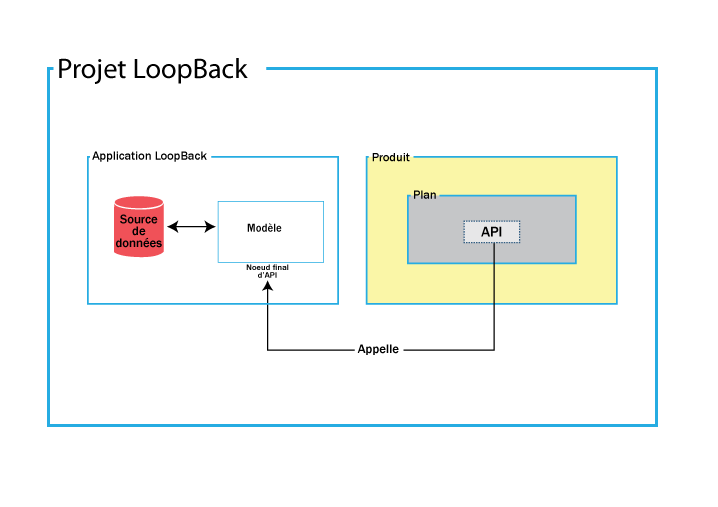
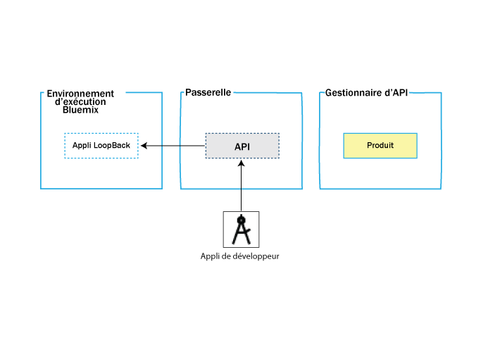

---

copyright:
  years: 2017
lastupdated: "2017-09-14"

keywords: IBM Cloud, APIs, lifecycle, catalog, manage, toolkit, develop, dev portal

subcollection: apiconnect

---

{:new_window: target="_blank"}
{:shortdesc: .shortdesc}
{:screen: .screen}
{:codeblock: .codeblock}
{:pre: .pre}

# Présentation d'IBM API Connect
{: #about_apic_overview}

Utilisez le service {{site.data.keyword.apiconnect_full}} pour créer rapidement des API et des microservices à partir des environnements d'exécution Node.js et Java. Une fois ces éléments créés, vous pouvez gérer vos API avec des contrôles de niveau métier en définissant différents niveaux de sécurité et de visibilité, des plans de facturation et des limites de débit tout en partageant ces API avec des développeurs d'applications. Le service {{site.data.keyword.apiconnect_short}} fournit également les outils vous permettant de transformer et renforcer votre activité au moyen de connaissances obtenues via des analyses détaillées et des recherches filtrées structurées.

<object height="315" type="application/x-shockwave-flash" width="560"
data="https://www.youtube.com/v/lmxyiNMER5Y?version=3&amp;hl=en_US">
<desc>Cette vidéo présente le service {{site.data.keyword.apiconnect_short}}</desc>
<param name="movie" value="https://www.youtube.com/v/lmxyiNMER5Y?version=3&amp;hl=en_US"/>
<param name="allowFullScreen" value="true"/>
<param name="allowscriptaccess" value="always"/>
<param name="scale" value="noScale"/>
</object>

## Création d'API
{: #creation_apic_overview}

{{site.data.keyword.apiconnect_short}} vous permet d'importer des API à partir de définitions Swagger ou de créer des API en utilisant une URL de proxy ou en assemblant des données à partir de sources de données HTTP. {{site.data.keyword.apiconnect_short}} prend également en charge la création et le test d'API en mode hors ligne. Il existe une micro-passerelle intégrée au kit d'outils de développement qui vous permet de vous connecter à des sources de données dorsales, telles qu'une base de données SQL, et d'effectuer ces opérations de création, de lecture, de mise à jour et de suppression.

Les API sont créées dans le kit d'outils de développement. Le kit d'outils de développement inclut une interface utilisateur de concepteur d'API et d'interface de ligne de commande. Pour accéder au kit d'outils de développement, vous devez le télécharger et l'installer à partir de npm.
Lorsque vous installez le kit d'outils, commencez pas créer un projet LoopBack. Le diagramme ci-après illustre le contenu d'un projet LoopBack.

- **Projet LoopBack** : Le projet LoopBack contient l'application LoopBack et le produit d'API.

- **Application LoopBack** : L'application Loopback contient le noeud final d'API qui permet d'accéder à votre source de données,
actif métier ou service cloud.

- **Produit** : Le produit est l'unité qui vous permet de publier des API. Un produit contient un plan et ce dernier contient l'API qui appelle le noeud final d'API lorsqu'elle est appelée.

Le diagramme suivant indique où sont déployés l'application LoopBack, l'API et le produit une fois qu'ils ont été publiés à partir de l'interface de ligne de commande ou de l'interface utilisateur du kit d'outils de développement.

- **Environnement d'exécution {{site.data.keyword.Bluemix_short}}** :
L'application LoopBack est déployée sur l'environnement d'exécution {{site.data.keyword.Bluemix_short}} que vous spécifiez.

- **Passerelle** : L'API est déployée sur la passerelle.

**Gestionnaire d'API** : Le produit est déployé sur le gestionnaire d'API où vous pouvez spécifier de quelle manière il est utilisé.

Pour plus d'informations sur les tâches nécessaires à la création d'API, voir [Création d'API](/docs/services/apiconnect?topic=apiconnect-creating_apis).

## Présentation de la gestion des API

Une fois qu'un produit a été transféré et publié, vous pouvez ouvrir le gestionnaire d'API pour gérer la sécurité, les limites de débit, les règles et les informations de facturation, puis publier le produit sur un portail de développement.

Comme illustré dans le diagramme ci-après, un produit contient un plan, qui comprend une ou plusieurs API.

### Plans
{: #plans_apic_overview}

Pour qu'une API puisse être mise à la disposition d'un client, elle doit être incluse dans un plan. Les plans sont utilisés pour distinguer les diverses offres. Les plans peuvent partager des API mais l'obligation ou la non-obligation d'approbation de l'abonnement dépend du plan lui-même. De plus, vous pouvez imposer des limites de débit via des plans ou au moyen d'opérations dans les API d'un plan qui se substituent à la limite de débit du plan.

Des plans peuvent également spécifier les coûts de facturation pour les clients qui utilisent vos produits. Par exemple, vous pouvez définir trois plans différents pour un seul produit. Chaque plan peut comporter un coût d'abonnement différent et une limite de débit différente ciblant différents clients.  

### Produits
{: #products_apic_overview}

Les plans et les API sont regroupés dans des produits. Ces produits vous permettent de gérer la disponibilité et la visibilité des API et des plans. Le concepteur d'API vous permet de créer, d'éditer et de transférer votre produit. Utilisez le gestionnaire d'API pour gérer le cycle de vie de votre produit.

Le diagramme suivant illustre la façon dont les produits, les plans et les API sont liés entre eux. Notez que les plans n'appartiennent qu'à un seul produit, qu'ils peuvent posséder différentes API pour d'autres plans au sein d'un même produit et qu'ils peuvent partager des API avec des plans d'un autre produit. Figure montrant la hiérarchie des produits, des plans et des API. 

Vous ne pouvez créer des plans que dans des produits qui sont
ensuite publiés dans un catalogue. Un gestionnaire du cycle de vie peut ensuite contrôler la disponibilité et la visibilité des API et des plans via le gestionnaire d'API. Le portail de développeur permet au client de s'abonner à l'un des plans qui sont mis sa disposition et identifiés dans le gestionnaire d'API. S'il s'agit d'un plan avec facturation, le client doit fournir des informations de carte de crédit lors de l'abonnement. L'utilisateur ne peut s'abonner qu'à un plan d'un produit spécifique. Il est utile d'avoir plusieurs plans dans un seul produit car ils peuvent remplir des objectifs similaires mais avec des niveaux de performances et de coûts différents. Par exemple, vous pouvez disposer d'un "plan de démonstration", qui met à disposition une API à disposition, et d'un "plan complet", qui met à disposition plusieurs API.

Il est possible de contrôler les API qu'un utilisateur peut utiliser mais il est également possible d'utiliser plusieurs plans pour implémenter des limites de débit. Une limite de débit peut être implémentée sous la forme d'un débit par défaut dans la totalité d'un plan. Il est aussi possible, pour des opérations d'API spécifiques au sein de ce plan, de les exempter de la limite de débit du plan. Différents plans peuvent avoir des limites de débit différentes, entre les opérations et pour la limite globale. Cela est utile pour pouvoir offrir des niveaux de services différents aux clients. Par exemple, un "plan de démonstration" peut imposer une limite de débit de 10 appels par minute tandis qu'un "plan complet" peut autoriser jusqu'à 1000 appels par minute.

Enfin, différents plans peuvent être utilisés pour affecter un coût de facturation. Un plan peut être gratuit ou avec facturation. Les plans avec facturation peuvent être utilisés avec des limites de débit pour définir différents niveaux de service pour les clients. Par exemple, un "plan de démonstration" peut imposer une limite de débit de 10 appels par minute pour un coût de 5 $ par mois, tandis qu'un "plan complet" peut autoriser jusqu'à 1 000 appels par minute pour un coût de 20 $ par mois.

**Remarque :** L'application d'une limite de débit au niveau du plan crée une limite de débit par défaut qui s'applique à chaque
    opération au sein du plan. Si vous avez besoin de spécifier des limites de débit spécifiques pour
certaines opérations, vous devez les définir dans les opérations proprement
dites. Ces nouvelles limites sont prioritaires sur celles définies au niveau du
plan.

IBM API Connect prend également en charge l'implémentation de plusieurs versions de produits. Vous pouvez choisir les numéros de versions et les utiliser pour faciliter le transfert de vos produits et plans.

**Remarque :** La version d'un produit est distincte de celle des API contenues dans les plans associés. Les plans ne peuvent pas avoir leur propre version ; ils utilisent celle de leur produit
parent.

Pour plus d'informations sur les tâches nécessaires à la gestion des API, voir [Gestion des API](/docs/services/apiconnect?topic=apiconnect-managing_apis).

### Catalogues
{: #catalogs_apic_overview}

Les produits doivent être transférés dans un catalogue, puis
publiés dans des organisations de développeurs pour pouvoir être mis à la
disposition des développeurs d'applications. {{site.data.keyword.apiconnect_short}}
vous permet de créer plusieurs catalogues. Les catalogues sont
utiles pour séparer les produits et les API que vous souhaitez tester avant de les mettre à disposition dans des organisations de développeurs.

Un catalogue est une cible de transfert qui se comporte comme une
partition logique de la passerelle et du portail de développeur. Les URL des
appels d'API et du portail de développeur sont propres à un catalogue donné. Dans
une configuration standard, une organisation de type fournisseur d'API utilise
un catalogue de développement pour tester les API en développement et un
catalogue de production pour héberger les API prêtes à l'utilisation. Il est
courant d'avoir un cloud de développement avec un catalogue de développement,
quelques catalogues de test et un cloud de production, éventuellement doté de
son propre catalogue de test.

#### Paramètres de catalogue
{: #cat_set_apic_overview}

Vous pouvez appliquer les paramètres suivants à un catalogue :

- **Développement** : Un catalogue de développement est fourni par défaut. Vous ne devez
utiliser un catalogue de développement qu'à des fins de test. Dans un catalogue de développement, les actions de transfert
et de publication sont forcées, ce qui signifie que si vous republiez un
produit précédemment publié, il est écrasé sans avertissement. Si des
conflits sont détectés, ils sont automatiquement résolus par le système. L'annulation de la publication des actions s'effectue
automatiquement. Lorsque
vous employez l'outil de test dans un catalogue de développement, le produit
que vous testez est forcé et remplace les produits transférés et publiés, même
si les opérations sont utilisées via le portail du développeur. Un portail de
développeur créé à partir d'un catalogue de développement doit être utilisé de
la même manière, c'est-à-dire à des fins de test uniquement et non pour des cas
réels.

- **Abonnement automatique** : L'activation d'un abonnement automatique pour un catalogue facilite le test de vos API dans l'interface utilisateur du gestionnaire d'API car une application de test est utilisée, avec un ID client
et un secret client préfournis, et abonnée automatiquement à tous les plans du catalogue. Par conséquent, vous n'avez pas à spécifier un plan ou une application lors des tests. L'application de test n'est pas soumise à des limites de débit. La fonction
d'abonnement automatique est disponible uniquement pour un catalogue de
développement.

- **Par défaut** : Vous pouvez définir l'un de vos catalogues comme le catalogue par défaut. Ensuite, les appels d'API qui sont publiés sur ce catalogue peuvent utiliser
une URL plus courte qui ne comporte pas le nom de catalogue.

Pour plus d'informations sur l'utilisation du portail de développeur, voir
[Recherche
et utilisation des API ](https://www.ibm.com/support/knowledgecenter/en/SSFS6T/com.ibm.apic.devportal.doc/capim_devportal_overview.dita){: #new_window}.

### Syndication
{: #syn_apic_overview}

La fonction de syndication
d'{{site.data.keyword.apiconnect_full}}
vous permet de partitionner vos catalogues en espaces. Chaque espace est
utilisé par une équipe de développement de fournisseur d'API différente et
possède ses propres capacités de gestion liées aux API que l'équipe de
développement associée publie dans cet espace, ce qui permet à chaque équipe de
gérer ses API de manière indépendante.

Lorsque vous transférez ou publiez une API dans un catalogue dont les
espaces sont activés, vous indiquez l'espace du catalogue vers lequel vous
souhaitez effectuer le transfert ou la publication. Toutefois, les
développeurs d'applications qui accèdent au portail du développeur du catalogue
ne connaissent pas le partitionnement des espaces du catalogue et voient les
API comme une offre coordonnée.
Chaque espace est doté de sa propre gestion de cycle de vie du produit, de
ses propres approbations d'abonnement et de ses propres données d'analyse.
Un contrôle d'accès spécifique à l'espace vous permet de restreindre
l'accès utilisateur à chaque espace. Par exemple, un développeur de l'équipe
Vols est capable de transférer des API uniquement vers l'espace Vols.

**Remarque :** Par défaut, les espaces sont désactivés dans un catalogue. Pour les
activer, vous devez modifier les paramètres du catalogue.

Pour partitionner un catalogue, voir [Partitionnement d'un catalogue](/docs/services/apiconnect?topic=apiconnect-create_catalog#apic_spaces).
