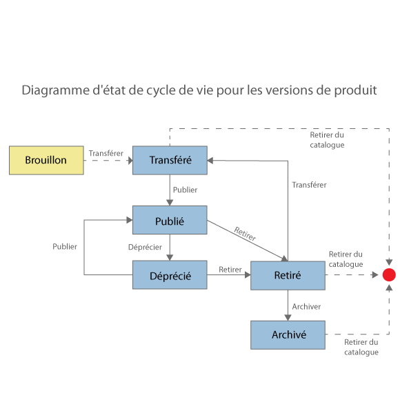

---

copyright:
  years: 2017
lastupdated: "2017-12-15"

keywords: IBM Cloud, APIs, lifecycle, catalog, manage, toolkit, develop, dev portal

subcollection: apiconnect

---

{:new_window: target="blank"}
{:shortdesc: .shortdesc}
{:screen: .screen}
{:codeblock: .codeblock}
{:pre: .pre}

# Gestion des produits
{: #managing_products}

Pour plus d'informations sur les méthodes permettant de gérer des produits, voir la documentation suivante dans l'IBM&reg; Knowledge Center : [Gestion des produits ](http://www.ibm.com/support/knowledgecenter/SSFS6T/com.ibm.apic.apionprem.doc/task_product_management.html){: #new_window}.

## Cycle de vie de produit
{: #prod_lifecycle_managing_products}

Lorsque vous gérez les versions de votre produit, elles passent par une série d'états de cycle de vie, depuis leur transfert initial à l'état de brouillon sur un environnement à leur publication pour être mises à la disposition des développeurs d'applications et à leur retrait et archivage. Le tableau et le diagramme ci-après décrivent les différents états du cycle de vie d'une version de produit.

<table summary="" id="apic_004__table_lym_rxj_gv" class="defaultstyle"><caption class="style-scope doc-content">Tableau 1. Etats de cycle de vie de produit (gestionnaire d'API)</caption>
<thead class="style-scope doc-content">
<tr class="style-scope doc-content doc-tr-even">
<th style="width: 11.25%" id="d3569e1968" class="thleft thbot style-scope doc-content">Etat</th>
<th style="width: 88.75%" id="d3569e1970" class="thleft thbot style-scope doc-content">Description</th>
</tr>
</thead>
<tbody class="style-scope doc-content">
<tr class="style-scope doc-content doc-tr-odd">
<td style="width: 11.25%" headers="d3569e1968 " class="style-scope doc-content">Brouillon</td>
<td style="width: 88.75%" headers="d3569e1970 " class="style-scope doc-content">Le produit n'est ni déployé ni associé à un catalogue API Connect.</td>
</tr>
<tr class="style-scope doc-content doc-tr-even">
<td style="width: 11.25%" headers="d3569e1968 " class="style-scope doc-content">Transféré</td>
<td style="width: 88.75%" headers="d3569e1970 " class="style-scope doc-content">Une copie non modifiable de la version de produit est déployée sur l'environnement cible. Il s'agit de l'état initial qui caractérise un produit brouillon que vous transférez. Lorsqu'un produit est à l'état transféré, les développeurs ne peuvent pas encore le voir ni s'y abonner.</td>
</tr>
<tr class="style-scope doc-content doc-tr-odd">
<td style="width: 11.25%" headers="d3569e1968 " class="style-scope doc-content">Publié</td>
<td style="width: 88.75%" headers="d3569e1970 " class="style-scope doc-content">La version de produit est visible pour les développeurs ou les communautés et ils peuvent s'y abonner.</td>
</tr>
<tr class="style-scope doc-content doc-tr-even">
<td style="width: 11.25%" headers="d3569e1968 " class="style-scope doc-content">Déprécié</td>
<td style="width: 88.75%" headers="d3569e1970 " class="style-scope doc-content">La version de produit est uniquement visible pour les développeurs dont les applications font actuellement l'objet d'un abonnement. Aucun nouvel abonnement pour le produit n'est possible.</td>
</tr>
<tr class="style-scope doc-content doc-tr-odd">
<td style="width: 11.25%" headers="d3569e1968 " class="style-scope doc-content">Retiré</td>
<td style="width: 88.75%" headers="d3569e1970 " class="style-scope doc-content">La version de produit n'est pas visible et ne peut faire l'objet d'aucun abonnement. De plus, toutes les API qui lui sont associées sont arrêtées. Une version de produit retirée s'affiche par défaut sur la page Produits dans l'interface utilisateur du gestionnaire d'API.</td>
</tr>
<tr class="style-scope doc-content doc-tr-even"><td style="width: 11.25%" headers="d3569e1968 " class="style-scope doc-content">Archivé</td>
<td style="width: 88.75%" headers="d3569e1970 " class="style-scope doc-content">La version de produit n'est pas visible et ne peut faire l'objet d'aucun abonnement. De plus, toutes les API qui lui sont associées sont arrêtées. La version de produit ne s'affiche pas par défaut sur la page Produits dans l'interface utilisateur du gestionnaire d'API.</td>
</tr>
</tbody>
</table>

### Flux du cycle de vie de produit
{: #prod_lifecycle_flows_managing_products}

Le diagramme ci-après illustre les états de cycle de vie possibles pour une version de produit, ainsi que les opérations de gestion de produit qui font passer une version de produit d'un état du cycle de vie à un autre. Par exemple, l'opération de retrait fait passer une version de produit de l'état publié à l'état retiré.




## Création d'un produit
{: #create_product_managing_products}

Créez un produit pour collecter un ensemble d'API et de plans dans une
offre que vous mettez à la disposition de vos développeurs. Un plan inclut des paramètres de limite de débit qui peuvent être appliqués au plan dans son ensemble ou spécifiés pour chaque opération dans une API. Grâce aux produits et aux plans, vous pouvez mieux contrôler les API auxquelles vos développeurs ont accès. Après avoir créé un produit, vous devez le transférer. Lorsqu'un produit est transféré, il passe à l'état Actif et cela vous permet d'appeler et de tester les API qu'il contient. Lorsqu'un produit est transféré, les développeurs ne peuvent pas encore le voir.

**Conseil** : En plus d'utiliser la méthode décrite dans cette tâche, vous pouvez également créer un produit
lorsque vous créez une API. Si vous créez une API en utilisant l'interface de ligne de commande du kit d'outils de développement, un produit est automatiquement créé pour vous. Vous pouvez ensuite modifier les paramètres de produit en ouvrant votre nouveau produit sur la page **Produits** du concepteur d'API.

Pour créer un produit à l'aide du concepteur d'API, procédez comme suit :
1. Pour ouvrir l'interface utilisateur du concepteur d'API, ouvrez une ligne de commande et entrez la commande suivante :
```
apic edit
```
Le concepteur d'API s'ouvre dans votre navigateur par défaut.

2. Dans le panneau de navigation du concepteur d'API, cliquez sur **Produits**.
L'onglet Produits s'ouvre.

3. Cliquez sur **Ajouter**, puis sur **Nouveau produit**.
La fenêtre Ajout d'un nouveau produit s'ouvre.

4. Renseignez les zones suivantes :
    - Intitulé
    - Nom
    - Version

5. Cliquez sur **Ajouter**.
L'onglet Concevoir s'ouvre pour le nouveau produit.

6. **Optional**:
Entrez la description, le contact, la licence et les conditions d'utilisation du produit dans la section
**Informations**.

7. Dans la section **Visibilité**, indiquez les utilisateurs pour
lesquels vous souhaitez que le produit soit visible. Vous avez le choix entre **Public**,
**Utilisateurs authentifiés** et **Personnalisé**. Si vous sélectionnez **Personnalisé**, vous pouvez utiliser la zone **Type à ajouter** pour rechercher les organisations ou communautés de développeurs pour lesquelles vous souhaitez que les plans du produit soient visibles.

    **Remarque :**
    Pour que vous puissiez rechercher des organisations ou des communautés de développeurs, le produit doit être à l'état transféré,
    publié ou déprécié. Si le catalogue dans lequel il est transféré, publié ou déprécié n'est pas un
catalogue de bac à sable, vous ne pouvez pas apporter d'autres modifications au
produit tant qu'il est dans l'un de ces trois états. Pour plus d'informations, voir [Cycle de vie de produit](#prod_lifecycle_managing_products).

8. Définissez les utilisateurs qui peuvent s'abonner au produit. Vous pouvez choisir **Utilisateurs authentifiés** ou **Personnalisé**. Si vous sélectionnez **Personnalisé**, vous pouvez utiliser la zone **Type à ajouter** pour rechercher les organisations ou communautés de développeurs que vous souhaitez autoriser à s'abonner aux plans du produit.

9. Dans la section API, indiquez les API à inclure dans le produit.
    1. Cliquez sur l'icône **Ajouter l'API**.
    2. Sélectionnez les API que vous souhaitez inclure, puis cliquez sur **Appliquer**. Les API sélectionnées sont répertoriées.

10. Pour qu'une API puisse être mise à la disposition des développeurs d'applications, vous devez l'inclure dans un plan. Pour ajouter un ou plusieurs plans au produit, cliquez sur l'icône **Ajouter un plan**.
    1. Développez le nouveau plan qui a été créé. Si vous avez déjà ajouté des API au produit, elles sont automatiquement incluses.
    2. Renommez le plan dans les zones **Titre** et **Nom** et ajoutez éventuellement une description.
    **Remarque :** Un plan par défaut est automatiquement créé pour vous ; vous pouvez inclure une API dans ce plan
    si vous ne souhaitez pas créer le vôtre. Toutefois, si vous décidez de ne pas utiliser le plan par défaut, vous devez le supprimer car un produit ne peut pas être transféré s'il inclut des plans qui n'incluent pas d'API.

11. Vérifiez que les API dont vous avez besoin sont incluses dans le plan.
    1. Développez le plan auquel vous souhaitez ajouter une API.
    2. Sous API incluses, vérifiez que les cases à cocher des API dont vous avez besoin sont sélectionnées. Si des API sont déjà sélectionnées et que vous ne souhaitez pas les inclure dans le plan en cours d'édition, désélectionnez les cases correspondantes.

12. **Facultatif** :
Ajoutez des informations de facturation pour votre plan. Pour ajouter des informations de facturation, vous devez définir un compte avec un service de traitement des cartes de crédit pour que vos clients puissent payer avec une carte de crédit. Des plans plan de facturation mensuels sont facturés à la même date chaque mois.

13. **Facultatif** :
Si vous souhaitez choisir les opérations d'une API qui seront incluses dans le plan, placez le curseur
au-dessus de l'API contenant l'opération choisie. Cliquez sur l'icône **Afficher les opérations**, puis sélectionnez ou désélectionnez les cases à cocher correspondant aux opérations que vous souhaitez inclure ou exclure.

14. **Facultatif** :
Pour ajouter une limite de débit à votre plan, désélectionnez la case à cocher **Illimité**, puis
spécifiez la limite de débit que vous souhaitez appliquer. Si la case **Appliquer la limite absolue** est cochée, le plan
empêchera les applications d'appeler l'API une fois la limite atteinte. Sinon, un avertissement sera envoyé.

    **Remarque :** L'application d'une limite de débit au niveau du plan crée une limite de débit par défaut qui s'applique à chaque
    opération au sein du plan. Si vous avez besoin de spécifier des limites de débit spécifiques pour
certaines opérations, vous devez les définir dans les opérations proprement
dites. Ces nouvelles limites sont prioritaires sur celles définies au niveau du
plan.

15. **Facultatif** :
Indiquez si votre plan nécessite une approbation des abonnements. Si vous souhaitez une approbation des abonnements au niveau de chaque développeur afin de pouvoir exiger l'approbation via l'interface utilisateur du gestionnaire d'API, sélectionnez **Exiger l'approbation de l'abonnement** ; sinon, assurez-vous que la case à cocher n'est pas sélectionnée.

16. **Facultatif** :
Ajoutez une limite de débit à une opération.
    1. Survolez à l'aide du curseur l'API contenant l'opération et cliquez sur l'icône **Afficher les opérations**.
    2. Survolez à l'aide du curseur l'opération à laquelle vous souhaitez appliquer une limite de débit. Cliquez sur l'icône **Editer la limite de débit**.
    3. Assurez-vous que la case à cocher **Illimité** n'est pas sélectionnée, puis spécifiez la limite de débit que vous souhaitez appliquer. Si la case **Appliquer la limite absolue** est cochée, le plan
empêchera les applications d'appeler l'API une fois la limite atteinte. Sinon, un avertissement sera envoyé.

- Cliquez sur l'icône **Sauvegarder** pour enregistrer vos modifications.

Vous venez de créer un produit et de spécifier un ensemble d'API et de plans dans une offre que vous pouvez à présent mettre à la disposition de vos développeurs.
Transférez ensuite votre produit vers un catalogue, comme expliqué dans la section suivante, [Transfert d'un produit](#stage_product_managing_products}).


## Transfert d'un produit
{: #stage_product_managing_products}

Avant de publier un produit, vous devez le transférer pour en créer
une version spécifique dans un catalogue. Lorsqu'un produit est à l'état transféré, les développeurs ne peuvent pas encore le voir ni s'y abonner.

**Remarque :** L'interface utilisateur du gestionnaire d'API comprend également l'option permettant de transférer des produits. Toutefois, la méthode privilégiée pour cette tâche est l'utilisation de l'interface utilisateur du concepteur d'API, comme indiqué ci-après.

1. Dans le panneau de navigation du concepteur d'API, cliquez sur **Produits**.
L'onglet Produits s'ouvre.

2. Cliquez sur le **produit** que vous souhaitez utiliser. Si vous disposez de plusieurs versions du produit, prenez soin de cliquer sur la version que vous souhaitez utiliser.

3. Cliquez sur l'icône **Publier**.

4. Si le catalogue vers lequel vous souhaitez transférer le produit est
présent dans la liste :
    1. Sélectionnez le catalogue dont vous avez besoin. 
    2. Sélectionnez **Transférer seulement (les produits ne seront pas
publiés)** et **Publier**. Votre produit a été transféré.

5. Si le catalogue vers lequel vous souhaitez transférer le produit ne
figure pas dans la liste :
    1. Cliquez sur **Ajouter et gérer des cibles**.
    2. Cliquez sur **Ajouter une cible {{site.data.keyword.Bluemix_notm}}**.
    3. Sélectionnez la **Région** {{site.data.keyword.Bluemix_short}}
cible pour la publication.
    4. Sélectionnez l'**Organisation** {{site.data.keyword.Bluemix_notm}} cible pour la publication.
    5. Une liste de catalogues s'affiche. Sélectionnez le catalogue cible pour la
publication.
    6. Cliquez sur **Suivant**.
    7. Si vous souhaitez publier une application LoopBack, sélectionnez l'application cible pour la publication.
Sinon, sélectionnez **Aucun**.
    8. Cliquez sur **Sauvegarder**.
    9. Cliquez de nouveau sur **Publier** et sélectionnez la cible que vous venez d'ajouter.
    10. Sélectionnez le catalogue requis.
    11. Sélectionnez **Transférer seulement**.
    12. Cliquez sur **Publier**.

Le produit a été transféré dans un catalogue. Pour visualiser l'état du
produit dans le catalogue, ouvrez l'interface utilisateur du gestionnaire
d'API, sélectionnez la section Tableau de bord dans le panneau de navigation,
puis cliquez sur le catalogue requis. Le produit est affiché à l'état transféré.

- Ouvrez le **Tableau de bord** {{site.data.keyword.Bluemix_notm}}. La vignette de l'application apparaît dans la section Applications.

Ouvrez le gestionnaire d'API pour publier votre produit sur une communauté où les développeurs d'applications peuvent y accéder via le portail de développeur, comme expliqué dans la section suivante, [Publication d'un produit](#publish_proj_managing_products}).


## Publication d'un produit
{: #publish_proj_managing_products}

Les API deviennent visibles et accessibles pour les développeurs d'applications une fois qu'un plan est publié.
Lorsqu'un produit est publié, il devient visible dans le **catalogue**
{{site.data.keyword.Bluemix_short}} et dans le portail de développeur intégré et il peut être utilisé par les développeurs
d'applications.

### Prérequis
{: #prereq_publish_proj_managing_products}

Vous devez transférer un produit pour pouvoir le publier. Pour plus d'informations sur le transfert des produits,
voir [Transfert d'un produit](#stage_product_managing_products).

Pour publier un produit, procédez comme suit :

1. Dans le panneau de navigation du gestionnaire d'API, développez la section
**Catalogues** et sélectionnez le catalogue que vous
souhaitez utiliser. L'onglet Produits du catalogue s'ouvre, et tous les
produits disponibles dans le catalogue sont affichés. Vous pouvez sélectionner les états à afficher à l'aide des cases à cocher de filtrage à droite de l'écran.

2. En même temps que vous spécifiez la version de produit que vous souhaitez utiliser, cliquez sur l'icône **Gérer**, puis sur **Publier**. La boîte de dialogue Editer la visibilité et les abonnés s'affiche.

3. Définissez les options suivantes :
    - `Visible pour` : Vous avez le choix entre **Utilisateurs publics**, **Utilisateurs authentifiés**
    ou **Personnalisé**. Si vous sélectionnez `Personnalisé`, vous pouvez utiliser la zone **Type à ajouter...** pour
rechercher les organisations ou communautés pour lesquelles vous souhaitez que le produit soit visible.
    - `Ouvert à l'abonnement pour` : Vous avez le choix entre **Utilisateurs authentifiés** ou **Personnalisé**. Si vous sélectionnez `Personnalisé`, vous pouvez utiliser la zone **Type à ajouter...** pour
rechercher les organisations ou communautés pour lesquelles vous souhaitez que le produit soit visible.

4. Cliquez sur **Publier**.
    Si une approbation est requise pour publier des produits dans ce catalogue,
une demande d'approbation est envoyée et le produit passe à l'état En attente.
Il est publié dès l'approbation de la demande. Si aucune approbation n'est requise, la version de produit est immédiatement publiée et passe à l'état Publié.

Votre produit est à l'état Publié. Le produit est publié dans votre
catalogue et disponible pour les communautés et organisations spécifiées. Les développeurs d'applications faisant partie des groupes sélectionnés peuvent voir et utiliser les API dans le produit. Tout développeur d'applications qui demande à utiliser votre produit est
affiché dans l'onglet Approbations du catalogue hôte, dans lequel vous pouvez
décliner ou accepter la demande.


## Publication d'un produit sur Bluemix
{: #pub_to_bm_managing_products}

Pour que vos produits apparaissent dans la section **Explorer des API** du tableau de bord d'{{site.data.keyword.apiconnect_short}}, procédez comme indiqué ci-après.

### Prérequis
{: #prereq_pub_bm_managing_products}

Avant de commencer, si vous souhaitez publier une API REST implémentée avec LoopBack, vérifiez que vous avez publié votre environnement d'exécution d'application et transféré votre produit avec le proxy d'appel désignant la nouvelle application. Pour plus d'informations sur cette opération, voir [Transfert et publication d'une application LoopBack](/docs/services/apiconnect?topic=apiconnect-managing_apis#stage_publish_lb_app_managing_apis).

1. Dans l'interface utilisateur du gestionnaire d'API, cliquez sur **Ajouter** > **Catalogue**. La fenêtre **Ajouter un catalogue** s'affiche.

2. Renseignez les zones suivantes, puis cliquez sur **Ajouter** :
    - Nom d'affichage
    - Nom
	
3. Sélectionnez le catalogue que vous avez créé.

4. Cliquez sur l'icône **Paramètres**.

5. Cliquez sur **Portail** et sélectionnez l'une des options suivantes :
    - **IBM Developer Portal**. Si vous sélectionnez cette option, l'URL du portail s'affiche.
    - **Autre**. Si vous sélectionnez cette option, entrez l'URL du portail que vous souhaitez utiliser.

6. Dans la section Registre d'utilisateurs et invitation, cliquez sur la flèche **Registre d'utilisateurs** et sélectionnez **SAML**.

7. Dans le panneau de navigation, cliquez sur l'icône **Développeurs**.

8. Cliquez sur **Ajouter une organisation IBM Cloud**.

9. Ajoutez votre adresse électronique d'utilisateur {{site.data.keyword.Bluemix_short}} et cliquez sur **Ajouter**.

10. Une invitation est envoyée à votre adresse électronique.

11. Cliquez sur le lien figurant dans le courrier électronique pour accepter l'invitation.
L'interface utilisateur d'{{site.data.keyword.Bluemix_notm}} s'ouvre.

12. Sélectionnez votre organisation {{site.data.keyword.Bluemix_notm}} et cliquez sur **Confirmer**.

13. Dans l'interface utilisateur du gestionnaire d'API, cliquez sur l'icône **Produits**.

14. En même temps que vous spécifiez la version de produit que vous souhaitez utiliser, cliquez sur l'icône **Gérer**, puis sur **Publier**. La boîte de dialogue Editer la visibilité et les abonnés s'affiche.

15. Définissez les options suivantes :
    - **Visible pour :** Sélectionnez **Personnalisé** et utilisez la zone **Type à ajouter...** pour sélectionner
votre organisation de développeurs, ainsi que les autres organisations que vous souhaitez ajouter.
    - **Ouvert à l'abonnement pour :** Sélectionnez **Personnalisé** et utilisez la zone **Type à ajouter...** pour sélectionner
votre organisation de développeurs, ainsi que les autres organisations que vous souhaitez ajouter.

16. Cliquez sur **Publier**.

Si une approbation est requise pour publier des produits dans ce catalogue,
une demande d'approbation est envoyée et le produit passe à l'état En attente.
Il est publié dès l'approbation de la demande. Si aucune approbation n'est requise, la version de produit est immédiatement publiée et passe à l'état Publié.

Votre produit s'affiche dans l'onglet **Explorer des API** du **Tableau de bord**
{{site.data.keyword.apiconnect_short}}. Si vous cliquez sur le lien Produit, vous êtes dirigé vers le produit dans le portail de développeur.
