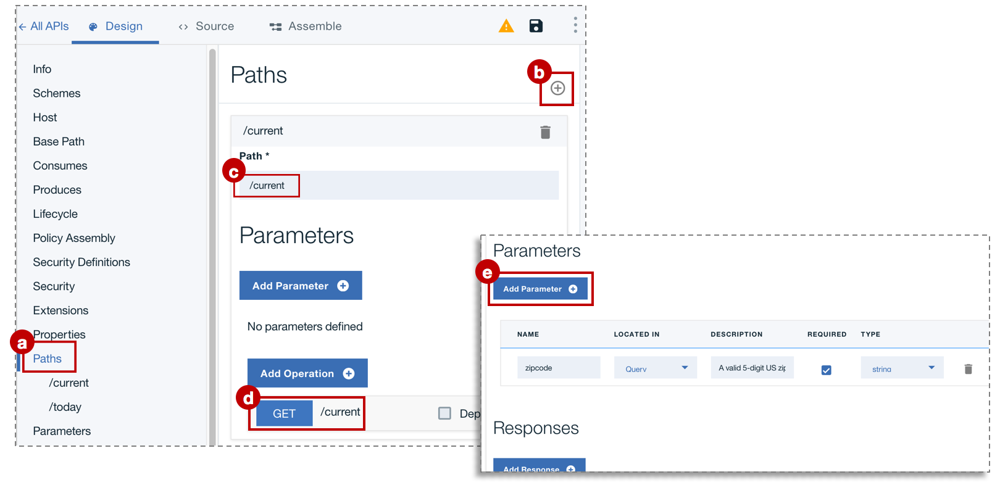
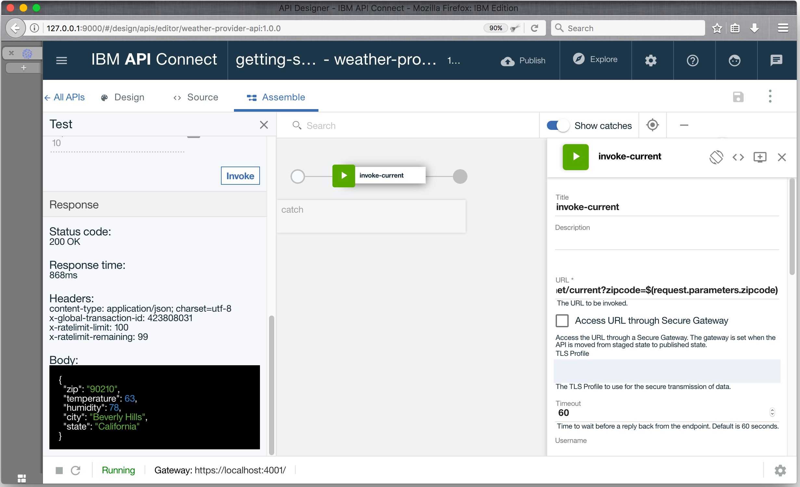

---
copyright:
  years: 2017
lastupdated: "2017-11-02"
---

{:new_window: target="blank"}
{:shortdesc: .shortdesc}
{:screen: .screen}
{:codeblock: .codeblock}
{:pre: .pre}

# Ajout d'une nouvelle spécification d'API et appel d'un service REST existant à l'aide du kit d'outils de développement
**Durée**: 15 mn  
**Niveau de compétence** : Débutant  

## Objectif
Ce tutoriel vous aide à démarrer rapidement avec {{site.data.keyword.apiconnect_full}} en vous montrant comment passer une API existante sous contrôle de gestion. Vous commencerez par créer une nouvelle spécification OpenAPI puis à créer un proxy d'API passe-système pour un service REST existant.

## Prérequis
Avant de commencer, vous devez [configurer votre instance API Connect](tut_prereq_set_up_apic_instance.html) et [installer le kit d'outils API Connect](tut_prereq_install_toolkit.html).

---


## Exploration du modèle d'application et test des noeuds finaux cible
Un modèle d'application _weather provider_ a été créé pour ce tutoriel.
1. Pour explorer l'application, accédez à [http://gettingstartedweatherapp.mybluemix.net/ ](http://gettingstartedweatherapp.mybluemix.net/){:new_window}.  
2. Entrez un code postal américain en 5 chiffres valide pour en obtenir la _**météo actuelle**_ et les _**prévisions du jour**_.  


3. Le modèle d'application de météo ci-dessus a été généré à l'aide d'API qui fournissent des données météorologiques. Le noeud final permettant d'obtenir les données météorologiques **en cours** est _**https:// myweatherprovider<span></span>.mybluemix.net/current?zipcode={zipcode}**_. Testez-le en accédant à [https://myweatherprovider.mybluemix.net/current?zipcode=90210 ](https://myweatherprovider.mybluemix.net/current?zipcode=90210){:new_window}.  

  

4. De même, le noeud final permettant d'obtenir les données prévisionnelles **d'aujourd'hui** est `https:// myweatherprovider<span></span>.mybluemix.net/today?zipcode={zipcode}`. Testez-le en accédant à [https://myweatherprovider.mybluemix.net/today?zipcode=90210 ](https://myweatherprovider.mybluemix.net/today?zipcode=90210){:new_window}.  

  

---

## Ajout d'une nouvelle spécification OpenAPI et appel d'un service REST existant
1. Lancez le **concepteur d'API**. Sur votre terminal, entrez `apic edit`.
2. Connectez-vous à l'aide de votre IBMid.
    
3.   Dans le concepteur d'API, vérifiez que le panneau de navigation est ouvert. S'il ne l'est pas, cliquez sur >> pour l'ouvrir. Dans le panneau de navigation du **concepteur d'API**, sélectionnez **Brouillons > API**.
4. Dans le panneau **API**, sélectionnez **Ajouter > Nouvelle API**.
5. Dans la fenêtre Nouvelle API, entrez "API Weather Provider" comme titre. _Les zones Nom et Chemin de base sont automatiquement renseignées_.  
     
6. Cliquez sur **Créer une API** pour terminer la procédure de l'assistant.  

7. Une fois l'API créée, l'onglet **Conception** est sélectionné.

8. Faites défiler jusqu'au panneau **Hôte**. Entrez la valeur `$(catalog.host)` si la zone n'est pas automatiquement renseignée.

9. Faites défiler jusqu'à l'onglet **Sécurité** et supprimez "clientIDHeader (API Key)", clé d'API automatiquement générée.  
_(Nous traiterons de la sécurité avec les clés d'API dans le prochain tutoriel.)_  

10. Dans le panneau **Chemins**, créez un nouveau chemin en cliquant sur **+**.
  a. Nommez le nouveau chemin **/current**".  
  b. Dans le même panneau **Chemins**, sélectionnez la section **GET /current**.  
  c. Dans la section **GET /current**, ajoutez un nouveau **paramètre**. Comme vous l'avez remarqué lors de l'étude du modèle d'application, le service météo nécessite un paramètre code postal.
      - Nom : code postal  
      - Situé dans : requête  
      - Obligatoire : oui  
      - Type : chaîne  
    
  d. Sauvegardez votre API.

11. Une fois les paramètres de requête définis à l'étape précédente, vous devez définir l'objet réponse renvoyé lorsque vous appelez l'API weather. Pour ce faire, faites défiler vers le bas jusqu'au panneau **Définitions**.

  1. Ajoutez une nouvelle définition. 
  2. Nommez cette définition _Current_.
  3. Définisse le type sur _Object_.
  4. Ajoutez de nouvelles propriétés pour la définition **Current**.
    - Nom : zip         /  Type : chaîne
    - Nom : température /  Type : entier
    - Nom : humidité    /  Type : entier
    - Nom : ville        /  Type : chaîne
    - Nom : état      /  Type : chaîne
    
  5. Sauvegardez votre API.  

12. A l'étape précédente, vous avez défini l'objet réponse. Vous devez ensuite vous assurer que cet objet réponse est associé au chemin **get /current**. Dans le panneau de navigation, faites défiler vers le haut jusqu'au panneau **Chemins**.
  a. Ouvrez l'opération **GET /current** et faites défiler jusqu'à la section **Réponses**.
  b. Modifiez le schéma de réponse 200OK de "object" en "**Current**".
  c. Sauvegardez votre API.

13. Le chemin et l'opération que vous venez de créer visent à obtenir les données météorologiques en cours. Vous devez maintenant créer un chemin et une opération similaires pour obtenir les données météorologiques d'aujourd'hui. Comme vous avez créé le chemin **/current** à l'étape 11, créez un nouveau chemin **/today**. 

14. Ajoutez un nouveau paramètre sous l'opération **GET /today**.
    - Nom du paramètre : code postal  
    - Situé dans : requête  
    - Obligatoire : oui  
    - Type : chaîne  

15. Créez une nouvelle définition **Today**.

16. Ajoutez de nouvelles propriétés pour la définition **Today**.
  - Nom : zip / Type : chaîne
  - Nom : ha / Type : entier
  - Nom : ba / Type : entier
  - Nom : humidité nuit / Type : entier
  - Nom : humidité jour / Type : entier
  - Nom : ville / Type : chaîne
  - Nom : état / Type : chaîne

17. Mettez à jour le schéma de réponse dans la section **GET /today** avec "Today".

18. Sauvegardez votre API.

19. Basculez sur l'onglet **Assembler**. Jusqu'à présent, vous avez créé deux opérations : **GET /current** et **GET /today**. Pour vous assurer que le noeud final cible approprié est appelé, vous devez créer une logique qui exécute des actions conditionnelles sur l'opération appelée. Pour ce faire, utilisons la construction logique **Permutation d'opération**.  

    a. Supprimez la stratégie **invoke** qui a peut-être été ajoutée au _canevas_.  
    b. Depuis la _palette_, faites glisser la logique **Permutation d'opération** et déposez-la sur le canevas.  
      - Affectez au cas **case 0** l'opération **get /current**.
      - Ajoutez un nouveau cas : **case 1**.
      - Affectez l'opération **get /today** au cas **case 1**.
    
    La logique **Permutation d'opération** fournit un point de décision. Sur la base de la paire verb/path, l'opération appropriée doit être appelée.  
    c. Faites glisser la stratégie **invoke** depuis la palette et déposez-la sur le canevas. Déposez une stratégie invoke dans le chemin **/get current** et une dans le chemin **/get today**.
    d. Sélectionnez la stratégie **invoke** dans le chemin **/get current** et mettez à jour son titre avec "**invoke-current**".  
    e. Mettez à jour la zone URL avec : `https://myweatherprovider.mybluemix.net/current?zipcode=$(request.parameters.zipcode)`.
    f. Sélectionnez la stratégie **invoke** dans le chemin **/get today** et mettez à jour son titre avec "**invoke-today**".  
    g. Mettez à jour la zone URL avec : `https://myweatherprovider.mybluemix.net/today?zipcode=$(request.parameters.zipcode)`.  

20. Sauvegardez votre API.

---

## Test du proxy de votre API

### Test avec l'_outil de test du gestionnaire d'API_.
1. Démarrez le serveur de test local en cliquant sur l'icône de démarrage des serveurs (>) en bas à gauche de la fenêtre du concepteur. Une fois la passerelle démarrée, vous verrez que le statut est automatiquement mis à jour sur Exécution en cours.

    

2. Dans l'onglet **Assembler**, cliquez sur l'icône de lecture (>) pour tester l'appel de la cible du proxy de votre API. _Etant donné que pour ce tutoriel nous utiliserons la passerelle Micro Gateway imbriquée, vous devez vous assurer que Règles Micro Gateway est sélectionné._

    

3. Dans le panneau de test, sélectionnez l'opération **get /current**.  
  a. Le paramètre zipcode étant nécessaire pour cette opération, entrez un code postal américain valide (par exemple, 90210).  
  b. Cliquez sur **invoke** et observez les informations qui s'affichent :
  ```
  200 OK response
  Current weather data for 90210  
  ```
      

_Si vous obtenez une erreur CORS, suivez les instructions fournies dans le message d'erreur. Cliquez sur le lien fourni pour ajouter l'exception à votre navigateur et appuyez ensuite de nouveau sur le bouton "invoke"._

### Test avec l'_outil Explorer_.  
1. Pour tester les noeuds finaux du proxy de votre API, sélectionnez _Explorer_.
2. Sélectionnez l'opération **GET /current** dans la palette.
3. Entrez un code postal américain valide (par ex. 90210) dans la zone de test.
4. Cliquez sur **Appeler une opération** pour afficher la réponse.  
    
  
---

## Conclusion
Dans ce tutoriel, vous avez vu comment appeler un service REST existant à l'aide d'un proxy passe-système d'API. Vous avez commencé par vérifier la disponibilité de l'exemple de service via le navigateur Web. Puis vous avez créé une nouvelle spécification OpenAPI dans {{site.data.keyword.apiconnect_short}} que vous avez liée à l'exemple de service à appeler. Enfin, vous avez testé le proxy de l'API à l'aide de l'outil de test intégré.

---

## Etape suivante

Sécurisation de votre API à l'aide d'une [limitation de débit](tut_rate_limit.html), d'un [ID et d'une valeur confidentielle client](tut_secure_landing.html) ou [sécurisation à l'aide de OAuth 2.0](tut_secure_oauth_2.html).

Création > **Gestion** > Sécurisation > Réseaux sociaux > Analyse

