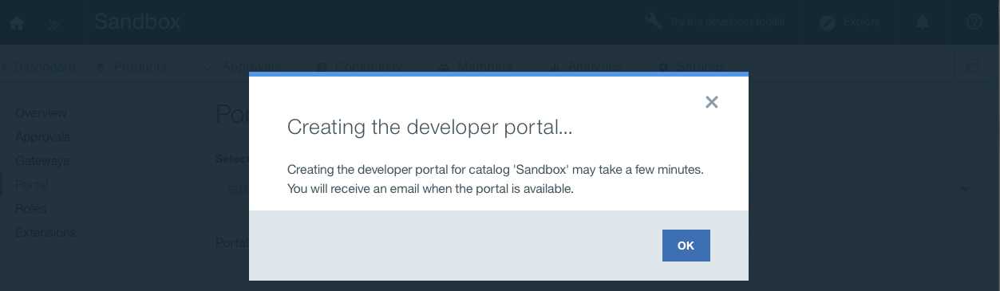

---

copyright:
  years: 2017
lastupdated: "2017-10-31"

subcollection: apiconnect

keywords: IBM Cloud, APIs, lifecycle, catalog, manage, toolkit, develop, dev portal, tutorial

---

{:new_window: target="blank"}
{:shortdesc: .shortdesc}
{:screen: .screen}
{:codeblock: .codeblock}
{:pre: .pre}

# Création et configuration de votre portail de développeur
{: #tut_config_dev_portal}

**Durée** : 30 mn  
**Niveau de compétence** : Débutant  

## Objectif
{: #object_tut_config_dev_portal}

Ce tutoriel vous aidera à commencer rapidement à configurer votre **portail de développeur API Connect**. 

## Prérequis
{: #prereq_tut_config_dev_portal}

Avant de commencer, vous devez [importer votre spécification d'API et passer par un proxy un service REST existant](/docs/services/apiconnect/tutorials?topic=apiconnect-tut_rest_landing).

---

## Création de votre portail de développeur
{: #create_prereq_tut_config_dev_portal}

Dans cette section, vous allez créer un portail de développeur pour un catalogue.

*Catalogue* est un terme IBM qui désigne différents environnements. Par exemple, vous pouvez créer différents catalogues pour vos environnement de test, de transfert et de production. Vous devez disposer d'un catalogue de bac à sable. N'hésitez pas à utiliser ce catalogue pour créer votre portail de développeur ou bien créez un nouveau catalogue que vous nommez comme il vous convient.

1. Dans le tableau de bord {{site.data.keyword.Bluemix_short}}, sélectionnez le service **API Connect** pour lancer le tableau de bord {{site.data.keyword.apiconnect_short}}. 

2. Dans le tableau de bord {{site.data.keyword.apiconnect_short}}, sélectionnez le catalogue pour lequel vous voulez créer un portail de développeur. Par exemple, **Bac à sable**.

3. Dans le catalogue, sélectionnez l'onglet **Paramètres**.  
  

4. Dans l'onglet Paramètres, sélectionnez **Portail**.  
  

5. Sur la page Configuration de portail, sélectionnez **IBM Developer Portal** dans le menu déroulant Sélectionner le portail.
   

6. Notez l'adresse URL **URL du portail**, puis sauvegardez vos modifications.  
  
  
7. Comme indiqué dans la boîte de dialogue, la création du portail de développeur prend quelques minutes. Vous recevrez un courrier électronique lorsque l'opération sera terminée. Sélectionnez **OK** pour accuser réception du message.  
  

---

## Exploration de votre portail de développeur
{: #explore_prereq_tut_config_dev_portal}

Dans cette section, vous allez vous familiariser avec le portail de développeur que vous avez créé précédemment.

1. Une fois le portail de développeur configuré pour votre catalogue, vous recevez un courrier électronique contenant un lien de connexion à usage unique. Cliquez sur ce lien pour lancer le portail de développeur.

2. Sélectionnez **Connexion** pour vous connecter au portail de développeur.

3. Entrez un nouveau mot de passe et cliquez sur **Sauvegarder**.  
  

4. Maintenant que vous avez défini le mot de passe, explorons le portail de développeur, en commençant par **Accueil**, affiché en haut de la page.  
  
  
| Onglet              | Description          | 
|:---------------- | -------------------- | 
| _Accueil_       | La page Accueil est la page de bienvenue dans votre portail de développeur. Vous pouvez [personnaliser la page](/docs/service/apiconnect/tutorials?topic=apiconnect-tut_custom_dev_portal) pour l'adapter à vos besoins. | 
| _Initiation_       | La page Initiation est utilisée pour expliquer aux développeurs comment commencer à utiliser votre portail de développeur. |
| _Produits d'API_ | Les développeurs utilisent la page Produits d'API pour explorer les API disponibles sur votre portail et s'y abonner. | 
| _Applications_ | La page Applications affiche les applications qui utilisent vos API. | 
| _Blogues_ | La page Blogues est celle dans laquelle vous pouvez créer et afficher des articles de blogue concernant vos API. | 
| _Forums_ | La page Forums est celle dans laquelle les développeurs peuvent discuter et poster des questions concernant vos API. | 
| _Support_ | La page Support est celle dans laquelle vous pouvez indiquer aux développeurs comment recevoir une assistance concernant vos API. Par exemple, les renvoyer à des forums et des foires aux questions. Vous pouvez également fournir un lien leur permettant, au besoin, d'ouvrir un ticket de demande de service. | 

Remarque : Sur la page Produits d'API, vous pouvez sélectionner un produit pour afficher la page Produit d'une API et les plans disponibles. Elle permet aux développeurs de s'abonner à des API et d'en afficher les détails. 

  

### Conclusion
{: #conclusion_prereq_tut_config_dev_portal}

Dans ce tutoriel, vous avez appris à créer et à configurer votre portail de développeur {{site.data.keyword.apiconnect_short}}. Vous avez également exploré le portail de développeur.

---

## Etape suivante
{: #next_prereq_tut_config_dev_portal}

[Personnalisation de votre portail de développeur et sélection d'un thème](/docs/services/apiconnect/tutorials?topic=apiconnect-tut_custom_dev_portal).

Création >Gestion> Sécurisation > ** Réseaux sociaux ** > Analyse
