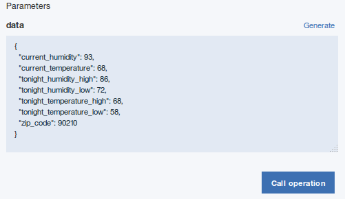

---

copyright:
  years: 2018
lastupdated: "2018-02-22"

---


{:new_window: target="_blank"}
{:shortdesc: .shortdesc}
{:screen: .screen}
{:codeblock: .codeblock}
{:pre: .pre}


# Création d'une API dans Node.js

**Durée** : 20 mn  
**Niveau de compétence** : Débutant  

---
## Objectif

Ce tutoriel vous guidera tout au long du processus de création d'une API dans Node.js à l'aide de l'infrastructure LoopBack. Il décrit comment :
1. Créer un nouveau projet LoopBack.
2. Ajouter une nouvelle source de données et un nouveau modèle à un projet LoopBack à l'aide du concepteur d'API dans le kit d'outils {{site.data.keyword.apiconnect_full}}.
3. Tester vos noeuds finaux d'API à l'aide de l'outil Explorer du concepteur d'API.

---
## Prérequis

Avant de commencer, [installez le kit d'outils {{site.data.keyword.apiconnect_short}}](tut_prereq_install_toolkit.html). Si le kit d'outils est déjà installé, assurez-vous d'exécuter la version 5.0.8.1 ou une version ultérieure. Pour le vérifier, entrez la commande suivante à partir de la ligne de commande :
	```
	apic -v
	```

---
## Créer un
projet Loopback

Vous pouvez créer un projet Loopback avec l'interface de ligne de commande du kit d'outils pour développeur {{site.data.keyword.apiconnect_short}} ou avec l'interface du concepteur d'API. 
 
### Création d'un projet LoopBack avec l'interface de ligne de commande du kit d'outils

Pour créer un projet LoopBack à l'aide de l'interface de ligne de commande du kit d'outils {{site.data.keyword.apiconnect_short}}, procédez comme suit :
1.  Dans l'interface de ligne de commande, entrez la commande suivante. Elle permet de créer et de gérer des applications LoopBack.
	```bash 
	apic loopback
	```
	>![info]
	>Pour ce tutoriel, vous créerez un projet nommé weather-data.
2.  A l'invite, entrez `weather-data` comme nom de projet et appuyez sur **Entrée**.
	```bash
	? Quel est le nom de votre application ? weather-data
	```
  	>![important]
  	>En général, un nom de projet peut contenir tout caractère sauf espace (" "), barre oblique ("/"), perluète ("&"), arobase ("@"), signe plus ("+"), pourcentage ("%"), et signe deux-points (":").
3.  Entrez le nom du répertoire dans lequel le projet doit être créé. Appuyez sur **Entrée** pour utiliser un répertoire de même nom que le projet ou entrez un autre nom et appuyez sur **Entrée**.
	```bash
	? Entrez le nom du répertoire qui contiendra le projet : weather-data
	```
4.  Sélectionnez la version de LoopBack à utiliser. Sélectionnez la version de production actuelle : 3.x.
	```bash
	? Quelle version de LoopBack voulez-vous utiliser ? 
  	2.x (support à long terme) 
	? 3.x (actuelle) 
	```
5.  Indiquez le type d'application que vous voulez créer en sélectionnant **empty-server** à l'aide des touches fléchées.
	```bash
	? Quel type d'application avez-vous en tête ? (Utilisez les touches fléchées)
	? empty-server (API LoopBack vide, sans aucun modèle ou source de données configuré(e))
  	hello-world (Projet contenant un exemple de base, incluant une base de données de mémoire)
  	notes (Projet contenant un exemple de base, incluant une base de données de mémoire)
	```
6.  Appuyez sur **Entrée** pour créer une API LoopBack vide. 

L'outil affiche un certain nombre de messages à mesure qu'il crée le répertoire du projet et y ajoute des répertoires et des fichiers. Il exécute également npm install pour installer toutes les dépendances du projet, telles que spécifiées dans package.json. Ce processus crée un répertoire node_modules et peut prendre un certain temps.

Un projet LoopBack vide contient les répertoires suivants :
- server : contient des définitions de modèle de serveur et de source de données ainsi que du code de serveur
- definitions : contient des fichiers de définition YAML
- node_modules : créé par node.js


### Création d'un projet LoopBack avec l'interface du concepteur d'API

Pour créer un projet LoopBack à l'aide de l'interface du concepteur d'API, procédez comme suit :
1.  Dans l'interface de ligne de commande, entrez la commande suivante pour démarrer le concepteur d'API :
	```bash
	apic edit
	```
	
	>![info]
	>La commande ci-dessus initialise le kit d'outils {{site.data.keyword.apiconnect_short}} et lance le concepteur d'API (API Designer) dans le navigateur par défaut une fois démarré.
 >![info]
	>Dans ce tutoriel, vous créerez un projet nommé weather-data.
2.  Si vous n'avez pas encore épinglé le panneau de navigation de l'interface utilisateur, cliquez sur l'icône Accéder à . Le panneau de navigation de l'interface utilisateur du gestionnaire d'API s'ouvre. Pour épingler le panneau de navigation de l'interface utilisateur, cliquez sur l'icône Epingler le menu .
3.  Dans la barre de navigation, cliquez sur l'icône Plus en regard de Projets .
4.  Cliquez sur **Créer un projet Loopback**. La boîte de dialogue **Ajouter un nouveau projet LoopBack** s'affiche.
5.  Sélectionnez **empty-server** comme modèle de projet.
6.  Pour **Version LoopBack**, sélectionnez version 3.x (version actuelle).
7.  Entrez `weather-data` dans les zones Nom d'affichage et Nom.
8.  Pour **Répertoire de projet**, sélectionnez le dossier `weather-data` créé à l'étape 1 en cliquant sur le bouton **Parcourir**.
	
9. Cliquez sur **Ajouter** pour ajouter le projet.
	>![info]
	>L'outil affiche un certain nombre de messages dans la fenêtre **Ajouter un nouveau projet LoopBack** à mesure qu'il crée le répertoire du projet et y ajoute des répertoires et des fichiers. Il exécute également npm install pour installer toutes les dépendances du projet, telles que spécifiées dans package.json. Ce processus crée un répertoire node_modules et peut prendre un certain temps.
	
	>Un projet LoopBack vide contient les répertoires suivants :
	- server : contient des définitions de modèle de serveur et de source de données ainsi que du code de serveur
	- definitions : contient des fichiers de définition YAML
	- node_modules : créé par node.js
10. Cliquez sur **Terminé** pour fermer la boîte de dialogue **Ajouter un nouveau projet LoopBack**.
11. Quittez le **concepteur d'API** en revenant sur la ligne de commande de l'étape 1 et en entrant `Ctrl + C`. Entrez `O` pour confirmer la sortie.
12. Fermez la session de navigation.

---
## Ajout d'une nouvelle source de données et d'un nouveau modèle

Pour ajouter un nouveau modèle et une nouvelle source de données à un projet LoopBack à l'aide du concepteur d'API, procédez comme suit :

### Ajout d'une source de données
Pour ajouter une nouvelle source de données à un projet LoopBack à l'aide du concepteur d'API, procédez comme suit.
1. Vous devez également créer un projet LoopBack (le projet "weather-data") comme indiqué dans `Création d'un projet LoopBack avec l'interface de ligne de commande` et vous assurer que le répertoire de travail en cours est le répertoire racine du projet :
	```bash
	cd weather-data
	```
2. Sur la ligne de commande, entrez la commande suivante :
	```bash
	apic edit
	```
	Au bout d'un court délai, la console affiche le message suivant :
	```bash
	Le serveur Express est à l'écoute sur http://127.0.0.1:9000
	```
	Le concepteur d'API s'ouvre dans votre navigateur Web par défaut, sur la page de connexion si vous ne vous êtes pas récemment connecté.  
	>![info]
	>Vous pouvez vous connecter à l'aide de votre compte {{site.data.keyword.Bluemix}} ou créer un compte.
3. Cliquez sur l'icône **Sources de données** .
4. Cliquez sur **Ajouter**. La fenêtre Nouvelle source de données LoopBack s'ouvre.
5. Entrez `weatherDS` dans la zone de texte **Nom**.
	>![info]
	>Dans un nom de source de données, vous pouvez utiliser tous les caractères alphanumériques, ainsi que les tirets et les traits de soulignement.
6. Cliquez sur **Nouveau**.
7. Par défaut, le paramètre **Connecteur** indique **Base de données en mémoire** et les autres paramètres
sont
vides. Pour le moment, conservez les paramètres par défaut ; le concepteur d'API sauvegarde automatiquement la nouvelle source de données.
	>![info]
	>La source de données en mémoire est intégrée à LoopBack et ne convient qu'au développement et aux tests initiaux. Lorsque vous êtes prêt à connecter vos modèles à une source de données réelle tel un serveur de base de données, modifiez le paramètre **Connecteur** en conséquence et installez le connecteur de source de données en suivant les instructions fournies dans [Installation des connecteurs LoopBack](https://www.ibm.com/support/knowledgecenter/SSMNED_5.0.0/com.ibm.apic.toolkit.doc/tapim-connector-install.html#task_i2p_dnw_vv){:new_window}. Entrez les paramètres de connecteur (nom d'hôte, port, nom de base de données, nom d'utilisateur, mot de passe) appropriés pour votre type de connecteur, puis cliquez sur l'icône **Sauvegarder** . Le concepteur d'API teste automatiquement la connexion à la source de données. Si le test aboutit, le message **Opération réussie - Le test de la connexion à la source de données a abouti** est affiché.
8. Cliquez sur l'icône Tester la connexion  pour tester la connexion à la source de données. Le message "Le test de la connexion à la source de données a abouti" s'affiche.
9. Cliquez sur **Toutes les sources de données**. La source de données apparaît dans la liste des sources de données et l'éditeur met à jour le fichier server/datasources.json avec les paramètres de la nouvelle source de données.

### Ajout d'un modèle

Pour ajouter un nouveau modèle à un projet LoopBack à l'aide du concepteur d'API, procédez comme suit :
1. Cliquez sur l'icône **Modèles** .
2. Cliquez sur **Ajouter**. La fenêtre Nouveau modèle LoopBack s'ouvre.
3. Entrez `weather` dans la zone de texte **Name**, puis cliquez sur **Nouveau**.
4. Dans la zone **Source de données**, sélectionnez **weatherDS**.	
5. Dans **Propriétés**, cliquez sur l'icône **Ajouter une propriété** .
6. Dans la zone de texte **Nom de la propriété**, entrez `zip_code`.
7. Pour **Type**, sélectionnez **number**.
8. Sélectionnez **Obligatoire** pour que la propriété soit requise. Cela signifie qu'elle doit posséder une valeur lorsque vous ajoutez
ou mettez à jour une instance de modèle. 
9. Sélectionnez **ID** pour vérifier que la propriété possède un identificateur unique. Pour le moment, conservez les valeurs par défaut pour les autres paramètres :
	- **Est un tableau** : indique que la propriété est un tableau JavaScript comportant des éléments du type spécifié.
	- **Index** : indique que la propriété représente une colonne (zone) qui est un index de base de données.
	- **Description** : description de la propriété.
9. Cliquez de nouveau sur l'icône **Ajouter une propriété**  pour ajouter une autre propriété. Reportez-vous au tableau suivant pour renseigner les propriétés restantes : 	
10. Cliquez sur l'icône **Sauvegarder**  pour sauvegarder vos modifications.
11. Cliquez sur **Tous les modèles** pour terminer l'édition du modèle.

Une nouvelle source de données et un nouveau modèle ont été ajoutés au projet LoopBack weather-data.

---

## Test du projet LoopBack

>![info]
	>Vous pouvez passer directement à l'étape 2 ci-dessous si vous n'avez pas quitté le concepteur {{site.data.keyword.apiconnect_short}} après avoir effectué les étapes de la section "Ajout d'une nouvelle source de données et d'un nouveau modèle".
	
Pour tester vos noeuds finaux d'API à l'aide de l'outil Explorer du concepteur d'API, procédez comme suit :
1. Sur la ligne de commande, entrez la commande suivante :
	```bash
	apic edit
	```
	Au bout d'un court délai, la console affiche le message suivant :
	```bash
	Le serveur Express est à l'écoute sur http://127.0.0.1:9000
	```
	Le concepteur d'API s'ouvre dans votre navigateur Web par défaut, sur la page de connexion si vous ne vous êtes pas récemment connecté.
	
2. Démarrez les serveurs de test locaux.
	a. Au bas de l'écran de la console de test, cliquez sur l'icône **Démarrer les serveurs** icon :
	
	b. Attendez que le message Exécution en cours s'affiche :
	

	>![info]
	>En fonction de la configuration de votre projet et selon que d'autres processus sont en cours d'exécution ou non, d'autres numéros de port peuvent s'afficher.
3. Cliquez sur **http://127.0.0.1:port_number** pour afficher le noeud final racine de l'API. Pour le projet LoopBack par défaut (vide ou hello-world), un message semblable au suivant s'affiche :
	```bash
	{"started":"2017-05-24T19:21:47.807Z","uptime":80.876}
	```
	>![info]
	>Pour arrêter votre projet, cliquez sur l'icône **Arrêter les serveurs** :
	>
	
	>Pour le redémarrer, cliquez sur l'icône **Redémarrer les serveurs** :
	>
	
4. Cliquez sur l'icône **Explorer**  pour afficher l'outil Explorer du concepteur d'API. La barre latérale affiche toutes les opérations REST des modèles LoopBack dans l'API. Les modèles, qui sont basés par défaut sur PersistedModel, ont une [série standard d'opérations de création, lecture, mise à jour et suppression ](http://loopback.io/doc/en/lb2/PersistedModel-REST-API){:new_window}.

5. Cliquez sur l'opération **weather.create** dans le panneau de gauche pour afficher le noeud final.

Le panneau central affiche des informations récapitulatives sur le noeud final, y compris ses paramètres, la sécurité, les données d'instance de modèle et les codes de réponse. Le panneau de droite fournit le code du modèle permettant d'appeler le noeud final à l'aide de la commande curl ainsi que les langages tels que Ruby, Python, Java et Node.

6. Pour tester les noeuds finaux REST à l'aide de l'outil Explorer du concepteur d'API (API Designer), procédez comme suit :
    1. Dans le panneau de droite, cliquez sur **Essayer**. S'il existe un élément de données `id`, supprimez-le des données générées avant d'exécuter le test. 
	
	2. Faites défiler jusqu'à **Paramètres** et cliquez sur **Générer** pour générer des données factices. Par défaut, les données générées incluent les propriétés `zip_code`, `current_temperature`, `current_humidity`, `tonight_temperature_low`, `tonight_temperature_high`, `tonight_humidity_low` et `tonight_humidity_high`.
	
	3. Cliquez sur **Appeler une opération**.
	
	
>![traitement des incidents]
>Si un message d'erreur relatif à un certificat non sécurisé pour un hôte local s'affiche, cliquez sur le lien fourni dans le message d'erreur dans l'outil Explorer du concepteur d'API pour accepter le certificat, puis procédez à l'appel des opérations dans votre navigateur Web. La procédure exacte dépend du navigateur Web que vous utilisez. Si vous chargez les noeuds finaux REST directement dans votre navigateur, le message suivant s'affiche : {"name":"PreFlowError","message":"unable to process the request"}. Vous devez utiliser l'outil Explorer du concepteur d'API pour tester les noeuds finaux REST dans votre navigateur car il contient les en-têtes prérequis ainsi que d'autres paramètres de demande.
>
>![traitement des incidents]
>Si vous obtenez un code de réponse **422 - Unprocessable Entity** avec le contenu suivant :
>
>
>assurez-vous que tous les éléments de données `id` ont été supprimés des données générées. S'il existe un élément ID, supprimez-le et réexécutez le test.
>![traitement des incidents]
>Si vous obtenez l'erreur **failed to parse request body**, vous devez supprimer la virgule qui suit le dernier nombre `humidity_high`.
7. Editez les valeurs dans le JSON de la section **data**. Essayez de modifier les données factices générées, puis cliquez de nouveau sur **Appeler une opération**. Vous devez voir les paramètres de demande et de réponse accompagnés des données d'instance JSON que vous avez entrées.


8. Pour confirmer que l'opération a ajouté une instance de modèle, cliquez sur **weather.find**. Cliquez sur **Appeler une opération** pour afficher toutes les instances weather. Par exemple (avec deux
instances de modèle) :

	
---

### Tâches exécutées dans ce tutoriel
Dans ce tutoriel, vous avez :
1. Créé un nouveau projet LoopBack à l'aide de la ligne de commande du kit d'outils {{site.data.keyword.apiconnect_short}}.
2. Ajouté un nouveau modèle et une nouvelle source de données à un projet LoopBack à l'aide du concepteur d'API dans le kit d'outils {{site.data.keyword.apiconnect_short}}.
3. Testé vos noeuds finaux d'API à l'aide de l'outil Explorer du concepteur d'API.


---

## Etape suivante

[Gestion d'un service REST](tut_rest_landing.html) ou [Gestion d'un service SOAP](tut_manage_soap_api.html).

Création > **Gestion** > Sécurisation > Réseaux sociaux > Analyse

 
[important]: ./images/important.png "Important"
[info]: ./images/info.png "Informations"
[troubleshooting]: ./images/troubleshooting.png "Traitement des incidents" 

