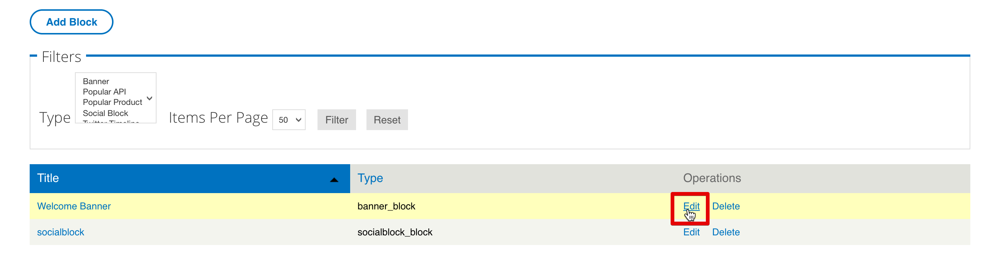

---
copyright:
  years: 2017
lastupdated: "2017-10-31"
---

{:new_window: target="blank"}
{:shortdesc: .shortdesc}
{:screen: .screen}
{:codeblock: .codeblock}
{:pre: .pre}

# Personnalisation de votre portail de développeur et sélection d'un thème
**Durée** : 30 mn  
**Niveau de compétence** : Débutant  

## Objectif
Ce tutoriel vous apprendra à personnaliser rapidement votre portail de développeur {{site.data.keyword.apiconnect_full}} et à sélectionner un thème adapté à vos besoins.

---

## Prérequis

Avant de commencer ce tutoriel, vous devez avoir finalisé le tutoriel [Installation et configuration de votre portail de développeur](tut_config_dev_portal.html) et être connecté en tant qu'administrateur du portail.

---

## Personnalisation de votre portail de développeur
Une fois votre portail de développeur créé, vous devez personnaliser sa présentation générale.

1. Commençons par modifier la bannière de bienvenue. Dans le menu du haut, sélectionnez **Contenu**, puis **Blocs**.  
  

2. Sélectionnez **Editer** dans le bloc **Bannière de bienvenue**.  
  

3. Sous l'en-tête Contenu, vous pouvez modifier le texte et l'image du contenu de la bannière de bienvenue en entrant du texte dans l'éditeur de contenu ou en sélectionnant l'icône Edit HTML Source pour éditer ou coller directement du HTML qui définit les spécifications de l'image et du texte.  
   

4. Ajoutons également une image à notre écran d'accueil. Faites défiler jusqu'à l'en-tête Image. Cherchez une image à utiliser en arrière-plan et sauvegardez-la dans un fichier au format approprié (png, gif, jpg ou jpeg). Si vous ne disposez d'aucune image, vous pouvez utiliser [celle-ci](images/Cloudy_Day.png). Cliquez sur **Choisir un fichier** et parcourez vos répertoires pour trouver votre image d'arrière-plan. Une fois l'image sélectionnée, cliquez sur **Upload**.  
  

5. Une fois téléchargée, l'image s'affiche. Si vous voulez la supprimer, cliquez sur **Supprimer**.  
  
 
6. Au bas de la page, cliquez sur **Sauvegarder** pour sauvegarder vos modifications.  
  
---

## Personnalisation du thème de votre portail de développeur
Le portail de développeur vous permet de modifier le thème afin de changer sa présentation.

1. Pour modifier le thème, sélectionnez **Apparence** dans le menu du haut, puis sélectionnez **Paramètres** et ensuite **Thème IBM API Connect**. Il s'agit du thème par défaut défini lorsque vous avez créé votre portail de développeur.
   

2. L'onglet **Standard Layout** permet de modifier la présentation pour les périphériques à grand écran, tels les ordinateurs de bureau. L'onglet **Tablet Layout** permet de modifier la présentation pour les tablettes. L'onglet **Smalltouch Layout** permet de modifier la présentation pour les périphériques à écran tactile tels les smartphones. Après avoir inspecté ces onglets, sélectionnez **Panels & Gpanels**.
  

3. Outre la modification de la présentation de la barre latérale ci-dessus, le thème par défaut prend en charge l'utilisation des panneaux G, ou panneaux réactifs, si vous installez le module Panels. Pour contrôler la présentation des panneaux sur les périphériques standard, les tablettes et les périphériques à écran tactile, développez les sections et mettez à jour les paramètres.
   

4. D'autres paramètres peuvent être ajustés, mais passons à la suite et sélectionnez **Extensions**. Cet onglet permet d'activer des paramètres supplémentaires pour configurer la mise en forme de votre portail de développeur.  
  

5. Les paramètres des extensions activés sur l'onglet **Extensions** sont modifiables dans la section **Extensions** sous les paramètres principaux.     
  

6. Une fois les modifications de paramètre effectuées, sélectionnez **Sauvegarder la configuration** au bas de la page.

---

## Sélection d'un autre thème pour votre portail de développeur
Le portail de développeur est livré avec un choix de thèmes supplémentaires que vous pouvez personnaliser afin de modifier leur présentation.

1. Pour activer un autre thème, sélectionnez l'onglet **Liste** en haut des paramètres Apparence.
   

2. Les thèmes activés s'affichent en haut de l'onglet **Liste**.
  

3. Une liste des thèmes désactivés s'affiche sous la liste des thèmes activés. Vous pouvez activer in thème en sélectionnant **Activer**   
   

4. Une fois activé, le thème s'affiche en haut de l'onglet **Liste** dans la section **Enabled Themes**. Vous pouvez le personnaliser en sélectionnant **Paramètres**.  
  

5. Après avoir modifié les paramètres, vous pouvez définir le thème comme thème par défaut en sélectionnant **Set Default**.     
  

---

## Installation d'un nouveau thème pour votre portail de développeur
Si la modification d'un thème existant ne répond pas à vos besoins, le portail de développeur vous permet également d'installer un thème pour modifier sa présentation générale.

1. Vous pouvez utiliser des modules ou des thèmes téléchargés depuis [drupal.org ](http://drupal.org){:new_window} pour personnaliser votre portail de développeur ou créer votre propre thème.

2. Pour installer un thème dans le portail de développeur, sélectionnez **Apparence** dans le menu du haut, puis sélectionnez **Install new theme**.  
  

3. Vous pouvez installer des thèmes directement depuis [drupal.org ](http://drupal.org){:new_window} en utilisant une adresse URL ou importer un thème que vous avez téléchargé ou créé en cliquant sur **Choisir un fichier**, puis sur **Installer**.  
   

4. Une fois le téléchargement terminé, vous devez activer le thème. Sélectionnez **Activation des thèmes nouvellement ajoutés**.  
  

5. Faites défiler la liste jusqu'au thème qui vient d'être installé. Sélectionnez **Enable and set default**.  
  

6. Au bas de la page, cliquez sur **Sauvegarder** pour sauvegarder vos modifications.  

---

## Récapitulatif
Bravo, vous avez terminé ce tutoriel. Vous avez appris à :

* Personnaliser la page d'accueil de votre portail de développeur
* Personnaliser le thème qu'utilise votre portail de développeur 
* Sélectionner un autre thème pour votre portail de développeur
* Installation d'un nouveau thème pour votre portail de développeur

---

## Etape suivante

Apprenez [comment un utilisateur navigue dans un portail de développeur](tut_discover_apis.html) ou [comment extraire des connaissances à partir d'analyses basiques](tut_insights_analytics.html).

Création >Gestion> Sécurisation > ** Réseaux sociaux ** > Analyse  

