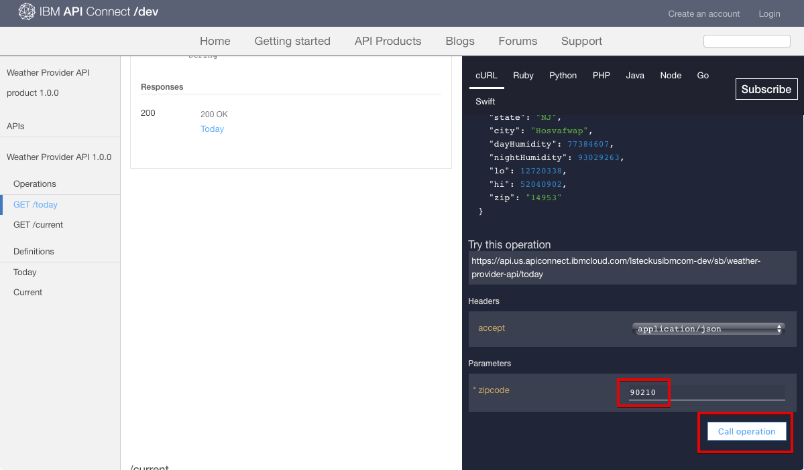

---
copyright:
  years: 2017
lastupdated: "2017-11-20"
---

{:new_window: target="_blank"}
{:shortdesc: .shortdesc}
{:screen: .screen}
{:codeblock: .codeblock}
{:pre: .pre}

# Découverte des API
**Durée** : 25 mn  
**Niveau de compétence** : Débutant  

## Prérequis
Ce tutoriel ne nécessite aucun prérequis. En tant qu'administrateur du portail, vous pouvez également mener à bien ce tutoriel tout en naviguant dans le portail de développeur pour observer comment les utilisateurs naviguent dans votre portail. N'oubliez pas tous les portails de développeur ont une apparence différente. 

Si vous ne disposez pas d'un portail de développeur existant, vous pouvez en installer et en configurer un dans {{site.data.keyword.Bluemix_short}} avant de lancer ce tutoriel.

## Objectif
Dans ce tutoriel, vous apprendrez comment un utilisateur de portail peut consommer les API dans le portail de développeur {{site.data.keyword.apiconnect_full}}. 
Vous comprendrez comment un utilisateur de portail explore des produits et des API, affiche et teste des API et s'abonne à des
API. 

## Exploration des produits & des API
Cette section montre comment un utilisateur de portail explore les produits et les API dans le portail de développeur.

1. Dans un navigateur, accédez à votre **portail de développeur API Connect**. 

2. Dans le portail de développeur {{site.data.keyword.apiconnect_short}}, sélectionnez l'onglet Produits d'API. 

3. Sélectionnez l'un des produits d'API disponibles pour afficher les API et plans disponibles pour le produit.  
  

4. Sélectionnez une API afin d'explorer les détails des API disponibles.  
  

5. La page des détails d'une API affiche les opérations disponibles accompagnées de leurs paramètres et des réponses renvoyées. Au bas de la page, sont indiquées les définitions qu'utilise l'API.  
   

6. Le panneau Code examples répertorie des exemples, dans différents langages de codification, d'appels de requête et de leurs réponses. Sélectionnez l'un des exemples, par exemple, **Node**, pour afficher un exemple dans ce langage de codification.  
   

---

## Affichage et test des API
Cette section montre comment un utilisateur de portail affiche et teste les API disponibles pour un produit. 

1. Accédez aux détails d'API dans le portail de développeur {{site.data.keyword.apiconnect_short}} comme indiqué dans la section précédente.  
   

2. Vous pouvez télécharger et afficher les informations du fichier YAML Swagger des API en sélectionnant **Ouvrir l'API**.  
   

3. Faites défiler jusqu'à l'une des opérations pour afficher ses détails. Vous pouvez également cliquer sur le lien d'une opération pour l'atteindre directement sur la page.

4. Dans le panneau de droite, sous les exemples, faites défiler jusqu'à la section **Essayer cette opération**. Entrez les paramètres, puis cliquez sur **Appeler une opération**.  
  

5. Faites défiler pour afficher la requête et la réponse de l'appel de l'opération. Si la réponse **200 OK** et le corps du message s'affichent, cela signifie que l'appel de l'opération a abouti.  
  

---

## Abonnement à des API
Cette section montre comment un utilisateur de portail s'abonne à des API dans le portail de développeur. 

1. Sélectionnez **Créer un compte**.

2. Renseignez les zones requises, puis sélectionnez **Create new account** au bas de la page. 
**Remarque :** Utilisez une autre adresse électronique que celle utilisée pour créer votre portail de développeur dans le tutoriel précédent.

3. Une fois le compte de développeur créé, connectez-vous pour afficher la page d’accueil. Vous devez disposer d'une application pour vous abonner aux API. Sélectionnez **Applications** pour accéder à la page des applications enregistrées.  
  

4. Pour enregistrer une nouvelle application, sélectionnez **Créer une application**.  
  

5. Entrez un *Titre* et une *Description* pour votre application, puis sélectionnez **Soumettre**.  
   

6. Maintenant que vous disposez d'une application, vous pouvez vous abonner à des plans de produit d'API. Sélectionnez **API disponibles** ou **Produits d'API** pour parcourir les plans de produit d'API.  
   

7. Sélectionnez le produit d'API auquel vous voulez vous abonner.  
   

8. Sélectionnez **S'abonner** pour vous abonner au plan de produit d'API.  
   

9. Sélectionnez l'application que vous voulez abonner au plan de produit, puis sélectionnez **S'abonner**.
   

10. Votre application a été abonnée au plan de produit.
   

## Conclusion

Dans ce tutoriel, vous avez appris comment vos utilisateurs de portail explorent des produits et des API, affichent et testent des API et s'abonnent à des API. 

---

## Etape suivante

Apprenez à [extraire des connaissances à partir d'analyses basiques](tut_insights_analytics.html).

Création >Gestion> Sécurisation > ** Réseaux sociaux ** > Analyse  

