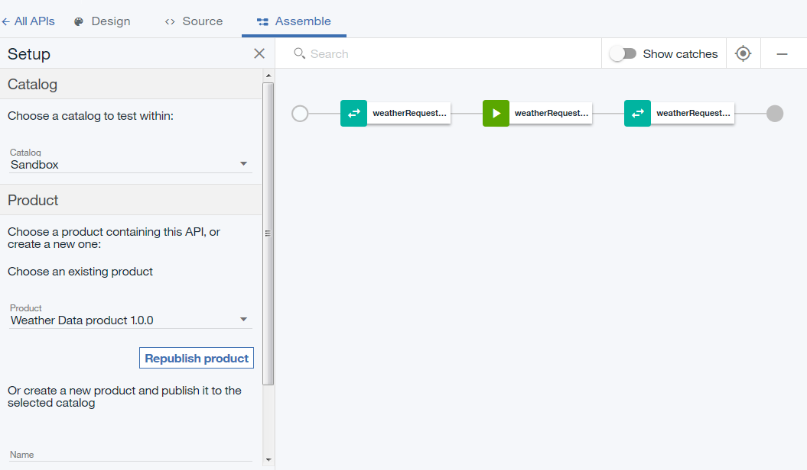
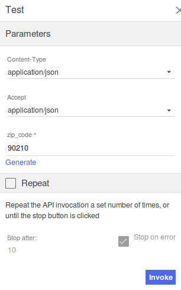

---

copyright:
years: 2019
lastupdated: "2019-3-12"

subcollection: apiconnect

keywords: IBM Cloud, APIs, lifecycle, catalog, manage, toolkit, develop, dev portal, tutorial

---

{:new_window: target="blank"}
{:shortdesc: .shortdesc}
{:screen: .screen}
{:codeblock: .codeblock}
{:pre: .pre}
 

# Exposition d'un service SOAP en tant qu'API REST
{: #tut_expose_soap_service}

**Durée** : 20 mn  
**Niveau de compétence** : Débutant  

---
## Objectif
{: #object_tut_expose_soap_service}

Dans le gestionnaire d'API, vous allez créer une API REST qui accédera à un service SOAP existant et l'exposera en tant qu'API REST.

## Prérequis
{: #prereq_tut_expose_soap_service}

1. Avant de commencer, vous devez [configurer votre instance {{site.data.keyword.apiconnect_full}}](/docs/services/apiconnect?topic=apiconnect-tut_prereq_set_up_apic_instance).
2. Avant de commencer, copiez le fichier de test [weatherprovider.wsdl ](https://raw.githubusercontent.com/IBM-Bluemix-Docs/apiconnect/master/tutorials/weatherprovider.wsdl){: #new_window} dans votre système de fichiers local.
	>![images/info.png]
	>Vous pouvez cliquer sur **Brut**, puis sauvegarder la page résultante sur votre système de fichiers local en tant que fichier `.wsdl`.

---
## Configuration d'une définition d'API REST
{: #setup_tut_expose_soap_service}

1. Connectez-vous à {{site.data.keyword.Bluemix_short}} : https://cloud.ibm.com.
2. Dans le **Tableau de bord** {{site.data.keyword.Bluemix_notm}}, cliquez sur **Cloud Foundary Services**. Lancez le service {{site.data.keyword.apiconnect_short}}. 
3. Dans {{site.data.keyword.apiconnect_short}}, vérifiez que le panneau de navigation est ouvert. S'il ne l'est pas, cliquez sur **>>** pour l'ouvrir.  

  

4. Sélectionnez **Brouillons** dans le panneau de navigation.
5. Sélectionnez **Ajouter +** > **Nouvelle API**.

      

	
6. Indiquez les informations de base sur l'API.
	- Dans la zone **Titre**, entrez `Weather Data`.
	- Dans la zone **Nom** laissez la valeur `weather-data` renseignée lorsque vous avez entré le titre.	
	- Dans la zone **Chemin de base** laissez la valeur `/weather-data`.
	- Dans la zone **Version** laissez la valeur `1.0.0`.
7. Développez la zone **Propriétés supplémentaires** afin de spécifier des propriétés supplémentaires pour l'API.
	- Dans la zone **Modèle d'API**, sélectionnez **Par défaut** pour indiquer que vous souhaitez utiliser le modèle par défaut pour créer la définition de l'API.
	- Laissez les autres zones inchangées.
	
8. Ajoutez votre API à un nouveau produit puis créez la définition de l'API.
	- Sélectionnez **Ajouter un produit**.
	- Dans la zone **Titre**, utilisez `Weather Data product` comme valeur par défaut.
	- Laissez les zones **Nom** et **Version** inchangées.
	- Vérifiez que la case **Publier ce produit dans un catalogue** est cochée, puis sélectionnez **Bac à sable** comme catalogue cible.
	
	- Cliquez sur **Créer une API**. L'onglet **Conception** du brouillon de votre définition d'API s'affiche.
9. Votre API est maintenant créée. La page Conception s'affiche.

   

10. Cliquez sur **Définitions** dans la barre de navigation. Cliquez sur l'icône **Ajouter une définition** . 

11. Développez la nouvelle définition en cliquant dessus. 
12. Nommez la définition `Weather Data Output`.
13. La définition aura cinq propriétés. Clique quatre fois sur **Ajouter une propriété** pour ajouter les propriétés supplémentaires. Modifiez le `Nom de propriété` en vous aidant des informations suivantes et utilisez la valeur par défaut pour les zones `Description`, `Type` et `Exemple` : 
    a. Ajoutez de nouvelles propriétés pour la définition **Weather Data Output**.     
       - Nom : zip         /  Type : chaîne   
       - Nom : température /  Type : entier   
       - Nom : humidité    /  Type : entier   
       - Nom : ville        /  Type : chaîne   
       - Nom : état / Type : chaîne   

	
14. Cliquez sur **Chemins** dans la barre de navigation. Cliquez sur l'icône **Ajouter un chemin** . 
15. Définissez le **Titre** du chemin que vous avez récemment créé sur `/getweatherdata`. 
16. Développez l'opération **GET /getweatherdata** en cliquant dessus.
	
17. Pour l'opération **GET /getweatherdata**, cliquez sur **Ajouter un paramètre**, puis sur **Ajouter un nouveau paramètre**.
18. Nommez le nouveau paramètre `zip_code` et laissez les autres zones sur leur valeur par défaut.
19. Dans la colonne **Schéma** de la réponse **200 OK** dans la section **Réponses**, sélectionnez la définition **Weather Data Output**. Pour la réponse à l'appel API, l'objet défini par **Weather Data Output** sera l'objet réponse.
	
20. Cliquez sur l'icône Sauvegarder  pour sauvegarder vos modifications.

---
## Ajout et configuration de votre appel de service Web
{: #add_web_tut_expose_soap_service}

Pour ajouter et configurer les stratégies invoke et map qui intègrent votre service Web à votre définition d'API, procédez comme suit.
1. Dans la section **Services**, cliquez sur l'icône **Ajout d'un service** . La fenêtre `Importer le service Web à partir de WSDL` s'ouvre.
	
2. Sélectionnez **Télécharger le fichier**.
3. Dans la fenêtre **Téléchargement de fichier**, indiquez l'emplacement du fichier `weatherprovider.wsdl` que vous avez téléchargé à l'`étape 2` de la section **Prérequis**, puis cliquez sur **Ouvrir** pour continuer.
4. Sélectionnez le service SOAP **weatherService**, puis cliquez sur **Terminé**. Dans la section **Services**, le service Web **WeatherService** est répertorié avec une seule opération **weatherRequest**.
	

		
5. Accédez à l'onglet **Assembler** et vérifiez que **Règles DataPower Gateway** est sélectionné.
6. Supprimez la stratégie **invoke** existante sur le canevas en passant le curseur au-dessus de la stratégie, puis en cliquant sur l'icône **Supprimer la stratégie** .
		
7. Depuis la palette, faites glisser le service Web **weatherRequest** jusqu'à la boîte en pointillés affichée sur le canevas. Une stratégie invoke et deux stratégies map sont placées dans l'assemblage. La première stratégie map affecte des variables à l'entrée de votre appel de service Web, tandis que la deuxième stratégie affecte des sorties de votre appel de service Web à des variables. Les sorties de la première stratégie map et les entrées de la seconde stratégie map sont générées à partir du WSDL fourni à l'étape 4.
		
8. Cliquez sur la stratégie map **weatherRequest: input**, puis sur l'icône **Editer les entrées**  dans la colonne Entrée de la feuille de propriété.
		
9. Cliquez sur **+ paramètres pour l'opération** et sélectionnez `get /getweatherdata`.
10. Cliquez sur **Terminé** pour ajouter le paramètre `zip_code`.
	
11. Cliquez sur le cercle correspondant à **zip_code string** côté entrée, puis sur celui correspondant à **zipcode string** côté sortie.  
	
12. Fermez la feuille de propriété.
13. Cliquez sur la stratégie map **weatherRequest: output** dans la palette, puis sur l'icône **Editer les sorties** icon  dans la colonne Sortie de la feuille de propriété.
14. Sélectionnez **+ sorties pour l'opération** et sélectionnez `get /getweatherdata`.
15. Sélectionnez **Terminé** pour ajouter la définition de sortie `Weather Data Output`.
	
16. Cliquez sur le cercle correspondant à **zip string** côté entrée, puis sur celui correspondant à **zip string** côté sortie. Mappez les paramètres restants en vous aidant des informations suivantes.
	
17. Cliquez sur l'icône **Sauvegarder**  pour sauvegarder vos modifications.

Vous avez inclus l'appel de service Web dans votre assemblage et mappé un paramètre d'entrée à la partie appropriée de la demande SOAP et mappé la partie appropriée de la réponse SOAP à une sortie JSON.

---
## Test de votre définition d'API
{: #test_tut_expose_soap_service}

Pour tester votre définition d'API à l'aide de l'outil de test du gestionnaire d'API, procédez comme suit.
1. Cliquez sur l'icône **Test**  sous l'onglet **Assemblage** pour afficher le panneau de test.
	
2. Si vous avez utilisé l'outil de test précédemment, cliquez sur **Changer la configuration**.
3. Sélectionnez `Weather Data product 1.0.0` dans la liste des produits.
	
4. Cliquez sur **Republier le produit**.
5. Cliquez sur **Suivant**.
6. Sélectionnez `get /getweatherdata` dans la liste des opérations.  
	
7. Faites défiler jusqu'à la zone **zip_code** et entrez `10504`.  
	
8. Cliquez sur **Appeler**. L'API renvoie la météo actuelle.  
	

---
## Conclusion
{: #conclusion_tut_expose_soap_service}

Dans ce tutoriel, vous avez effectué les activités suivantes :
1. Configuration d'une définition d'API REST
2. Configuration d'une API pour appeler un service Web existant et renvoyer sa sortie
3. Test de votre définition d'API

---

## Etape suivante
{: #next_tut_expose_soap_service}

Sécurisation d'une API [à l'aide d'OAuth 2.0](/docs/services/apiconnect/tutorials?topic=apiconnect-tut_secure_oauth_2).

Création > **Gestion** > Sécurisation > Réseaux sociaux > Analyse

[important]: ./images/important.png "Important"
[info]: ./images/info.png "Informations"
[troubleshooting]: ./images/troubleshooting.png "Traitement des incidents" 
