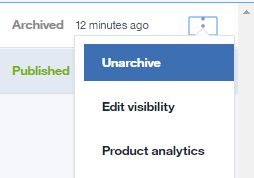

---

copyright:
  years: 2019
lastupdated: "2019-3-15"

subcollection: apiconnect

keywords: IBM Cloud, APIs, lifecycle, catalog, manage, toolkit, develop, dev portal, tutorial

---

{:new_window: target="_blank"}
{:shortdesc: .shortdesc}
{:screen: .screen}
{:codeblock: .codeblock}
{:pre: .pre}

# Archivage et suppression de produits d'API
{: #tut_manage_remove}

**Durée**: 15 mn  
**Niveau de compétence** : Débutant 

## Objectif
{: #object_tut_manage_remove}
Dans ce tutoriel, vous allez supprimer, archiver et retirer une API.

---
## Prérequis
{: #prereq_tut_manage_remove}

1. [Configurez votre instance {{site.data.keyword.apiconnect_full}}](/docs/services/apiconnect/tutorials?topic=apiconnect-tut_prereq_set_up_apic_instance).

2. Exécutez le [tutoriel Substitution d'un produit d'API](/docs/services/apiconnect/tutorials?topic=apiconnect-tut_manage_supercede).

---

## Suppression d'un produit d'API
{: #delete_tut_manage_remove}

1. Connectez-vous à {{site.data.keyword.Bluemix_short}} : https://cloud.ibm.com.
2. Dans le **Tableau de bord** {{site.data.keyword.Bluemix_notm}}, cliquez sur **Cloud Foundary Services**. Lancez le service {{site.data.keyword.apiconnect_short}}. 
3. Dans {{site.data.keyword.apiconnect_short}}, vérifiez que le panneau de navigation est ouvert. S'il ne l'est pas, cliquez sur **>>** pour l'ouvrir.  

  

4. Cliquez sur **Bac à sable** pour ouvrir le catalogue de bac à sable. **Remarque** : Vous devrez peut-être revenir dans le tableau de bord pour voir les catalogues disponibles. Il est également possible que votre page de tableau de bord affiche les catalogues sous forme de mosaïques au lieu d'une liste.

5. Cliquez sur les points de suspension verticaux sur la ligne **API Weather Provider 1.0.0**.  

6. Sélectionnez **Supprimer du catalogue**.  

7. Cliquez sur **OK**.  

    Le produit disparaît de la liste des produits dans le catalogue. Il ne peut pas être récupéré à ce stade.

## Archivage d'un produit d'API
{: #archive_tut_manage_remove}

1. Cliquez sur les points de suspension verticaux sur la ligne **API Weather Provider 2.0.0**.  

2. Sélectionnez **Retirer**.  

3. Cliquez sur **OK**.  

4. Cliquez sur les points de suspension verticaux sur la ligne **API Weather Provider 2.0.0**.  

5. Sélectionnez **Archiver**.  

6. Cliquez sur **OK**.  

    Le produit disparaît de la liste des produits dans le catalogue. Il peut être récupéré.

7. Cliquez sur l'icône de vue de liste.  

8. Cochez **Archivé**.  

9. Cliquez sur les points de suspension verticaux sur la ligne **API Weather Provider 2.0.0**.  

10. Sélectionnez **Désarchiver**.  

    Le produit passe à l'état Retiré.
    

 
 
## Conclusion
{: #conclusion_tut_manage_remove}

Dans ce tutoriel, vous avez effectué les activités suivantes :

1. Suppression d'un produit d'API
2. Retrait d'un produit d'API
3. Archivage d'un produit d'API
4. Désarchivage d'un produit d'API

---

