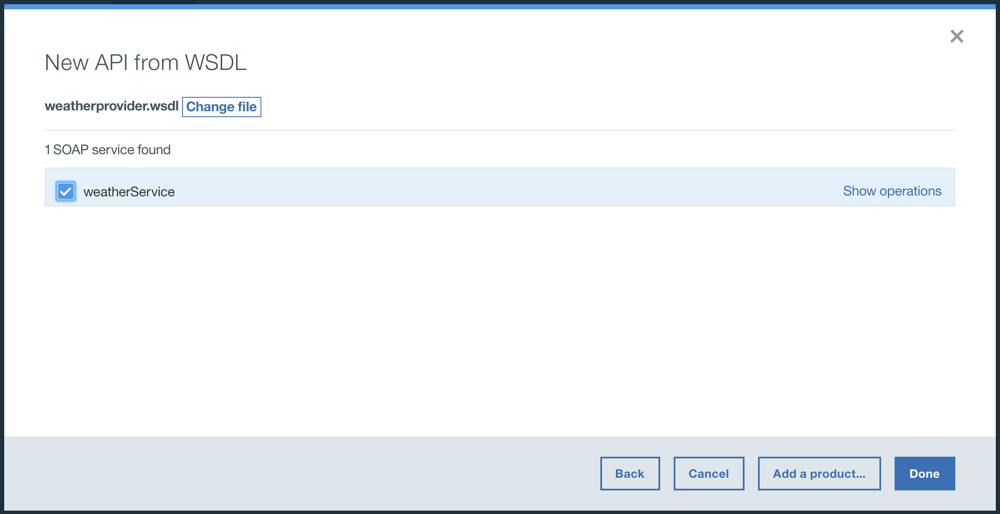

---
copyright:
  years: 2017
lastupdated: "2017-10-19"
---


{:new_window: target="_blank"}
{:shortdesc: .shortdesc}
{:screen: .screen}
{:codeblock: .codeblock}
{:pre: .pre}


# Gestion d'un service SOAP
**Durée** : 15 mn
**Niveau de compétence** : Débutant

---
## Objectif
Dans ce tutoriel, vous utiliserez le gestionnaire d'API pour créer une API SOAP qui fait office de proxy pour un service météo basé sur SOAP.

## Prérequis
- Avant de commencer, vous devez [configurer votre instance {{site.data.keyword.apiconnect_short}}](tut_prereq_set_up_apic_instance.html).
- Avant de commencer, copiez le fichier de test [weatherprovider.wsdl ](https://github.com/ibm-apiconnect/getting-started/blob/master/bluemix/manage-soap-api/files/weatherprovider.wsdl){:new_window} dans votre système de fichiers local. Remarque : Vous pouvez cliquer sur **Brut** puis sauvegarder la page résultante sur votre système de fichiers local en tant que fichier `.wsdl`. Comme le suggère son nom, ce service SOAP renvoie des données météorologiques lorsqu'un code postal est indiqué.

---
## Configuration d'une définition d'API SOAP
1. Connectez-vous à {{site.data.keyword.Bluemix_short}}: [https://new-console.ng.bluemix.net/login](https://new-console.ng.bluemix.net/login){:new_window}.

2. Dans le **tableau de bord** {{site.data.keyword.Bluemix_short}}, faites défiler vers le bas jusqu'à **Tous les services**.

3. Sélectionnez **API Connect** pour lancer le service API Connect. 
  
4. Accédez à la page Brouillons, si elle n'est pas déjà affichée :  
    a. Dans l'interface API Connect, cliquez sur >> pour ouvrir le panneau de navigation.
    b. Cliquez sur **Brouillons** dans le panneau de navigation.
    c. Cliquez sur l'onglet **API**.

5. Dans l'onglet API, cliquez sur `Ajouter +`.

6. Dans le menu déroulant, sélectionnez **API d'un service SOAP**.
  

7. La nouvelle API de la boîte de dialogue WSDL s'ouvre. Cliquez sur **Télécharger un fichier**.
  

8. Sélectionnez le fichier `weatherprovider.wsdl` précédemment sauvegardé.

9. La nouvelle API de la boîte de dialogue WSDL s'affiche. Cochez la case **weatherService**. Cliquez sur **Terminé**.
  

10. Une fois l'importation réussie, la vue Concevoir de l'API s'affiche. Vous pouvez également afficher la définition OpenAPI dans l'onglet Source.
   _Dans l'onglet Source, vous voyez que le WSDL est encapsulé dans la définition OpenAPI._
  

11. Faites défiler jusqu'à l'onglet **Sécurité**, puis cliquez sur l'icône de suppression pour supprimer la clé d'API `clientIDHeader (API Key)` automatiquement générée lors de la création du service.
   _Nous traiterons de la sécurité avec les clés d'API dans le prochain tutoriel._

12. Cliquez sur l'icône de  pour sauvegarder vos modifications. Une notification de confirmation "API sauvegardé" s'affiche brièvement.

13. Dans la barre de menus contenant l'icône de sauvegarde, l'onglet **Concevoir** indique votre emplacement actuel. A côté, se trouve l'onglet **Source**, dans lequel vous pouvez directement afficher le fichier Swagger (2.0) qui représente votre API, et juste après, l'onglet **Assembler** qui vous mène à une interface de glisser-déplacer pour le traitement de l'API. Cliquez sur **Assembler**.
    

## Test de la définition d'API SOAP

1. Dans l'onglet **Assembler**, cliquez sur l'icône **Plus d'actions** (trois points de suspension), puis sélectionnez **Générer un produit par défaut** dans le menu.  
   

2. Acceptez les options par défaut de la boîte de dialogue **Nouveau produit**, puis cliquez sur **Créer un produit**. Le **produit weatherService 1.0.0** est créé et publié dans le catalogue de bac à sable.  
  
 
  _Dans {{site.data.keyword.apiconnect_short}}, **Produits** propose un mécanisme permettant de regrouper des API destinées à un usage particulier. Les produits sont publiés dans un **catalogue**. Référence : Glossaire [{{site.data.keyword.apiconnect_short}}](../apic_glossary.html)_

3. Sauvegardez vos modifications.  

4. En regard de la zone de recherche, cliquez sur l'icône de test pour tester le service d'API. Le menu de configuration s'affiche.

5. Dans la liste des produits, sélectionnez `produit weatherService 1.0.0`.  
  

6. Faites défiler jusqu'au bas de la page, puis cliquez sur **Suivant**.

7. Dans la liste des opérations, sélectionnez `post /weatherRequest`.  
  

8. Faites défiler vers le bas. Entrez le xml suivant dans le corps du texte. Vous pouvez sélectionner et copier l'exemple de XML suivant, puis cliquer sur la zone **Corps** pour l'activer et y insérer l'exemple de XML.  
  ```
  <?xml version="1.0" encoding="UTF-8"?>
  <soap:Envelope xmlns:xsi="http://www.w3.org/2001/XMLSchema-instance" xmlns:xsd="http://www.w3.org/2001/XMLSchema" xmlns:soap="http://schemas.xmlsoap.org/soap/envelope/">
   <soap:Body>
  <wdata:WeatherRequest xmlns:wdata="http://www.ibm.com/wdata">
       <zipcode>10504</zipcode>
  </wdata:WeatherRequest>
   </soap:Body>
  </soap:Envelope>
  ```
  {: codeblock}  
  

9. Au besoin, faites défiler vers le bas, puis cliquez sur **Appeler**.
L'API renvoie une réponse **corps** qui indique la météo en cours.  
  

## Résumé des activités du tutoriel
Dans ce tutoriel, vous avez :
1. Configuré une définition d'API SOAP
2. Testé votre définition d'API
3. Reçu une réponse **corps** du noeud final de l'API de météo fournissant les résultats de votre requête.

---

## Etape suivante 

[Exposition de votre service en tant qu'API REST](tut_expose_soap_api.html) ou sécurisation de votre API à l'aide d'une [limitation de débit](tut_rate_limit.html), d'un[ID et d'une valeur confidentielle client](tut_secure_landing.html) ou [sécurisation à l'aide de OAuth 2.0](tut_secure_oauth_2.html).

Création > **Gestion** > Sécurisation > Réseaux sociaux > Analyse
