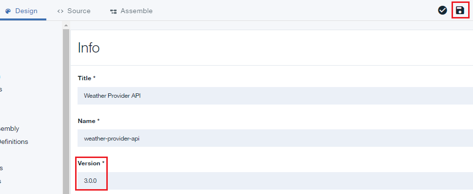

---

copyright:
  years: 2017
lastupdated: "2017-10-10"

---

{:new_window: target="_blank"}
{:shortdesc: .shortdesc}
{:screen: .screen}
{:codeblock: .codeblock}
{:pre: .pre}

# Substitution de produits d'API
**Durée**: 15 mn  
**Niveau de compétence** : Débutant  

## Prérequis

1. [Configurez votre instance {{site.data.keyword.apiconnect_full}}](tut_prereq_set_up_apic_instance.html).

2. Exécutez le [tutoriel Remplacement d'un produit d'API](tut_manage_replace.html).

---
## Objectif
Dans ce tutoriel, vous substituerez une nouvelle API à une API existante.

---
## Substitution d'un produit d'API
1. Connectez-vous à {{site.data.keyword.Bluemix_short}}: [https://console.ng.bluemix.net/login ](https://console.ng.bluemix.net/login){:new_window}.

2. Dans le tableau de bord {{site.data.keyword.Bluemix_short}}, lancez le service {{site.data.keyword.apiconnect_short}}.

3. Dans le gestionnaire d'API, si vous n'avez pas encore épinglé le panneau de navigation de l'interface utilisateur, cliquez sur l'icône **Accéder à** . Le panneau de navigation de l'interface utilisateur du gestionnaire d'API s'ouvre. Pour épingler le panneau de Navigation de l'interface utilisateur, cliquez sur l'icône **Epingler le menu** .

4. Cliquez sur **Bac à sable** pour ouvrir le catalogue de bac à sable. **Remarque** : Il est possible que votre écran affiche des mosaïques au lieu d'une liste de catalogues.

4. Cliquez sur **Brouillons** > **API**.

5. Dans le panneau API, cliquez sur **API Weather Provider** pour ouvrir l'API de proxy REST.  

6. Modifiez la **Version** en 3.0.0.

7. Cliquez sur l'icône de disque pour sauvegarder les modifications apportées à l'API.  

8. Cliquez sur **Toutes les API**.  

9. Cliquez sur **Produits**.  

10.	Sélectionnez **Produit d'API Weather Provider 2.0.0**.  

11.	Modifiez la **Version** en 3.0.0. Cliquez sur l'icône de disque pour sauvegarder les modifications. Cliquez sur l'icône **Transférer**.  

12.	Cliquez sur **>>** pour ouvrir le panneau de navigation, puis sélectionnez **Tableau de bord**.  

13.	Cliquez sur **Bac à sable**.

14.	Cliquez sur **Communauté**.  

15.	Cliquez sur **Abonnements**.  

16.	Notez les abonnements d'application au produit d'API Weather Provider 2.0.0. Cliquez sur **Produits**.
  

17.	Cliquez sur les points de suspension verticaux sur la ligne **Produit d'API Weather Provider 3.0.0 transféré**.  

18.	Sélectionnez **Substituer un produit existant**.  

19.	Sélectionnez **Produit d'API Weather Provider 2.0.0** dans la liste de produits affichée. Cliquez sur **Suivant**.  

20.	Sélectionnez **Plan par défaut**. Cliquez sur **Substituer**.  

    Suite à cette opération, le produit d'API Weather Provider 2.0.0 devient obsolète et le produit d'API Weather Provider 3.0.0 est publié.  
 
 
21.	Cliquez sur **Communauté >> Abonnements**.  

 
22.	Cliquez sur les points de suspension verticaux sur la ligne **Produit d'API Weather Provider 2.0.0**. Sélectionnez **Gérer**.  
 

23.	Sélectionnez **Plan par défaut** sous Produit d'API Weather Provider 3.0.0 . Cliquez sur **Migrer**.  

    Suite à cette opération, le produit d'API Weather Provider 2.0.0 est migré vers le produit d'API Weather Provider 3.0.0.  
 
 

 
## Tâches exécutées dans ce tutoriel
Dans ce tutoriel, vous avez effectué les activités suivantes :

1. Mise à jour d'un produit d'API.
2. Substitution d'un produit d'API mis à jour à un produit d'API existant.
3. Migration de l'abonnement du produit d'API existant vers le produit d'API mis à jour.

---

