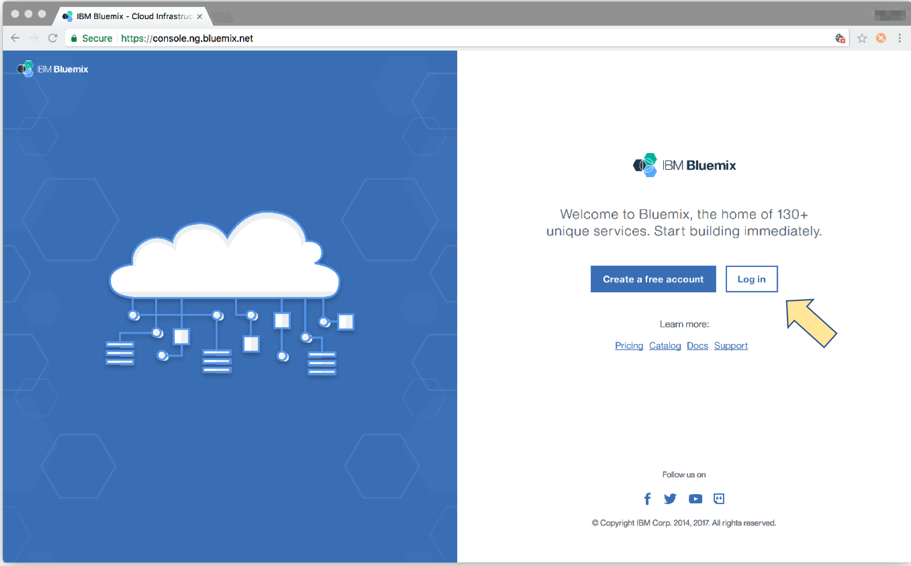

---
copyright:
  years: 2017
lastupdated: "2017-10-10"
---

{:new_window: target="blank"}
{:shortdesc: .shortdesc}
{:screen: .screen}
{:codeblock: .codeblock}
{:pre: .pre}

# Définition d'une instance API Connect
**Durée**: 15 mn  
**Niveau de compétence** : Débutant  

## Ce dont vous avez besoin :
1. Un IBMid
2. Un compte {{site.data.keyword.Bluemix_short}}
3. Une instance {{site.data.keyword.apiconnect_short}} avec au moins un plan _Lite_

<table>
  <tr><td><b>IBMid</b> : Utilisé pour accéder à toutes les applications, communautés, support et autres d'IBM
     
    <b>{{site.data.keyword.Bluemix_short}}</b> : Plateforme cloud d'IBM qui héberge {{site.data.keyword.apiconnect_short}} ainsi que d'autres applications et services 
    <b>{{site.data.keyword.apiconnect_short}}Lite</b> : Version gratuite d'{{site.data.keyword.apiconnect_short}} hébergée sur {{site.data.keyword.Bluemix_short}}</td></tr>
  </table>  

---

1. Inscrivez-vous pour obtenir votre IBMid à l'adresse URL suivante : [https://console.ng.bluemix.net/registration/ ](https://console.ng.bluemix.net/registration/){:new_window}.

	Vous avez déjà un IBMid ? Alors, sautez l'étape d'enregistrement et créez simplement votre compte {{site.data.keyword.Bluemix_short}} gratuit à l'adresse URL suivante : [https://console.ng.bluemix.net/ ](https://console.ng.bluemix.net/){:new_window}.  

2. Une fois en possession de votre IBMid et de votre compte {{site.data.keyword.Bluemix_short}}, créez votre instance {{site.data.keyword.apiconnect_short}}.  
  a. Connectez-vous à {{site.data.keyword.Bluemix_short}} : [https://new-console.ng.bluemix.net/login ](https://new-console.ng.bluemix.net/login){:new_window}.  
    
  b. Créez votre _organisation_ dans {{site.data.keyword.Bluemix_short}}. Un message vous y invite lors de votre première connexion.  
  
  c. Créez votre _espace_.  
  
  d. Accédez à [https://console.ng.bluemix.net/catalog/services/api-connect ](https://console.ng.bluemix.net/catalog/services/api-connect){:new_window}.  
    
  e. Sélectionnez le plan de tarification (gratuit) _Lite_, puis cliquez sur **Créer** pour démarer.  
    
