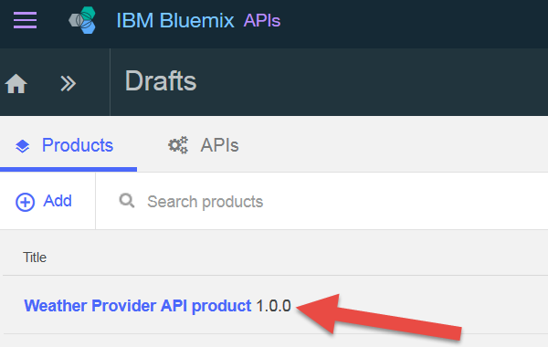
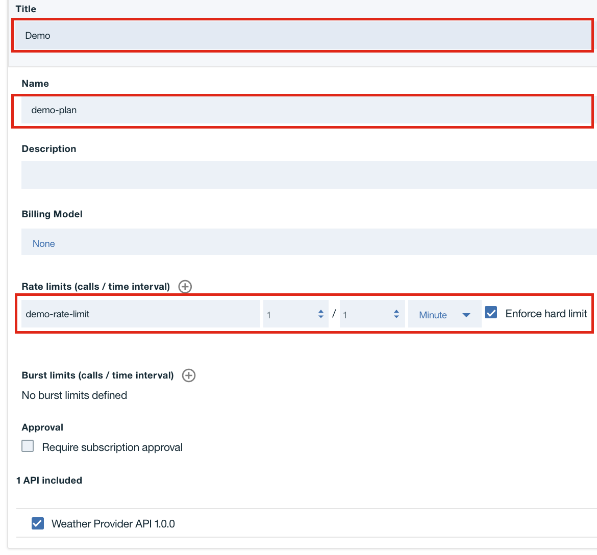
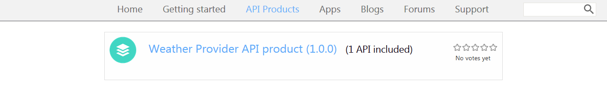
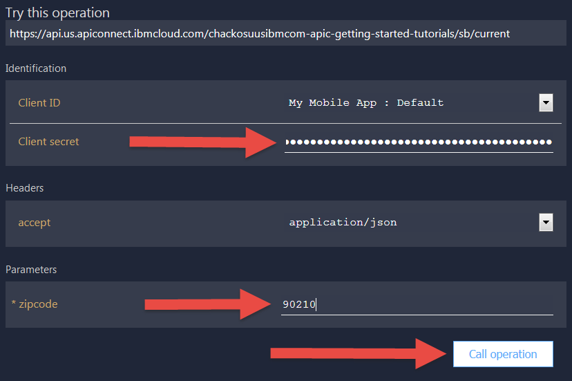

---
copyright:
  years: 2017
lastupdated: "2017-11-02"
---

{:new_window: target="_blank"}
{:shortdesc: .shortdesc}
{:screen: .screen}
{:codeblock: .codeblock}
{:pre: .pre}

# Définition de limites de débit
**Durée**: 15 mn  
**Niveau de compétence** : Débutant  

## Objectif
Ce tutoriel montre comment limiter le débit de vos API. Définir des limites de débit vous permet de gérer le trafic réseau de vos API et d'opérations spécifiques au sein de vos API. Une limite de débit est le nombre maximum d'appels que vous souhaitez autoriser au cours d'un intervalle de temps donné.

Dans {{site.data.keyword.apiconnect_full}}, *Produits* propose un moyen de regrouper des API dans un package pour une utilisation particulière ou un public cible. Produits contient également *Plans*, qui décrit les conditions que vous voulez offrir à vos consommateurs d'API. Plus précisément, Plans définit des règles associées à des abonnement d'API, telles que des limites de débit d'API et si les abonnements doivent ou non être approuvés.

Lorsqu'un développeur d'applications veut utiliser vos API, il sélectionnez un produit qui contient l'API qu'il souhaite utiliser et s'abonne au plan du produit qui répond à ses besoins.

Dans ce tutoriel, vous allez :
1. Créer un nouveau plan rate-limited dans un produit existant.
2. Voir ce qui se produit lorsqu'une application dépasse les limites de débit autorisées.

## Prérequis
Vous devez au préalable avoir créé dans {{site.data.keyword.apiconnect_short}} une API sécurisée avec au moins une clé d'API. Dans les instructions, notre point de départ est le [fichier d'exemple API Weather Provider ](https://raw.githubusercontent.com/IBM-Bluemix-Docs/apiconnect/master/tutorials/weather-provider-api_1.yaml){:new_window}, sécurisé avec un [ID client et une valeur confidentielle](tut_secure_landing.html).

Avant de commencer ce tutoriel, effectuez les opérations suivantes :
- [Importez votre spécification d'API et passez par un proxy un service REST existant](tut_rest_landing.html).
- [Sécurisation d'une API avec un ID client et un secret client](tut_secure_landing.html).

---
## Lancement d'API Connect

1. Connectez-vous à {{site.data.keyword.Bluemix_notm}}: [https://console.ng.bluemix.net/login ](https://console.ng.bluemix.net/login){:new_window}.
2. Une fois connecté à {{site.data.keyword.Bluemix_notm}}, faites défiler la page jusqu'à **Tous les services**, puis cliquez sur **API Connect**.
3. Cliquez sur **API Connect** pour lancer le service {{site.data.keyword.apiconnect_short}}.

## Exploration du Plan par défaut
1. Dans le panneau de navigation {{site.data.keyword.apiconnect_short}}, sélectionnez **Brouillons**. (Si le panneau de navigation n'est pas ouvert, cliquez sur **>>** pour l'ouvrir.)
2. Sélectionnez l'onglet **Produits** dans lequel le produit API Weather Provider doit s'afficher.

         

3. Cliquez sur le lien Produit. La vue Conception, qui contient des informations sur le produit, s'affiche.
4. Faites défiler la page vers le bas jusqu'à la section Plans. Un plan par défaut a été créé lorsque vous avez généré ce produit. 

       
5. Développez les détails du plan par défaut. Les zones Limite de débit (100 appels/heure) et Liste des API peuvent être développées pour afficher des opérations spécifiques.

    

   
## Création d'un nouveau plan avec débit limité

Maintenant que vous avons vu à quoi ressemble le plan par défaut, créons un nouveau plan avec des limites de débit plus restrictives afin de montrer ce qui se passe lorsqu'un consommateur d'API dépasse les limites du plan. 
1. Cliquez sur le bouton d'ajout d'un nouveau plan.
 
     
    
    Un nouveau plan, défini par défaut pour autoriser un usage illimité (c'est-à-dire, sans aucune limite de débit), est automatiquement créé. Attribuons lui un nom plus significatif et définissons une limite plus restrictive. 
2. Cliquez sur le nouveau plan (`Nouveau plan 1`) afin de développer ses détails.
3. Cliquez sur la zone Titre et attribuez au plan le titre `Démo`.
4. Cliquez sur la zone Nom et attribuez au plan le nom `demo-plan`.
5. Cliquez sur le signe + pour ajouter une nouvelle limite de débit.
6. Renommez la nouvelle limite de débit en `demo-rate-limit` et vérifiez qu'elle est définie sur `1 / 1 Minute`.
7. Cochez la case `Appliquer la limite absolue`. (Lorsque cette case est cochée, une application reçoit un message d'erreur si elle appelle une API plus de fois que le nombre autorisé par la limite du plan souscrit).
8. Acceptez tous les autres paramètres par défaut et sauvegardez le produit.

    

## Transfert & publication d'un produit mis à jour dans le catalogue de bac à sable

Dans les exemples précédents, vous pouviez avoir publié votre produit à l'aide de l'outil de test, qui appelle votre API avec des données d'identification d'application de test préfournies. Toutefois, cette application de test n'est pas soumise à des limites de débit, et nous devons donc créer ici une nouvelle application à des fins de limitation du débit. Voir le [contenu d'IBM Knowledge Center relative à API Connect ](https://www.ibm.com/support/knowledgecenter/SSFS6T/com.ibm.apic.toolkit.doc/tapim_create_product.html){:new_window} pour plus d'informations.

1. Cliquez sur l'icône Publier pour *transférer* le produit vers le catalogue **Bac à sable**. Cette action ajoute vos modifications apportées au brouillon du produit dans le catalogue sélectionné. Nous devons ensuite *publier* les modifications du produit de sorte qu'elles soient disponibles pour les consommateurs via le portail de développeur.
    
2. Cliquez sur le bouton >> pour ouvrir le menu de navigation.
3. Sélectionnez Tableau de bord, puis ouvrez le cataloguer **Bac à sable**. Le produit API Weather Provider est répertorié comme étant **Transféré**.
4. Cliquez sur les points de suspension et sélectionnez **Publier** dans le menu.
    
5. Acceptez les paramètres de visibilité par défaut, puis cliquez sur le bouton **Publier**. Une fois le produit publié et visible dans le portail de développeur, les développeurs d'applications peuvent s'abonner aux plans disponibles.

## Enregistrement d'une nouvelle application (consommateur) dans le portail de développeur
Les développeurs d'applications découvrent et utilisent vos API à l'aide du portail de développeur. Pour plus d'informations sur le portail de développeur, voir la rubrique [IBM Knowledge Center](https://www.ibm.com/support/knowledgecenter/SSFS6T/com.ibm.apic.devportal.doc/tapim_tutorial_using_ADP.html){:new_window}.

La première fois où vous travaillez avec le portail de développeur, vous devrez mettre un portail de développeur à disposition pour votre catalogue Bac à sable. Le compte auquel vous êtes connecté lorsque vous mettez le portail à disposition sera le compte administrateur de ce portail. Par conséquent, pour explorer et tester des API, vous devrez créer & vous connecter avec un nouveau compte de développeur (en utilisant une adresse électronique différente) que le compte administrateur.

Les instructions suivantes vous guident tout au long de cette procédure.

1. Ouvrez le portail de développeur. Si vous ne connaissez pas l'adresse URL, vous la trouverez dans l'onglet Paramètres du catalogue de bac à sable. Pour mettre à disposition le portail de développeur pour la première fois, voir [Création et configuration de votre portail de développeur](tut_config_dev_portal.html).
    - Cette opération peut prendre jusqu'à une heure pour s'exécuter. Lorsque votre portail de développeur de bac à sable est prêt, vous recevez un courrier électronique contenant un lien vers votre nouveau site de portail de développeur. Le lien est à usage unique pour le compte administrateur.
2. Connectez-vous au portail avec vos données d'identification de développeur d'applications (**pas** votre ID IBM). ***(Au besoin, créez un nouveau compte de développeur, en utilisant une autre adresse que votre ID IBM.)***
3. Cliquez sur le lien **Applis** de la barre d'outils, puis cliquez sur le bouton **Créer une application**.

4. Donnez un titre à l'application, puis cliquez sur **Soumettre**.

   
5. Sauvegardez la valeur confidentielle et l'ID du client affichés. Vous ne disposez que de cette seule opportunité pour copier la valeur confidentielle du client.

   
   
   

## Abonnement à un produit d'API

1. Cliquez sur le lien **Produits d'API** de la barre d'outils. Votre produit API Weather Provider est réperetorié. 

   
2. Cliquez sur le lien pour afficher les détails et options. Deux plans doivent être disponibles : le plan par défaut d'origine et votre nouveau plan Démo. (Si vous ne voyez qu'un seul plan, revenez dans {{site.data.keyword.apiconnect_short}} et vérifiez que vos modifications apportées au produit ont été sauvegardées, transférées et publiées dans le catalogue de bac à sable.) 

   
3. Cliquez sur **S'abonner** au plan Démo et sélectionnez l'application que vous venez d'enregistrer. Votre application peut maintenant appeler les API associées à ce plan, selon un débit d'*un* appel d'API par minute. 

Nous sommes prêt à tester ce comportement et à observer ce qui se passe lorsque l'application dépasse le débit fixé.

## Appel d'une API à débit limité

1. Sur la page Produit de l'API Weather Provider du portail de développeur, cliquez sur le lien API.

   
2. La page s'actualise pour afficher les détails relatifs à l'API ainsi que ses opérations et fournit un emplacement pour la tester. (C'est également ainsi que vos consommateurs d'API découvriront et testeront votre API.) Un panneau de test sombre s'affiche ; faites défiler vers le bas jusqu'à la section **Essayer cette opération**.

3. Pour tester l'opération `GET /current`, entrez la valeur confidentielle du client de votre application et un code postal valide. Cliquez sur le bouton **Appeler une opération**. Vous devez obtenir la réponse `200 OK`, accompagnée des données météorologiques relatives à ce code postal, 

   

   

4. Maintenant, avant qu'une minute ne s'écoule, cliquez de nouveau sur le bouton **Appeler une opération**, éventuellement avec un autre code postal. Cette fois, vous devez obtenir la réponse `429 Too Many Requests`.

   

5. Pour vous assurer de la réinitialisation de la limite de débit, attendez une minute, essayez de nouveau et vérifiez que vous recevez une réponse valide.

## Conclusion

Félicitations ! Vous avez créé avec succès un plan avec limite de débit, vous l'avez associé à vos API sécurisées et vous avez vérifié que votre API ne répond aux demandes que dans le respect des paramètres que vous avez définis.

---

## Etape suivante

Commencez à diffuser votre API sur les réseaux sociaux via la [création et configuration d'un portail de développeur](tut_config_dev_portal.html).

Création > Gestion > **Sécurisation** > Réseaux sociaux > Analyse
