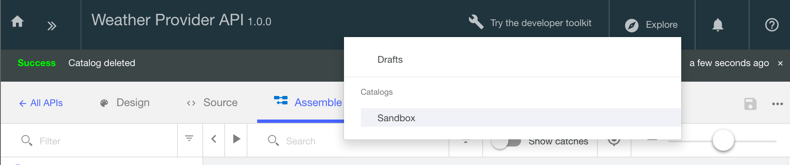

---
copyright:
  years: 2017
lastupdated: "2017-10-31"
---

{:new_window: target="blank"}
{:shortdesc: .shortdesc}
{:screen: .screen}
{:codeblock: .codeblock}
{:pre: .pre}

# Sécurisation de votre API avec un ID client et une valeur confidentielle du client à l'aide du kit d'outils de développement

**Durée :** 10 mn  
**Niveau de compétence :** Débutant

## Objectif

Ce tutoriel vous guidera tout au long du processus de sécurisation de votre API avec un ID client et une valeur confidentielle du client. Lorsque des applications sont enregistrées dans votre portail de développeur, un ID client est généré afin d'identifier l'application. Une valeur confidentielle du client, qui sert de mot de passe, peut éventuellement être aussi générée. Les applications devront fournir les clés ID client et Valeur confidentielle du client pour pouvoir accéder à votre API.

## Prérequis
Avant de commencer, vous devez avoir terminé l'un des tutoriels suivants :
- [Importation d'une spécification d'OpenAPI2.0 et passage par un proxy d'un service REST existant](tut_rest_landing.html)
**ou**  
- [Ajout d'une nouvelle spécification d'API et appel d'un service REST existant](tut_rest_landing.html)

## Définition du mécanisme d'identification de votre API

1. Lancez le concepteur d'API (s'il n'est pas déjà ouvert) :  
   a. Ouvrez votre terminal.  
   b. Entrez `apic edit` sur la ligne de commande. _Le concepteur d'API est lancé dans votre navigateur Web_    
   c. Cliquez sur **Se connecter avec {{site.data.keyword.Bluemix_notm}}**.  
   d. Entrez vos informations de connexion à {{site.data.keyword.Bluemix_short}}.  

2. Accédez à la vue Concevoir de votre API comme suit :
    a. Cliquez sur **Brouillons** dans le panneau de navigation de gauche 
    b. Cliquez ensuite sur l'onglet **API**
    c. Cliquez sur l'_API Weather Provider_ que vous avez créée dans le précédent tutoriel. La vue **Concevoir** de cette API s'ouvre.  
      

3. Dans la vue Concevoir :  
   a. Faites défiler jusqu'à **Définitions de sécurité**.  
     

   b. Cliquez sur l'icône d'**ajout de définitions de sécurité** (+), puis sur **Clé d'API**.  
      - Nom : ID client ; Nom du paramètre : X-IBM-Client-ID  
      - Nom : Valeur confidentielle du client ; Nom du paramètre : X-IBM-Client-Secret  
      - Assurez-vous pour les deux clés que la zone **Situé dans** est définie sur "En-tête".  
          

4. Faites défiler jusqu'au panneau **Sécurité** et ajoutez une nouvelle option de sécurité.  
   a. Sélectionnez les clés ID client et Valeur confidentielle du client que vous venez de créer.  
   b. Sauvegardez votre API.  
   c. Basculez sur l'onglet **Assembler**.  
     

## Test des modifications apportées à votre API

1. Dans l'onglet Assembler, cliquez sur ► pour tester vos modifications.
2. Dans le panneau de test, cliquez sur l'opération **get /current**.
3. Faites défiler le panneau de test vers le bas ; vous remarquerez que les valeurs ID client et Valeur confidentielle du client sont déjà renseignées _Ce sont des valeurs de test générées pour votre bac à sable et correspondant aux clés de l'application qui utilisera votre API._  
> Remarque : Ces clés ID client et Valeur confidentielle du client figurent également sous **Tableau de bord** > **Catalogue** > **Paramètres** > **Noeuds finaux**  

 

4. Faites défiler un peu plus vers le bas et entrez un code postal (par ex. 90210). 
5. Cliquez ensuite sur **Appeler**. _Vous devez obtenir une réponse 200 OK, accompagnée du corps du message qui renvoie les informations météorologiques._  
6. Faites défiler vers le haut jusqu'à la zone ID client, et remplacez la valeur d'ID client par une valeur aléatoire (afin de tester le comportement lorsqu'un ID client incorrect est entré)  
7. Exécutez de nouveau le test en cliquant sur **Appeler**. _Vous obtiendrez une réponse 401, accompagnée du message "Client ID not registered"._  
    
  

## Appel de votre API à l'aide de l'ID client et de la valeur confidentielle du client

Vous pouvez également tester les paramètres de sécurité à l'aide de l'outil Explorer qui appelle explicitement le noeud final de proxy et transmet les clés ID client et Valeur confidentielle du client en tant que valeurs d'en-tête.

1. Cliquez sur **Explorer**. 

2. Sélectionnez l'opération **GET /current** dans la liste.  

3. Dans la colonne de droite, cliquez sur **Appeler une opération** pour réexécuter le test.  
      
    
---

### Conclusion
Dans ce tutoriel, vous avez appris à configurer le mécanisme d'identification de votre API, tester les modifications apportées à votre API et appeler votre API en utilisant l'ID client et la valeur confidentielle du client. 

---

## Etape suivante

Commencez à diffuser votre API sur les réseaux sociaux via la [création et configuration d'un portail de développeur](tut_config_dev_portal.html).

Création > Gestion > **Sécurisation** > Réseaux sociaux > Analyse
