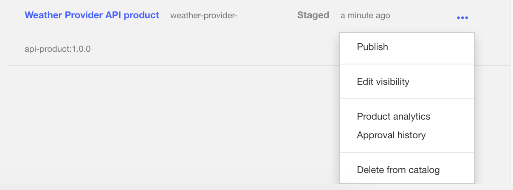

---
copyright:
  years: 2017
lastupdated: "2017-09-30"
---

{:new_window: target="blank"}
{:shortdesc: .shortdesc}
{:screen: .screen}
{:codeblock: .codeblock}
{:pre: .pre}

# Sécurisation de votre API avec un protocole d'autorisation OAuth à deux acteurs

Durée : 10 mn  
Niveau de compétence : Débutant

## Objectif

Ce tutoriel vous guidera tout au long du processus de sécurisation de votre API avec un protocole d'autorisation OAuth 2.0 à deux acteurs. Dans ce flux d'application, le client OAuth envoie une demande au serveur d'autorisations et reçoit un jeton d'accès. Le client OAuth peut ensuite utiliser ce jeton pour accéder à des ressources protégées via votre API.

## Prérequis

Avant de commencer, vous devez avoir terminé l'un des tutoriels suivants :  
- [Sécurisation de votre API avec un ID client et une valeur confidentielle du client à l'aide d'IBM Bluemix](tut_secure_id_secret_bm.html)
or
- [Sécurisation de votre API avec un ID client et une valeur confidentielle du client à l'aide du kit d'outils](tut_secure_id_secret_tk.html)

## Procédure

1. Créez une API de fournisseur OAuth et sélectionnez votre schéma OAuth.  
	a. Ouvrez **Brouillons**, sélectionnez **API**, puis cliquez sur **Ajouter** > **API du fournisseur OAuth 2.0**.  
    
	b. Intitulez-la "API OAuth Endpoint". (Le nom et le chemin de base doivent être automatiquement renseignés.)  
	c. Sélectionnez **Créer une API**.   
	d. Dans la nouvelle API OAuth Endpoint, accédez au panneau **OAuth 2** (ou faites défiler vers le bas jusqu'au panneau), puis sélectionnez "Confidentiel" comme type de client.  
	e. Sous Portées, renommez _scope1_ en _view_current_. Supprimez _scope2_ et _scope3_.  
	f. Sous **Accords**, désélectionnez **Implicite**, **Mot de passe** et **Code d'accès**. Conservez la sélection de **Application**.  
	  
	g. Sauvegardez votre API.  

2. Mettez à jour la définition de sécurité de votre API Weather Provider afin d'y inclure OAuth.  
	a. Accédez à votre _API Weather Provider_. (Revenez dans l'écran API et sélectionnez _API Weather Provider_.)  
	b. Sous Définitions de sécurité, ajoutez une nouvelle définition pour OAuth. Nommez la "Définition OAuth".  
	c. Dans la zone Flux, sélectionnez **Application**.  
	d. Entrez l'URL de jeton _<votre URL de base>/oauth-endpoint-api/oauth2/token_.  
	e. Ajoutez la nouvelle portée view_current.  
	
	f. Sous **Sécurité**, sélectionnez **Définition OAuth** et **view_current**, et conservez la sélection de ID client et Valeur confidentielle du client.  
	
	g. Cliquez sur Sauvegarder.  
	h. Revenez dans **Brouillons** et sélectionnez **Produits**. Ajoutez l'API OAuth Endpoint à votre produit Weather Provider.  
	i. Sauvegardez le produit, puis transférez-le dans votre bac à sable.  
	

3. Testez votre configuration de la sécurité OAuth.  
	a. Publiez votre produit mis à jour dans le bac à sable. Cliquez sur **Tableau de bord > Bac à sable** et publiez votre produit.  
	  
	b. Cliquez sur **Explorer > Bac à sable**.  
      
	c. Dans votre **API Weather Provider**, cliquez sur **GET /current** dans la liste des opérations.  
	d. Dans le panneau de droite, vous remarquerez que les valeurs ID client et Valeur confidentielle du client sont déjà renseignées.  
	e. Dans la section **Paramètres**, entrez un code postal.  
      
	f. Dans la section **Autorisation**, cliquez sur **Autoriser** pour obtenir votre jeton d'accès.  
	g. Une fois que vous avez reçu le jeton d'accès, cliquez sur **Appeler une opération** pour terminer le test.  
      

4. Notez que la demande inclut le jeton d'accès, l'ID client et la valeur confidentielle du client. Pour que seul le jeton d'accès soit transmis dans la demande, vous devez supprimer l'ID client et la valeur confidentielle du client des exigences de sécurité associées à l'API Weather Provider.  
    

5. Sauvegardez votre API Weather Provider. Puis transférez-la et publiez-la dans le bac à sable. Exécutez le même test à partir de l'outil Explorer.  
    
    
## Conclusion
Dans ce tutoriel, vous avez appris comment créer une API OAuth Provider, mettre à jour la définition d'une API pour y inclure OAuth et tester votre configuration de la sécurité.

---

## Etape suivante 

Commencez à diffuser votre API sur les réseaux sociaux via la [création et configuration d'un portail de développeur](tut_config_dev_portal.html).

Création > Gestion > **Sécurisation** > Réseaux sociaux > Analyse
