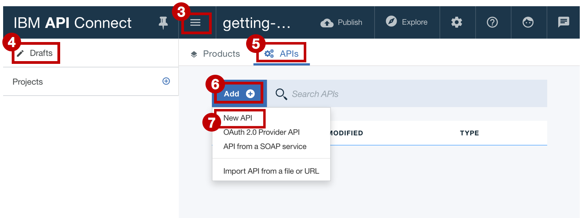

---
copyright:
  years: 2017
lastupdated: "2017-11-02"
---

{:new_window: target="blank"}
{:shortdesc: .shortdesc}
{:screen: .screen}
{:codeblock: .codeblock}
{:pre: .pre}

# Aggiungi una nuova specifica API e richiama un servizio REST esistente con {{site.data.keyword.Bluemix_notm}}
**Durata**: 15 minuti  
**Livello di competenza**: Principiante  

## Obiettivo
Questa esercitazione ti aiuta ad iniziare ad utilizzare velocemente {{site.data.keyword.apiconnect_full}}. Inizieremo creando una nuova specifica OpenAPI e poi creando un proxy API passthrough per un servizio REST esistente.

## Prerequisito
Prima di iniziare, devi [configurare la tua istanza API Connect](tut_prereq_set_up_apic_instance.html).

---

### Esplora l'applicazione di esempio e verifica gli endpoint di destinazione
È stata creata un'applicazione _weather provider_ di esempio per questa esercitazione.
1. Per esplorare l'applicazione, vai a [http://gettingstartedweatherapp.mybluemix.net/ ](http://gettingstartedweatherapp.mybluemix.net/){:new_window}.  
2. Immetti un codice postale U.S. valido per ottenere il tuo _**meteo corrente**_ e le _**previsioni di oggi**_.  


3. La precedente applicazione di esempio meteo è stata creata utilizzando API che forniscono dati meteo. L'endpoint per ottenere i dati meteo **correnti** è _**https://myweatherprovider.mybluemix.net/current?zipcode={zipcode}**_. Verifica visitando [https://myweatherprovider.mybluemix.net/current?zipcode=90210 ](https://myweatherprovider.mybluemix.net/current?zipcode=90210){:new_window}.  

  

4. In modo simile, l'endpoint per ottenere i dati della previsione **di oggi** è _**https:// myweatherprovider<span></span>.mybluemix.net/today?zipcode={zipcode}**_. Verifica visitando [https://myweatherprovider.mybluemix.net/today?zipcode=90210 ](https://myweatherprovider.mybluemix.net/today?zipcode=90210){:new_window}.  

  


---

### Aggiungi una nuova specifica OpenAPI per creare un proxy API REST  
1. Accedi a {{site.data.keyword.Bluemix_notm}}: https://new-console.ng.bluemix.net/login.
2. Nel pannello di navigazione {{site.data.keyword.Bluemix_notm}}, seleziona **Services** e quindi **Dashboard**. Avvia il servizio {{site.data.keyword.apiconnect_short}}.
3. In {{site.data.keyword.apiconnect_short}}, assicurati che il pannello di navigazione sia aperto. Se non lo è, fai clic su **>>** per aprirlo.  
4. Seleziona **Drafts** nel pannello di navigazione.
5. Nella scheda **APIs**, fai clic su **Add**. Dal menu a discesa, seleziona **New API**.    
    
6. Nella finestra *New API*, immetti `Weather Provider API` per il titolo.
_Il nome e il percorso di base vengono popolati automaticamente._.  
  
7. Fai clic su **Create API** per completare la procedura guidata.  
8. Dopo aver creato la tua API, viene selezionata la scheda **Design**. 
9. Scorri fino al pannello **Host**. Immetti `$(catalog.host)` come valore se il campo non viene compilato automaticamente.
10. Nel pannello **Base Path**, nota il valore popolato automaticamente: `/weather-provider-api`. Il tuo URL di destinazione dell'API sarà creato da questi valori.  

11. Scorri fino alla scheda **Security** e elimina il valore "clientIDHeader (API Key)" che è stato generato automaticamente.  
_(Visiteremo la sicurezza con le chiavi API nella prossima esercitazione.)_  

12. Nel pannello di navigazione, scorri fino al pannello **Paths** e crea un nuovo percorso facendo clic su **+**.     
    a. Denomina il nuovo percorso con "**/current**".  
    b. Nello stesso pannello *Paths*, seleziona la sezione **GET /current**.    
    c. Nella sezione **GET /current**, aggiungi un nuovo **Parameter**. Come hai notato durante l'esplorazione dell'applicazione di esempio, il servizio meteo necessita di un codice postale come parametro.   
      - Nome: codice postale  
      - Ubicato in: query  
      - Obbligatorio: sì  
      - Tipo: stringa   
       
    d. Salva la tua API.  

13. Con i tuoi parametri di query definiti nel passo precedente, devi ora definire l'oggetto di risposta restituito quando richiami l'API meteo. Per far ciò, scorri fino al pannello **Definitions**.   
    a. Aggiungi una nuova definizione.  
    b. Denomina la nuova definizione con _Current_.  
    c. Imposta il tipo su _Object_.  
    d. Aggiungi nuove proprietà per la definizione **Current**.    
       - Nome: codice postale         /  Tipo: stringa   
       - Nome: temperatura /  Tipo: numero intero   
       - Nome: umidità    /  Tipo: numero intero   
       - Nome: città        /  Tipo: stringa   
       - Nome: stato       /  Tipo: stringa   
       
    e. Salva la tua API.  

14. Nel passo precedente, hai definito l'oggetto di risposta. Successivamente dovrai assicurarti che l'oggetto di risposta venga associato al percorso **get /current**. Nel pannello di navigazione, scorri fino al pannello **Paths**.
    a. Apri l'operazione **GET /current** e scorri fino alla sezione **Responses**.
    b. Modifica lo schema della risposta 200OK da "object" in "**Current**".
    c. Salva la tua API facendo clic sull'icona di salvataggio. Viene visualizzata momentaneamente una notifica di conferma “API Saved”. 

15. Il percorso e l'operazione appena creati devono richiamare i dati meteo correnti. Ora dovrai creare un'operazione e un percorso simili per richiamare i dati meteo di oggi. In modo simile a come hai creato il percorso **/current** al passo 12, crea un nuovo percorso: **/today**.

16. Aggiungi un nuovo parametro nell'operazione **GET /today**.
    - Nome parametro: codice postale  
    - Ubicato in: query  
    - Obbligatorio: sì  
    - Tipo: stringa  

17. Crea una nuova definizione: **Today**.

18. Aggiungi nuove proprietà per la definizione **Today**.
    - Nome: codice postale         /  Tipo: stringa
    - Nome: alta    /  Tipo: numero intero
    - Nome: bassa    /  Tipo: numero intero
    - Nome: umidità notturna    /  Tipo: numero intero
    - Nome: umidità giorno    /  Tipo: numero intero
    - Nome: città        /  Tipo: stringa
    - Nome: stato       /  Tipo: stringa
19. Aggiorna lo schema di risposta nella sezione **GET /today** in "Today".
20. Salva la tua API.

21. Passa alla scheda **Assemble**. Hai creato due operazioni finora: **GET /current** e **GET /today**. Per assicurarti che venga richiamato l'endpoint corretto, dovrai creare della logica che verrà eseguita in modo condizionale nell'operazione che sta venendo richiamata. Utilizza il costrutto di logica **Operation Switch** per farlo.  
    a. Elimina la politica **invoke** che potrebbe già essere stata aggiunta ai _canvas_.  
    b. Dalla tavolozza, trascina **Operation Switch** e rilascialo nel canvas.  
      - Per **case 0**, assegna l'operazione **get /current**.
      - Aggiungi un nuovo caso: **case 1**.
      - Assegna l'operazione **get /today** a **case 1**.
      
**Operation Switch** fornisce un punto di decisione. In base alla coppia verbo/percorso, deve essere richiamata l'operazione appropriata.
    c. Trascina la politica **invoke** dalla tavolozza e rilasciala nel canvas. _L'azione di richiamo viene utilizzata per richiamare un servizio esistente dall'interno di un'operazione_.  Rilascia un'azione di richiamo nel percorso **/get current** e una in **/get today**.   
    d. Seleziona la politica **invoke** nel percorso **/get current** e aggiornane il titolo con "**invoke-current**".  
    e. Aggiorna il campo URL con `https://myweatherprovider.mybluemix.net/current?zipcode=$(request.parameters.zipcode)`.  
    f. Seleziona la politica **invoke** nel percorso **/get today** e aggiornane il titolo con "**invoke-today**".  
    g. Aggiorna il campo URL con `https://myweatherprovider.mybluemix.net/today?zipcode=$(request.parameters.zipcode)`.  
       

22. Salva la tua API.

---

### Verifica il tuo proxy API
1. Nella scheda **Assemble**, fai clic sull'icona delle ulteriori azioni e seleziona **Generate a default product**.  
    

2. Accetta le opzioni predefinite nella finestra di dialogo **New Product** e fai clic su **Create Product**. Viene creato e pubblicato il prodotto Weather Provider API nel catalogo Sandbox. Viene visualizzato un messaggio che indica la corretta generazione del prodotto.  
    
  
   

  - _In {{site.data.keyword.apiconnect_short}}, **Products** fornisce un modo per raggruppare le API intese per un utilizzo particolare. I prodotti sono pubblicati in un **Catalog**. [Glossario {{site.data.keyword.apiconnect_short}}](../apic_glossary.html)_

3. Nella scheda Assemble, fai clic sull'icona di riproduzione per verificare il richiamo della destinazione del proxy dell'API.

4. Nel pannello di verifica, seleziona l'operazione **get /current**.
	a. Codice postale è un parametro obbligatorio per questa operazione, per cui immetti un codice postale U.S. valido (ad es. 90210). 
	b. Fai clic su **invoke** e verifica di visualizzare: 
  ```
  200 OK response
  Current weather data for 90210  
  ```
  
      

      

    

---

### Conclusioni
In questa esercitazione hai imparato come può essere richiamato un servizio REST esistente tramite un proxy passthrough dell'API. Hai iniziato verificando la disponibilità del servizio di esempio tramite il browser web. Poi hai creato una nuova specifica OpenAPI in {{site.data.keyword.apiconnect_short}} e l'hai collegata al servizio di esempio da richiamare. Hai impacchettato la tua API in un prodotto, pubblicato il prodotto nel catalogo e verificato il proxy.

---

## Passo successivo

Proteggi la tua API utilizzando [la limitazione di frequenza](tut_rate_limit.html), [il segreto e l'ID client](tut_secure_landing.html) o [la protezione tramite OAuth 2.0](tut_secure_oauth_2.html).

Create > **Manage** > Secure > Socialize > Analyze
