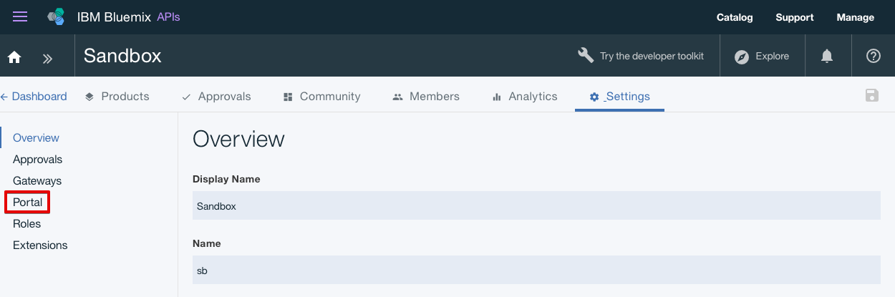

---
copyright:
  years: 2017
lastupdated: "2017-10-31"
---

{:new_window: target="blank"}
{:shortdesc: .shortdesc}
{:screen: .screen}
{:codeblock: .codeblock}
{:pre: .pre}

# Impostazione e configurazione del portale sviluppatori
**Durata**: 30 minuti  
**Livello di competenza**: Principiante  

## Prerequisiti
Prima di iniziare, dovrai [importare la tua specifica API e collegarti tramite proxy a un servizio REST esistente](tut_rest_landing.html).

## Obiettivo
Questa esercitazione di aiuterà ad iniziare a configurare velocemente il tuo **Portale sviluppatori API Connect**. 

---

## Crea il tuo portale sviluppatori
In questa sezione, creerai un portale sviluppatori per un catalogo.

*Cataloghi* è un termine di IBM per ambienti diversi. Ad esempio, puoi creare diversi cataloghi per gli ambienti di test, preparazione e produzione. Dovresti avere un catalogo denominato Sandbox. Sentiti libero di utilizzare questo catalogo per creare il tuo portale sviluppatori o crea un nuovo catalogo e denominalo come preferisci.

1. Nel tuo dashboard {{site.data.keyword.Bluemix_short}}, seleziona il tuo servizio **API Connect** per avviare il dashboard {{site.data.keyword.apiconnect_short}}.

2. Nel dashboard {{site.data.keyword.apiconnect_short}}, seleziona il catalogo per cui desideri creare un portale sviluppatori. Ad esempio, **Sandbox**.

3. Nel catalogo, seleziona la scheda **Settings**.  
  

4. Nella scheda delle impostazioni, seleziona **Portal**.  
  

5. Nella pagina di configurazione del portale, seleziona **IBM Developer Portal** dall'elenco a discesa di selezione del portale.
   

6. Prendi nota del tuo **Portal URL**, poi salva le tue modifiche.  
  
  
7. Come indicato nella finestra di dialogo, normalmente servono alcuni minuti per creare il tuo portale sviluppatori. Riceverai un'email al termine dell'operazione. Seleziona **OK** per il riconoscimento del messaggio di dialogo.  
  

---

## Esplora il tuo portale sviluppatori
In questa sezione, prenderai familiarità con il portale sviluppatori che hai creato nei passi precedenti.

1. Dopo aver configurato il portale sviluppatori per il tuo catalogo, riceverai un'email con un link per un accesso monouso. Seleziona il link per avviare il portale sviluppatori.

2. Seleziona **Login** per accedere al portale sviluppatori.

3. Immetti una nuova password e fai clic su **Save**.  
  

4. Dopo aver impostato la nuova password, esplora il portale sviluppatori a partire da **Home** all'inizio della pagina.  
  
  
| Scheda              | Descrizione          | 
|:---------------- | -------------------- | 
| _Home_       | La homepage è la pagina di benvenuto del tuo portale sviluppatori. Puoi [personalizzare la pagina](tut_custom_dev_portal.html) per soddisfare i tuoi bisogni. | 
| _Getting Started_       | La pagina Getting started viene utilizzata per indicare agli sviluppatori come iniziare ad utilizzare il tuo portale sviluppatori. |
| _API Products_ | La pagina API Products viene utilizzata dagli sviluppatori per esplorare e sottoscriversi alle API disponibili nel tuo portale. | 
| _Apps_ | La pagina Apps visualizza le applicazioni che stanno utilizzando le tue API. | 
| _Blogs_ | La pagina Blogs è dove puoi creare e visualizzare i post del blog sulle tue API. | 
| _Forums_ | La pagina Forums è dove gli sviluppatori posso discutere e inserire domande sulle tue API. | 
| _Support_ | La pagina Support è dove puoi indirizzare gli sviluppatori su come possono ricevere supporto per le tue API. Ad esempio, puoi far fare loro riferimento ai tuoi forum e FAQ. Puoi anche fornire un link che gli consente di aprire un ticket di supporto se necessario. | 

Nota: nella pagina API Products, puoi selezionare uno dei prodotti per visualizzare la pagina del prodotto di un'API e i piani disponibili. Questo abilita gli sviluppatori a sottoscriversi e a visualizzare i dettagli di un'API. 

  

### Conclusioni
In questa esercitazione hai imparato come configurare il tuo portale sviluppatori {{site.data.keyword.apiconnect_short}}. Hai anche esplorato il portale sviluppatori.

---

## Passo successivo

[Personalizza il tuo portale sviluppatori e seleziona un tema](tut_custom_dev_portal.html).

Create >Manage> Secure > ** Socialize ** > Analyze
