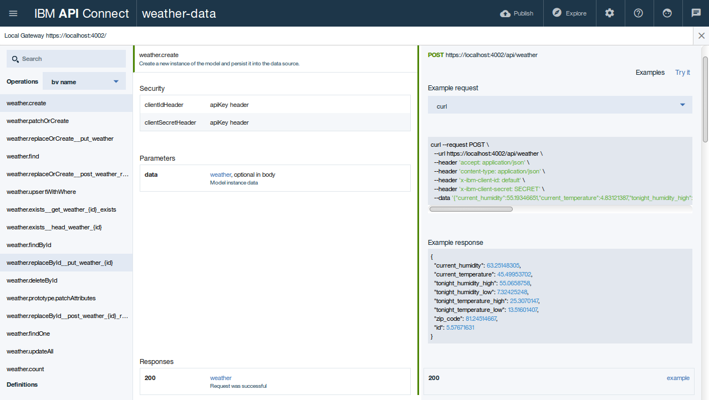
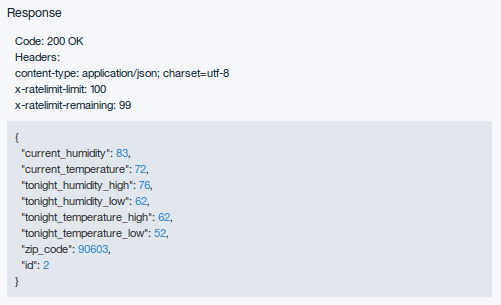

---

copyright:
  years: 2018
lastupdated: "2018-02-22"

subcollection: apiconnect

keywords: IBM Cloud, APIs, lifecycle, catalog, manage, toolkit, develop, dev portal, tutorial

---

{:new_window: target="blank"}
{:shortdesc: .shortdesc}
{:screen: .screen}
{:codeblock: .codeblock}
{:pre: .pre}

# Creazione di un'API in Node.js
{: #tut_create_api_node}

**Durata**: 20 minuti  
**Livello di competenza**: Principiante  

---
## Obiettivo
{: #object_tut_create_api_node}

Questa esercitazione di guida nella creazione di un'API in Node.js utilizzando il framework LoopBack. L'esercitazione descrive come:
1. Creare un nuovo progetto LoopBack.
2. Aggiungere un nuovo modello e una nuova origine dati a un progetto LoopBack utilizzando API Designer nel toolkit {{site.data.keyword.apiconnect_full}}.
3. Verificare i tuoi endpoint API utilizzando lo strumento API Designer Explore.

---
## Prerequisiti
{: #prereq_tut_create_api_node}

Prima di iniziare, [installa il toolkit {{site.data.keyword.apiconnect_short}}](/docs/services/apiconnect/tutorials?topic=apiconnect-tut_prereq_install_toolkit). Se il toolkit è già installato, assicurati che stai eseguendo la versione 5.0.8.1 o successiva. Puoi verificarlo immettendo il seguente comando nella riga di comando:
	```
	apic -v
	```

---
## Crea progetto LoopBack.
{: #create_tut_create_api_node}

Puoi creare un progetto Loopback utilizzando l'interfaccia riga di comando del toolkit sviluppatori {{site.data.keyword.apiconnect_short}} o l'interfaccia API Designer. 
 
### Crea un progetto LoopBack utilizzando la riga di comando del toolkit
{: #create_cli_tut_create_api_node}

Per creare un LoopBack utilizzando la riga di comando del toolkit {{site.data.keyword.apiconnect_short}}, completa la seguente procedura:
1.  Dall'interfaccia riga di comando, immetti il seguente comando. Viene utilizzato per creare e gestire le applicazioni LoopBack.
	```bash 
	apic loopback
	```
	>![info]
	>In questa esercitazione, creerai un progetto denominato weather-data.
2.  Quando richiesto, immetti `weather-data` per il nome del progetto e premi **Invio**.
	```bash
	? What's the name of your application? weather-data
	```
  	>![important]
  	>In generale, un nome progetto può contenere qualsiasi carattere tranne spazio bianco (" "), barra ("/"), e commerciale ("&"), chiocciola ("@"), segno più ("+"), percentuale ("%"), e due punti (":").
3.  Immetti il nome della directory in cui creare il progetto. Premi **Invio** per utilizzare una directory con lo stesso nome del progetto o immetti un nuovo nome e premi **Invio**.
	```bash
	? Enter name of the directory to contain the project: weather-data
	```
4.  Seleziona la versione di LoopBack da utilizzare. Scegli la versione di produzione corrente: 3.x.
	```bash
	? Which version of LoopBack would you like to use? 
  	2.x (long term support) 
	? 3.x (current) 
	```
5.  Specifica il tipo di applicazione che desideri utilizzare per la creazione utilizzando i tasti freccia per selezionare **empty-server**.
	```bash
	? What kind of application do you have in mind? (Use arrow keys)
	? empty-server (An empty LoopBack API, without any configured models or datasources) 
  	hello-world (A project containing a basic working example, including a memory database) 
  	notes (A project containing a basic working example, including a memory database)
	```
6.  Premi **Invio** per creare un'API LoopBack vuota. 

Lo strumento visualizza diversi messaggi mentre crea la directory di progetto e aggiunge a essa un certo numero di directory e file. Esegue anche npm install per installare tutte le dipendenze del progetto, come specificato in package.json. Questo processo crea una directory node_modules e potrebbe richiedere del tempo.

Un progetto LoopBack vuoto contiene le seguenti directory:
- server: contiene le definizioni di origine dati e di modello del server e altro codice del server
- definitions: contiene i file di definizione YAML
- node_modules: creata da node.js


### Crea un progetto LoopBack utilizzando l'interfaccia API Designer
{: #create_apid_tut_create_api_node}

Per creare un LoopBack utilizzando API Designer, completa la seguente procedura:
1.  Dall'interfaccia riga di comando, immetti il seguente comando per avviare API Designer:
	```bash
	apic edit
	```
	
	>![info]
	>Il precedente comando inizializza il toolkit {{site.data.keyword.apiconnect_short}} e avvia API Designer nel browser predefinito quando eseguito.
	>![info]
	>In questa esercitazione, creerai un progetto denominato weather-data.
2.  Se non hai precedentemente bloccato il riquadro di navigazione della IU, fai clic sull'icona Navigate to . Viene aperto il pannello di navigazione della IU API Manager. Per bloccare il pannello di navigazione della IU, fai clic sull'icona del menu Pin .
3.  Nella barra laterale, fai clic sull'icona Projects Plus .
4.  Fai clic su **Create LoopBack Project**. Visualizzerai la finestra di dialogo **Add new LoopBack project**.
5.  Seleziona **empty-server** come template del progetto.
6.  Per **LoopBack Version**, seleziona la versione 3.x (la versione corrente).
7.  Immetti `weather-data` nei campi Display Name e Name.
8.  Per **Project Directory**, seleziona la cartella `weather-data` creata nel passo 1 facendo clic sul pulsante **Browse**.
	
9. Fai clic su **Add** per aggiungere il progetto.
	>![info]
	>Saranno visualizzati diversi messaggi nella finestra **Add new LoopBack project** mentre crea la directory di progetto e aggiunge a essa un certo numero di directory e file. Esegue anche npm install per installare tutte le dipendenze del progetto, come specificato in package.json. Questo processo crea una directory node_modules e potrebbe richiedere del tempo.
	
	>Un progetto LoopBack vuoto contiene le seguenti directory:
	- server: contiene le definizioni di origine dati e di modello del server e altro codice del server
	- definitions: contiene i file di definizione YAML
	- node_modules: creata da node.js
10. Fai clic su **Finished** per chiudere la finestra di dialogo **Add new LoopBack project**.
11. Esci da **API Designer** ritornando alla riga di comando nel passo 1 e immettendo `Ctrl + C`.  Digita `Y` per confermare l'uscita.
12. Chiudi la sessione del browser.

---
## Aggiungi un nuovo modello e una nuova origine dati
{: #add_tut_create_api_node}

Per aggiungere un nuovo modello e una nuova origine dati a un progetto LoopBack utilizzando API Designer, completa la seguente procedura:

### Aggiungi un'origine dati
{: #add_ds_tut_create_api_node}

Per aggiungere una nuova origine dati a un progetto LoopBack utilizzando API Designer, completa la seguente procedura.
1. Devi inoltre creare un progetto LoopBack (il progetto "weather-data") come descritto in `Create a LoopBack project from the command line` e assicurarti che la directory di lavoro corrente sia la directory root del progetto:
	```bash
	cd weather-data
	```
2. Dalla riga di comando, immetti il seguente comando:
	```bash
	apic edit
	```
	Dopo una breve pausa, la console visualizza questo messaggio:
	```bash
	Express server listening on http://127.0.0.1:9000
	```
	API Designer viene aperto nel browser web predefinito, visualizzando inizialmente la pagina di accesso se non hai eseguito il login di recente.  
	>![info]
	>Puoi accedere utilizzando il tuo account {{site.data.keyword.Bluemix}} o crearne uno.
3. Fai clic sull'icona **Data Sources** .
4. Fai clic su **Aggiungi**. Viene visualizzata la finestra New LoopBack Data Source.
5. Immetti `weatherDS` nel campo di testo **Name**.
	>![info]
	>In un nome di origine dati puoi usare qualsiasi carattere alfanumerico, più i trattini e i segni di sottolineatura.
6. Fai clic su **Nuovo**.
7. Per impostazione predefinita, l'impostazione **Connector** visualizza **In-memory db** e le altre impostazioni sono vuote. Conserva le impostazioni predefinite per ora, API Designer salva automaticamente la nuova origine dati.
	>![info]
	>L'origine dati in memoria è integrata in LoopBack ed è adatta solo per lo sviluppo e la verifica iniziale. Quando sei pronto a connettere i tuoi modelli a un'origine dati reale come un server di database, modifica l'impostazione **Connector** di conseguenza e installa il connettore dell'origine dati seguendo le istruzioni nell'argomento dell'IBM Knowledge Center, <https://www.ibm.com/support/knowledgecenter/SSMNED_5.0.0/com.ibm.apic.toolkit.doc/tapim-connector-install.html#task_i2p_dnw_vv>Installing LoopBack connectors  come appropriato per il tuo tipo di connettore, e fai clic sull'icona **Salva** . API Designer verifica automaticamente il collegamento all'origine dati. Se la verifica ha esito positivo, viene visualizzato il messaggio **Success - Data source connection test succeeded**.
8. Fai clic sull'icona Test Connection  per verificare il collegamento all'origine dati. Viene visualizzato il messaggio "Data source connection test succeeded".
9. Fai clic su All Data Sources. L'origine dati verrà visualizzata nell'elenco di origini dati e l'editor aggiorna il file server/datasources.json con le impostazioni per la nuova origine dati.

### Aggiungi un modello
{: #add_model_tut_create_api_node}

Per aggiungere un nuovo modello a un progetto LoopBack utilizzando API Designer, completa la seguente procedura:
1. Fai clic sull'icona Models .
2. Fai clic su Aggiungi. Viene visualizzata la finestra Nuovo modello LoopBack.
3. Immetti weather nel campo di testo Name e fai clic su New.
4. Nel campo Data Source, seleziona weatherDS.
	
5. In Properties, fai clic sull'icona Add property .
6. Nel campo di testo Property Name, immetti zip_code.
7. Per Type, seleziona number.
8. Seleziona Required per rendere la proprietà obbligatoria. Questo significa che deve avere un valore quando aggiungi o aggiorni l'istanza del modello. 
9. Seleziona ID per assicurarti che la proprietà abbia un identificativo univoco. Per ora, mantieni i valori predefiniti per le altre impostazioni:
	- Is Array: se la proprietà è un array JavaScript con elementi del tipo specificato.
	- Index: se la proprietà rappresenta una colonna (campo) che è un indice del database.
	- Description: descrizione del testo della proprietà.
9. Fai nuovamente clic sull'icona Add property  per aggiungere un'altra proprietà.  Fai riferimento alla seguente tabella per completare le proprietà rimanenti:
	
10. Fai clic sull'icona Save  per salvare le tue modifiche.
11. Fai clic su All Models per terminare la modifica del modello.

Questo completa l'aggiunta di una nuova origine dati e di un nuovo modello al progetto LoopBack weather-data.

---

## Verifica il tuo nuovo progetto LoopBack
{: #test_tut_create_api_node}

>![info]
	>Puoi andare direttamente al seguente passo 2 se non se sei uscito dal designer {{site.data.keyword.apiconnect_short}} dopo aver completato la sezione "Add a new model and data source".
	
Per verificare i tuoi endpoint API utilizzando lo strumento API Designer Explore, completa la seguente procedura:
1. Dalla riga di comando, immetti il seguente comando:
	```bash
	apic edit
	```
	Dopo una breve pausa, la console visualizza questo messaggio:
	```bash
	Express server listening on http://127.0.0.1:9000
	```
	API Designer viene aperto nel browser web predefinito, visualizzando inizialmente la pagina di accesso se non hai eseguito il login di recente.
	
2. Avvia i server di test locali.
	a. Nella console di test in fondo alla schermata, fai clic sull'icona **Start the servers** :
	
	b. Attendi finché viene visualizzato il messaggio di esecuzione del messaggio:
	

	>![info]
	>A seconda della configurazione del tuo progetto e dal fatto che siano o meno in esecuzione altri processi, potrebbe essere visualizzati numeri porta differenti.
3. Fai clic su **http://127.0.0.1:port_number** per visualizzare l'endpoint della root API. Per il progetto LoopBack predefinito (vuoto o hello-world), visualizzerai qualcosa di simile a questo:
	```bash
	{"started":"2017-05-24T19:21:47.807Z","uptime":80.876}
	```
	>![info]
	>Per arrestare il tuo progetto, fai clic sull'icona **Stop the servers** :
	>
	
	>Per riavviarlo, fai clic sull'icona **Restart the servers** :
	>
	
4. Fai clic sull'icona **Explore**  per visualizzare lo strumento API Designer Explore. La barra laterale mostra tutte le operazioni REST per i modelli LoopBack nell'API. I modelli che sono basati su PersistedModel dispongono, per impostazione predefinita, di una [erie standard di operazioni di creazione, lettura, aggiornamento ed eliminazione ](http://loopback.io/doc/en/lb2/PersistedModel-REST-API){: new_window} come spiegato nella documentazione di Loopback.

5. Fai clic sull'operazione **weather.create** nel pannello di sinistra per visualizzare l'endpoint.

Il pannello centrale visualizza le informazioni di riepilogo sull'endpoint, inclusi i parametri, la sicurezza, i dati dell'istanza del modello e i codici di risposta. Il pannello di destra fornisce il codice del template per richiamare l'endpoint utilizzando il comando curl e i linguaggi come Ruby, Python, Java e Node.

6. Per verificare gli endpoint REST nello strumento API Designer Explore, completa la seguente procedura:
    1. Nel pannello di destra, fai clic su **Try it**. Se è presente un elemento dati `id`, rimuovilo dai dati generati prima di eseguire il test. 
	
	2. Scorri fino a **Parameters** e fai clic su **Generate** per generare alcuni dati fittizi. Per impostazione predefinita, i dati generati includono le proprietà `zip_code`, `current_temperature`, `current_humidity`, `tonight_temperature_low`, `tonight_temperature_high`, `tonight_humidity_low` e `tonight_humidity_high`.
	
	3. Fai clic su **Call operation**.
	
	
>![troubleshooting]
>Se visualizzi un messaggio di errore dovuto a un certificato non attendibile per l'host locale, fai clic sul link fornito nel messaggio di errore nello strumento API Designer Explore per accettare il certificato e procedi con il richiamo delle operazioni nel tuo browser web. La procedura esatta dipende da quale browser web stai utilizzando. Se carichi gli endpoint REST direttamente nel tuo browser, visualizzerai il messaggio: {"name":"PreFlowError","message":"unable to process the request"}. Devi utilizzare lo strumento API Designer Explore per verificare gli endpoint REST nel tuo browser perché include le intestazioni necessarie e altri parametri obbligatori.
>
>![troubleshooting]
>Se ricevi un codice di risposta di **422 - Unprocessable Entity** con il seguente payload:
>
>
>assicurati che non sia presente un elemento dati `id` che non è stato rimosso dai dati generati. Se è presente un elemento ID, rimuovilo e riesegui la verifica.
>![troubleshooting]
>Se ricevi un errore **failed to parse request body**, devi rimuovere la virgola che segue l'ultimo numero `humidity_high`.
7. Modifica i valori nel JSON mostrati nella sezione **data**. Tenta di modificare i dati fittizi generati e fai clic nuovamente su **Call operation**. Dovresti visualizzare i parametri di richiesta e risposta, insieme ai dati dell'istanza JSON che hai immesso.


8. Per confermare che l'operazione ha aggiunto un'istanza del modello, fai clic su **weather.find**. Fai clic su **Call operation** per visualizzare tutte le istanze meteo. Ad esempio (con due istanze del modello):

	
---

### Cosa hai fatto in questa esercitazione
{: #conclusion_tut_create_api_node}

In questa esercitazione, hai completato quanto segue:
1. Creato un nuovo progetto LoopBack utilizzando la riga di comando del toolkit {{site.data.keyword.apiconnect_short}}.
2. Aggiunto un nuovo modello e una nuova origine dati a un progetto LoopBack utilizzando API Designer nel toolkit {{site.data.keyword.apiconnect_short}}.
3. Verificato i tuoi endpoint API utilizzando lo strumento API Designer Explore.


---

## Passo successivo
{: #next_tut_create_api_node}

[Gestisci un servizio REST](/docs/services/apiconnect/tutorials?topic=apiconnect-tut_rest_landing) o [Gestisci un servizio SOAP](/docs/services/apiconnect/tutorials?topic=apiconnect-tut_manage_soap_api).

Create > **Manage** > Secure > Socialize > Analyze

 
[important]: ./images/important.png "Importante!"
[info]: ./images/info.png "Informazioni"
[troubleshooting]: ./images/troubleshooting.png "Risoluzione dei problemi" 

